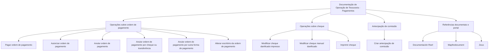

# Documentação de Operação de Tesouraria — Pagamentos no Reef

## 1. Metadados do Documento
- **Arquivo de Origem:** Não identificado no conteúdo fornecido
- **Tipo de Documento:** Manual Operacional
- **Domínio / Sistema:** Tesouraria — Pagamentos; Reef; referência a Mapfre
- **Público-Alvo:** Operação
- **Data/Versão Identificada:** Não identificada

---

## 2. Resumo Executivo & Contexto de Negócio

O conteúdo apresenta uma documentação de operação de Tesouraria voltada a pagamentos. O documento encontra-se identificado como “EN CONSTRUCCIÓN”, indicando que o material estava em construção no momento da extração.

O escopo funcional listado concentra-se em operações sobre ordens de pagamento, incluindo pagar, autorizar, anular e alterar informações associadas a pagamentos. Também são mencionadas atividades relacionadas a antecipação de comissão e tratamento de cheques danificados ou manuais.

O material referencia o ambiente ou repositório documental Reef, incluindo navegação por “Documentación Reef”, “Mapfredocument” e elementos de portal como Soluções, Arquiteturas, APIs, Componentes, Cloud, Documentação, Zeus, Reef e Ajuda.

O texto não fornece detalhamento adicional sobre regras de autorização, perfis de acesso, contratos de integração, métodos HTTP, dados de entrada, dados de saída ou procedimentos passo a passo para cada operação.

---

## 3. Arquitetura, Componentes & Tecnologias Envolvidas

Os elementos explicitamente citados são:

- **Tesouraria — Pagamentos:** domínio funcional da documentação.
- **Reef:** sistema, portal ou área documental referenciada repetidamente.
- **Mapfredocument:** referência textual presente no conteúdo.
- **Zeus:** item presente no menu de navegação.
- **Owner:** atributo exibido com o valor `user:agonzalez_mapfre.com`.
- **Lifecycle:** atributo exibido sem valor associado claramente identificável.
- **Approved Source / VL:** referências exibidas no rodapé ou metadados do portal.



> **Nota de Análise:** O documento lista operações de Tesouraria, mas não detalha a arquitetura técnica, integrações, tecnologias de implementação, ambientes, APIs, contratos JSON ou dependências entre os componentes.

---

## 4. Regras de Negócio, Especificações Funcionais & Processos

O conteúdo fornecido enumera as seguintes capacidades operacionais:

1. **Pagar ordem de pagamento**
   - A documentação lista a operação `PAGAR orden pago`.
   - Não são descritos pré-requisitos, estados permitidos, validações, valores monetários, aprovações necessárias ou efeitos posteriores da operação.

2. **Autorizar ordem de pagamento**
   - A documentação lista a operação `AUTORIZAR orden pago`.
   - Não há especificação de níveis de autorização, perfis responsáveis, segregação de funções ou condições de aprovação.

3. **Criar antecipação de comissão**
   - A documentação apresenta a operação `[CREAR anticipo comisión][CREAR-anticipo-comisión]`.
   - O texto preserva tanto o rótulo funcional quanto a referência/identificador entre colchetes.
   - Não são descritos critérios, cálculos, beneficiários ou processo de liquidação da antecipação.

4. **Anular ordem de pagamento**
   - A documentação lista `ANULAR orden pago`.
   - Não são fornecidas condições para anulação, tratamento de pagamentos já processados ou regras de reversão.

5. **Anular ordem de pagamento por cheque ou transferência**
   - A operação `ANULAR orden pago cheque transferencia` é listada separadamente.
   - O documento não explica se cheque e transferência possuem o mesmo processo de anulação ou regras específicas.

6. **Anular ordem de pagamento por outra forma de pagamento**
   - A documentação lista `ANULAR orden pago otra forma pago`.
   - O conteúdo não define quais formas de pagamento são classificadas como “outra forma de pagamento”.

7. **Alterar escritório da ordem de pagamento**
   - A operação aparece como `CAMBIAR ocina orden pago`.
   - Há um caractere não textual presente no termo extraído entre `o` e `cina`; o provável significado não deve ser inferido além do texto literal.

8. **Modificar cheque danificado impresso**
   - A documentação lista `MODIFICAR cheque dañado impreso`.
   - Não há critérios que definam dano, reimpressão, cancelamento ou substituição do cheque.

9. **Modificar cheque manual danificado**
   - A documentação lista `MODIFICAR cheque manual dañado`.
   - O texto não informa a diferença operacional entre cheque manual e cheque impresso.

10. **Imprimir cheque**
    - A operação `IMPRIMIR cheque` é mencionada.
    - Não são descritos layouts, impressoras, controles de segurança ou condições para impressão.

---

## 5. Tabelas de Parâmetros, Ambientes e Estruturas de Dados

| Item / Parâmetro | Descrição / Função | Tipo / Valores / Formato | Ambiente / Observações |
| :--- | :--- | :--- | :--- |
| PAGAR orden pago | Operação para pagar uma ordem de pagamento. | Nome de operação. | Sem detalhamento adicional. |
| AUTORIZAR orden pago | Operação para autorizar uma ordem de pagamento. | Nome de operação. | Sem detalhamento adicional. |
| CREAR anticipo comisión | Operação para criar antecipação de comissão. | Nome de operação. | Referência textual: `CREAR-anticipo-comisión`. |
| ANULAR orden pago | Operação para anular uma ordem de pagamento. | Nome de operação. | Sem detalhamento adicional. |
| ANULAR orden pago cheque transferencia | Operação para anular uma ordem de pagamento por cheque ou transferência. | Nome de operação. | Sem detalhamento adicional. |
| ANULAR orden pago otra forma pago | Operação para anular uma ordem de pagamento por outra forma de pagamento. | Nome de operação. | As formas abrangidas não são definidas. |
| CAMBIAR ocina orden pago | Operação para alterar o escritório da ordem de pagamento, conforme texto extraído. | Nome de operação. | A extração contém um caractere não textual em `ocina`. |
| MODIFICAR cheque dañado impreso | Operação para modificar cheque impresso danificado. | Nome de operação. | Sem detalhamento adicional. |
| MODIFICAR cheque manual dañado | Operação para modificar cheque manual danificado. | Nome de operação. | Sem detalhamento adicional. |
| IMPRIMIR cheque | Operação para imprimir cheque. | Nome de operação. | Sem detalhamento adicional. |
| Owner | Proprietário exibido no conteúdo. | `user:agonzalez_mapfre.com` | Valor textual extraído. |
| Lifecycle | Campo de ciclo de vida exibido. | Não identificado. | O texto não associa um valor claro ao campo. |
| Approved Source | Texto de metadado exibido. | Não identificado. | Aparece junto de `/ VL`. |
| VL | Texto associado a “Approved Source”. | Não identificado. | Significado não detalhado. |
| Idioma | Idioma indicado na navegação. | `ES` | Valor textual exibido. |

---

## 6. Bateria de Perguntas & Respostas para RAG (FAQ Sintético)

### P1: Qual é o objetivo da documentação de Tesouraria — Pagamentos?
**R:** O conteúdo apresenta uma documentação de operação de Tesouraria voltada a pagamentos, com uma lista de ações sobre ordens de pagamento, antecipação de comissão e cheques. O material está marcado como “EN CONSTRUCCIÓN”.

### P2: Quais operações sobre ordem de pagamento são listadas?
**R:** As operações listadas são pagar ordem de pagamento, autorizar ordem de pagamento, anular ordem de pagamento, anular ordem de pagamento por cheque ou transferência, anular ordem de pagamento por outra forma de pagamento e alterar o escritório da ordem de pagamento conforme o texto extraído.

### P3: O documento explica como autorizar uma ordem de pagamento?
**R:** Não. O documento somente lista `AUTORIZAR orden pago`; não informa perfis autorizadores, critérios de aprovação, limites, estados anteriores ou efeitos da autorização.

### P4: Existe uma operação para criar antecipação de comissão?
**R:** Sim. O conteúdo lista `[CREAR anticipo comisión][CREAR-anticipo-comisión]`, identificando uma operação de criação de antecipação de comissão. Não há detalhamento sobre regras, cálculos ou beneficiários.

### P5: Quais operações relacionadas a cheques são mencionadas?
**R:** O documento lista modificar cheque danificado impresso, modificar cheque manual danificado e imprimir cheque. Também menciona anulação de ordem de pagamento por cheque ou transferência.

### P6: O documento define o procedimento para anular uma ordem de pagamento?
**R:** Não. Há operações de anulação listadas, incluindo anulação genérica, por cheque ou transferência e por outra forma de pagamento, mas não há etapas, validações, restrições ou regras de reversão.

### P7: Quais sistemas ou áreas documentais são citados além de Tesouraria?
**R:** O conteúdo cita Reef, Documentación Reef, Mapfredocument e Zeus. Também exibe itens de navegação como Soluciones, Arquitecturas, APIs, Componentes, Cloud, Documentación e Ayuda.

### P8: Qual é o proprietário identificado no documento?
**R:** O campo `Owner` apresenta o valor `user:agonzalez_mapfre.com`.

### P9: O documento informa ambientes, URLs, servidores ou portas?
**R:** Não. O conteúdo não fornece URLs, nomes de servidores, portas, ambientes técnicos, credenciais ou configurações de infraestrutura.

### P10: O que significa “VL” no documento?
**R:** O texto apresenta `VL` próximo de `Approved Source`, mas não define o significado de `VL`. Portanto, não é possível expandir ou interpretar a sigla com base exclusivamente no conteúdo fornecido.

### P11: Há detalhamento de APIs ou contratos de integração?
**R:** Não. Embora `APIs` apareça como item de navegação, não são especificados endpoints, métodos HTTP, parâmetros, contratos JSON, mensagens ou integrações técnicas.

### P12: Qual é o status de maturidade indicado para a documentação?
**R:** A expressão `EN CONSTRUCCIÓN` indica que a documentação estava em construção. O conteúdo não informa data prevista de conclusão, versão futura ou responsáveis pela finalização.

---

## 7. Glossário de Termos, Siglas & Conceitos-Chave

- **Tesouraria:** domínio funcional indicado no título da documentação, associado a pagamentos.
- **Ordem de pagamento:** entidade operacional sobre a qual são listadas ações de pagar, autorizar, anular e alterar escritório.
- **Antecipação de comissão:** operação denominada `CREAR anticipo comisión`; não há definição adicional.
- **Cheque danificado impresso:** categoria de cheque mencionada na operação `MODIFICAR cheque dañado impreso`.
- **Cheque manual danificado:** categoria de cheque mencionada na operação `MODIFICAR cheque manual dañado`.
- **Reef:** nome citado como referência documental ou área de portal.
- **Mapfredocument:** nome textual citado no conteúdo sem explicação adicional.
- **Zeus:** item de navegação citado no conteúdo sem explicação adicional.
- **VL:** termo exibido próximo a `Approved Source`; significado não identificado.
- **ES:** valor de idioma exibido na navegação.

---

## 8. Notas Críticas, Riscos & Limitações

- O documento está explicitamente marcado como **“EN CONSTRUCCIÓN”**, o que indica possível incompletude.
- Não há procedimentos operacionais detalhados, critérios de validação, perfis de acesso, segregação de funções ou trilhas de auditoria.
- Não há informações sobre integrações, APIs, arquitetura técnica, ambientes, URLs, servidores, logs ou mecanismos de tratamento de erro.
- Não são apresentados dados de versão, data de publicação, histórico de alterações ou responsável funcional além do campo `Owner`.
- O texto `CAMBIAR ocina orden pago` contém um caractere não textual na extração; qualquer normalização sem acesso ao documento visual original pode introduzir interpretação não suportada.
- **Nota de Análise:** O documento lista operações de Tesouraria, porém não detalha métodos, contratos, estados do processo ou regras funcionais para sua execução.

---

## 9. Conteúdo Bruto Estruturado (Referência Fiel)

```text
--- [PÁGINA 1 DE 1] ---

EN CONSTRUCCIÓN
DOCUMENTACIÓN de OPERACIÓN de TESORERÍA - PAGOS
Imagen pagos
OPERACIONES
PAGAR orden pago
AUTORIZAR orden pago
[CREAR anticipo comisión][CREAR-anticipo-comisión]
ANULAR orden pago
ANULAR orden pago cheque transferencia
ANULAR orden pago otra forma pago
CAMBIAR ocina orden pago
MODIFICAR cheque dañado impreso
MODIFICAR cheque manual dañado
IMPRIMIR cheque
Documentation / DOCUMENTACIÓN Reef
DOCUMENTACIÓN Reef
Mapfredocument
DOCUMENTACIÓN Reef
Owner
user:agonzalez_mapfre.com
Lifecycle
Approved Source
 / 
 VL
Buscar Inicio Soluciones Arquitecturas APIs Componentes Cloud Documentación Zeus Reef Ayuda
ES
```
