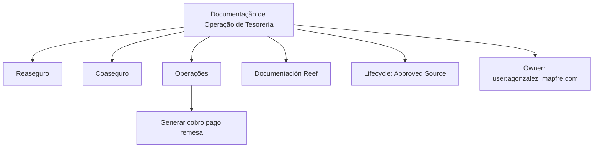
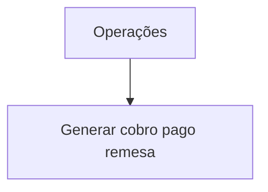

# Documentação de Operação de Tesorería — Reaseguro y Coaseguro (Reef)

## 1. Metadados do Documento
- **Arquivo de Origem:** Não identificado no conteúdo fornecido
- **Tipo de Documento:** Procedimento / documentação operacional
- **Domínio / Sistema:** Tesorería; Reaseguro y Coaseguro; Reef; Mapfre
- **Público-Alvo:** Operação
- **Data/Versão Identificada:** Não identificada
- **Owner identificado:** `user:agonzalez_mapfre.com`
- **Lifecycle identificado:** `Approved Source`

---

## 2. Resumo Executivo & Contexto de Negócio

O conteúdo apresenta uma página de documentação denominada **“DOCUMENTACIÓN de OPERACIÓN de TESORERÍA - REASEGURO Y COASEGURO”**. O escopo explicitamente indicado está relacionado a operações de tesouraria aplicáveis aos domínios de resseguro e cosseguro.

A operação citada no conteúdo é **“GENERAR cobro pago remesa”**, expressão que sugere a geração de processos ou registros relacionados a cobrança, pagamento e remessa. Entretanto, o material não descreve etapas operacionais, regras de elegibilidade, entradas, saídas, responsáveis, sistemas envolvidos ou critérios de sucesso dessa operação.

A documentação está associada a referências de navegação e categorização como **Reef**, **Mapfre**, **Soluciones**, **Arquitecturas**, **APIs**, **Componentes**, **Cloud** e **Zeus**. Essas referências demonstram o contexto de uma base documental ou portal corporativo, mas o conteúdo fornecido não estabelece relações técnicas ou funcionais detalhadas entre esses elementos.

O estado de ciclo de vida informado é **Approved Source**, indicando que a fonte documental possui essa classificação. O conteúdo também exibe a marcação **“EN CONSTRUCCIÓN”**, que deve ser considerada uma limitação relevante: não há detalhamento suficiente para tratar o documento como um manual operacional completo.

---

## 3. Arquitetura, Componentes & Tecnologias Envolvidas

### Componentes, domínios e referências identificadas

| Componente / Termo | Classificação baseada no texto | Evidência / Contexto |
| :--- | :--- | :--- |
| Tesorería | Domínio operacional | Presente no título da documentação. |
| Reaseguro | Domínio de negócio | Presente no título da documentação. |
| Coaseguro | Domínio de negócio | Presente no título da documentação. |
| Reef | Referência documental / sistema | Citado como “DOCUMENTACIÓN Reef” e “Documentation / DOCUMENTACIÓN Reef”. |
| Mapfre | Referência corporativa / documental | Citado como “Mapfredocument”. |
| Zeus | Referência de navegação | Listado entre opções de navegação. |
| Soluciones | Categoria de navegação | Listado na navegação. |
| Arquitecturas | Categoria de navegação | Listado na navegação. |
| APIs | Categoria de navegação | Listado na navegação. |
| Componentes | Categoria de navegação | Listado na navegação. |
| Cloud | Categoria de navegação | Listado na navegação. |
| Approved Source | Estado de lifecycle | Exibido no bloco de metadados. |
| `user:agonzalez_mapfre.com` | Owner identificado | Exibido no bloco “Owner”. |

### Fluxo conceitual explicitamente observável



> **Nota de Análise:** O conteúdo não descreve arquitetura de software, integrações, microsserviços, APIs, bancos de dados, protocolos, ambientes, URLs, métodos HTTP ou contratos de dados. O diagrama representa apenas relações textuais explicitamente identificadas.

---

## 4. Regras de Negócio, Especificações Funcionais & Processos

### Operação identificada

A única operação explicitamente mencionada é:

- **GENERAR cobro pago remesa**

O conteúdo não detalha:

- O significado operacional completo de “cobro”, “pago” e “remesa”.
- A sequência de execução da operação.
- Os dados obrigatórios para gerar cobrança, pagamento ou remessa.
- As regras de validação.
- Os perfis autorizados a executar a operação.
- Os sistemas ou componentes responsáveis pelo processamento.
- Os efeitos contábeis, financeiros ou operacionais.
- Os critérios de finalização, rejeição, erro ou reprocessamento.
- Os mecanismos de auditoria, rastreabilidade ou logs.

### Fluxo operacional disponível



> **Nota de Análise:** O documento fornece somente a identificação da operação “GENERAR cobro pago remesa”. Não há detalhamento adicional que permita reconstruir um procedimento passo a passo sem introduzir informações não sustentadas pela fonte.

---

## 5. Tabelas de Parâmetros, Ambientes e Estruturas de Dados

| Item / Parâmetro | Descrição / Função | Tipo / Valores / Formato | Ambiente / Observações |
| :--- | :--- | :--- | :--- |
| Título da documentação | Identifica o tema principal do conteúdo. | `DOCUMENTACIÓN de OPERACIÓN de TESORERÍA - REASEGURO Y COASEGURO` | Conteúdo marcado como “EN CONSTRUCCIÓN”. |
| Operação | Operação listada na seção “OPERACIONES”. | `GENERAR cobro pago remesa` | Sem detalhamento funcional adicional. |
| Sistema / referência documental | Referência documental citada repetidamente. | `Reef` | Não há versão, URL ou descrição técnica. |
| Referência corporativa | Texto exibido no conteúdo. | `Mapfredocument` | Sem detalhamento adicional. |
| Owner | Proprietário identificado no documento. | `user:agonzalez_mapfre.com` | Valor apresentado literalmente no conteúdo. |
| Lifecycle | Estado de ciclo de vida exibido. | `Approved Source` | Não há definição do significado operacional dessa classificação. |
| Idioma da interface | Opção de idioma visível. | `ES` | Interface ou portal apresentado em espanhol. |
| Categorias de navegação | Itens de navegação exibidos. | `Buscar`, `Inicio`, `Soluciones`, `Arquitecturas`, `APIs`, `Componentes`, `Cloud`, `Documentación`, `Zeus`, `Reef`, `Ayuda` | Não há URL, hierarquia ou descrição de cada item. |

---

## 6. Bateria de Perguntas & Respostas para RAG (FAQ Sintético)

### P1: Qual é o tema central da documentação apresentada?
**R:** A documentação trata de operação de **Tesorería** no contexto de **Reaseguro y Coaseguro**. O título exibido é “DOCUMENTACIÓN de OPERACIÓN de TESORERÍA - REASEGURO Y COASEGURO”.

### P2: Qual operação de tesouraria é citada no documento?
**R:** A operação citada é **“GENERAR cobro pago remesa”**. O conteúdo não explica os passos, as entradas, as regras ou os resultados dessa operação.

### P3: O documento descreve como gerar uma remessa?
**R:** Não. O documento apenas lista “GENERAR cobro pago remesa” sob a seção “OPERACIONES”. Não há procedimento passo a passo, parâmetros, telas, integrações ou validações para geração de remessa.

### P4: Qual sistema ou referência documental é mencionado no conteúdo?
**R:** O termo **Reef** é mencionado em “DOCUMENTACIÓN Reef” e “Documentation / DOCUMENTACIÓN Reef”. O documento não descreve a arquitetura, a finalidade técnica ou a versão de Reef.

### P5: Quem é o owner identificado para essa documentação?
**R:** O campo **Owner** apresenta o valor `user:agonzalez_mapfre.com`.

### P6: Qual lifecycle está associado ao documento?
**R:** O lifecycle exibido é **Approved Source**. O conteúdo não define o processo, os critérios ou as implicações dessa classificação.

### P7: O documento informa APIs, endpoints ou contratos de integração?
**R:** Não. Embora “APIs” apareça como item de navegação, não existem endpoints, métodos HTTP, payloads, contratos JSON, autenticação ou integrações especificadas no conteúdo.

### P8: Há informações sobre ambientes, servidores, URLs ou portas?
**R:** Não. O conteúdo não apresenta ambientes, nomes de servidores, URLs, portas, credenciais, variáveis de configuração ou rotas de logs.

### P9: O documento está completo para execução operacional?
**R:** Não é possível concluir que o documento seja suficiente para execução operacional. O conteúdo contém a indicação **“EN CONSTRUCCIÓN”** e não detalha o procedimento associado a “GENERAR cobro pago remesa”.

### P10: Quais áreas de negócio são explicitamente relacionadas à documentação?
**R:** As áreas ou domínios explicitamente relacionados são **Tesorería**, **Reaseguro** e **Coaseguro**.

### P11: Quais categorias de navegação aparecem na página?
**R:** A página lista: **Buscar**, **Inicio**, **Soluciones**, **Arquitecturas**, **APIs**, **Componentes**, **Cloud**, **Documentación**, **Zeus**, **Reef** e **Ayuda**.

---

## 7. Glossário de Termos, Siglas & Conceitos-Chave

- **Tesorería:** Termo apresentado como parte do escopo operacional da documentação. O conteúdo não fornece definição adicional.
- **Reaseguro:** Termo apresentado no título da documentação. O conteúdo não fornece definição adicional.
- **Coaseguro:** Termo apresentado no título da documentação. O conteúdo não fornece definição adicional.
- **Reef:** Referência documental ou de sistema citada no conteúdo como “DOCUMENTACIÓN Reef”.
- **Mapfredocument:** Texto ou referência exibida no conteúdo, sem definição adicional.
- **Owner:** Campo que identifica o proprietário da documentação; o valor exibido é `user:agonzalez_mapfre.com`.
- **Lifecycle:** Campo que representa o ciclo de vida do documento; o valor exibido é `Approved Source`.
- **Approved Source:** Valor de lifecycle apresentado na fonte; não há explicação adicional sobre seu significado.
- **Cobro:** Termo presente na operação “GENERAR cobro pago remesa”; não definido pelo documento.
- **Pago:** Termo presente na operação “GENERAR cobro pago remesa”; não definido pelo documento.
- **Remesa:** Termo presente na operação “GENERAR cobro pago remesa”; não definido pelo documento.

---

## 8. Notas Críticas, Riscos & Limitações

- O conteúdo contém a indicação explícita **“EN CONSTRUCCIÓN”**, sinalizando que a documentação pode estar incompleta.
- Não há arquivo de origem, data, versão, identificador documental ou histórico de alterações.
- Não há descrição detalhada da operação **“GENERAR cobro pago remesa”**.
- Não há regras de negócio, critérios de validação, exceções, perfis de acesso ou responsabilidades operacionais.
- Não há arquitetura técnica, relação formal entre sistemas, integrações, APIs, contratos de dados ou tecnologias implementadas.
- Não há informações de ambientes, servidores, URLs, portas, parâmetros de execução, logs, monitoramento ou troubleshooting.
- Embora o conteúdo cite **Reef**, **Mapfredocument** e **Zeus**, não explica a função de cada referência no processo de Tesorería, Reaseguro y Coaseguro.
- O valor **Approved Source** é apresentado como lifecycle, mas o documento não define seu impacto em aprovação, publicação, manutenção ou governança documental.

---

## 9. Conteúdo Bruto Estruturado (Referência Fiel)

```text
--- [PÁGINA 1 DE 1] ---

EN CONSTRUCCIÓN
DOCUMENTACIÓN de OPERACIÓN de TESORERÍA - REASEGURO Y
COASEGURO
Imagen reaseguro-coaseguro
OPERACIONES
GENERAR cobro pago remesa
Documentation / DOCUMENTACIÓN Reef
DOCUMENTACIÓN Reef
Mapfredocument
DOCUMENTACIÓN Reef
Owner
user:agonzalez_mapfre.com
Lifecycle
Approved Source
 /
 VL
Buscar Inicio Soluciones Arquitecturas APIs Componentes Cloud Documentación Zeus Reef Ayuda
ES
```
