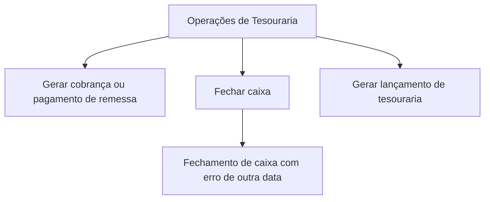

# Documentação de Operação de Tesouraria — Fechamento de Caixa

## 1. Metadados do Documento
- **Arquivo de Origem:** Não identificado
- **Tipo de Documento:** Manual Operacional
- **Domínio / Sistema:** Tesouraria / Reef / Mapfre
- **Público-Alvo:** Operação
- **Data/Versão Identificada:** Não identificada

---

## 2. Resumo Executivo & Contexto de Negócio

O documento apresenta uma documentação operacional relacionada ao processo de tesouraria, com foco no **fechamento de caixa** (“cierre de cajero”). O conteúdo indica que o processo inclui operações de cobrança, pagamento de remessa, fechamento de caixa e geração de lançamento contábil de tesouraria.

A documentação está associada ao contexto **Reef** e contém referências a **Mapfre** e **Zeus**, aparentemente por meio de elementos de navegação de uma plataforma documental corporativa. O documento também é identificado como aprovado (“Approved”) e atribui a propriedade a `user:agonzalez_mapfre.com`.

As operações explicitamente enumeradas são: gerar cobrança/pagamento de remessa, fechar caixa, tratar fechamento de caixa com erro de outra data e gerar lançamento de tesouraria. Não há detalhamento de telas, procedimentos passo a passo, regras de validação, contratos de integração ou campos necessários para executar essas operações.

> **Nota de Análise:** O documento apresenta títulos de operações de tesouraria, mas não descreve os critérios, entradas, saídas, responsáveis operacionais ou regras de exceção de cada operação.

---

## 3. Arquitetura, Componentes & Tecnologias Envolvidas

Os seguintes elementos são citados:

- **Tesouraria:** domínio funcional da documentação.
- **Reef:** contexto ou sistema associado à documentação.
- **Mapfre:** organização ou contexto corporativo citado.
- **Zeus:** item disponível na navegação da plataforma documental.
- **Documentação Reef / Mapfredocument:** referências ao repositório ou à classificação documental.
- **Cajero:** termo em espanhol empregado para a função ou processo de caixa.
- **Asiento tesorería:** lançamento contábil de tesouraria.

O texto não apresenta arquitetura de software, microsserviços, APIs, bancos de dados, tecnologias de implementação, ambientes ou integrações técnicas. O fluxo abaixo representa somente a sequência conceitual indicada pelos títulos operacionais, sem inferir dependências obrigatórias entre as etapas.



---

## 4. Regras de Negócio, Especificações Funcionais & Processos

O documento relaciona as seguintes operações funcionais de tesouraria:

1. **Gerar cobrança ou pagamento de remessa**
   - A operação é apresentada como “GENERAR cobro pago remesa”.
   - O documento não especifica se cobrança e pagamento são ações independentes ou alternativas dentro da mesma operação.
   - Não são informados valores, critérios de seleção de remessas, status processados, validações ou efeitos contábeis.

2. **Fechar caixa**
   - A operação é apresentada como “CERRAR cajero”.
   - O documento não detalha o procedimento de fechamento, os dados necessários, a periodicidade ou o resultado esperado.

3. **Fechar caixa com erro de outra data**
   - A operação é apresentada como “CERRAR cajero error otra fecha”.
   - A expressão indica um cenário de erro relacionado a “outra data”.
   - Não são descritos a causa do erro, a validação de data, a mensagem apresentada, a estratégia de correção ou o responsável pelo tratamento.

4. **Gerar lançamento de tesouraria**
   - A operação é apresentada como “GENERAR asiento tesorería”.
   - O documento não informa a estrutura do lançamento, contas contábeis, regras de débito e crédito, eventos disparadores ou integração com sistemas contábeis.

> **Nota de Análise:** Não há regras de negócio detalhadas, sequências operacionais completas ou critérios de aceite explícitos no conteúdo disponível.

---

## 5. Tabelas de Parâmetros, Ambientes e Estruturas de Dados

| Item / Parâmetro | Descrição / Função | Tipo / Valores / Formato | Ambiente / Observações |
| :--- | :--- | :--- | :--- |
| `GENERAR cobro pago remesa` | Operação de geração de cobrança ou pagamento de remessa | Operação funcional | Não há parâmetros, formatos ou validações detalhados |
| `CERRAR cajero` | Operação de fechamento de caixa | Operação funcional | Não há procedimento ou condição de execução descrita |
| `CERRAR cajero error otra fecha` | Cenário de fechamento de caixa com erro relacionado a outra data | Cenário de exceção | Causa e tratamento não detalhados |
| `GENERAR asiento tesorería` | Operação de geração de lançamento de tesouraria | Operação funcional / contábil | Não há estrutura de lançamento descrita |
| Reef | Sistema, domínio ou contexto documental citado | Nome próprio | O papel técnico de Reef não é detalhado |
| Mapfre | Contexto corporativo citado | Nome próprio | Não há detalhamento da relação com o processo |
| Zeus | Item citado na navegação | Nome próprio | Não há função descrita no processo de tesouraria |
| `user:agonzalez_mapfre.com` | Proprietário (“Owner”) indicado no documento | Identificador de usuário | Exibido no conteúdo bruto |
| Lifecycle | Campo de ciclo de vida documental | Campo documental | Valor não informado |
| Approved | Estado de aprovação indicado | Status documental | Aparece associado ao documento |

---

## 6. Bateria de Perguntas & Respostas para RAG (FAQ Sintético)

### P1: Qual é o assunto principal da documentação?
**R:** A documentação trata da operação de tesouraria, especificamente do processo de fechamento de caixa (“cierre de cajero”).

### P2: Quais operações de tesouraria são citadas no documento?
**R:** O documento cita quatro operações: gerar cobrança ou pagamento de remessa, fechar caixa, fechar caixa com erro de outra data e gerar lançamento de tesouraria.

### P3: O documento explica como executar o fechamento de caixa?
**R:** Não. O documento menciona a operação “CERRAR cajero”, mas não apresenta passos, pré-requisitos, campos, validações ou resultado esperado para o fechamento de caixa.

### P4: Qual cenário de erro é mencionado para o fechamento de caixa?
**R:** O texto menciona “CERRAR cajero error otra fecha”, indicando um cenário de erro de fechamento de caixa relacionado a outra data. O motivo, as regras de validação e o tratamento do erro não são detalhados.

### P5: O que significa “GENERAR asiento tesorería” no documento?
**R:** “GENERAR asiento tesorería” é uma operação de geração de lançamento de tesouraria. O documento não fornece detalhes sobre contas contábeis, valores, regras de débito e crédito ou integração contábil.

### P6: O documento descreve parâmetros técnicos, APIs ou integrações?
**R:** Não. Não há URLs, métodos HTTP, contratos de API, tecnologias, servidores, credenciais, ambientes ou detalhes de integração no conteúdo fornecido.

### P7: Qual sistema ou contexto é associado à documentação?
**R:** A documentação faz referência a Reef, por meio dos textos “Documentation / DOCUMENTACIÓN Reef” e “DOCUMENTACIÓN Reef”. O papel funcional ou técnico de Reef não é explicado.

### P8: Quem é identificado como proprietário do documento?
**R:** O conteúdo indica `user:agonzalez_mapfre.com` no campo “Owner”.

### P9: Qual é o status de ciclo de vida indicado para a documentação?
**R:** O texto apresenta “Approved”, indicando que o documento está aprovado. O campo “Lifecycle” também aparece, mas sem um valor adicional explícito.

### P10: O documento contém um procedimento detalhado para cobrança ou pagamento de remessa?
**R:** Não. O texto apenas lista “GENERAR cobro pago remesa” como operação, sem detalhar fluxo, dados de entrada, critérios de processamento ou impactos financeiros.

---

## 7. Glossário de Termos, Siglas & Conceitos-Chave

- **Tesouraria:** domínio funcional mencionado no título da documentação e nas operações de lançamento.
- **Cajero:** termo em espanhol usado no documento para caixa ou operador/processo de caixa.
- **Cierre de cajero:** fechamento de caixa.
- **Cobro:** cobrança.
- **Pago:** pagamento.
- **Remesa:** remessa.
- **Asiento tesorería:** lançamento de tesouraria.
- **Reef:** sistema, domínio ou classificação documental citada; o documento não define seu significado.
- **Mapfre:** nome corporativo citado no conteúdo; o documento não define sua função no processo.
- **Zeus:** item citado na navegação da plataforma; o documento não define sua função.
- **Lifecycle:** campo referente ao ciclo de vida do documento.
- **Approved:** status de aprovação do documento.

---

## 8. Notas Críticas, Riscos & Limitações

- O conteúdo está identificado como **“EN CONSTRUCCIÓN”**, indicando que a documentação pode estar em elaboração.
- Não há passo a passo operacional para nenhuma das operações citadas.
- Não há definição de responsabilidades, perfis de acesso, aprovações ou segregação de funções.
- Não há detalhamento de regras para cobrança, pagamento de remessa, fechamento de caixa ou geração de lançamento de tesouraria.
- O cenário “erro outra data” é citado sem causa raiz, validação, procedimento corretivo ou escalonamento.
- Não há informações sobre ambientes, sistemas integrados, URLs, logs, monitoramento, APIs ou estruturas de dados.
- A presença de elementos de navegação da plataforma documental não comprova uma relação técnica entre Reef, Zeus, Mapfre e as operações de tesouraria.

---

## 9. Conteúdo Bruto Estruturado (Referência Fiel)

```text
--- [PÁGINA 1 DE 1] ---

EN CONSTRUCCIÓN
DOCUMENTACIÓN de OPERACIÓN de TESORERÍA - CIERRE DE
CAJERO
Imagen cierre-cajero
OPERACIONES
GENERAR cobro pago remesa
CERRAR cajero
CERRAR cajero error otra fecha
GENERAR asiento tesorería
Documentation / DOCUMENTACIÓN Reef
DOCUMENTACIÓN Reef
Mapfredocument
DOCUMENTACIÓN Reef
Owner
user:agonzalez_mapfre.com
Lifecycle
Approved Source
 /
VL
Buscar Inicio Soluciones Arquitecturas APIs Componentes Cloud Documentación Zeus Reef Ayuda
ES
```
