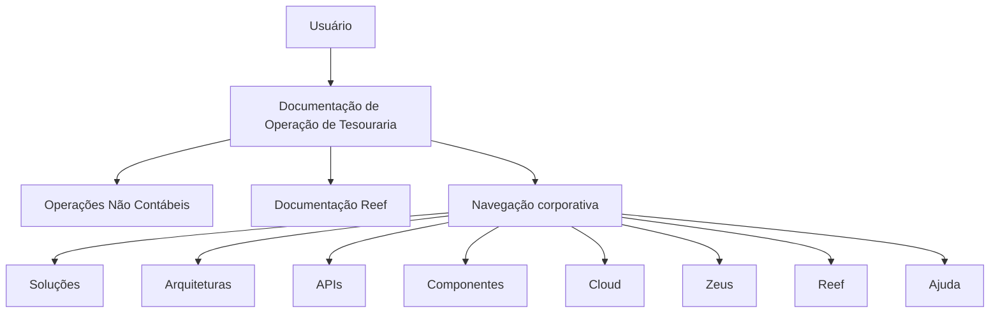

# Documentação de Operação de Tesouraria — Operações Não Contábeis

## 1. Metadados do Documento
- **Arquivo de Origem:** `Não identificado — conteúdo bruto fornecido na solicitação`
- **Tipo de Documento:** Procedimento / Documentação Operacional
- **Domínio / Sistema:** Tesouraria, REEF e Mapfre
- **Público-Alvo:** Operação, Negócio e suporte aos sistemas de Tesouraria
- **Data/Versão Identificada:** Não identificada

---

## 2. Resumo Executivo & Contexto de Negócio

O conteúdo apresenta uma página de documentação de operação de Tesouraria voltada a **operações não contábeis**. A documentação parece estar em construção, pois o texto inclui a indicação “EN CONSTRUCCIÓN”.

O escopo operacional listado inclui ajustes e criação de comissões, tratamento de recibos de prêmio, alteração de gestor de recibo e registro de fatura. Esses itens representam as operações explicitamente disponibilizadas ou documentadas na página.

A página está inserida em um contexto documental associado a **REEF**, **Mapfre** e à navegação corporativa “Mapfredocument”. O documento também referencia uma área de “Documentación Reef” e categorias de navegação como Soluções, Arquiteturas, APIs, Componentes, Cloud, Documentação, Zeus, Reef e Ajuda.

Não há procedimentos passo a passo, critérios de aprovação, contratos de integração, parâmetros de cálculo, URLs de ambiente, tecnologias implementadas ou regras de validação detalhadas no conteúdo fornecido. Portanto, este artefato preserva os itens operacionais mencionados sem inferir seu comportamento técnico ou funcional.

---

## 3. Arquitetura, Componentes & Tecnologias Envolvidas

Os elementos de sistema e documentação identificados são:

| Componente / Termo | Papel identificado no conteúdo | Detalhamento disponível |
| :--- | :--- | :--- |
| Tesouraria | Domínio da documentação operacional | A página trata de operações não contábeis de Tesouraria. |
| REEF / Reef | Contexto documental e item de navegação | Não há descrição de arquitetura, módulos ou integrações de REEF. |
| Mapfre | Contexto corporativo associado à documentação | O texto contém “Mapfredocument” e o domínio de e-mail `mapfre.com`. |
| Mapfredocument | Elemento textual de documentação | Não há detalhamento funcional ou técnico. |
| Zeus | Item de navegação | Não há explicação sobre a finalidade de Zeus. |
| APIs | Categoria de navegação | Nenhuma API, endpoint, método HTTP ou contrato é informado. |
| Cloud | Categoria de navegação | Nenhum provedor, recurso ou ambiente cloud é identificado. |



> **Nota de Análise:** O conteúdo não descreve relações de execução, trocas de dados, camadas de software, integrações ou responsabilidades entre REEF, Mapfre, Zeus e Tesouraria. O diagrama representa exclusivamente os vínculos documentais e de navegação explicitamente visíveis.

---

## 4. Regras de Negócio, Especificações Funcionais & Processos

### Operações não contábeis identificadas

1. **Ajustar comissão de liquidação**
   - A operação “AJUSTAR comisión liquidación” está listada.
   - O conteúdo não informa critérios para ajuste, campos envolvidos, fórmulas, perfis autorizados, aprovações ou efeitos contábeis.

2. **Criar comissão de liquidação**
   - A operação “CREAR comisión liquidación” está listada.
   - O conteúdo não especifica os dados obrigatórios, regras de cálculo, vigência, moeda, aprovação ou persistência da comissão.

3. **Criar comissão de informe**
   - A operação “CREAR comisión informe” está listada.
   - O termo “informe” não recebe definição adicional no texto fornecido.

4. **Remesar recibo de prima**
   - A operação “REMESAR recibo prima” está listada.
   - O conteúdo não descreve condições para remessa, estados do recibo, destino, processamento ou validações.

5. **Desremesar recibo**
   - A operação “DESREMESAR recibo” está listada.
   - O conteúdo não define o significado operacional de desremessa, pré-requisitos, reversões ou impactos.

6. **Alterar gestor do recibo de prêmio**
   - A operação “CAMBIAR recibo prima gestor” está listada.
   - Não há informação sobre quem pode alterar o gestor, quais dados do gestor são utilizados ou como a alteração é auditada.

7. **Registrar fatura**
   - A operação “REGISTRAR factura” está listada.
   - Não há detalhamento de campos da fatura, validações fiscais, associação a recibos ou fluxo de aprovação.

> **Nota de Análise:** As operações são apresentadas como títulos ou opções, sem detalhamento adicional de processo. Não é possível afirmar, com base no conteúdo, se as operações são manuais, automatizadas, expostas por API ou executadas por uma interface de REEF.

---

## 5. Tabelas de Parâmetros, Ambientes e Estruturas de Dados

| Item / Parâmetro | Descrição / Função | Tipo / Valores / Formato | Ambiente / Observações |
| :--- | :--- | :--- | :--- |
| Estado da documentação | Indica o estágio apresentado para a documentação. | `EN CONSTRUCCIÓN` | Sugere conteúdo em construção; não há data de atualização. |
| Área documental | Identifica a área de negócio. | `TESORERÍA - OPERACIONES NO CONTABLES` | Referência a Tesouraria e operações não contábeis. |
| Operação | Ajustar comissão de liquidação. | `AJUSTAR comisión liquidación` | Sem regras, campos ou fluxo descritos. |
| Operação | Criar comissão de liquidação. | `CREAR comisión liquidación` | Sem regras, campos ou fluxo descritos. |
| Operação | Criar comissão de informe. | `CREAR comisión informe` | O termo “informe” não é detalhado. |
| Operação | Remesar recibo de prêmio. | `REMESAR recibo prima` | Sem estados, condições ou destino descritos. |
| Operação | Desremesar recibo. | `DESREMESAR recibo` | Sem comportamento de reversão ou validações descritos. |
| Operação | Alterar gestor de recibo de prêmio. | `CAMBIAR recibo prima gestor` | Sem identificação de perfis ou dados de gestor. |
| Operação | Registrar fatura. | `REGISTRAR factura` | Sem estrutura de dados ou validações descritas. |
| Proprietário | Identidade apresentada como owner da documentação. | `user:agonzalez_mapfre.com` | Transcrito literalmente do conteúdo. |
| Ciclo de vida | Estado editorial apresentado na página. | `Lifecycle` / `Approved Source` | A relação entre os dois rótulos não é explicada. |
| Idioma | Idioma indicado na navegação. | `ES` | O conteúdo está majoritariamente em espanhol. |
| Navegação | Categorias disponíveis na página. | `Buscar`, `Inicio`, `Soluciones`, `Arquitecturas`, `APIs`, `Componentes`, `Cloud`, `Documentación`, `Zeus`, `Reef`, `Ayuda` | Sem URLs ou destinos de navegação fornecidos. |

---

## 6. Bateria de Perguntas & Respostas para RAG (FAQ Sintético)

### P1: Qual é o escopo da documentação apresentada?
**R:** A documentação apresentada está associada a **Tesouraria — Operações Não Contábeis**. O texto não fornece uma definição adicional do escopo nem explica quais processos contábeis ficam fora da página.

### P2: Quais operações de comissão são listadas na documentação de Tesouraria?
**R:** A documentação lista três operações de comissão: **ajustar comissão de liquidação**, **criar comissão de liquidação** e **criar comissão de informe**. Não há critérios, fórmulas ou parâmetros de cálculo descritos.

### P3: A documentação explica como ajustar uma comissão de liquidação?
**R:** Não. O conteúdo apenas lista a operação “AJUSTAR comisión liquidación”. Não são informados campos, regras de alteração, aprovações, perfis autorizados ou impactos do ajuste.

### P4: Quais operações relacionadas a recibos de prêmio aparecem no documento?
**R:** O documento lista as operações **remesar recibo de prêmio**, **desremesar recibo** e **alterar gestor do recibo de prêmio**. Não há descrição de etapas, transições de estado, validações ou efeitos operacionais para essas operações.

### P5: O documento define o que significa desremesar um recibo?
**R:** Não. A operação “DESREMESAR recibo” é citada sem definição de negócio, requisitos, efeitos de reversão ou regras de execução.

### P6: Existe uma operação para registro de fatura?
**R:** Sim. A operação “REGISTRAR factura” é listada na documentação. O texto não informa estrutura da fatura, dados obrigatórios, validações, aprovações ou integração com outros sistemas.

### P7: Quais sistemas ou áreas tecnológicas são citados?
**R:** O conteúdo cita **REEF/Reef**, **Mapfre**, **Mapfredocument**, **Zeus**, **APIs**, **Cloud**, **Arquiteturas** e **Componentes**. Esses termos aparecem em contexto de documentação ou navegação; não há arquitetura técnica detalhada.

### P8: A documentação está finalizada e aprovada?
**R:** O texto contém simultaneamente “EN CONSTRUCCIÓN” e os rótulos “Lifecycle” e “Approved Source”. Com base apenas no conteúdo fornecido, não é possível determinar se a documentação está efetivamente concluída, pois não há explicação sobre o ciclo de vida ou a relação entre esses rótulos.

### P9: Quem é identificado como proprietário da documentação?
**R:** O campo “Owner” apresenta `user:agonzalez_mapfre.com`. O conteúdo não fornece nome completo, papel organizacional ou responsabilidades associadas a essa identificação.

### P10: Há APIs ou contratos de integração descritos?
**R:** Não. “APIs” aparece apenas como item de navegação. Não são apresentados endpoints, métodos HTTP, payloads, autenticação, contratos JSON, portas ou URLs.

### P11: Qual idioma está indicado na página?
**R:** A navegação apresenta o indicador `ES`, e os títulos das operações aparecem predominantemente em espanhol, como “CREAR comisión liquidación” e “REGISTRAR factura”.

---

## 7. Glossário de Termos, Siglas & Conceitos-Chave

- **REEF / Reef:** Nome citado em “Documentación Reef” e como item de navegação. O conteúdo não define o significado da sigla ou produto.
- **Tesouraria / TESORERÍA:** Área de negócio associada às operações não contábeis apresentadas.
- **Operações não contábeis / OPERACIONES NO CONTABLES:** Classificação das operações de Tesouraria abordadas; não há definição formal no texto.
- **Comissão de liquidação / comisión liquidación:** Tipo de comissão para o qual existem ações de ajuste e criação; sem fórmula ou regras descritas.
- **Comissão de informe / comisión informe:** Tipo de comissão que pode ser criada; “informe” não é explicado.
- **Recibo de prêmio / recibo prima:** Recibo associado às operações de remessa e alteração de gestor.
- **Remesar / REMESAR:** Operação listada para recibo de prêmio; significado processual não é detalhado.
- **Desremesar / DESREMESAR:** Operação listada para recibo; o documento não define seu efeito.
- **Gestor / gestor:** Entidade ou responsável relacionado a um recibo de prêmio; atributos e função não são descritos.
- **Fatura / factura:** Entidade para a qual há uma operação de registro; a estrutura não é apresentada.
- **Mapfredocument:** Termo exibido no conteúdo, aparentemente associado ao contexto de documentação; sem definição adicional.
- **Zeus:** Item de navegação sem definição funcional ou técnica.
- **Lifecycle:** Rótulo de ciclo de vida exibido na página, sem explicação.
- **Approved Source:** Rótulo exibido junto ao ciclo de vida, sem critérios ou significado definidos.
- **ES:** Indicador de idioma exibido na navegação; o contexto sugere espanhol.

---

## 8. Notas Críticas, Riscos & Limitações

- A página inclui a indicação **“EN CONSTRUCCIÓN”**, indicando que o conteúdo pode estar incompleto.
- Não há procedimentos operacionais detalhados para nenhuma das operações listadas.
- Não há regras de negócio, critérios de validação, parâmetros de cálculo, gestão de erros ou matriz de permissões.
- Não há descrição de arquitetura, componentes executáveis, bancos de dados, integrações, APIs, contratos, ambientes, servidores, logs ou URLs.
- Não há definição explícita para os termos REEF, Zeus, Mapfredocument, comissão de informe, remessa ou desremessa.
- O rótulo “Approved Source” aparece no conteúdo, mas não é suficiente para inferir aprovação formal ou validade operacional da documentação.
- O identificador do proprietário é preservado literalmente como fornecido, sem interpretação de identidade, função ou responsabilidade.
- A extração disponibilizada não contém paginação real além do conteúdo textual; por isso, a referência fiel abaixo é tratada como uma única página extraída.

---

## 9. Conteúdo Bruto Estruturado (Referência Fiel)

```text
--- [PÁGINA 1 DE 1] ---

EN CONSTRUCCIÓN
DOCUMENTACIÓN de OPERACIÓN de TESORERÍA - OPERACIONES
NO CONTABLES
Imagen operacion-no-contable
OPERACIONES
AJUSTAR comisión liquidación
CREAR comisión liquidación
CREAR comisión informe
REMESAR recibo prima
DESREMESAR recibo
CAMBIAR recibo prima gestor
REGISTRAR factura
Documentation / DOCUMENTACIÓN Reef
DOCUMENTACIÓN Reef
Mapfredocument
DOCUMENTACIÓN Reef
Owner
user:agonzalez_mapfre.com
Lifecycle
Approved Source
 / 
 VL
Buscar Inicio Soluciones Arquitecturas APIs Componentes Cloud Documentación Zeus Reef Ayuda
ES
```
