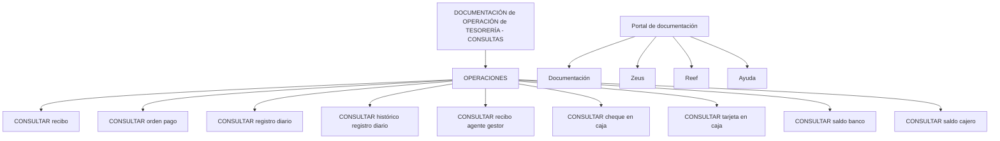

# Documentação de Operação de Tesouraria — Consultas Reef

## 1. Metadados do Documento
- **Arquivo de Origem:** `Não identificado`
- **Tipo de Documento:** Manual Operacional
- **Domínio / Sistema:** Tesouraria / Reef / Mapfre
- **Público-Alvo:** Operação, Negócio e usuários responsáveis por consultas de tesouraria
- **Data/Versão Identificada:** Não identificada

---

## 2. Resumo Executivo & Contexto de Negócio

O conteúdo apresenta uma documentação de operação de tesouraria orientada a consultas. O documento está associado a referências de documentação Reef e ao ambiente de navegação Mapfre, incluindo itens de menu e áreas como Soluções, Arquiteturas, APIs, Componentes, Cloud, Documentação, Zeus, Reef e Ajuda.

A documentação enumera operações de consulta relacionadas a recibos, ordens de pagamento, registros diários, histórico de registros diários, recibos de agente gestor, cheques em caixa, cartões em caixa, saldos bancários e saldos de caixa/cajero.

O texto contém a indicação “EN CONSTRUCCIÓN”, sinalizando que o material pode estar em elaboração ou incompleto. Há também a menção a “Imagen consultas”, porém a imagem não foi disponibilizada no conteúdo bruto; portanto, não é possível extrair telas, campos, filtros, URLs, fluxos de navegação ou regras operacionais adicionais.

A origem documental parece estar vinculada ao repositório ou portal “DOCUMENTACIÓN Reef”, com metadados apresentados como Owner, Lifecycle e Approved Source. O valor exibido para Owner é `user:agonzalez_mapfre.com`; o texto não detalha o significado operacional de Lifecycle nem de Approved Source.

---

## 3. Arquitetura, Componentes & Tecnologias Envolvidas

Os elementos explicitamente citados são:

- **Tesouraria:** domínio funcional da documentação de operação.
- **Reef:** referência de documentação e item de navegação.
- **Mapfredocument:** termo apresentado no conteúdo bruto.
- **Zeus:** item apresentado no menu de navegação.
- **DOCUMENTACIÓN Reef:** área ou referência documental recorrente.
- **Owner:** metadado documental cujo valor é `user:agonzalez_mapfre.com`.
- **Lifecycle:** metadado documental sem valor ou detalhamento apresentado.
- **Approved Source:** metadado documental sem detalhamento apresentado.

O conteúdo não descreve microsserviços, bancos de dados, APIs, protocolos, tecnologias de implementação, ambientes, integrações, URLs ou contratos de dados. A relação identificável é apenas a organização funcional entre a documentação de tesouraria e as operações de consulta.



> **Nota de Análise:** O documento não detalha a arquitetura técnica, os fluxos de dados, os métodos HTTP, os contratos JSON, as permissões ou a implementação das operações de consulta listadas.

---

## 4. Regras de Negócio, Especificações Funcionais & Processos

O documento apresenta as seguintes capacidades de consulta no domínio de tesouraria:

1. Consultar recibo.
2. Consultar ordem de pagamento.
3. Consultar registro diário.
4. Consultar histórico de registro diário.
5. Consultar recibo de agente gestor.
6. Consultar cheque em caixa.
7. Consultar cartão em caixa.
8. Consultar saldo bancário.
9. Consultar saldo de cajero.

Não foram fornecidos critérios de pesquisa, filtros, campos obrigatórios, condições de validação, perfis autorizados, mensagens de erro, regras de cálculo, regras de consistência, estados de processo ou procedimentos passo a passo para as consultas.

A expressão “Imagen consultas” indica a existência de uma imagem relacionada às consultas, mas o conteúdo extraído não contém a imagem nem uma descrição textual suficiente para reconstruir sua interface ou fluxo.

---

## 5. Tabelas de Parâmetros, Ambientes e Estruturas de Dados

| Item / Parâmetro | Descrição / Função | Tipo / Valores / Formato | Ambiente / Observações |
| :--- | :--- | :--- | :--- |
| Documento | Documentação de operação de tesouraria voltada a consultas | `DOCUMENTACIÓN de OPERACIÓN de TESORERÍA - CONSULTAS` | Marcado como `EN CONSTRUCCIÓN` |
| Operação | Consultar recibo | Operação de consulta | Sem filtros, campos ou regras detalhados |
| Operação | Consultar ordem de pagamento | Operação de consulta | Sem filtros, campos ou regras detalhados |
| Operação | Consultar registro diário | Operação de consulta | Sem filtros, campos ou regras detalhados |
| Operação | Consultar histórico de registro diário | Operação de consulta | Sem filtros, campos ou regras detalhados |
| Operação | Consultar recibo de agente gestor | Operação de consulta | Sem filtros, campos ou regras detalhados |
| Operação | Consultar cheque em caixa | Operação de consulta | Sem filtros, campos ou regras detalhados |
| Operação | Consultar cartão em caixa | Operação de consulta | Sem filtros, campos ou regras detalhados |
| Operação | Consultar saldo bancário | Operação de consulta | Sem filtros, campos ou regras detalhados |
| Operação | Consultar saldo de cajero | Operação de consulta | Sem filtros, campos ou regras detalhados |
| Owner | Proprietário apresentado nos metadados | `user:agonzalez_mapfre.com` | O texto não especifica a semântica do identificador |
| Lifecycle | Metadado documental | Sem valor informado | Sem detalhamento adicional |
| Approved Source | Metadado documental | Sem valor informado | Sem detalhamento adicional |
| Idioma | Idioma exibido na navegação | `ES` | Apresentado no rodapé do conteúdo |
| Imagem | Referência a imagem de consultas | `Imagen consultas` | Imagem não presente no conteúdo bruto |

---

## 6. Bateria de Perguntas & Respostas para RAG (FAQ Sintético)

### P1: Qual é o objetivo da documentação de operação de tesouraria apresentada?
**R:** O objetivo é registrar operações de consulta no domínio de tesouraria. O conteúdo enumera consultas de recibos, ordens de pagamento, registros diários, histórico de registros diários, recibos de agente gestor, cheques em caixa, cartões em caixa, saldo bancário e saldo de cajero.

### P2: Quais consultas de tesouraria são listadas no documento?
**R:** O documento lista: consultar recibo, consultar ordem de pagamento, consultar registro diário, consultar histórico de registro diário, consultar recibo agente gestor, consultar cheque em caixa, consultar cartão em caixa, consultar saldo banco e consultar saldo cajero.

### P3: O documento descreve como consultar um recibo?
**R:** Não. O documento apenas lista a operação “CONSULTAR recibo”. Não há campos de busca, filtros, telas, regras de validação, permissões ou etapas operacionais detalhadas.

### P4: Existe uma operação específica para consultar o histórico de registros diários?
**R:** Sim. A operação “CONSULTAR histórico registro diario” é explicitamente listada como uma das consultas de tesouraria.

### P5: A documentação diferencia consulta de saldo bancário e consulta de saldo de cajero?
**R:** Sim. O conteúdo apresenta duas operações distintas: “CONSULTAR saldo banco” e “CONSULTAR saldo cajero”. Contudo, não explica diferenças funcionais, fontes de dados, critérios de consulta ou formatos de retorno.

### P6: O documento detalha APIs, serviços ou contratos técnicos das operações de tesouraria?
**R:** Não. Apesar de o menu conter referências a “APIs”, o conteúdo não fornece nomes de APIs, URLs, métodos HTTP, contratos JSON, microsserviços, tecnologias ou parâmetros técnicos.

### P7: Quem é o Owner identificado na documentação?
**R:** O valor apresentado no campo Owner é `user:agonzalez_mapfre.com`. O texto não explica se esse valor representa uma pessoa, conta de usuário, grupo responsável ou outro tipo de identificador.

### P8: Qual é o status de maturidade indicado para o documento?
**R:** O conteúdo contém a expressão “EN CONSTRUCCIÓN”, indicando que a documentação está em construção ou não possui detalhamento final completo no material fornecido.

### P9: Há uma imagem ou tela de consultas disponível no conteúdo extraído?
**R:** O texto menciona “Imagen consultas”, mas a imagem não está presente na extração fornecida. Portanto, não há elementos suficientes para documentar telas, campos, botões ou sequências de navegação.

### P10: Quais áreas estão disponíveis no menu de navegação associado ao documento?
**R:** O menu contém os itens Buscar, Inicio, Soluciones, Arquitecturas, APIs, Componentes, Cloud, Documentación, Zeus, Reef e Ayuda. O conteúdo não descreve a finalidade funcional de cada área.

---

## 7. Glossário de Termos, Siglas & Conceitos-Chave

- **Tesouraria:** domínio funcional citado no título da documentação de operação.
- **Reef:** termo associado à documentação e a um item de navegação; o texto não expande ou define o termo.
- **Zeus:** item de navegação apresentado no portal; o texto não fornece definição adicional.
- **Owner:** campo de metadado documental cujo valor informado é `user:agonzalez_mapfre.com`.
- **Lifecycle:** campo de metadado documental mencionado sem valor ou definição adicional.
- **Approved Source:** campo de metadado documental mencionado sem valor ou definição adicional.
- **Recibo:** entidade consultável listada nas operações de tesouraria.
- **Ordem de pagamento:** entidade consultável listada nas operações de tesouraria.
- **Registro diário:** entidade consultável listada nas operações de tesouraria.
- **Agente gestor:** termo associado à operação “CONSULTAR recibo agente gestor”; sem definição adicional.
- **Cheque em caixa:** entidade consultável listada nas operações de tesouraria.
- **Cartão em caixa:** entidade consultável listada nas operações de tesouraria.
- **Saldo banco:** saldo associado a banco, apresentado como objeto de consulta.
- **Saldo cajero:** saldo associado a cajero, apresentado como objeto de consulta.

---

## 8. Notas Críticas, Riscos & Limitações

- O documento está marcado como **“EN CONSTRUCCIÓN”**, indicando possível incompletude.
- A expressão **“Imagen consultas”** está presente, mas a imagem correspondente não foi incluída no conteúdo bruto.
- Não há instruções operacionais passo a passo para nenhuma consulta.
- Não há especificação de filtros, parâmetros, campos de entrada, formatos de saída ou tratamento de erros.
- Não há definição de perfis de acesso, autorização, auditoria ou matriz de permissões.
- Não há detalhes de APIs, integrações, microsserviços, bases de dados, URLs, ambientes, servidores, portas ou tecnologias.
- Os metadados **Lifecycle** e **Approved Source** são citados sem valores ou explicações.
- O significado de termos como **Reef**, **Zeus**, **Mapfredocument** e **cajero** não é detalhado no texto fornecido.

---

## 9. Conteúdo Bruto Estruturado (Referência Fiel)

```text
--- [PÁGINA 1 DE 1] ---

EN CONSTRUCCIÓN
DOCUMENTACIÓN de OPERACIÓN de TESORERÍA - CONSULTAS
Imagen consultas
OPERACIONES
CONSULTAR recibo
CONSULTAR orden pago
CONSULTAR registro diario
CONSULTAR histórico registro diario
CONSULTAR recibo agente gestor
CONSULTAR cheque en caja
CONSULTAR tarjeta en caja
CONSULTAR saldo banco
CONSULTAR saldo cajero
Documentation / DOCUMENTACIÓN Reef
DOCUMENTACIÓN Reef
Mapfredocument
DOCUMENTACIÓN Reef
Owner
user:agonzalez_mapfre.com
Lifecycle
Approved Source
 / 
 VL
Buscar Inicio Soluciones Arquitecturas APIs Componentes Cloud Documentación Zeus Reef Ayuda
ES
```
