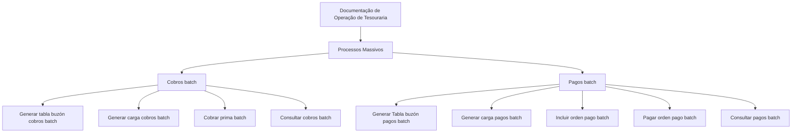

# Documentação de Operação de Tesouraria — Processos Massivos (Reef)

## 1. Metadados do Documento
- **Arquivo de Origem:** Não identificado no conteúdo extraído
- **Tipo de Documento:** Manual Operacional
- **Domínio / Sistema:** Tesouraria, Reef, Mapfre
- **Público-Alvo:** Operação
- **Data/Versão Identificada:** Não identificada

---

## 2. Resumo Executivo & Contexto de Negócio

O documento apresenta uma página de documentação de operação de Tesouraria voltada a **processos massivos**. O conteúdo está identificado como “EN CONSTRUCCIÓN”, indicando que a documentação está em construção e não contém detalhamento operacional completo.

A estrutura apresentada separa operações massivas de **cobros** e **pagos**. Para cobros, o documento lista a geração de tabela de buzón, carga, cobrança de prima e consulta. Para pagos, o documento lista geração de tabela de buzón, carga, inclusão de ordem de pagamento, pagamento de ordem e consulta.

A documentação está associada a referências “Documentation / DOCUMENTACIÓN Reef”, “DOCUMENTACIÓN Reef” e “Mapfredocument”. A página também apresenta navegação para Soluções, Arquiteturas, APIs, Componentes, Cloud, Documentação, Zeus, Reef e Ajuda.

Não há descrição de procedimentos, critérios de validação, contratos de integração, URLs, tecnologias, equipes responsáveis pelos processos ou regras de execução batch. O conteúdo disponível funciona como um índice inicial de operações de Tesouraria.

---

## 3. Arquitetura, Componentes & Tecnologias Envolvidas

Os elementos explicitamente citados são:

- **Reef:** contexto de documentação.
- **Tesouraria:** domínio operacional.
- **Processos masivos / batch:** modalidade de execução das operações.
- **Cobros:** conjunto de operações relacionadas a cobranças.
- **Pagos:** conjunto de operações relacionadas a pagamentos.
- **Mapfredocument:** referência exibida na página.
- **Zeus:** item de navegação mencionado, sem descrição de relação funcional com Tesouraria.



> **Nota de Análise:** O documento lista operações batch, mas não declara uma sequência obrigatória de execução, dependências técnicas, serviços envolvidos, protocolos, métodos HTTP, contratos de dados ou mecanismos de agendamento.

---

## 4. Regras de Negócio, Especificações Funcionais & Processos

### Processos massivos de cobros

O documento relaciona as seguintes operações de cobros batch:

1. **GENERAR tabla buzón cobros batch**
2. **GENERAR carga cobros batch**
3. **COBRAR prima batch**
4. **CONSULTAR cobros batch**

Não foram fornecidos critérios de elegibilidade para cobrança, regras de cálculo de prima, definição de buzón, formato da carga, comportamento para erros ou parâmetros para consulta.

### Processos massivos de pagos

O documento relaciona as seguintes operações de pagos batch:

1. **GENERAR Tabla buzón pagos batch**
2. **GENERAR carga pagos batch**
3. **INCLUIR orden pago batch**
4. **PAGAR orden pago batch**
5. **CONSULTAR pagos batch**

Não foram fornecidos critérios para inclusão de ordem de pagamento, condições para pagamento, estados possíveis de uma ordem, validações, formato de arquivos batch ou regras de consulta.

---

## 5. Tabelas de Parâmetros, Ambientes e Estruturas de Dados

| Item / Parâmetro | Descrição / Função | Tipo / Valores / Formato | Ambiente / Observações |
| :--- | :--- | :--- | :--- |
| Processos masivos | Grupo principal de operações documentadas para Tesouraria | Operações batch | Sem ambiente identificado |
| GENERAR tabla buzón cobros batch | Operação listada para cobros | Processo batch | Sem detalhamento adicional |
| GENERAR carga cobros batch | Operação listada para cobros | Processo batch | Sem detalhamento adicional |
| COBRAR prima batch | Operação listada para cobrança de prima | Processo batch | Sem detalhamento adicional |
| CONSULTAR cobros batch | Operação de consulta de cobros | Processo batch | Sem detalhamento adicional |
| GENERAR Tabla buzón pagos batch | Operação listada para pagos | Processo batch | Sem detalhamento adicional |
| GENERAR carga pagos batch | Operação listada para pagos | Processo batch | Sem detalhamento adicional |
| INCLUIR orden pago batch | Operação de inclusão de ordem de pagamento | Processo batch | Sem detalhamento adicional |
| PAGAR orden pago batch | Operação de pagamento de ordem | Processo batch | Sem detalhamento adicional |
| CONSULTAR pagos batch | Operação de consulta de pagamentos | Processo batch | Sem detalhamento adicional |
| Owner | Proprietário exibido na documentação | `user:agonzalez_mapfre.com` | Identificador apresentado literalmente |
| Lifecycle | Estado do ciclo de vida da documentação | `Approved` | Valor exibido na página |
| Idioma | Idioma de navegação exibido | `ES` | Interface em espanhol |

---

## 6. Bateria de Perguntas & Respostas para RAG (FAQ Sintético)

### P1: Qual é o objetivo da documentação de operação de Tesouraria?
**R:** A documentação apresenta processos massivos de Tesouraria, organizados em operações batch de cobros e pagos. O conteúdo extraído está marcado como “EN CONSTRUCCIÓN”.

### P2: Quais processos batch de cobros são listados no documento?
**R:** O documento lista: gerar tabela de buzón de cobros batch, gerar carga de cobros batch, cobrar prima batch e consultar cobros batch.

### P3: Quais processos batch de pagos são listados no documento?
**R:** O documento lista: gerar tabela de buzón de pagos batch, gerar carga de pagos batch, incluir ordem de pagamento batch, pagar ordem de pagamento batch e consultar pagos batch.

### P4: O documento define o formato da carga de cobros batch?
**R:** Não. O documento apenas cita a operação “GENERAR carga cobros batch”, sem informar formato de arquivo, campos, validações, origem ou destino da carga.

### P5: O documento explica como ocorre a cobrança de prima batch?
**R:** Não. A operação “COBRAR prima batch” é mencionada, mas não há regras de cálculo, condições de cobrança, estados, integrações ou tratamento de exceções.

### P6: O documento estabelece uma sequência obrigatória para os processos de cobros?
**R:** Não explicitamente. As operações de cobros são apresentadas em uma lista, mas o conteúdo não confirma que a ordem apresentada representa uma sequência operacional mandatória.

### P7: O documento descreve regras para incluir uma ordem de pagamento batch?
**R:** Não. A operação “INCLUIR orden pago batch” é listada sem detalhamento de critérios, dados obrigatórios, aprovações ou validações.

### P8: Existe detalhamento de ambientes, servidores ou URLs para os processos de Tesouraria?
**R:** Não. O conteúdo não apresenta URLs, nomes de servidores, portas, ambientes de desenvolvimento, homologação ou produção.

### P9: Qual sistema é associado à documentação de Tesouraria?
**R:** O documento contém referências a “DOCUMENTACIÓN Reef” e “Documentation / DOCUMENTACIÓN Reef”. Também há referência textual a “Mapfredocument”.

### P10: Quem é identificado como owner da documentação?
**R:** O campo Owner é apresentado como `user:agonzalez_mapfre.com`.

### P11: Qual é o lifecycle exibido para a documentação?
**R:** O lifecycle exibido é `Approved`.

### P12: O documento especifica APIs ou contratos de integração para cobros e pagos?
**R:** Não. Embora a navegação da página inclua o item “APIs”, o conteúdo extraído não descreve APIs, endpoints, métodos HTTP, payloads ou contratos de integração.

---

## 7. Glossário de Termos, Siglas & Conceitos-Chave

- **Batch:** Modalidade de processo mencionada para as operações de cobros e pagos. O documento não apresenta definição técnica adicional.
- **Buzón:** Termo presente nas operações “tabla buzón cobros batch” e “Tabla buzón pagos batch”. O significado funcional não é detalhado.
- **Cobros:** Grupo de operações relacionadas a cobranças no contexto de Tesouraria.
- **Orden pago:** Ordem de pagamento mencionada nas operações batch de pagos.
- **Pagos:** Grupo de operações relacionadas a pagamentos no contexto de Tesouraria.
- **Prima:** Item sujeito à operação “COBRAR prima batch”; o documento não define seu significado ou método de cálculo.
- **Reef:** Nome citado como contexto da documentação.
- **Tesouraria:** Domínio operacional documentado.
- **Zeus:** Item de navegação exibido na página, sem definição ou relação operacional detalhada.

---

## 8. Notas Críticas, Riscos & Limitações

- O documento está explicitamente identificado como **“EN CONSTRUCCIÓN”**.
- O conteúdo não detalha procedimentos operacionais para nenhuma das operações batch listadas.
- Não há parâmetros, arquivos de entrada, campos de dados, regras de validação ou critérios de sucesso.
- Não há definição de sequenciamento obrigatório entre operações de cobros ou pagamentos.
- Não há evidência de URLs, servidores, ambientes, logs, APIs, contratos ou mecanismos de integração.
- Não há regras de erro, reprocessamento, auditoria, monitoramento ou tratamento de exceções.
- **Nota de Análise:** O documento lista as operações de Tesouraria, porém não fornece detalhamento suficiente para executar ou implementar os processos sem fontes complementares.

---

## 9. Conteúdo Bruto Estruturado (Referência Fiel)

```text
--- [PÁGINA 1 DE 1] ---

EN CONSTRUCCIÓN
DOCUMENTACIÓN de OPERACIÓN de TESORERÍA - PROCESOS
MASIVOS
Imagen masivos
OPERACIONES
GENERAR tabla buzón cobros batch
GENERAR carga cobros batch
COBRAR prima batch
CONSULTAR cobros batch
GENERAR Tabla buzón pagos batch
GENERAR carga pagos batch
INCLUIR orden pago batch
PAGAR orden pago batch
CONSULTAR pagos batch
Documentation / DOCUMENTACIÓN Reef
DOCUMENTACIÓN Reef
Mapfredocument
DOCUMENTACIÓN Reef
Owner
user:agonzalez_mapfre.com
Lifecycle
Approved Source
 / 
 VL
Buscar Inicio Soluciones Arquitecturas APIs Componentes Cloud Documentación Zeus Reef Ayuda
ES
```
