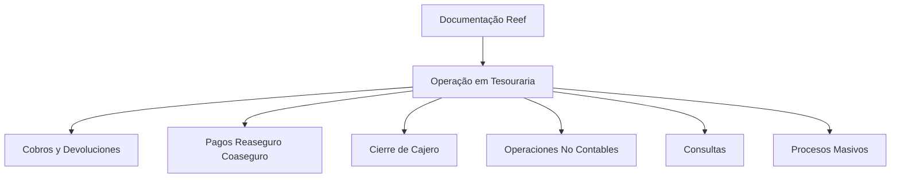

# Documentação Reef — Operação em Tesouraria por Tipo de Operação

## 1. Metadados do Documento
- **Arquivo de Origem:** Não identificado
- **Tipo de Documento:** Procedimento
- **Domínio / Sistema:** Reef / Tesouraria / Mapfre
- **Público-Alvo:** Operação
- **Data/Versão Identificada:** Não identificada

---

## 2. Resumo Executivo & Contexto de Negócio

O conteúdo apresenta uma documentação Reef orientada à operação em Tesouraria. A organização indicada é feita por tipo de operação, sem detalhamento dos procedimentos, responsáveis operacionais, pré-requisitos ou resultados esperados para cada tipo.

Os tipos de operação listados abrangem cobranças e devoluções, pagamentos relacionados a resseguro e cosseguro, fechamento de caixa, operações não contábeis, consultas e processos massivos. O documento, portanto, funciona como uma classificação inicial das áreas operacionais abordadas pela documentação Reef.

A origem do conteúdo aparenta estar associada ao portal “Documentation / DOCUMENTACIÓN Reef”, com referências a Mapfre e Mapfredocument. O registro apresenta estado de ciclo de vida como “Approved Source” e identifica `user:agonzalez_mapfre.com` como Owner.

Não há descrição adicional de regras de negócio, integrações, telas, URLs de ambientes, contratos de serviço, métodos HTTP, parâmetros técnicos ou fluxos detalhados. A informação disponível limita-se aos títulos e agrupamentos explicitamente extraídos.

---

## 3. Arquitetura, Componentes & Tecnologias Envolvidas

Os elementos explicitamente citados são:

- **Reef:** sistema ou domínio associado à documentação.
- **Tesouraria:** contexto operacional da documentação.
- **Mapfre / Mapfredocument:** referências presentes na navegação e identificação documental.
- **Documentation / DOCUMENTACIÓN Reef:** portal ou área de documentação mencionada.
- **Zeus, Soluciones, Arquitecturas, APIs, Componentes, Cloud e Ayuda:** itens de navegação exibidos; o conteúdo não explica sua relação funcional ou técnica com Reef.

Não há arquitetura de software, componentes internos, microsserviços, tecnologias, bancos de dados ou integrações descritos no conteúdo extraído. O diagrama abaixo representa somente a classificação documental das operações listadas.



> **Nota de Análise:** O conteúdo não detalha relações de integração, fluxos de dados, tecnologias ou responsabilidades entre os itens de navegação e a documentação Reef.

---

## 4. Regras de Negócio, Especificações Funcionais & Processos

O documento estabelece apenas a seguinte organização funcional:

1. A documentação Reef é orientada à operação em Tesouraria.
2. A documentação deve ser consultada por tipo de operação.
3. Os tipos de operação apresentados são:
   - Cobros y Devoluciones.
   - Pagos Reaseguro Coaseguro.
   - Cierre de Cajero.
   - Operaciones No Contables.
   - Consultas.
   - Procesos Masivos.

Não foram identificadas regras de validação, critérios de cálculo, condições de aprovação, exceções operacionais, sequência de execução, papéis de usuário, níveis de permissão ou critérios de encerramento.

> **Nota de Análise:** O documento menciona categorias de operação, mas não apresenta o detalhamento operacional de cada categoria.

---

## 5. Tabelas de Parâmetros, Ambientes e Estruturas de Dados

| Item / Parâmetro | Descrição / Função | Tipo / Valores / Formato | Ambiente / Observações |
| :--- | :--- | :--- | :--- |
| Reef | Sistema ou domínio associado à documentação | Nome próprio | Relacionado à operação em Tesouraria |
| Tesouraria | Área operacional abordada | Domínio de negócio | O conteúdo declara “OPERACIÓN en TESORERÍA” |
| Cobros y Devoluciones | Tipo de operação listado | Categoria operacional | Sem detalhamento adicional |
| Pagos Reaseguro Coaseguro | Tipo de operação listado | Categoria operacional | Sem detalhamento adicional |
| Cierre de Cajero | Tipo de operação listado | Categoria operacional | Sem detalhamento adicional |
| Operaciones No Contables | Tipo de operação listado | Categoria operacional | Sem detalhamento adicional |
| Consultas | Tipo de operação listado | Categoria operacional | Sem detalhamento adicional |
| Procesos Masivos | Tipo de operação listado | Categoria operacional | Sem detalhamento adicional |
| Owner | Proprietário identificado no registro documental | `user:agonzalez_mapfre.com` | Associado a “Mapfredocument” |
| Lifecycle | Estado do ciclo de vida do documento | `Approved Source` | Valor exibido no conteúdo |
| Idioma | Idioma da interface exibida | `ES` | O conteúdo possui termos em espanhol |
| Navegação | Seções exibidas no portal | Buscar, Inicio, Soluciones, Arquitecturas, APIs, Componentes, Cloud, Documentación, Zeus, Reef, Ayuda | Sem descrição funcional adicional |

---

## 6. Bateria de Perguntas & Respostas para RAG (FAQ Sintético)

### P1: Qual é o objetivo da documentação Reef apresentada?
**R:** A documentação Reef é orientada à operação em Tesouraria e está organizada por tipo de operação. O conteúdo não detalha os procedimentos de cada operação.

### P2: Quais tipos de operação em Tesouraria são listados na documentação Reef?
**R:** Os tipos listados são: Cobros y Devoluciones, Pagos Reaseguro Coaseguro, Cierre de Cajero, Operaciones No Contables, Consultas e Procesos Masivos.

### P3: O documento descreve o procedimento de cobranças e devoluções?
**R:** Não. O documento apenas lista “COBROS Y DEVOLUCIONES” como tipo de operação. Não há etapas, regras, campos, validações ou responsabilidades descritas.

### P4: Existe detalhamento sobre pagamentos de resseguro e cosseguro?
**R:** Não. “PAGOS REASEGURO COASEGURO” aparece somente como uma categoria de operação em Tesouraria, sem detalhamento adicional.

### P5: O que o conteúdo informa sobre fechamento de caixa?
**R:** O conteúdo lista “CIERRE DE CAJERO” entre os tipos de operação. Não há informações sobre periodicidade, responsáveis, critérios de fechamento ou tratamento de exceções.

### P6: Há regras para operações não contábeis?
**R:** Não. “OPERACIONES NO CONTABLES” é apenas uma categoria listada; o texto não apresenta regras de negócio, condições ou exemplos.

### P7: O documento fornece URLs, servidores ou ambientes técnicos do Reef?
**R:** Não. Não foram identificadas URLs de ambiente, nomes de servidores, portas, credenciais, variáveis de configuração ou parâmetros de infraestrutura.

### P8: Quem é identificado como proprietário do documento?
**R:** O conteúdo identifica o Owner como `user:agonzalez_mapfre.com`.

### P9: Qual é o estado do ciclo de vida indicado para o documento?
**R:** O campo Lifecycle apresenta o valor `Approved Source`.

### P10: O documento descreve APIs ou contratos de integração do Reef?
**R:** Não. Embora “APIs” apareça como item de navegação, não há métodos HTTP, endpoints, contratos JSON, serviços ou integrações detalhados.

### P11: Quais referências corporativas aparecem no conteúdo?
**R:** O conteúdo menciona Reef, Tesouraria, Mapfre, Mapfredocument, Documentation / DOCUMENTACIÓN Reef e Zeus.

### P12: O documento contém especificações para processos massivos?
**R:** Não. “PROCESOS MASIVOS” é listado como tipo de operação, mas não possui descrição de processamento, entradas, saídas, agendamento ou tratamento de falhas.

---

## 7. Glossário de Termos, Siglas & Conceitos-Chave

- **Reef:** nome do sistema, domínio ou área documental referenciada no conteúdo.
- **Tesouraria:** área operacional indicada como contexto da documentação.
- **Cobros y Devoluciones:** categoria de operação relacionada a cobranças e devoluções.
- **Pagos Reaseguro Coaseguro:** categoria de operação relacionada a pagamentos de resseguro e cosseguro.
- **Cierre de Cajero:** categoria de operação relacionada a fechamento de caixa.
- **Operaciones No Contables:** categoria de operações não contábeis.
- **Consultas:** categoria de consultas.
- **Procesos Masivos:** categoria de processos massivos.
- **Owner:** campo que identifica o proprietário do registro documental.
- **Lifecycle:** campo que identifica o estado do ciclo de vida do documento.
- **Approved Source:** valor exibido para o ciclo de vida do documento.
- **Mapfredocument:** referência exibida no conteúdo, sem descrição adicional.
- **Zeus:** item de navegação exibido, sem descrição funcional adicional.

---

## 8. Notas Críticas, Riscos & Limitações

- O arquivo de origem, a data e a versão não foram identificados no conteúdo fornecido.
- Não há procedimentos detalhados para nenhuma das categorias operacionais listadas.
- Não há regras de negócio, cálculos, validações, exceções ou critérios de aprovação.
- Não há arquitetura técnica, componentes, integrações, APIs, ambientes ou dados de infraestrutura.
- Itens como “APIs”, “Cloud”, “Zeus” e “Arquitecturas” aparecem na navegação, mas não são explicados.
- O conteúdo aparenta ser uma página de índice, navegação ou capa documental, e não uma especificação operacional completa.

---

## 9. Conteúdo Bruto Estruturado (Referência Fiel)

```text
--- [PÁGINA 1 DE 1] ---

== EN CONSTRUCCIÓN ==
OPERACIÓN en TESORERÍA
 Documentación orientada a la operación por tipo de operación.
TIPOS DE OPERACIÓN
 COBROS Y DEVOLUCIONES
PAGOS REASEGURO COASEGURO
CIERRE DE CAJERO OPERACIONES NO CONTABLES CONSULTAS
PROCESOS MASIVOS
Documentation / DOCUMENTACIÓN Reef
DOCUMENTACIÓN Reef
Mapfredocument
DOCUMENTACIÓN Reef
Owner
user:agonzalez_mapfre.com
Lifecycle
Approved Source
 / 
 VL
Buscar Inicio Soluciones Arquitecturas APIs Componentes Cloud Documentación Zeus Reef Ayuda
ES
```
