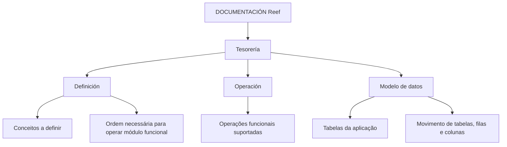

# Documentação Reef — Tesorería: Estrutura Funcional, Operação e Modelo de Dados

## 1. Metadados do Documento
- **Arquivo de Origem:** Não identificado no conteúdo fornecido
- **Tipo de Documento:** Manual Operacional
- **Domínio / Sistema:** Reef / Tesorería
- **Público-Alvo:** Operação, Negócio, Desenvolvedores e Arquitetos
- **Data/Versão Identificada:** Não identificada

---

## 2. Resumo Executivo & Contexto de Negócio

O documento apresenta a organização da documentação de **Tesorería** no sistema **Reef**. O conteúdo informa que a documentação funcional está dividida em três áreas: **Definición**, **Operación** e **Modelo de datos**.

A seção **Definición** concentra documentos que descrevem conceitos a serem definidos e a ordem necessária para obter a definição requerida antes de operar um módulo funcional. A seção **Operación** reúne documentos relacionados às operações funcionais suportadas pelo módulo.

A seção **Modelo de datos** é orientada às tabelas da aplicação. O documento declara que essa documentação também descreve detalhadamente o movimento de elementos como tabelas, filas e colunas em função das operações funcionais.

O conteúdo também identifica o espaço documental como **DOCUMENTACIÓN Reef**, associado a **Mapfredocument**, com estado de ciclo de vida **Approved Source** e proprietário indicado como `user:agonzalez_mapfre.com`.

---

## 3. Arquitetura, Componentes & Tecnologias Envolvidas

Os componentes e contextos explicitamente citados são:

| Componente / Termo | Papel identificado no documento |
| :--- | :--- |
| Reef | Sistema ou contexto documental ao qual pertence a documentação. |
| Tesorería | Área funcional abordada pela documentação. |
| Definición | Categoria documental para conceitos e ordem de definição necessária à operação de módulos funcionais. |
| Operación | Categoria documental relacionada às operações funcionais suportadas pelo módulo. |
| Modelo de datos | Categoria documental orientada às tabelas da aplicação e ao movimento de tabelas, filas e colunas. |
| Mapfredocument | Termo apresentado no contexto da documentação Reef. |
| Zeus | Item listado na navegação da plataforma documental. |
| Cloud | Item listado na navegação da plataforma documental. |
| APIs | Item listado na navegação da plataforma documental. |
| Componentes | Item listado na navegação da plataforma documental. |



> **Nota de Análise:** O conteúdo fornecido descreve categorias documentais e não apresenta uma arquitetura de software detalhada, integrações, microsserviços, métodos HTTP, contratos JSON, tecnologias de implementação ou ambientes técnicos.

---

## 4. Regras de Negócio, Especificações Funcionais & Processos

### 4.1 Organização da documentação de Tesorería

A documentação relacionada à funcionalidade do sistema é dividida nos seguintes apartados:

1. **Definición**
2. **Operación**
3. **Modelo de datos**

### 4.2 Definición

A categoria **Definición** contém documentos que:

- Detalham os conceitos que devem ser definidos.
- Estabelecem a ordem que deve ser seguida.
- Visam alcançar a definição necessária para que seja possível operar um módulo funcional.

### 4.3 Operación

A categoria **Operación** contém documentos relacionados às operações funcionais suportadas pelo módulo.

O conteúdo não especifica quais operações funcionais são suportadas, nem apresenta fluxos operacionais detalhados, pré-condições, validações ou exceções.

### 4.4 Modelo de datos

A categoria **Modelo de datos** contém documentação:

- Orientada às tabelas da aplicação.
- Que descreve detalhadamente o movimento de elementos.
- Que considera elementos como tabelas, filas e colunas.
- Que relaciona esses movimentos às operações funcionais.

> **Nota de Análise:** O documento não identifica nomes de tabelas, estruturas de colunas, chaves, formatos de dados, regras de persistência ou exemplos de movimentação.

---

## 5. Tabelas de Parâmetros, Ambientes e Estruturas de Dados

| Item / Parâmetro | Descrição / Função | Tipo / Valores / Formato | Ambiente / Observações |
| :--- | :--- | :--- | :--- |
| Sistema / contexto | Reef | Nome citado na documentação | Não detalhado |
| Área funcional | Tesorería | Área abordada pelo conteúdo | Não detalhado |
| Categoria documental | Definición | Documentos sobre conceitos a definir e ordem de definição para operação de módulo funcional | Não detalhado |
| Categoria documental | Operación | Documentos relacionados a operações funcionais suportadas pelo módulo | Operações não enumeradas |
| Categoria documental | Modelo de datos | Documentação sobre tabelas da aplicação e movimento de tabelas, filas e colunas | Estruturas não detalhadas |
| Owner | `user:agonzalez_mapfre.com` | Identificador de proprietário exibido no conteúdo | Associado a DOCUMENTACIÓN Reef |
| Lifecycle | Approved Source | Estado de ciclo de vida exibido | Não detalhado |
| Plataforma / referência | Mapfredocument | Termo exibido no conteúdo | Relação técnica não detalhada |
| Navegação | Soluciones, Arquitecturas, APIs, Componentes, Cloud, Documentación, Zeus, Reef, Ayuda | Itens de navegação apresentados | Sem descrição funcional adicional |
| Idioma | ES | Indicador de idioma exibido | Espanhol |

---

## 6. Bateria de Perguntas & Respostas para RAG (FAQ Sintético)

### P1: Qual é o sistema ou contexto principal da documentação de Tesorería?
**R:** O contexto principal é o sistema ou espaço documental **Reef**, identificado no conteúdo como **DOCUMENTACIÓN Reef**.

### P2: Como a documentação funcional de Tesorería está organizada?
**R:** A documentação funcional de Tesorería está dividida em três apartados: **Definición**, **Operación** e **Modelo de datos**.

### P3: Qual é a finalidade da seção Definición na documentação Reef?
**R:** A seção **Definición** reúne documentos que detalham os conceitos que devem ser definidos e a ordem que deve ser seguida para obter a definição necessária à operação de um módulo funcional.

### P4: O que a seção Operación documenta?
**R:** A seção **Operación** reúne documentos relacionados às operações funcionais que o módulo suporta. O conteúdo fornecido não lista quais operações são suportadas.

### P5: Qual é o foco da seção Modelo de datos?
**R:** A seção **Modelo de datos** é orientada às tabelas da aplicação e descreve detalhadamente o movimento de elementos como tabelas, filas e colunas em função das operações funcionais.

### P6: O documento fornece nomes de tabelas ou definições de colunas?
**R:** Não. O documento informa que a documentação de modelo de dados é orientada às tabelas, filas e colunas, mas não fornece nomes de tabelas, colunas, tipos de dados ou chaves.

### P7: Existe um fluxo de operação funcional detalhado no conteúdo?
**R:** Não. O documento somente informa que a seção **Operación** contém documentos relacionados às operações funcionais suportadas pelo módulo; não há passos operacionais, validações ou exceções descritos.

### P8: Quem é o proprietário identificado para DOCUMENTACIÓN Reef?
**R:** O proprietário indicado no conteúdo é `user:agonzalez_mapfre.com`.

### P9: Qual é o estado de ciclo de vida identificado no documento?
**R:** O estado de ciclo de vida exibido é **Approved Source**.

### P10: O conteúdo descreve APIs, microsserviços ou contratos de integração?
**R:** Não. Embora “APIs” apareça como item de navegação, o documento não descreve endpoints, métodos HTTP, microsserviços, contratos JSON, protocolos ou integrações técnicas.

---

## 7. Glossário de Termos, Siglas & Conceitos-Chave

- **Reef:** Sistema ou contexto documental citado como **DOCUMENTACIÓN Reef**.
- **Tesorería:** Área funcional abordada pelo conteúdo.
- **Definición:** Categoria documental dedicada aos conceitos que devem ser definidos e à ordem necessária para viabilizar a operação de um módulo funcional.
- **Operación:** Categoria documental relacionada às operações funcionais que um módulo suporta.
- **Modelo de datos:** Categoria documental orientada às tabelas da aplicação e ao movimento de tabelas, filas e colunas conforme operações funcionais.
- **Mapfredocument:** Termo apresentado no contexto da documentação Reef; o conteúdo não detalha sua função.
- **Lifecycle:** Campo de ciclo de vida exibido com o valor **Approved Source**.
- **Owner:** Campo que identifica o proprietário do conteúdo; o valor apresentado é `user:agonzalez_mapfre.com`.
- **ES:** Indicador de idioma apresentado na navegação; corresponde ao contexto em espanhol exibido no documento.

---

## 8. Notas Críticas, Riscos & Limitações

- O arquivo de origem, data, versão e autoria formal do documento não foram identificados no conteúdo fornecido.
- O conteúdo é predominantemente descritivo e estrutural; não apresenta procedimentos operacionais detalhados.
- Não há nomes de módulos funcionais, tabelas, filas, colunas, atributos, tipos de dados ou relacionamentos de modelo de dados.
- Não há informações sobre ambientes, URLs, servidores, credenciais, logs, parâmetros de execução, APIs, contratos de integração ou tecnologias de implementação.
- O termo **Mapfredocument** é citado sem explicação funcional ou arquitetural adicional.
- A presença de itens como **APIs**, **Cloud**, **Zeus** e **Componentes** na navegação não sustenta inferências sobre integrações ou arquitetura técnica.

---

## 9. Conteúdo Bruto Estruturado (Referência Fiel)

```text
--- [PÁGINA 1 DE 1] ---

DOCUMENTACIÓN - TESORERÍA
 En este apartado se aborda todo aquello relacionado con la funcionalidad del sistema. La información se encuentra dividida en los
apartados siguientes:
Denición
Operación
Modelo de datos
DEFINICIÓN
Documentos que detallan aquellos conceptos que se han de denir y el orden que se ha de seguir para conseguir la denición necesaria con
lo que poder operar un módulo funcional.
OPERACIÓN
Documentos relacionados con las operaciones funcionales que el módulo soporta.
MODELO DE DATOS
Documentación orientada hacia las tablas de la aplicación. Adicionalmente, se describe con detalle el movimiento de distintos elementos
como tablas, las y columnas atendiendo a las operaciones funcionales.
Documentation / DOCUMENTACIÓN Reef
DOCUMENTACIÓN Reef
Mapfredocument
DOCUMENTACIÓN Reef
Owner
user:agonzalez_mapfre.com
Lifecycle
Approved Source
 / 
 VL
Buscar Inicio Soluciones Arquitecturas APIs Componentes Cloud Documentación Zeus Reef Ayuda
ES
```
