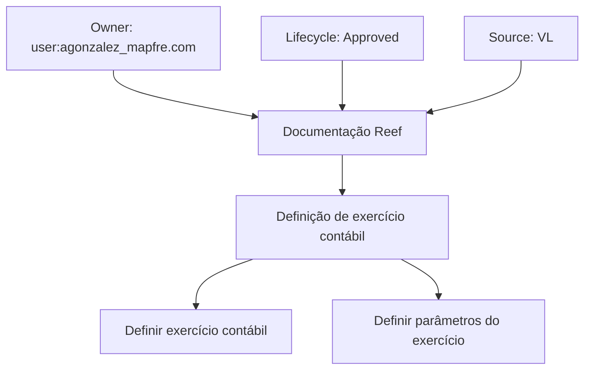

# Definição de Exercício Contábil — Documentação Reef

## 1. Metadados do Documento
- **Arquivo de Origem:** Não identificado
- **Tipo de Documento:** Procedimento
- **Domínio / Sistema:** Reef / Documentação Reef
- **Público-Alvo:** Negócio, Operação e usuários da documentação Reef
- **Data/Versão Identificada:** Não identificada

---

## 2. Resumo Executivo & Contexto de Negócio

O documento descreve, em nível resumido, a definição de um exercício contábil. O objetivo declarado é definir o período de tempo em que serão realizadas as operações contábeis e as condições que determinarão a forma de trabalho sobre esse período.

O processo apresentado contém duas etapas: definir o exercício contábil e definir os parâmetros do exercício. A extração não detalha responsáveis por cada etapa, regras de validação, critérios de abertura ou encerramento, nem os parâmetros que devem ser configurados.

A documentação está relacionada ao ambiente ou portal denominado Reef. O conteúdo também apresenta referências a “Mapfredocument”, “DOCUMENTACIÓN Reef”, ao proprietário `user:agonzalez_mapfre.com`, ao estado de ciclo de vida “Approved” e à fonte “VL”.

A navegação visível indica que o conteúdo está inserido em uma base documental com categorias como Soluções, Arquiteturas, APIs, Componentes, Cloud, Documentação, Zeus, Reef e Ajuda.

---

## 3. Arquitetura, Componentes & Tecnologias Envolvidas

Os elementos identificados são:

| Componente / Elemento | Papel identificado |
| :--- | :--- |
| Reef | Contexto do sistema ou repositório documental citado. |
| DOCUMENTACIÓN Reef | Área ou classificação documental exibida. |
| Mapfredocument | Referência exibida no conteúdo bruto. Não há detalhamento funcional. |
| Zeus | Item de navegação do portal documental. Não há relação técnica detalhada com o exercício contábil. |
| `user:agonzalez_mapfre.com` | Proprietário identificado no conteúdo. |
| Lifecycle: Approved | Estado de ciclo de vida informado para o documento. |
| Source: VL | Fonte identificada no conteúdo. O significado de “VL” não é detalhado. |



**Nota de Análise:** O documento não apresenta arquitetura de software, integrações, APIs, microsserviços, tecnologias de implementação ou fluxos de dados.

---

## 4. Regras de Negócio, Especificações Funcionais & Processos

### Objetivo funcional

O exercício contábil deve ser definido para estabelecer:

1. O período de tempo no qual serão realizadas operações contábeis.
2. As condições que determinarão a forma de trabalhar sobre esse período.

### Processo apresentado

| Etapa | Nome da etapa | Descrição disponível |
| :--- | :--- | :--- |
| 1 | Definir exercício contábil | O documento indica esta como a primeira etapa do processo, sem informar dados de entrada, responsáveis, validações ou resultado esperado. |
| 2 | Definir parâmetros do exercício | O documento indica esta como a segunda etapa do processo, sem listar os parâmetros, valores permitidos, regras de cálculo ou comportamento operacional. |

**Nota de Análise:** A extração apresenta títulos de processo, mas não detalha regras de abertura, fechamento, alteração, bloqueio ou consulta de exercícios contábeis.

---

## 5. Tabelas de Parâmetros, Ambientes e Estruturas de Dados

| Item / Parâmetro | Descrição / Função | Tipo / Valores / Formato | Ambiente / Observações |
| :--- | :--- | :--- | :--- |
| Exercício contábil | Período de tempo em que serão realizadas operações contábeis. | Não detalhado. | O documento não informa formato de data, periodicidade ou identificador. |
| Condições de trabalho | Condições que determinam a forma de trabalhar sobre o período contábil. | Não detalhado. | Não há regras ou valores especificados. |
| Parâmetros do exercício | Elementos definidos na segunda etapa do processo. | Não detalhado. | O documento não lista parâmetros individuais. |
| Owner | Proprietário apresentado para a documentação. | `user:agonzalez_mapfre.com` | Exibido no portal documental. |
| Lifecycle | Estado de ciclo de vida da documentação. | `Approved` | Exibido no portal documental. |
| Source | Fonte apresentada para a documentação. | `VL` | O significado de `VL` não é explicado. |
| Idioma | Idioma exibido na interface documental. | `ES` | A interface contém elementos em espanhol e inglês. |

---

## 6. Bateria de Perguntas & Respostas para RAG (FAQ Sintético)

### P1: Qual é o objetivo da definição de um exercício contábil?
**R:** O objetivo é definir o período de tempo no qual serão realizadas as operações contábeis e as condições que determinarão como trabalhar sobre esse período.

### P2: Quais etapas compõem o processo de definição de exercício contábil?
**R:** O processo possui duas etapas apresentadas no documento: primeiro, definir o exercício contábil; segundo, definir os parâmetros do exercício.

### P3: O documento informa quais parâmetros devem ser configurados no exercício contábil?
**R:** Não. O documento menciona a etapa “definir parâmetros do exercício”, mas não identifica os parâmetros, seus formatos, valores permitidos ou regras de validação.

### P4: O documento define o formato de datas do exercício contábil?
**R:** Não. A extração apenas menciona a definição de um período de tempo para operações contábeis, sem informar formato de data, data de início, data de fim ou periodicidade.

### P5: O documento detalha regras para abertura ou fechamento de exercícios contábeis?
**R:** Não. Não há regras explícitas para abertura, fechamento, bloqueio, reabertura ou alteração de exercícios contábeis.

### P6: Qual sistema ou contexto documental está associado ao conteúdo?
**R:** O conteúdo está associado à “DOCUMENTACIÓN Reef” e contém referências a Reef, Mapfredocument e ao item de navegação Zeus.

### P7: Quem é o proprietário identificado para a documentação?
**R:** O proprietário exibido é `user:agonzalez_mapfre.com`.

### P8: Qual é o estado de ciclo de vida identificado para o documento?
**R:** O estado de ciclo de vida apresentado é `Approved`.

### P9: Qual fonte está identificada no portal documental?
**R:** A fonte identificada é `VL`. O documento não explica o significado dessa sigla.

### P10: O documento descreve APIs, integrações ou arquitetura técnica?
**R:** Não. A extração não apresenta APIs, contratos, integrações, componentes técnicos, servidores, URLs ou tecnologias de implementação.

---

## 7. Glossário de Termos, Siglas & Conceitos-Chave

- **Exercício contábil:** Período de tempo em que serão realizadas operações contábeis, conforme o objetivo declarado no documento.
- **Parâmetros do exercício:** Elementos que devem ser definidos como segunda etapa do processo; seus detalhes não são apresentados.
- **Reef:** Nome citado no contexto da documentação. O documento não define funcionalmente o termo.
- **Mapfredocument:** Referência exibida no conteúdo bruto, sem explicação adicional.
- **Lifecycle:** Campo de ciclo de vida documental, apresentado com o valor `Approved`.
- **Approved:** Estado de ciclo de vida indicado para o documento.
- **Source:** Campo de origem documental, apresentado com o valor `VL`.
- **VL:** Valor exibido no campo de fonte; significado não detalhado.
- **ES:** Indicador de idioma exibido na interface documental.

---

## 8. Notas Críticas, Riscos & Limitações

- O documento contém somente uma descrição resumida do objetivo e das duas etapas do processo.
- Não há detalhamento dos parâmetros do exercício contábil.
- Não são informados formatos de data, critérios de validação, regras de cálculo, permissões, responsáveis operacionais ou procedimentos de exceção.
- Não há informações sobre integrações, APIs, arquitetura de software, ambientes, URLs, logs ou estruturas de dados.
- A referência `VL` é exibida como fonte, porém não possui definição no conteúdo extraído.

---

## 9. Conteúdo Bruto Estruturado (Referência Fiel)

```text
--- [PÁGINA 1 DE 1] ---

EN CONSTRUCCIÓN
DEFINICIÓN de ejercicio contable
Objetivo
Denir el periodo de tiempo en el que se realizarán las operaciones contables y las condiciones que determinarán la forma de trabajar sobre
este período.
Proceso a seguir
DEFINIR ejercicio
contable
(1)
DEFINIR parámetros
del ejercicio
(2)
1. DEFINIR ejercicio contable
1. DEFINIR parámetros del ejercicio
Documentation / DOCUMENTACIÓN Reef
DOCUMENTACIÓN Reef
Mapfredocument
DOCUMENTACIÓN Reef
Owner
user:agonzalez_mapfre.com
Lifecycle
Approved Source
 / 
 VL
Buscar Inicio Soluciones Arquitecturas APIs Componentes Cloud Documentación Zeus Reef Ayuda
ES
```
