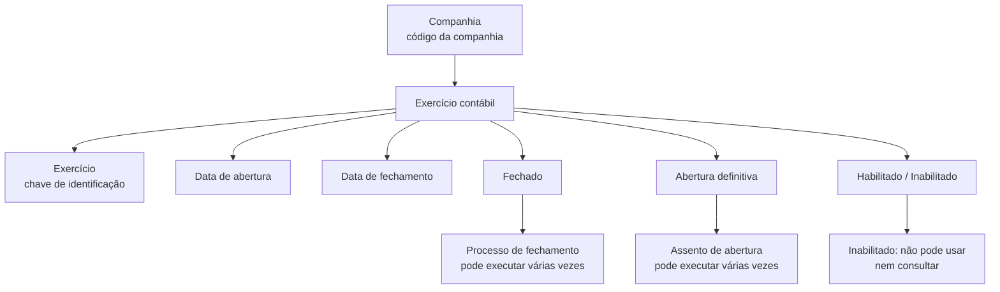

# Definição de Exercício Contábil — Documentação Reef

## 1. Metadados do Documento
- **Arquivo de Origem:** Não informado; conteúdo extraído de páginas 1 e 2.
- **Tipo de Documento:** Especificação Técnica / Documentação Funcional.
- **Domínio / Sistema:** Reef / Mapfre; definição de exercício contábil.
- **Público-Alvo:** Negócio, analistas funcionais, desenvolvedores e operação.
- **Data/Versão Identificada:** Não identificada.

---

## 2. Resumo Executivo & Contexto de Negócio

O documento define o conceito de **exercício contábil** no contexto da documentação Reef. O objetivo declarado é estabelecer o período de tempo durante o qual as operações contábeis serão realizadas para uma companhia.

A definição de exercício contábil é composta por atributos que identificam a companhia, a chave do exercício, as datas de abertura e fechamento e estados operacionais relacionados a encerramento, abertura definitiva e habilitação. Esses atributos determinam tanto a identificação temporal do período quanto a possibilidade de operar ou consultar registros nele.

O documento apresenta exemplos de exercícios que coincidem com um ano natural, exercícios que abrangem dois anos naturais e múltiplos exercícios dentro do mesmo ano natural. A chave do exercício pode usar os dígitos do ano ou outra codificação, conforme a necessidade de identificação.

O controle operacional possui mecanismos de repetição para os processos de fechamento e abertura: ambos podem ser executados várias vezes até que sejam marcados como definitivos. Um exercício inabilitado possui uma restrição mais forte: não pode ser utilizado nem mesmo para consulta, comportando-se como se não existisse.

---

## 3. Arquitetura, Componentes & Tecnologias Envolvidas

O conteúdo não descreve arquitetura de software, APIs, tecnologias, integrações, ambientes ou microsserviços. O documento apresenta uma estrutura funcional de dados e estados para o objeto ou cadastro de **exercício contábil** no domínio Reef/Mapfre.

Componentes e conceitos citados:

| Componente / Conceito | Papel descrito |
| :--- | :--- |
| Reef | Contexto documental em que a definição é apresentada. |
| Mapfre | Referência presente no cabeçalho e no identificador de proprietário. |
| Exercício contábil | Período em que são realizadas operações contábeis. |
| Companhia | Entidade identificada por código para a qual o exercício contábil é definido. |
| Processo de fechamento | Processo que pode ser executado várias vezes até o fechamento definitivo. |
| Assento de abertura | Processo que pode ser executado várias vezes até a abertura definitiva. |
| Definição de companhia | Vínculo documental citado. |



> **Nota de Análise:** O documento não detalha a implementação técnica do exercício contábil, tais como banco de dados, API, métodos HTTP, contratos JSON, permissões, tecnologias ou integrações externas.

---

## 4. Regras de Negócio, Especificações Funcionais & Processos

### 4.1 Objetivo do exercício contábil

O exercício contábil define o período de tempo no qual serão realizadas as operações contábeis.

### 4.2 Companhia

- O atributo **Companhia** contém o código da companhia para a qual o exercício contábil está sendo definido.
- Cada definição de exercício contábil está associada a uma companhia identificada por código.

### 4.3 Chave de exercício

- O atributo **Exercício** é a chave usada para identificar o exercício contábil.
- Quando o exercício coincide com o ano natural, normalmente são usados como chave os dígitos do ano.
- O documento permite utilizar outra codificação para a chave do exercício.
- Quando há mais de um exercício dentro do mesmo ano, os exemplos usam uma chave composta pelo ano e um sufixo numérico identificador do exercício.

### 4.4 Data de abertura

- O atributo **Data de abertura** indica a data em que o exercício contábil começa.
- Para exercícios que começam no primeiro dia do ano, o exemplo informado é `01/01/2023`.

### 4.5 Data de fechamento

- O atributo **Data de fechamento** indica a data em que o exercício contábil termina.
- Para um exercício coincidente com o ano natural de 2023, a data de fechamento exemplificada é `31/12/2023`.

### 4.6 Cenários de identificação e período

1. **Um único exercício que coincide com o ano**
   - Exercício: `2023`
   - Data de abertura: `01/01/2023`
   - Data de fechamento: `31/12/2023`

2. **Exercício entre dois anos naturais**
   - Exercício: `2223`
   - Data de abertura: `01/07/2022`
   - Data de fechamento: `30/06/2023`

3. **Mais de um exercício no mesmo ano natural**
   - Primeiro exercício:
     - Exercício: `20231`
     - Data de abertura: `01/01/2023`
     - Data de fechamento: `30/06/2023`
   - Segundo exercício:
     - Exercício: `20232`
     - Data de abertura: `01/07/2023`
     - Data de fechamento: `31/12/2023`

### 4.7 Fechamento do exercício

- O atributo **Cierre** indica se o exercício contábil está fechado.
- Um exercício fechado não permite mais operações nesse exercício.
- O processo de fechamento pode ser executado várias vezes.
- O exercício é considerado definitivamente fechado quando o atributo correspondente assim o indicar.

### 4.8 Abertura definitiva

- O atributo **Apertura definitiva** indica se o exercício está definitivamente aberto.
- O assento de abertura pode ser executado várias vezes.
- A abertura torna-se definitiva quando o atributo de abertura definitiva assim indicar.

### 4.9 Inabilitação

- O atributo **Inhabilitado** informa se o exercício está habilitado para uso.
- Um exercício inabilitado não pode ser utilizado.
- Um exercício inabilitado não pode ser consultado.
- Para efeitos funcionais, um exercício inabilitado é tratado como se não existisse.

---

## 5. Tabelas de Parâmetros, Ambientes e Estruturas de Dados

| Item / Parâmetro | Descrição / Função | Tipo / Valores / Formato | Ambiente / Observações |
| :--- | :--- | :--- | :--- |
| Companhia | Contém o código da companhia para a qual o exercício contábil é definido. | Código de companhia; formato não detalhado. | Obrigatório no contexto da definição descrita. |
| Exercício | Chave de identificação do exercício contábil. | Codificação livre; exemplos: `2023`, `20231`, `20232`, `2223`. | Normalmente usa os dígitos do ano quando coincide com o ano natural. |
| Data de abertura | Indica a data de início do exercício contábil. | Data; exemplos: `01/01/2023`, `01/07/2022`, `01/07/2023`. | Define o começo do período operacional contábil. |
| Data de fechamento | Indica a data de término do exercício contábil. | Data; exemplos: `31/12/2023`, `30/06/2023`. | Define o fim do período operacional contábil. |
| Cierre | Indica se o exercício contábil está fechado. | Estado booleano ou equivalente; formato não detalhado. | Impede novas operações quando indica fechamento. Pode haver várias execuções do processo antes do fechamento definitivo. |
| Apertura definitiva | Indica se a abertura do exercício é definitiva. | Estado booleano ou equivalente; formato não detalhado. | O assento de abertura pode ser executado várias vezes antes da indicação definitiva. |
| Inhabilitado | Indica se o exercício está habilitado para trabalho. | Estado booleano ou equivalente; formato não detalhado. | Quando inabilitado, não pode ser utilizado nem consultado. |
| Vínculo documental | Referência a “DEFINICION de compañía”. | Link/documentação; URL não informada. | Relaciona a definição de exercício à definição de companhia. |
| Owner | Proprietário mostrado no cabeçalho documental. | `user:agonzalez_mapfre.com` | Metadado exibido no conteúdo extraído. |
| Lifecycle | Estado de ciclo de vida exibido no cabeçalho. | `Approved Source` | Sem detalhamento adicional no documento. |

---

## 6. Bateria de Perguntas & Respostas para RAG (FAQ Sintético)

### P1: Qual é o objetivo da definição de exercício contábil?
**R:** O objetivo é definir o período de tempo durante o qual serão realizadas as operações contábeis. O exercício contábil delimita o intervalo entre uma data de abertura e uma data de fechamento.

### P2: Qual atributo identifica a companhia associada a um exercício contábil?
**R:** O atributo **Companhia** contém o código da companhia para a qual o exercício contábil está sendo definido. O documento não especifica o formato técnico desse código.

### P3: Como o exercício contábil é identificado no cadastro?
**R:** O atributo **Exercício** é a chave de identificação do exercício contábil. Quando o exercício coincide com o ano natural, normalmente são usados os dígitos do ano, como `2023`, embora outra codificação também possa ser utilizada.

### P4: Como identificar dois exercícios diferentes dentro do mesmo ano natural?
**R:** O documento exemplifica dois exercícios em 2023 usando as chaves `20231` para o primeiro exercício e `20232` para o segundo. No exemplo, o primeiro vai de `01/01/2023` a `30/06/2023`, e o segundo vai de `01/07/2023` a `31/12/2023`.

### P5: Qual período corresponde ao exercício contábil 2223?
**R:** No exemplo apresentado, o exercício `2223` cobre dois anos naturais: começa em `01/07/2022` e termina em `30/06/2023`.

### P6: O que acontece quando um exercício contábil está fechado?
**R:** Quando o atributo **Cierre** indica que o exercício está fechado, não podem ser realizadas mais operações nesse exercício. O processo de fechamento pode ser executado várias vezes, mas o fechamento é definitivo somente quando o atributo correspondente assim o indica.

### P7: O processo de fechamento pode ser executado mais de uma vez?
**R:** Sim. O documento informa que o processo de fechamento pode ser executado várias vezes. O exercício somente é considerado fechado definitivamente quando o atributo de fechamento indicar esse estado.

### P8: O que significa abertura definitiva de um exercício contábil?
**R:** **Apertura definitiva** indica que o exercício está aberto definitivamente. O assento de abertura pode ser executado várias vezes até que o atributo de abertura definitiva seja marcado.

### P9: Um exercício inabilitado pode ser consultado?
**R:** Não. Um exercício inabilitado não pode ser utilizado nem mesmo em consulta. O documento afirma que, nessa condição, o exercício funciona como se não existisse.

### P10: Quais são as datas de um exercício coincidente com o ano natural de 2023?
**R:** Para o exercício `2023`, o exemplo define data de abertura em `01/01/2023` e data de fechamento em `31/12/2023`.

### P11: O documento informa APIs, tecnologias ou contratos de integração do exercício contábil?
**R:** Não. O documento descreve atributos funcionais, exemplos de períodos e estados operacionais do exercício contábil, mas não detalha APIs, métodos HTTP, contratos JSON, tecnologias, bancos de dados ou integrações.

---

## 7. Glossário de Termos, Siglas & Conceitos-Chave

- **Reef:** Nome presente na documentação e no contexto de navegação exibido no conteúdo extraído.
- **Mapfre:** Referência corporativa presente no cabeçalho e no identificador de proprietário.
- **Exercício contábil:** Período de tempo em que são realizadas operações contábeis.
- **Companhia:** Entidade para a qual um exercício contábil é definido; identificada por código.
- **Exercício:** Chave usada para identificar um exercício contábil.
- **Data de abertura:** Data em que o exercício contábil começa.
- **Data de fechamento:** Data em que o exercício contábil termina.
- **Cierre:** Atributo que indica se o exercício contábil está fechado.
- **Apertura definitiva:** Atributo que indica se a abertura do exercício é definitiva.
- **Assento de abertura:** Processo que pode ser executado várias vezes até a abertura definitiva.
- **Inhabilitado:** Estado que impede a utilização e a consulta do exercício contábil.

---

## 8. Notas Críticas, Riscos & Limitações

- O documento não define formatos técnicos, tipos de dados, obrigatoriedade de campos, regras de validação de sobreposição de datas ou comportamento de erros.
- O documento não informa se a chave de exercício deve ser única por companhia, globalmente única ou validada contra períodos existentes.
- Não há detalhamento sobre autorizações, perfis de acesso ou responsáveis pelos processos de abertura, fechamento e inabilitação.
- Não são descritas APIs, serviços, integrações, persistência de dados, rotas de logs, URLs de ambiente ou procedimentos operacionais.
- O fechamento e o assento de abertura podem ser executados várias vezes; entretanto, o documento não descreve efeitos contábeis, reversões, auditoria ou critérios técnicos dessas reexecuções.
- Um exercício inabilitado não pode ser usado nem consultado. Esse comportamento pode impactar auditoria, operação e recuperação histórica, mas o documento não apresenta mecanismo alternativo de acesso.
- O texto extraído contém caracteres de codificação substituídos por `` em termos como “definir”, “identifica” e “finaliza”; a interpretação foi preservada conforme o contexto textual.

---

## 9. Conteúdo Bruto Estruturado (Referência Fiel)

```text
--- [PÁGINA 1 DE 2] ---

DEFINICIÓN de Ejercicio contable
Objetivo
El objetivo es denir el periodo de tiempo en el que se realizarán las operaciones contables.
Propiedades
Compañía
Este atributo contiene el código de la compañía para la que se está deniendo el ejercicio contable.
Ejercicio
Este atributo será la clave con la que se identica el ejercicio contable.
Normalmente, si el ejercicio coincide con el año natural, se suelen utilizar como clave los dígitos del año, pero puede utilizarse cualquier otra
codicación.
Ejemplo
Si hay un único ejercicio y coincide con el año
Ejercicio: 2023
Si hay más de un ejercicio en el mismo año
Ejercicio: 20231 (para el primer ejercicio)
Ejercicio: 20232 (para el segundo ejercicio)
Fecha de apertura
Este atributo indica la fecha en la que inicia el ejercicio contable.
Ejemplo
Si el ejercicio se inicia el primer día del año
Fecha de apertura: 01/01/2023
Fecha de cierre
Este atributo indica la fecha en la que naliza el ejercicio contable.
Ejemplo
Si el ejercicio coincide con el año natural
Ejercicio: 2023
Documentation / DOCUMENTACIÓN Reef
DOCUMENTACIÓN Reef
Mapfredocument
DOCUMENTACIÓN Reef
Owner
user:agonzalez_mapfre.com
Lifecycle
Approved Source
 / 
 VL
Buscar Inicio Soluciones Arquitecturas APIs Componentes Cloud Documentación Zeus Reef Ayuda
ES


--- [PÁGINA 2 DE 2] ---

Fecha de apertura: 01/01/2023
Fecha de cierre: 31/12/2023
Si el ejercicio está entre dos años naturales
Ejercicio: 2223
Fecha de apertura: 01/07/2022
Fecha de cierre: 30/06/2023
Si hay más de un ejercicio en el mismo año natural
a. Primer ejercicio
Ejercicio: 20231
Fecha de apertura: 01/01/2023
Fecha de cierre: 30/06/2023
b. Segundo ejercicio
Ejercicio: 20232
Fecha de apertura: 01/07/2023
Fecha de cierre: 31/12/2023
Cierre
Este atributo indica si el ejercicio contable está cerrado, es decir, no pueden realizarse más operaciones en este ejercicio.
El proceso de cierre puede ejecutarse varias veces, considerando que el ejercicio está cerrado denitivamente cuando este atributo así lo
indica.
Apertura denitiva
Este atributo indica si el ejercicio está abierto denitivamente.
El asiento de apertura se puede ejecutar varias veces hasta que en este atributo se indique que la apertura es denitiva.
Inhabilitado
Este atributo indica si el ejercicio está habilitado o no, para poder trabajar.
Un ejercicio inhabilitado no se puede utilizar, ni siquiera en consulta, es como si no existiera.
Vínculos
DEFINICION de compañía
Preguntas frecuentes
```
