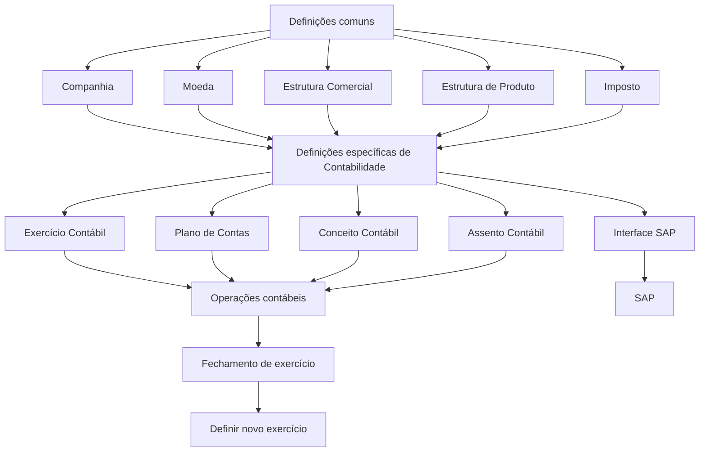

# Construção — Definição de Contabilidade no Reef.core

## 1. Metadados do Documento
- **Arquivo de Origem:** `Não identificado no conteúdo fornecido`
- **Tipo de Documento:** `Apresentação Executiva`
- **Domínio / Sistema:** `Reef.core — módulo de Contabilidade`
- **Público-Alvo:** `Negócio, configuração funcional e equipes de Contabilidade`
- **Data/Versão Identificada:** `Não identificada`

---

## 2. Resumo Executivo & Contexto de Negócio

O documento descreve a ordem de definições necessária para a construção do módulo de Contabilidade no sistema Reef.core. A estrutura separa definições comuns, necessárias mas não exclusivas da Contabilidade, das definições específicas do módulo contábil.

No nível comum, a configuração abrange companhia, moeda, estrutura comercial, estrutura de produto e imposto. Esses elementos estabelecem a entidade que emitirá apólices, as divisas usadas nas operações, a organização territorial, a organização dos ramos comercializados e as obrigações tributárias aplicáveis.

No nível de Contabilidade, o documento define exercício contábil, plano de contas, conceito contábil, assento contábil e interface SAP. Esses elementos organizam o período das operações contábeis, as contas da companhia, o agrupamento de lançamentos, os tipos de lançamentos e o envio de informações ao SAP.

Após cada fechamento de exercício, deve ser definido um novo exercício contábil. O documento não detalha telas, métodos, contratos de integração, regras de cálculo tributário, layouts de interface SAP ou procedimentos operacionais de execução.

---

## 3. Arquitetura, Componentes & Tecnologias Envolvidas

| Componente / Conceito | Papel descrito no documento |
| :--- | :--- |
| Reef.core | Sistema no qual são realizadas operações da companhia com as divisas definidas. |
| Módulo de Contabilidade | Módulo com definições específicas de exercício, plano de contas, conceito, assento e interface SAP. |
| Companhia | Entidade ou entidades com as quais serão criadas apólices e os demais elementos. |
| Moeda | Divisas utilizadas pelo Reef.core nas operações da companhia. |
| Estrutura Comercial | Organização territorial da companhia. |
| Estrutura de Produto | Organização dos ramos comercializados. |
| Imposto | Tipos de obrigações tributárias, suas características e formas de cálculo. |
| SAP | Sistema que receberá informações definidas na interface SAP. |



---

## 4. Regras de Negócio, Especificações Funcionais & Processos

### Ordem e níveis de definição

1. O documento estabelece elementos de definição e uma ordem para a realização da definição de Contabilidade.
2. As definições são separadas entre:
   - **Comum:** definições não pertencentes exclusivamente ao módulo de Contabilidade, mas necessárias para definir esse módulo.
   - **Contabilidade:** definições específicas do módulo de Contabilidade.

### Definições comuns

1. **Companhia**
   - Define a entidade ou entidades com as quais serão criadas as apólices.
   - A companhia também se relaciona à criação dos demais elementos.

2. **Moeda**
   - Define as divisas com as quais o Reef.core realizará as distintas operações da companhia.

3. **Estrutura Comercial**
   - Define como será estabelecida a organização territorial da companhia.

4. **Estrutura de Produto**
   - Define como serão organizados os ramos comercializados.

5. **Imposto**
   - Define os tipos de obrigações tributárias a serem considerados.
   - Inclui as características das obrigações tributárias.
   - Inclui as formas de cálculo das obrigações tributárias.

### Definições específicas de Contabilidade

1. **Exercício Contábil**
   - Define o período de tempo no qual serão realizadas as operações contábeis.
   - Após cada fechamento de exercício, deve ser definido um novo exercício.

2. **Plano de Contas**
   - Define as contas utilizadas pela companhia dentro do exercício contábil.
   - O texto indica que existem parâmetros correspondentes a cada conta.

3. **Conceito Contábil**
   - Define o identificador que agrupa os lançamentos contábeis para consulta posterior.

4. **Assento Contábil**
   - Define os tipos e as características dos assentos contábeis com os quais a companhia trabalhará.

5. **Interface SAP**
   - Define as informações que serão levadas ao SAP.
   - Define a relação dos dados entre o sistema e o SAP.

> **Nota de Análise:** O documento menciona a interface SAP, mas não detalha os formatos de arquivo ou mensagem, mecanismos de transporte, frequência de integração, campos mapeados ou validações de envio.

---

## 5. Tabelas de Parâmetros, Ambientes e Estruturas de Dados

| Item / Parâmetro | Descrição / Função | Tipo / Valores / Formato | Ambiente / Observações |
| :--- | :--- | :--- | :--- |
| Companhia | Define a entidade ou entidades para criação de apólices e demais elementos. | Entidade ou entidades. | Definição comum. |
| Moeda | Define as divisas usadas pelo Reef.core nas operações da companhia. | Divisas. | Definição comum. |
| Estrutura Comercial | Estabelece a organização territorial da companhia. | Organização territorial. | Definição comum. |
| Estrutura de Produto | Organiza os ramos comercializados. | Organização de ramos. | Definição comum. |
| Imposto | Define obrigações tributárias, características e formas de cálculo. | Tipos de obrigações tributárias e formas de cálculo. | Definição comum. |
| Exercício Contábil | Define o período em que ocorrerão operações contábeis. | Período de tempo. | Novo exercício deve ser definido após cada fechamento. |
| Plano de Contas | Define as contas utilizadas pela companhia no exercício contábil. | Contas e parâmetros por conta. | O documento não especifica a estrutura dos parâmetros. |
| Conceito Contábil | Agrupa lançamentos contábeis para consulta posterior. | Identificador. | Definição específica de Contabilidade. |
| Assento Contábil | Define tipos e características dos assentos usados pela companhia. | Tipos e características. | Definição específica de Contabilidade. |
| Interface SAP | Define informações enviadas ao SAP e a relação dos dados entre ambos os sistemas. | Não detalhado. | Interface entre o módulo de Contabilidade e SAP. |

---

## 6. Bateria de Perguntas & Respostas para RAG (FAQ Sintético)

### P1: Qual é o objetivo da seção de definição de Contabilidade no Reef.core?
**R:** O objetivo é organizar os elementos e a ordem necessária para definir o módulo de Contabilidade. O documento distingue definições comuns, necessárias para a configuração, e definições específicas do módulo contábil.

### P2: Quais definições comuns são necessárias antes ou durante a definição do módulo de Contabilidade?
**R:** As definições comuns listadas são Companhia, Moeda, Estrutura Comercial, Estrutura de Produto e Imposto. Elas não pertencem exclusivamente à Contabilidade, mas são necessárias para definir o módulo.

### P3: O que a definição de Companhia representa no documento?
**R:** Companhia define a entidade ou entidades com as quais serão criadas as apólices e, por consequência, os demais elementos relacionados.

### P4: Qual é a finalidade da definição de Moeda no Reef.core?
**R:** Moeda define as divisas com as quais o Reef.core realizará as distintas operações da companhia.

### P5: O que é definido pela Estrutura Comercial?
**R:** A Estrutura Comercial define como será estabelecida a organização territorial da companhia.

### P6: Qual é o papel da Estrutura de Produto?
**R:** A Estrutura de Produto define como estarão organizados os ramos que são comercializados.

### P7: O que deve ser configurado na definição de Imposto?
**R:** Devem ser definidos os tipos de obrigações tributárias que precisam ser considerados, bem como as características e as formas de cálculo dessas obrigações.

### P8: O que é um Exercício Contábil segundo o documento?
**R:** Exercício Contábil é o período de tempo no qual serão realizadas as operações contábeis. Depois de cada fechamento de exercício, deve ser definido um novo exercício.

### P9: O que o Plano de Contas define?
**R:** O Plano de Contas define as contas utilizadas pela companhia dentro do exercício contábil e menciona parâmetros correspondentes a cada conta.

### P10: Para que serve o Conceito Contábil?
**R:** O Conceito Contábil define um identificador que agrupa os lançamentos contábeis para permitir sua consulta posterior.

### P11: O que é definido em Assento Contábil?
**R:** Assento Contábil define os tipos e as características dos assentos contábeis com os quais a companhia trabalhará.

### P12: Qual é o escopo da Interface SAP?
**R:** A Interface SAP define as informações que serão levadas ao SAP e a relação dos dados entre o SAP e o outro sistema mencionado no documento. O conteúdo não especifica métodos, formatos ou contratos técnicos dessa integração.

---

## 7. Glossário de Termos, Siglas & Conceitos-Chave

- **Reef.core:** Sistema citado como responsável por realizar operações da companhia com as divisas definidas.
- **Contabilidade:** Módulo que possui definições específicas de exercício contábil, plano de contas, conceito contábil, assento contábil e interface SAP.
- **Companhia:** Entidade ou entidades com as quais são criadas apólices e outros elementos.
- **Divisas:** Moedas utilizadas nas operações da companhia no Reef.core.
- **Ramos:** Elementos comercializados cuja organização é definida pela Estrutura de Produto.
- **Exercício Contábil:** Período de tempo no qual são realizadas operações contábeis.
- **Plano de Contas:** Definição das contas usadas pela companhia dentro do exercício contábil.
- **Conceito Contábil:** Identificador que agrupa lançamentos contábeis para consulta posterior.
- **Assento Contábil:** Tipo e características dos lançamentos contábeis com os quais a companhia trabalha.
- **SAP:** Sistema para o qual a interface SAP leva informações e com o qual existe relação de dados.

---

## 8. Notas Críticas, Riscos & Limitações

- O documento não informa o nome do arquivo de origem, data, versão ou autoria técnica do conteúdo.
- Não há detalhamento de telas, permissões, responsáveis, sequência transacional ou critérios de aprovação.
- Os parâmetros correspondentes a cada conta do Plano de Contas são mencionados, mas não são especificados.
- A Interface SAP é citada sem contratos, campos, formatos, protocolos, frequência ou estratégia de tratamento de erros.
- Não são detalhadas as fórmulas, alíquotas ou condições de aplicação das formas de cálculo de Imposto.
- Não são fornecidos métodos HTTP, contratos JSON, estruturas de dados, URLs, ambientes ou mecanismos de integração.

---

## 9. Conteúdo Bruto Estruturado (Referência Fiel)

```text
--- [PÁGINA 1 DE 2] ---

EN CONSTRUCCIÓN
DEFINICIÓN DE CONTABILIDAD
 Elementos que intervienen en la denición y orden en el que se debe realizar.
COMÚN
En este nivel se encuentran deniciones que no pertenecen exclusivamente al módulo de contabilidad, pero
son necesarias para poder realizar la denición de dicho módulo
COMPAÑÍA 
Denición de la entidad o entidades con
las que se van a crear las pólizas y por
consiguiente el resto de elementos
MONEDA 
Denición de las divisas con las que
Reef.core va a realizar las distintas
operaciones de la compañía
ESTRUCTURA COMERCIAL 
Denición de como se va a establecer la
organización territorial de la compañía
ESTRUCTURA PRODUCTO 
Denición de como estarán organizados
los ramos que se comercializan
IMPUESTO
Denir los tipos de obligaciones tributarias
que se deben tener en cuenta, así como
sus características y formas de cálculo
CONTABILIDAD
Deniciones especícas del módulo de Contabilidad
EJERCICIO CONTABLE 
Se dene el periodo de tiempo en el que
se realizarán las operaciones contables.
PLAN DE CUENTAS 
Denición de las cuentas utilizadas por la
compañía dentro del ejercicio contable y
CONCEPTO CONTABLE
Se dene el identicador que agrupa los
apuntes contables para su posterior
consulta
Documentation / DOCUMENTACIÓN Reef
DOCUMENTACIÓN Reef
Mapfredocument
DOCUMENTACIÓN Reef
Owner
user:agonzalez_mapfre.com
Lifecycle
Approved Source
 / 
 VL
Buscar Inicio Soluciones Arquitecturas APIs Componentes Cloud Documentación Zeus Reef Ayuda
ES


--- [PÁGINA 2 DE 2] ---

Después de cada cierre de ejercicio se
debe denir el nuevo ejercicio
los parámetros correspondientes a cada
cuenta
ASIENTO CONTABLE
Denición de los tipos y características de
los asientos contables con los que
trabajará la compañía
INTERFAZ SAP
Denición de la información que se llevará
a SAP así como la relación de los datos de
ambos sistemas
```
