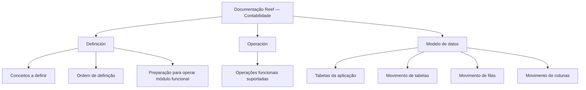

# Documentação Reef — Contabilidade, Operação e Modelo de Dados

## 1. Metadados do Documento
- **Arquivo de Origem:** Não identificado
- **Tipo de Documento:** Manual Operacional
- **Domínio / Sistema:** Reef — Contabilidade
- **Público-Alvo:** Desenvolvedores, Operação e Negócio
- **Data/Versão Identificada:** Não identificada

---

## 2. Resumo Executivo & Contexto de Negócio

O documento apresenta a seção de **Documentación - Contabilidad** do sistema Reef. O conteúdo está organizado para abordar a funcionalidade do sistema, dividindo as informações nos tópicos **Definición**, **Operación** e **Modelo de datos**.

A seção **Definición** concentra documentos que descrevem os conceitos que precisam ser definidos e a ordem necessária para realizar a definição que viabiliza a operação de um módulo funcional.

A seção **Operación** reúne documentação associada às operações funcionais suportadas pelo módulo. O texto fornecido não especifica quais operações, fluxos ou regras operacionais são suportados.

A seção **Modelo de datos** é direcionada às tabelas da aplicação. Além das tabelas, a documentação declara que descreve o movimento de elementos como tabelas, filas e colunas conforme as operações funcionais.

O conteúdo também indica uma navegação de portal de documentação Reef, com seções como Soluções, Arquiteturas, APIs, Componentes, Cloud, Documentação, Zeus, Reef e Ajuda. O documento está marcado com ciclo de vida **Approved** e apresenta o proprietário `user:agonzalez_mapfre.com`.

---

## 3. Arquitetura, Componentes & Tecnologias Envolvidas

Os componentes e conceitos explicitamente identificados são:

| Componente / Conceito | Papel identificado no conteúdo |
| :--- | :--- |
| Reef | Sistema ou domínio documental ao qual a documentação pertence. |
| Contabilidad | Área funcional abordada pela documentação. |
| Definición | Seção que documenta conceitos e sua ordem de definição para permitir a operação de módulos funcionais. |
| Operación | Seção referente às operações funcionais suportadas pelo módulo. |
| Modelo de datos | Seção orientada às tabelas da aplicação e ao movimento de tabelas, filas e colunas. |
| Zeus | Item disponível na navegação do portal. O documento não descreve sua função. |
| Mapfredocument | Termo exibido no conteúdo. O documento não fornece detalhamento adicional. |
| VL | Termo exibido próximo ao estado do documento. O significado não é detalhado. |



> **Nota de Análise:** O conteúdo não descreve arquitetura de software, integrações, APIs, tecnologias, servidores, URLs de ambiente, contratos de dados ou métodos HTTP.

---

## 4. Regras de Negócio, Especificações Funcionais & Processos

1. A informação relacionada à funcionalidade do sistema é dividida em três áreas: **Definición**, **Operación** e **Modelo de datos**.
2. A seção **Definición** descreve os conceitos que devem ser definidos.
3. A seção **Definición** também estabelece que existe uma ordem a seguir para alcançar a definição necessária.
4. A definição necessária permite operar um módulo funcional.
5. A seção **Operación** contém documentos relacionados às operações funcionais suportadas pelo módulo.
6. A seção **Modelo de datos** está orientada às tabelas da aplicação.
7. A seção **Modelo de datos** descreve o movimento de tabelas, filas e colunas em função das operações funcionais.

> **Nota de Análise:** O documento não detalha regras de validação, fórmulas de cálculo, exceções, critérios de aprovação, nomes de tabelas, estruturas de colunas, operações específicas ou sequências operacionais concretas.

---

## 5. Tabelas de Parâmetros, Ambientes e Estruturas de Dados

| Item / Parâmetro | Descrição / Função | Tipo / Valores / Formato | Ambiente / Observações |
| :--- | :--- | :--- | :--- |
| Documentação | Conteúdo relacionado à funcionalidade do sistema. | Estruturado em três seções. | Contexto Reef — Contabilidade. |
| Definición | Define conceitos e a ordem necessária para permitir a operação de um módulo funcional. | Seção documental. | Não há conceitos detalhados no extrato. |
| Operación | Reúne documentos sobre operações funcionais suportadas. | Seção documental. | Operações não especificadas. |
| Modelo de datos | Documenta tabelas da aplicação e o movimento de tabelas, filas e colunas. | Seção documental. | Não há nomes de tabelas, filas ou colunas. |
| Owner | Proprietário exibido para a documentação. | `user:agonzalez_mapfre.com` | Exibido no conteúdo bruto. |
| Lifecycle | Estado de ciclo de vida do documento. | `Approved` | Exibido no conteúdo bruto. |
| Idioma | Idioma selecionado no portal. | `ES` | Exibido na navegação. |
| VL | Termo apresentado junto à informação do documento. | `VL` | Significado não identificado. |
| Mapfredocument | Termo apresentado no conteúdo. | `Mapfredocument` | Função não detalhada. |

---

## 6. Bateria de Perguntas & Respostas para RAG (FAQ Sintético)

### P1: Qual é o objetivo da documentação de Contabilidade no sistema Reef?
**R:** A documentação de Contabilidade no sistema Reef aborda conteúdos relacionados à funcionalidade do sistema. As informações são organizadas nas seções Definición, Operación e Modelo de datos.

### P2: Quais seções estruturam a documentação Reef de Contabilidade?
**R:** A documentação é dividida em três seções: Definición, Operación e Modelo de datos.

### P3: O que a seção Definición documenta?
**R:** A seção Definición reúne documentos que detalham os conceitos que devem ser definidos e a ordem a ser seguida para alcançar a definição necessária para operar um módulo funcional.

### P4: Por que a ordem de definição é relevante no módulo funcional?
**R:** Segundo o documento, a ordem de definição deve ser seguida para obter a definição necessária que permite operar um módulo funcional. O conteúdo não informa quais são as etapas dessa ordem.

### P5: Que tipo de conteúdo está na seção Operación?
**R:** A seção Operación contém documentos relacionados às operações funcionais suportadas pelo módulo. O extrato não especifica quais operações funcionais são suportadas.

### P6: Qual é o foco da seção Modelo de datos?
**R:** A seção Modelo de datos é orientada às tabelas da aplicação e descreve detalhadamente o movimento de tabelas, filas e colunas conforme as operações funcionais.

### P7: O documento identifica tabelas, filas ou colunas específicas da aplicação?
**R:** Não. O documento informa que a seção Modelo de datos trata de tabelas, filas e colunas, mas não apresenta nomes, estruturas, tipos de dados ou relacionamentos específicos.

### P8: Quem é o proprietário identificado para a documentação Reef?
**R:** O proprietário exibido no conteúdo é `user:agonzalez_mapfre.com`.

### P9: Qual é o estado de ciclo de vida identificado para o documento?
**R:** O ciclo de vida identificado no conteúdo é `Approved`.

### P10: O documento informa APIs, URLs, ambientes ou tecnologias utilizadas pelo sistema Reef?
**R:** Não. O conteúdo apresenta itens de navegação como APIs, Componentes e Cloud, mas não detalha APIs, URLs, ambientes, tecnologias, endpoints ou configurações técnicas.

---

## 7. Glossário de Termos, Siglas & Conceitos-Chave

- **Reef:** Sistema ou domínio documental mencionado no conteúdo.
- **Contabilidad:** Área de contabilidade abordada pela documentação.
- **Definición:** Seção destinada à definição de conceitos e da ordem necessária para operar módulos funcionais.
- **Operación:** Seção referente às operações funcionais suportadas pelo módulo.
- **Modelo de datos:** Seção voltada às tabelas da aplicação e ao movimento de tabelas, filas e colunas.
- **Lifecycle:** Campo de ciclo de vida documental; o valor identificado é `Approved`.
- **Owner:** Campo que identifica o proprietário da documentação.
- **VL:** Termo exibido no documento sem definição fornecida.
- **Mapfredocument:** Termo exibido no documento sem definição fornecida.
- **Zeus:** Item de navegação apresentado no portal, sem descrição funcional no conteúdo.

---

## 8. Notas Críticas, Riscos & Limitações

- O arquivo de origem, a data e a versão do documento não foram identificados no conteúdo fornecido.
- Não há detalhamento de operações funcionais específicas, embora a seção **Operación** seja mencionada.
- Não foram apresentados nomes de tabelas, filas, colunas, campos, tipos de dados ou relacionamentos do modelo de dados.
- Não há informações sobre arquitetura técnica, integrações, microsserviços, APIs, contratos, ambientes, URLs, logs ou mecanismos de segurança.
- Os termos **VL**, **Mapfredocument** e **Zeus** aparecem no conteúdo, mas não possuem definição adicional.
- A reconstrução Mermaid representa apenas a organização documental explicitamente descrita; não representa uma arquitetura técnica de execução.

---

## 9. Conteúdo Bruto Estruturado (Referência Fiel)

```text
--- [PÁGINA 1 DE 1] ---

DOCUMENTACIÓN - CONTABILIDAD
 En este apartado se aborda todo aquello relacionado con la funcionalidad del sistema. La información se encuentra dividida en los
apartados siguientes:
Denición
Operación
Modelo de datos
DEFINICIÓN
Documentos que detallan aquellos conceptos que se han de denir y el orden que se ha de seguir para conseguir la denición necesaria con
lo que poder operar un módulo funcional.
OPERACIÓN
Documentos relacionados con las operaciones funcionales que el módulo soporta.
MODELO DE DATOS
Documentación orientada hacia las tablas de la aplicación. Adicionalmente, se describe con detalle el movimiento de distintos elementos
como tablas, las y columnas atendiendo a las operaciones funcionales.
Documentation / DOCUMENTACIÓN Reef
DOCUMENTACIÓN Reef
Mapfredocument
DOCUMENTACIÓN Reef
Owner
user:agonzalez_mapfre.com
Lifecycle
Approved Source
 / 
 VL
Buscar Inicio Soluciones Arquitecturas APIs Componentes Cloud Documentación Zeus Reef Ayuda
ES
```
