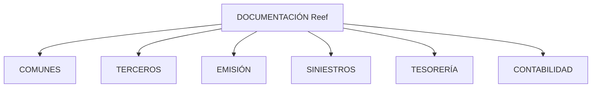

# Documentação Reef — Funcionalidades Organizadas por Módulo

## 1. Metadados do Documento
- **Arquivo de Origem:** Não identificado
- **Tipo de Documento:** Documentação funcional
- **Domínio / Sistema:** Reef / Mapfre
- **Público-Alvo:** Desenvolvedores, Arquitetos, Operação e Negócio
- **Data/Versão Identificada:** Não identificada

---

## 2. Resumo Executivo & Contexto de Negócio

O conteúdo apresenta uma referência documental denominada **DOCUMENTACIÓN Reef**, associada ao sistema ou domínio **Reef** no contexto **Mapfre**. O objetivo declarado é abordar informações relacionadas à funcionalidade do sistema, organizando-as por módulos.

Os módulos explicitamente listados são **Comunes**, **Terceros**, **Emisión**, **Siniestros**, **Tesorería** e **Contabilidad**. A estrutura indica uma organização funcional por áreas de negócio, porém o trecho não detalha processos, regras, integrações, interfaces ou responsabilidades de cada módulo.

O material parece estar publicado em um ambiente de documentação corporativa identificado por elementos de navegação como “Soluciones”, “Arquitecturas”, “APIs”, “Componentes”, “Cloud”, “Documentación”, “Zeus”, “Reef” e “Ayuda”. O documento apresenta estado de ciclo de vida como **Approved Source**.

> **Nota de Análise:** O trecho fornecido não descreve funcionalidades específicas, contratos técnicos, tecnologias, ambientes, integrações ou regras operacionais dos módulos Reef.

---

## 3. Arquitetura, Componentes & Tecnologias Envolvidas

Os únicos componentes funcionais identificados são os módulos do sistema Reef:

- Comunes
- Terceros
- Emisión
- Siniestros
- Tesorería
- Contabilidad



> **Nota de Análise:** O diagrama representa somente a organização documental por módulo. O conteúdo não sustenta relações de integração, dependências técnicas, fluxo de dados, microsserviços, APIs ou tecnologias entre esses módulos.

---

## 4. Regras de Negócio, Especificações Funcionais & Processos

O documento estabelece apenas a seguinte diretriz de organização:

1. A documentação trata de assuntos relacionados à funcionalidade do sistema.
2. A informação é organizada por módulo.
3. Os módulos apresentados são: Comunes, Terceros, Emisión, Siniestros, Tesorería e Contabilidad.

Não foram identificadas regras de negócio detalhadas, critérios de validação, cálculos, estados, exceções, fluxos de operação ou procedimentos passo a passo.

---

## 5. Tabelas de Parâmetros, Ambientes e Estruturas de Dados

| Item / Parâmetro | Descrição / Função | Tipo / Valores / Formato | Ambiente / Observações |
| :--- | :--- | :--- | :--- |
| Sistema / Domínio | Nome da documentação e sistema referenciado | Reef | Associado ao contexto Mapfre |
| Organização documental | Critério de estruturação das informações | Por módulo | Declarado no texto |
| Módulo | Área funcional listada | COMUNES | Sem detalhamento adicional |
| Módulo | Área funcional listada | TERCEROS | Sem detalhamento adicional |
| Módulo | Área funcional listada | EMISIÓN | Sem detalhamento adicional |
| Módulo | Área funcional listada | SINIESTROS | Sem detalhamento adicional |
| Módulo | Área funcional listada | TESORERÍA | Sem detalhamento adicional |
| Módulo | Área funcional listada | CONTABILIDAD | Sem detalhamento adicional |
| Owner | Usuário proprietário exibido | `user:agonzalez_mapfre.com` | Conforme conteúdo bruto |
| Lifecycle | Estado de ciclo de vida exibido | Approved Source | Conforme conteúdo bruto |
| Idioma da interface | Idioma indicado na navegação | ES | Conforme conteúdo bruto |

---

## 6. Bateria de Perguntas & Respostas para RAG (FAQ Sintético)

### P1: Qual é o objetivo da documentação Reef?
**R:** A documentação Reef aborda assuntos relacionados à funcionalidade do sistema e organiza essas informações por módulos.

### P2: Quais módulos funcionais são citados na documentação Reef?
**R:** Os módulos citados são Comunes, Terceros, Emisión, Siniestros, Tesorería e Contabilidad.

### P3: A documentação descreve as funcionalidades detalhadas do módulo Emisión?
**R:** Não. O trecho apenas lista o módulo Emisión, sem apresentar funcionalidades, regras de negócio, processos ou especificações técnicas adicionais.

### P4: O que o documento informa sobre o módulo Siniestros?
**R:** O documento informa somente que Siniestros é um dos módulos da documentação Reef. Não há detalhamento funcional ou técnico no trecho fornecido.

### P5: Existem APIs, endpoints ou contratos de integração documentados?
**R:** Não. Embora a navegação corporativa inclua uma opção denominada “APIs”, o conteúdo fornecido não descreve APIs, endpoints, métodos HTTP, contratos JSON ou integrações.

### P6: Qual é o estado de ciclo de vida exibido para o documento?
**R:** O estado de ciclo de vida exibido é **Approved Source**.

### P7: Quem aparece como owner da documentação Reef?
**R:** O conteúdo apresenta `user:agonzalez_mapfre.com` no campo Owner.

### P8: A documentação fornece informações sobre ambientes, URLs ou servidores?
**R:** Não. O trecho não fornece URLs, nomes de servidores, ambientes de implantação, portas, credenciais ou configurações técnicas.

### P9: A documentação permite entender a relação entre os módulos Reef?
**R:** Não completamente. Ela apenas apresenta uma lista de módulos; não descreve dependências, fluxos de dados ou relações funcionais entre Comunes, Terceros, Emisión, Siniestros, Tesorería e Contabilidad.

### P10: Qual idioma é indicado na interface do conteúdo?
**R:** A interface indica o idioma `ES`, e o conteúdo textual principal está em espanhol.

---

## 7. Glossário de Termos, Siglas & Conceitos-Chave

- **Reef:** Nome do sistema, domínio ou conjunto documental referenciado no conteúdo.
- **DOCUMENTACIÓN:** Termo em espanhol para documentação.
- **COMUNES:** Módulo listado na documentação Reef; não há definição adicional.
- **TERCEROS:** Módulo listado na documentação Reef; não há definição adicional.
- **EMISIÓN:** Módulo listado na documentação Reef; não há definição adicional.
- **SINIESTROS:** Módulo listado na documentação Reef; não há definição adicional.
- **TESORERÍA:** Módulo listado na documentação Reef; não há definição adicional.
- **CONTABILIDAD:** Módulo listado na documentação Reef; não há definição adicional.
- **Owner:** Campo que identifica o proprietário exibido para o conteúdo.
- **Lifecycle:** Campo que indica o estado de ciclo de vida do documento.
- **Approved Source:** Valor apresentado para o ciclo de vida; o significado operacional específico não é detalhado.
- **ES:** Indicador de idioma espanhol na interface.

---

## 8. Notas Críticas, Riscos & Limitações

- O texto é altamente resumido e não detalha as funcionalidades dos módulos listados.
- Não há especificações técnicas sobre arquitetura, tecnologias, APIs, integrações, bancos de dados, ambientes ou observabilidade.
- Não há regras de negócio, processos operacionais, matrizes de permissão ou critérios de validação.
- O estado **Approved Source** é exibido, mas o conteúdo não define seu significado ou processo de aprovação.
- O trecho não permite inferir relações entre os módulos Reef sem extrapolar as informações originais.

---

## 9. Conteúdo Bruto Estruturado (Referência Fiel)

```text
--- [PÁGINA 1 DE 1] ---

DOCUMENTACIÓN
 En este apartado se aborda todo aquello relacionado con la funcionalidad del sistema. La información está
organizada por módulo.
 COMUNES
  TERCEROS
  EMISIÓN
 SINIESTROS
  TESORERÍA
  CONTABILIDAD
Documentation / DOCUMENTACIÓN Reef
DOCUMENTACIÓN Reef
Mapfredocument
DOCUMENTACIÓN Reef
Owner
user:agonzalez_mapfre.com
Lifecycle
Approved Source
 / 
 VL
Buscar Inicio Soluciones Arquitecturas APIs Componentes Cloud Documentación Zeus Reef Ayuda
ES
```
