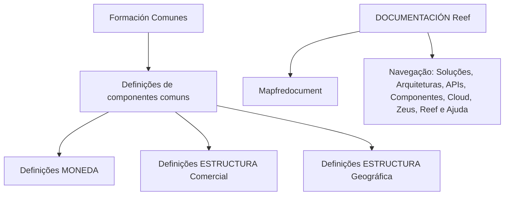

# Formação de Componentes Comuns do Sistema — Definições de Moeda, Estruturas Comercial e Geográfica

## 1. Metadados do Documento
- **Arquivo de Origem:** Não informado
- **Tipo de Documento:** Apresentação Executiva
- **Domínio / Sistema:** Reef / Mapfre
- **Público-Alvo:** Não identificado
- **Data/Versão Identificada:** Não identificada

---

## 2. Resumo Executivo & Contexto de Negócio

O conteúdo apresenta uma formação sobre as definições próprias dos componentes comuns do sistema. A formação abrange três áreas explicitamente indicadas: definições de moeda, estrutura comercial e estrutura geográfica.

O documento também referencia a documentação do sistema Reef e o repositório ou ambiente denominado Mapfredocument. O estado de ciclo de vida identificado é `Approved Source`.

A navegação apresentada inclui áreas como Soluções, Arquiteturas, APIs, Componentes, Cloud, Documentação, Zeus, Reef e Ajuda. Não há detalhamento sobre responsabilidades, integrações, tecnologias, contratos ou regras operacionais desses itens.

---

## 3. Arquitetura, Componentes & Tecnologias Envolvidas

Componentes e termos identificados:

| Componente / Termo | Contexto identificado |
| :--- | :--- |
| Reef | Sistema ou área de documentação referenciada como `DOCUMENTACIÓN Reef`. |
| Mapfredocument | Referência textual associada à documentação. |
| Moeda | Área de definições coberta pela formação. |
| Estrutura Comercial | Área de definições coberta pela formação. |
| Estrutura Geográfica | Área de definições coberta pela formação. |
| Zeus | Item disponível na navegação apresentada. |
| Cloud | Item disponível na navegação apresentada. |
| APIs | Item disponível na navegação apresentada. |



**Nota de Análise:** O conteúdo não descreve relações técnicas, fluxos de dados, protocolos, microsserviços, bancos de dados ou contratos de API entre Reef, Mapfredocument, Zeus, Cloud e os demais itens de navegação.

---

## 4. Regras de Negócio, Especificações Funcionais & Processos

O documento identifica uma formação orientada às definições dos componentes comuns do sistema. Os tópicos funcionais explicitamente apresentados são:

1. Definições de moeda.
2. Definições de estrutura comercial.
3. Definições de estrutura geográfica.

Não foram fornecidas regras de cálculo, critérios de validação, condições de negócio, etapas operacionais, responsabilidades, campos de entrada, saídas processadas ou exceções.

**Nota de Análise:** O conteúdo é resumido e não detalha como as definições de moeda, estrutura comercial ou estrutura geográfica devem ser criadas, alteradas, validadas ou consumidas pelos sistemas.

---

## 5. Tabelas de Parâmetros, Ambientes e Estruturas de Dados

| Item / Parâmetro | Descrição / Função | Tipo / Valores / Formato | Ambiente / Observações |
| :--- | :--- | :--- | :--- |
| Definições de moeda | Tópico da formação sobre componentes comuns. | Não informado | Não há parâmetros de moeda descritos. |
| Estrutura comercial | Tópico da formação sobre componentes comuns. | Não informado | Não há hierarquias, campos ou regras detalhadas. |
| Estrutura geográfica | Tópico da formação sobre componentes comuns. | Não informado | Não há localidades, códigos ou regras detalhadas. |
| Reef | Sistema, área ou referência documental. | `DOCUMENTACIÓN Reef` | Associado ao texto `Mapfredocument`. |
| Mapfredocument | Referência documental exibida no conteúdo. | Não informado | Relação técnica com Reef não detalhada. |
| Owner | Proprietário apresentado no cabeçalho documental. | `user:agonzalez_mapfre.com` | Valor reproduzido conforme conteúdo bruto. |
| Lifecycle | Estado de ciclo de vida do registro documental. | `Approved Source` | Não há definição do processo de aprovação. |
| Idioma | Idioma da interface exibido. | `ES` | O conteúdo inclui textos em espanhol. |
| Navegação | Áreas disponíveis na interface. | Buscar, Inicio, Soluciones, Arquitecturas, APIs, Componentes, Cloud, Documentación, Zeus, Reef, Ayuda | Sem descrição funcional adicional. |

---

## 6. Bateria de Perguntas & Respostas para RAG (FAQ Sintético)

### P1: Qual é o objetivo da formação sobre componentes comuns?
**R:** A formação é orientada às definições próprias dos componentes comuns do sistema. O conteúdo menciona definições de moeda, estrutura comercial e estrutura geográfica.

### P2: Quais tópicos funcionais são abordados na formação?
**R:** A formação aborda três tópicos explicitamente: definições de moeda, definições de estrutura comercial e definições de estrutura geográfica.

### P3: O documento especifica regras de cálculo ou validação para moeda?
**R:** Não. O conteúdo apenas menciona `Definiciones MONEDA`; não apresenta regras de cálculo, formatos, códigos, validações ou processos de manutenção de moeda.

### P4: O documento detalha a estrutura comercial?
**R:** Não. A estrutura comercial é listada como `Definiciones ESTRUCTURA Comercial`, sem detalhamento de níveis hierárquicos, atributos, relacionamentos ou regras de negócio.

### P5: O documento descreve a estrutura geográfica?
**R:** Não. A estrutura geográfica é citada como `Definiciones ESTRUCTURA Geográfica`, mas não contém países, regiões, localidades, códigos ou regras de associação.

### P6: Qual sistema ou área documental é mencionada no conteúdo?
**R:** O conteúdo menciona `DOCUMENTACIÓN Reef` e também apresenta a referência `Mapfredocument`. Não há explicação adicional sobre a arquitetura ou função desses elementos.

### P7: Qual é o ciclo de vida identificado para o documento?
**R:** O ciclo de vida indicado no conteúdo é `Approved Source`.

### P8: Quem é identificado como proprietário do documento?
**R:** O campo `Owner` contém o valor `user:agonzalez_mapfre.com`, conforme apresentado no conteúdo bruto.

### P9: Quais áreas aparecem na navegação da interface?
**R:** A navegação inclui Buscar, Inicio, Soluciones, Arquitecturas, APIs, Componentes, Cloud, Documentación, Zeus, Reef e Ayuda.

### P10: Existem APIs, microsserviços ou contratos técnicos documentados?
**R:** Não. Embora `APIs` apareça na navegação, o conteúdo não descreve endpoints, métodos HTTP, contratos JSON, autenticação, versões ou integrações técnicas.

---

## 7. Glossário de Termos, Siglas & Conceitos-Chave

- **Reef:** Sistema, área ou referência de documentação mencionada como `DOCUMENTACIÓN Reef`.
- **Mapfredocument:** Referência documental exibida no conteúdo.
- **MONEDA:** Termo em espanhol para moeda; apresentado como tema de definições.
- **ESTRUCTURA Comercial:** Termo em espanhol para estrutura comercial; apresentado como tema de definições.
- **ESTRUCTURA Geográfica:** Termo em espanhol para estrutura geográfica; apresentado como tema de definições.
- **Owner:** Campo de proprietário do documento.
- **Lifecycle:** Campo de ciclo de vida do documento.
- **Approved Source:** Valor de ciclo de vida apresentado para o registro documental.
- **Zeus:** Item disponível na navegação; sem definição adicional no conteúdo.
- **ES:** Indicador de idioma espanhol exibido na interface.

---

## 8. Notas Críticas, Riscos & Limitações

- O conteúdo é altamente resumido e não oferece detalhamento técnico ou funcional além dos tópicos apresentados.
- Alguns caracteres do texto extraído estão corrompidos, como `Deniciones` e `Geográca`; a interpretação adotada foi baseada no contexto textual em espanhol.
- Não há informações sobre versões, datas, autores completos, ambientes, URLs, servidores, tecnologias, integrações ou protocolos.
- Não há descrição de operações de criação, consulta, alteração, exclusão, aprovação ou governança para moeda, estrutura comercial ou estrutura geográfica.
- Não há evidência documental para inferir a relação técnica entre Reef, Mapfredocument, Zeus, APIs ou Cloud.

---

## 9. Conteúdo Bruto Estruturado (Referência Fiel)

```text
--- [PÁGINA 1 DE 1] ---

FORMACIÓN COMUNES - DEFINICIÓN
Formación orientada a las Deniciones propias de los componentes Comunes del Sistema.
Deniciones MONEDA
Deniciones ESTRUCTURA Comercial
Deniciones ESTRUCTURA Geográca
--
Documentation / DOCUMENTACIÓN Reef
DOCUMENTACIÓN Reef
Mapfredocument
DOCUMENTACIÓN Reef
Owner
user:agonzalez_mapfre.com
Lifecycle
Approved Source
 / 
 VL
Buscar Inicio Soluciones Arquitecturas APIs Componentes Cloud Documentación Zeus Reef Ayuda
ES
```
