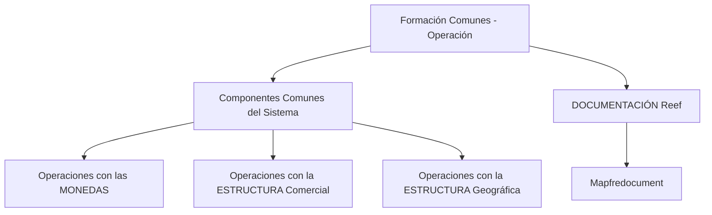

# Formação Comunes — Operação dos Componentes Comuns do Sistema

## 1. Metadados do Documento
- **Arquivo de Origem:** Não identificado no conteúdo fornecido
- **Tipo de Documento:** Apresentação Executiva
- **Domínio / Sistema:** Reef / Mapfre
- **Público-Alvo:** Operação
- **Data/Versão Identificada:** Não identificada

---

## 2. Resumo Executivo & Contexto de Negócio

O documento apresenta uma formação direcionada às operações dos componentes comuns do sistema. O conteúdo associa explicitamente a formação ao contexto operacional e ao sistema Reef, dentro de um ambiente de documentação denominado “DOCUMENTACIÓN Reef”.

Os tópicos funcionais explicitamente citados abrangem operações com moedas, estrutura comercial e estrutura geográfica. O conteúdo fornecido não descreve procedimentos, regras de alteração, validações, permissões, interfaces ou impactos operacionais relacionados a esses tópicos.

A referência a “Mapfredocument” e ao proprietário `user:agonzalez_mapfre.com` indica que o material está associado a um repositório ou portal documental corporativo. O ciclo de vida do documento é apresentado como “Approved Source”.

O fragmento extraído contém apenas uma página e não fornece detalhamento técnico adicional sobre arquitetura, sistemas integrados, APIs, ambientes, URLs, logs ou fluxos de execução.

---

## 3. Arquitetura, Componentes & Tecnologias Envolvidas

Os elementos identificados no conteúdo são:

- **Reef:** sistema ou domínio documental mencionado repetidamente.
- **DOCUMENTACIÓN Reef:** área ou repositório de documentação relacionado a Reef.
- **Mapfredocument:** termo citado sem descrição funcional adicional.
- **Operaciones con las MONEDAS:** tópico de operação sobre moedas.
- **Operaciones con la ESTRUCTURA Comercial:** tópico de operação sobre estrutura comercial.
- **Operaciones con la ESTRUCTURA Geográfica:** tópico de operação sobre estrutura geográfica.
- **Zeus:** item presente na navegação do portal, sem relação arquitetural explicada.
- **Cloud:** item presente na navegação do portal, sem relação arquitetural explicada.
- **APIs, Componentes, Soluciones, Arquitecturas:** categorias de navegação mencionadas, sem detalhes técnicos.



> **Nota de Análise:** o documento não detalha integrações, protocolos, tecnologias de implementação, componentes de software, métodos HTTP, contratos de API ou fluxos de dados.

---

## 4. Regras de Negócio, Especificações Funcionais & Processos

O conteúdo identifica três áreas de operações dos componentes comuns do sistema:

1. **Operações com moedas**
   - O documento declara que a formação cobre operações com moedas.
   - Não são informadas moedas suportadas, regras de conversão, taxas, validações, datas de vigência, permissões ou procedimentos operacionais.

2. **Operações com estrutura comercial**
   - O documento declara que a formação cobre operações com a estrutura comercial.
   - Não são descritos níveis hierárquicos, entidades comerciais, regras de criação, alteração, exclusão, aprovação ou impacto em outros sistemas.

3. **Operações com estrutura geográfica**
   - O documento declara que a formação cobre operações com a estrutura geográfica.
   - Não são descritas localidades, hierarquias territoriais, códigos, regras de associação, processos de manutenção ou critérios de validação.

4. **Documentação Reef**
   - O material é identificado como documentação relacionada ao Reef.
   - O ciclo de vida exibido é `Approved Source`.
   - O proprietário exibido é `user:agonzalez_mapfre.com`.

> **Nota de Análise:** não há regras de negócio detalhadas, sequência operacional, critérios de entrada/saída, exceções ou evidências de validação no conteúdo extraído.

---

## 5. Tabelas de Parâmetros, Ambientes e Estruturas de Dados

| Item / Parâmetro | Descrição / Função | Tipo / Valores / Formato | Ambiente / Observações |
| :--- | :--- | :--- | :--- |
| Formação Comunes - Operação | Formação orientada às operações dos componentes comuns do sistema | Título do material | Conteúdo em espanhol |
| MONEDAS | Tópico de operações com moedas | Tópico funcional | Sem detalhamento adicional |
| ESTRUCTURA Comercial | Tópico de operações com estrutura comercial | Tópico funcional | Sem detalhamento adicional |
| ESTRUCTURA Geográfica | Tópico de operações com estrutura geográfica | Tópico funcional | O texto extraído contém caractere inválido em “Geográca” |
| DOCUMENTACIÓN Reef | Área ou identificação documental associada ao Reef | Repositório/documentação | Sem URL fornecida |
| Mapfredocument | Termo citado no contexto documental | Sistema, repositório ou referência não especificada | Sem descrição adicional |
| Owner | Proprietário do material documental | Campo de metadado | `user:agonzalez_mapfre.com` |
| Lifecycle | Estado do ciclo de vida do documento | Campo de metadado | `Approved Source` |
| Idioma | Idioma indicado no portal | Código de idioma | `ES` |
| Navegação do portal | Itens visíveis no menu | Lista de categorias | Buscar, Inicio, Soluciones, Arquitecturas, APIs, Componentes, Cloud, Documentación, Zeus, Reef, Ayuda |

---

## 6. Bateria de Perguntas & Respostas para RAG (FAQ Sintético)

### P1: Qual é o objetivo da formação “Formación Comunes - Operación”?
**R:** A formação é orientada às operações próprias dos componentes comuns do sistema. O conteúdo fornecido identifica operações com moedas, estrutura comercial e estrutura geográfica como tópicos da formação.

### P2: Quais tópicos operacionais são explicitamente citados no documento?
**R:** O documento cita operações com moedas, operações com a estrutura comercial e operações com a estrutura geográfica.

### P3: O documento descreve como executar operações com moedas?
**R:** Não. O documento apenas informa que operações com moedas fazem parte da formação. Não apresenta procedimentos, regras, moedas suportadas, taxas, validações ou permissões.

### P4: Quais regras são apresentadas para a estrutura comercial?
**R:** Nenhuma regra detalhada é apresentada. O conteúdo somente lista operações com a estrutura comercial como um tema da formação.

### P5: O documento detalha a hierarquia da estrutura geográfica?
**R:** Não. A estrutura geográfica é mencionada como tópico operacional, mas o documento não especifica localidades, níveis hierárquicos, códigos ou regras de manutenção.

### P6: Qual sistema ou domínio está associado à documentação?
**R:** O material está associado ao Reef, identificado pelas referências “Documentation / DOCUMENTACIÓN Reef” e “DOCUMENTACIÓN Reef”.

### P7: Quem é o proprietário identificado para a documentação Reef?
**R:** O proprietário identificado no conteúdo é `user:agonzalez_mapfre.com`.

### P8: Qual é o ciclo de vida informado para o documento?
**R:** O ciclo de vida informado é `Approved Source`.

### P9: Há URLs de ambientes, endpoints de API ou caminhos de logs no documento?
**R:** Não. O conteúdo extraído não apresenta URLs, ambientes, portas, endpoints, rotas de logs ou parâmetros técnicos de infraestrutura.

### P10: O documento descreve integrações entre Reef, Zeus, Cloud ou APIs?
**R:** Não. Reef, Zeus, Cloud e APIs aparecem no contexto de navegação do portal, mas não há descrição de integração, dependência ou fluxo de dados entre esses elementos.

---

## 7. Glossário de Termos, Siglas & Conceitos-Chave

- **Reef:** sistema ou domínio associado à documentação apresentada; o documento não fornece definição adicional.
- **DOCUMENTACIÓN Reef:** identificação da documentação relacionada ao Reef.
- **Mapfredocument:** termo exibido no contexto documental, sem definição adicional.
- **MONEDAS:** moedas; tópico de operações abordado pela formação.
- **ESTRUCTURA Comercial:** estrutura comercial; tópico de operações abordado pela formação.
- **ESTRUCTURA Geográfica:** estrutura geográfica; tópico de operações abordado pela formação.
- **Owner:** campo que identifica o proprietário do conteúdo documental.
- **Lifecycle:** campo que identifica o estado do ciclo de vida do documento.
- **Approved Source:** valor exibido para o ciclo de vida documental.
- **ES:** código exibido para o idioma espanhol.
- **Zeus:** item de navegação citado sem detalhamento funcional ou técnico.

---

## 8. Notas Críticas, Riscos & Limitações

- O conteúdo extraído possui somente uma página.
- Não há identificação do arquivo de origem, data, versão, autor formal ou escopo completo do material.
- Não há procedimentos operacionais detalhados para moedas, estrutura comercial ou estrutura geográfica.
- Não há informações sobre permissões, perfis de acesso, validações, exceções, auditoria ou trilhas de log.
- Não há arquitetura técnica, integrações, APIs, contratos, URLs, ambientes ou dependências descritas.
- O termo “Geográca” contém um caractere inválido na extração; foi interpretado contextualmente como “Geográfica”, preservando a evidência no conteúdo bruto.
- Os itens do menu do portal não devem ser interpretados como componentes integrados ou tecnologias efetivamente utilizadas sem evidência adicional.

---

## 9. Conteúdo Bruto Estruturado (Referência Fiel)

```text
--- [PÁGINA 1 DE 1] ---

FORMACIÓN COMUNES - OPERACIÓN
Formación orientada a las Operaciones propias de los componentes Comunes del Sistema.
Operaciones con las MONEDAS
Operaciones con la ESTRUCTURA Comercial
Operaciones con la ESTRUCTURA Geográca
--
Documentation / DOCUMENTACIÓN Reef
DOCUMENTACIÓN Reef
Mapfredocument
DOCUMENTACIÓN Reef
Owner
user:agonzalez_mapfre.com
Lifecycle
Approved Source
 / 
 VL
Buscar Inicio Soluciones Arquitecturas APIs Componentes Cloud Documentación Zeus Reef Ayuda
ES
```
