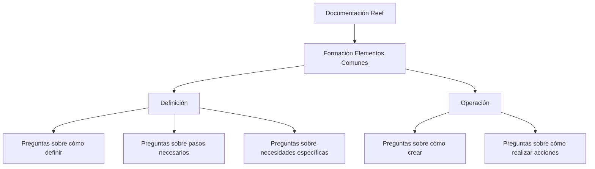

# Formação de Elementos Comuns — Documentação Reef

## 1. Metadados do Documento
- **Arquivo de Origem:** Não identificado no conteúdo extraído
- **Tipo de Documento:** Procedimento / Material de formação
- **Domínio / Sistema:** Reef / Mapfredocument
- **Público-Alvo:** Usuários de documentação, operação e definição de elementos do sistema
- **Data/Versão Identificada:** Não identificada

---

## 2. Resumo Executivo & Contexto de Negócio

O documento apresenta a formação relativa aos **elementos comuns ou transversais** existentes no Sistema. O conteúdo organiza essa formação em dois eixos principais: **Definição** e **Operação**.

A seção **Definição** está orientada a apoiar perguntas sobre os passos necessários para definir elementos, sobre como realizar uma definição e sobre ações necessárias diante de necessidades específicas. O conteúdo disponível não detalha quais elementos podem ser definidos, nem os procedimentos correspondentes.

A seção **Operação** está orientada a perguntas sobre criação e execução de ações no sistema. O texto não informa fluxos operacionais, permissões, telas, APIs, contratos ou critérios de validação.

O material está associado à navegação de documentação Reef, com referências a **Mapfredocument**, ao proprietário `user:agonzalez_mapfre.com`, ao ciclo de vida **Approved Source** e ao idioma **ES**.

---

## 3. Arquitetura, Componentes & Tecnologias Envolvidas

Componentes e referências explicitamente citados:

- **Sistema:** Sistema não nomeado no trecho extraído.
- **Documentação Reef:** Área de documentação referenciada no conteúdo.
- **Mapfredocument:** Termo exibido na navegação/documentação.
- **Lifecycle:** `Approved Source`.
- **Owner:** `user:agonzalez_mapfre.com`.
- **Idioma:** `ES`.
- **Áreas de navegação:** Buscar, Inicio, Soluciones, Arquitecturas, APIs, Componentes, Cloud, Documentación, Zeus, Reef e Ayuda.



> **Nota de Análise:** O conteúdo extraído não descreve arquitetura de software, integrações, microsserviços, APIs, ambientes ou tecnologias de implementação.

---

## 4. Regras de Negócio, Especificações Funcionais & Processos

### Formação de elementos comuns

A formação apresentada aplica-se aos elementos considerados **comuns** ou **transversais** no Sistema.

### Definição

A seção de definição busca responder perguntas como:

1. Quais passos devem ser seguidos para definir algo.
2. Como determinada definição deve ser realizada.
3. O que deve ser feito quando existe uma necessidade específica.

Não foram fornecidos procedimentos detalhados, campos, regras de validação, responsáveis, pré-requisitos ou resultados esperados para atividades de definição.

### Operação

A seção de operação busca responder perguntas como:

1. Como criar algo.
2. O que deve ser feito para executar determinada ação.

Não foram fornecidos passos operacionais detalhados, controles, permissões, estados, telas ou evidências de execução.

---

## 5. Tabelas de Parâmetros, Ambientes e Estruturas de Dados

| Item / Parâmetro | Descrição / Função | Tipo / Valores / Formato | Ambiente / Observações |
| :--- | :--- | :--- | :--- |
| Formação | Formação relativa a elementos comuns ou transversais do Sistema | Conteúdo formativo | Dividida em Definição e Operação |
| Definição | Orientação para perguntas sobre definição e passos necessários | Seção funcional | Sem procedimentos detalhados no conteúdo |
| Operação | Orientação para perguntas sobre criação e realização de ações | Seção funcional | Sem procedimentos detalhados no conteúdo |
| Documentação Reef | Referência à documentação Reef | Área documental | Exibida como “Documentation / DOCUMENTACIÓN Reef” |
| Mapfredocument | Referência documental exibida no conteúdo | Nome / termo de navegação | Sem detalhamento adicional |
| Owner | Proprietário identificado | `user:agonzalez_mapfre.com` | Conforme conteúdo extraído |
| Lifecycle | Estado do ciclo de vida exibido | `Approved Source` | Conforme conteúdo extraído |
| Idioma | Idioma indicado na navegação | `ES` | Interface/documentação em espanhol |
| Navegação | Seções exibidas | Buscar, Inicio, Soluciones, Arquitecturas, APIs, Componentes, Cloud, Documentación, Zeus, Reef, Ayuda | Não há descrição funcional das seções |

---

## 6. Bateria de Perguntas & Respostas para RAG (FAQ Sintético)

### P1: Qual é o objetivo da formação de elementos comuns?
**R:** A formação aborda elementos comuns ou transversais existentes no Sistema e está organizada nas seções Definição e Operação.

### P2: Quais são as divisões da formação de elementos comuns?
**R:** A formação está dividida em dois apartados: Definição e Operação.

### P3: Que tipo de perguntas a seção Definição pretende responder?
**R:** A seção Definição pretende apoiar perguntas sobre os passos necessários para definir algo, sobre como realizar uma definição e sobre o que fazer quando existe uma necessidade específica.

### P4: O documento explica quais passos devem ser seguidos para definir um elemento?
**R:** Não. O documento informa que a seção Definição busca responder esse tipo de pergunta, mas não apresenta os passos concretos no conteúdo extraído.

### P5: Que tipo de perguntas a seção Operação pretende responder?
**R:** A seção Operação pretende responder perguntas sobre como criar algo e sobre o que fazer para realizar determinada ação.

### P6: O documento informa como criar elementos no Sistema?
**R:** Não. O conteúdo indica que a seção Operação cobre perguntas sobre criação, mas não fornece procedimentos operacionais detalhados.

### P7: Qual documentação é mencionada no conteúdo?
**R:** O conteúdo menciona “Documentation / DOCUMENTACIÓN Reef”, “DOCUMENTACIÓN Reef” e “Mapfredocument”.

### P8: Quem é identificado como proprietário do conteúdo?
**R:** O proprietário identificado é `user:agonzalez_mapfre.com`.

### P9: Qual é o ciclo de vida indicado para o conteúdo?
**R:** O ciclo de vida exibido é `Approved Source`.

### P10: Qual idioma está indicado na navegação?
**R:** O idioma indicado é `ES`.

### P11: O documento descreve APIs, microsserviços ou contratos técnicos?
**R:** Não. Embora “APIs” apareça na navegação, o conteúdo extraído não descreve APIs, microsserviços, métodos HTTP, contratos JSON ou integrações.

---

## 7. Glossário de Termos, Siglas & Conceitos-Chave

- **Definición:** Seção orientada a questões sobre definição de elementos e passos necessários.
- **Operación:** Seção orientada a questões sobre criação e execução de ações.
- **Elementos comunes:** Elementos comuns existentes no Sistema.
- **Elementos transversales:** Elementos aplicáveis de forma transversal no Sistema.
- **Reef:** Nome associado à documentação apresentada.
- **Mapfredocument:** Termo exibido na área de documentação.
- **Lifecycle:** Campo que informa o estado do ciclo de vida do conteúdo.
- **Approved Source:** Valor do ciclo de vida exibido no documento.
- **Owner:** Campo que identifica o proprietário do conteúdo.
- **ES:** Código de idioma exibido na navegação, correspondente ao espanhol no contexto apresentado.

---

## 8. Notas Críticas, Riscos & Limitações

- O trecho extraído contém somente uma apresentação resumida da formação de elementos comuns.
- Não há detalhamento dos elementos comuns ou transversais cobertos pela formação.
- Não há instruções passo a passo para definição ou operação.
- Não há regras de negócio, parâmetros de entrada, critérios de validação, matrizes de permissão ou fluxos de exceção.
- Não há descrição de APIs, contratos, ambientes, servidores, logs ou integrações técnicas.
- **Nota de Análise:** O documento menciona as seções Definição e Operação, porém não detalha os processos, telas ou procedimentos associados.

---

## 9. Conteúdo Bruto Estruturado (Referência Fiel)

```text
--- [PÁGINA 1 DE 1] ---

FORMACIÓN ELEMENTOS COMUNES
 En este apartado se encuentra la formación relativa a los elementos comunes o transversales existentes en el Sistema. Dicha
formación está dividida en los apartados siguientes:
Denición
Operación
DEFINICIÓN
Conseguir respuestas a preguntas del estilo:
¿Qué pasos he de seguir para poder denir...?
¿Cómo se dene...?
¿Qué he de hacer si necesito...?
...
OPERACIÓN
Obtener respuestas a preguntas del tipo...
¿Cómo puedo crear...?
¿Qué hago para poder hacer...?
...
Documentation / DOCUMENTACIÓN Reef
DOCUMENTACIÓN Reef
Mapfredocument
DOCUMENTACIÓN Reef
Owner
user:agonzalez_mapfre.com
Lifecycle
Approved Source
 / 
 VL
Buscar Inicio Soluciones Arquitecturas APIs Componentes Cloud Documentación Zeus Reef Ayuda
ES
```
