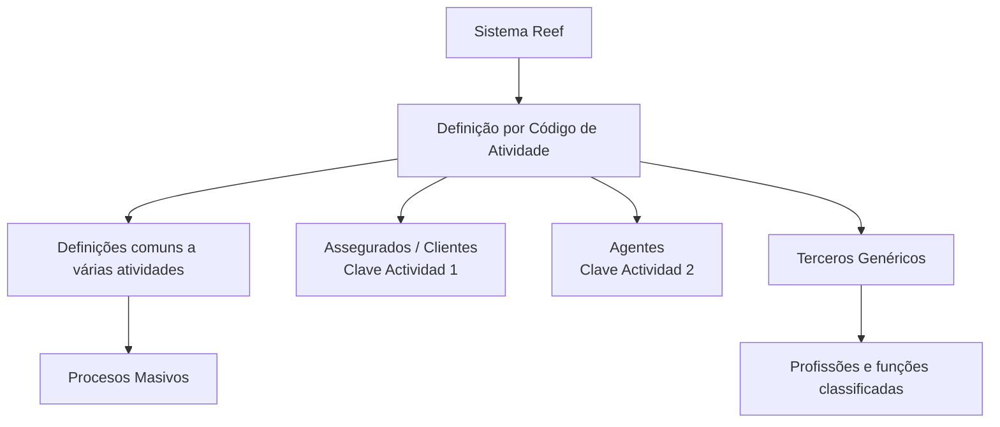

# Documentação Reef — Formação de Terceiros por Código de Atividade

## 1. Metadados do Documento
- **Arquivo de Origem:** Não identificado no conteúdo fornecido
- **Tipo de Documento:** Manual Operacional / Documentação Funcional
- **Domínio / Sistema:** Reef / Mapfredocument
- **Público-Alvo:** Negócio, operação e equipes que definem ou consultam atividades de terceiros
- **Data/Versão Identificada:** Não identificada

---

## 2. Resumo Executivo & Contexto de Negócio

O documento descreve a formação e a definição de terceiros no sistema Reef por meio de um **Código de Atividade** (*Clave Actividad*). Pessoas físicas e jurídicas são tratadas como sinônimos de terceiros no contexto documental.

As definições podem ser comuns a duas ou mais atividades de terceiros, próprias de assegurados/clientes, específicas de agentes ou particulares de terceiros genéricos. O documento também cita processos massivos como parte das definições comuns a múltiplas atividades.

O sistema identifica assegurados pela chave de atividade **1** e agentes pela chave de atividade **2**. Terceiros genéricos abrangem pessoas físicas ou jurídicas classificadas em profissões e funções específicas, como peritos, médicos, fornecedores, oficinas, clínicas e representantes legais.

---

## 3. Arquitetura, Componentes & Tecnologias Envolvidas

Os elementos identificados são o sistema **Reef**, a área de **DOCUMENTACIÓN Reef**, o repositório ou referência **Mapfredocument** e a classificação funcional por **Clave Actividad**. O conteúdo fornecido não descreve APIs, microsserviços, tecnologias de implementação, ambientes ou integrações técnicas.



> **Nota de Análise:** O documento não detalha a arquitetura técnica do Reef, os mecanismos de persistência, interfaces de usuário, contratos de integração ou regras de autorização.

---

## 4. Regras de Negócio, Especificações Funcionais & Processos

1. O sistema utiliza a **Clave Actividad** para identificar ou classificar atividades de terceiros.
2. Pessoas físicas e pessoas jurídicas são consideradas sinônimos de **Terceros** na redação dos documentos.
3. As definições comuns podem afetar duas ou mais atividades de terceiros, não uma atividade específica isolada.
4. **Procesos Masivos** são citados dentro do conjunto de definições comuns a várias atividades; o conteúdo fornecido não detalha o funcionamento desses processos.
5. Os **Asegurados/Clientes** são identificados no sistema pela **Clave Actividad 1**.
6. Os **Agentes** são identificados no sistema pela **Clave Actividad 2**.
7. **Terceros Genéricos** correspondem a pessoas físicas ou jurídicas cujas atividades laborais pertencem às profissões e funções enumeradas na tabela de códigos de atividade.
8. O conteúdo fornecido lista códigos para terceiros genéricos entre **3** e **45**, com lacunas numéricas e indicação final de continuidade da tabela por meio de `... ...`.

---

## 5. Tabelas de Parâmetros, Ambientes e Estruturas de Dados

| Item / Parâmetro | Descrição / Função | Tipo / Valores / Formato | Ambiente / Observações |
| :--- | :--- | :--- | :--- |
| Sistema | Sistema que identifica atividades de terceiros | Reef | Ambiente não informado |
| Critério de classificação | Código utilizado para identificar a atividade | Clave Actividad | Formato numérico apresentado |
| Terceiro | Pessoa física ou jurídica | Terceros | Termos utilizados indistintamente |
| Assegurado / Cliente | Terceiro identificado como assegurado ou cliente | Clave Actividad `1` | Não há detalhamento adicional |
| Agente | Terceiro identificado como agente | Clave Actividad `2` | Não há detalhamento adicional |
| Definições comuns | Definições aplicáveis a duas ou mais atividades | Definiciones COMUNES | Inclui referência a Procesos Masivos |
| Terceiro genérico | Pessoa física ou jurídica classificada por profissão ou função | Claves `3` a `45` listadas parcialmente | A tabela continua além do conteúdo fornecido |
| Documentação | Referência documental do sistema | DOCUMENTACIÓN Reef / Mapfredocument | Owner exibido: `user:agonzalez_mapfre.com` |
| Lifecycle | Estado de ciclo de vida exibido | `Approved Source` | Valor apresentado na página 1 |

| Clave Actividad | Descrição / Função | Tipo / Valores / Formato | Ambiente / Observações |
| :--- | :--- | :--- | :--- |
| 1 | Asegurados/Clientes | Código numérico de atividade | Identificação de assegurados no sistema |
| 2 | Agentes | Código numérico de atividade | Identificação de agentes no sistema |
| 3 | Peritos | Código numérico de atividade | Terceiro genérico |
| 4 | Inspectores | Código numérico de atividade | Terceiro genérico |
| 5 | Médicos | Código numérico de atividade | Terceiro genérico |
| 6 | Abogados | Código numérico de atividade | Terceiro genérico |
| 7 | Procuradores | Código numérico de atividade | Terceiro genérico |
| 10 | Proveedores | Código numérico de atividade | Terceiro genérico |
| 11 | Ejecutivos de Cta. | Código numérico de atividade | Terceiro genérico |
| 12 | Cobradores | Código numérico de atividade | Terceiro genérico |
| 15 | Empleados | Código numérico de atividade | Terceiro genérico |
| 17 | Talleres | Código numérico de atividade | Terceiro genérico |
| 18 | Clínicas | Código numérico de atividade | Terceiro genérico |
| 19 | Juzgados | Código numérico de atividade | Terceiro genérico |
| 20 | Cristaleros | Código numérico de atividade | Terceiro genérico |
| 21 | Cerrajeros | Código numérico de atividade | Terceiro genérico |
| 22 | Plomeros | Código numérico de atividade | Terceiro genérico |
| 23 | Electricistas | Código numérico de atividade | Terceiro genérico |
| 24 | Grúas | Código numérico de atividade | Terceiro genérico |
| 25 | Investigadores | Código numérico de atividade | Terceiro genérico |
| 26 | Recuperadores | Código numérico de atividade | Terceiro genérico |
| 27 | Ajustadores | Código numérico de atividade | Terceiro genérico |
| 28 | Herreros | Código numérico de atividade | Terceiro genérico |
| 29 | Tribunales | Código numérico de atividade | Terceiro genérico |
| 30 | Terceros Seg. MOTOR | Código numérico de atividade | Terceiro genérico |
| 31 | Terceros Seg. SALUD | Código numérico de atividade | Terceiro genérico |
| 32 | Terceros Seg. PATRIMONIALES | Código numérico de atividade | Terceiro genérico |
| 33 | Depósitos | Código numérico de atividade | Terceiro genérico |
| 34 | Notarías | Código numérico de atividade | Terceiro genérico |
| 35 | Centros de Peritación | Código numérico de atividade | Terceiro genérico |
| 36 | Comisarías | Código numérico de atividade | Terceiro genérico |
| 38 | Filial | Código numérico de atividade | Terceiro genérico |
| 45 | Representantes Legales | Código numérico de atividade | Terceiro genérico |

---

## 6. Bateria de Perguntas & Respostas para RAG (FAQ Sintético)

### P1: Como o sistema Reef identifica assegurados ou clientes?
**R:** O sistema Reef identifica os assegurados ou clientes pela **Clave Actividad 1**.

### P2: Qual código de atividade identifica agentes no Reef?
**R:** Os agentes são identificados no sistema Reef pela **Clave Actividad 2**.

### P3: Pessoas físicas e jurídicas são classificadas de forma diferente como terceiros?
**R:** Não. O documento informa que pessoas físicas e jurídicas são sinônimos de terceiros e que esses termos podem ser utilizados indistintamente na redação dos documentos.

### P4: O que são definições comuns a várias atividades de terceiros?
**R:** São definições que não afetam uma atividade específica isolada, mas sim duas ou mais atividades de terceiros. O documento cita processos massivos dentro desse agrupamento, sem detalhar seu funcionamento.

### P5: O que caracteriza um terceiro genérico no Reef?
**R:** Terceiros genéricos são pessoas físicas ou jurídicas cujas atividades laborais correspondem às profissões ou funções relacionadas na tabela de códigos de atividade, como peritos, médicos, fornecedores, clínicas, oficinas e representantes legais.

### P6: Qual é o código de atividade para médicos?
**R:** Médicos possuem a **Clave Actividad 5**.

### P7: Qual código deve ser utilizado para terceiros do segmento de seguros MOTOR?
**R:** O documento associa **Terceros Seg. MOTOR** à **Clave Actividad 30**.

### P8: Quais códigos representam terceiros dos segmentos de seguros SALUD e PATRIMONIALES?
**R:** **Terceros Seg. SALUD** corresponde à **Clave Actividad 31**, enquanto **Terceros Seg. PATRIMONIALES** corresponde à **Clave Actividad 32**.

### P9: Qual código identifica clínicas?
**R:** Clínicas são classificadas pela **Clave Actividad 18**.

### P10: O documento informa métodos HTTP, APIs ou contratos de integração do Reef?
**R:** Não. O conteúdo fornecido trata da classificação funcional de terceiros por código de atividade e não detalha métodos HTTP, APIs, contratos JSON, microsserviços ou integrações técnicas.

---

## 7. Glossário de Termos, Siglas & Conceitos-Chave

- **Reef:** Sistema mencionado como responsável pela identificação de terceiros por código de atividade.
- **Clave Actividad:** Código numérico utilizado para identificar ou classificar atividades de terceiros.
- **Terceros:** Pessoas físicas ou jurídicas; os dois termos são tratados como sinônimos no documento.
- **Asegurados/Clientes:** Categoria identificada pela Clave Actividad 1.
- **Agentes:** Categoria identificada pela Clave Actividad 2.
- **Terceros Genéricos:** Pessoas físicas ou jurídicas classificadas conforme as profissões e funções enumeradas na tabela.
- **Procesos Masivos:** Processos citados como parte das definições comuns a várias atividades, sem detalhamento adicional.
- **Mapfredocument:** Referência apresentada na área de documentação Reef.
- **Seg. MOTOR:** Abreviação exibida para a categoria `Terceros Seg. MOTOR`; o significado da sigla não é explicitado.
- **Seg. SALUD:** Abreviação exibida para a categoria `Terceros Seg. SALUD`; o significado da sigla não é explicitado.
- **Seg. PATRIMONIALES:** Abreviação exibida para a categoria `Terceros Seg. PATRIMONIALES`; o significado da sigla não é explicitado.

---

## 8. Notas Críticas, Riscos & Limitações

- O arquivo de origem, data, versão e autor formal do documento não foram identificados no conteúdo fornecido.
- A tabela de códigos de atividade é incompleta: a página 3 apresenta `... ...`, indicando continuidade não disponível na extração.
- Existem lacunas na numeração dos códigos exibidos; o documento não informa se esses códigos estão reservados, descontinuados ou presentes em páginas não extraídas.
- O documento não detalha fluxos operacionais, validações, critérios de manutenção dos códigos, permissões, APIs, logs, ambientes ou integrações.
- **Nota de Análise:** O documento cita processos massivos, mas não descreve regras de execução, entradas, saídas, frequência ou tratamento de exceções.
- **Nota de Análise:** As abreviações `Seg. MOTOR`, `Seg. SALUD` e `Seg. PATRIMONIALES` não são expandidas explicitamente no conteúdo original.

---

## 9. Conteúdo Bruto Estruturado (Referência Fiel)

```text
--- [PÁGINA 1 DE 3] ---

FORMACIÓN de TERCEROS, DEFINICIÓN por Código de Actividad
Formación orientada a las Deniciones propias o particulares de cada una de las Actividades de Terceros contempladas en el Sistema.
Las personas físicas y jurídicas son sinónimos de Terceros por lo que en la redacción de los documentos se utilizarán estos términos
indistintamente.
Deniciones COMUNES a Varias Actividades de Terceros
Este Apartado afecta no a una Actividad Especícas sino a 2 o más Actividades de los Terceros.
Procesos Masivos
Deniciones propias de Asegurados/Clientes
El Sistema identica a los Asegurados con la Clave de Actividad... 1.
-
Deniciones especícas de Agentes
El Sistema identica a los Agentes con la Clave de Actividad... 2.
-
Deniciones particulares de Terceros Genéricos
En el Sistema se consideran "Terceros Genéricos" todas aquellas personas físicas o jurídicas cuyas actividades laborales se corresponden
con las siguientes profesiones...
Clave Actividad Descripción
3 Peritos
4 Inspectores
5 Médicos
6 Abogados
7 Procuradores
Documentation / DOCUMENTACIÓN Reef
DOCUMENTACIÓN Reef
Mapfredocument
DOCUMENTACIÓN Reef
Owner
user:agonzalez_mapfre.com
Lifecycle
Approved Source
 / 
 VL
Buscar Inicio Soluciones Arquitecturas APIs Componentes Cloud Documentación Zeus Reef Ayuda
ES

--- [PÁGINA 2 DE 3] ---

Clave Actividad Descripción
10 Proveedores
11 Ejecutivos de Cta.
12 Cobradores
15 Empleados
17 Talleres
18 Clínicas
19 Juzgados
20 Cristaleros
21 Cerrajeros
22 Plomeros
23 Electricistas
24 Grúas
25 Investigadores
26 Recuperadores
27 Ajustadores
28 Herreros
29 Tribunales
30 Terceros Seg. MOTOR
31 Terceros Seg. SALUD
32 Terceros Seg. PATRIMONIALES
33 Depósitos
34 Notarías
35 Centros de Peritación
36 Comisarías
38 Filial
45 Representantes Legales

--- [PÁGINA 3 DE 3] ---

Clave Actividad Descripción
... ...
-
```
