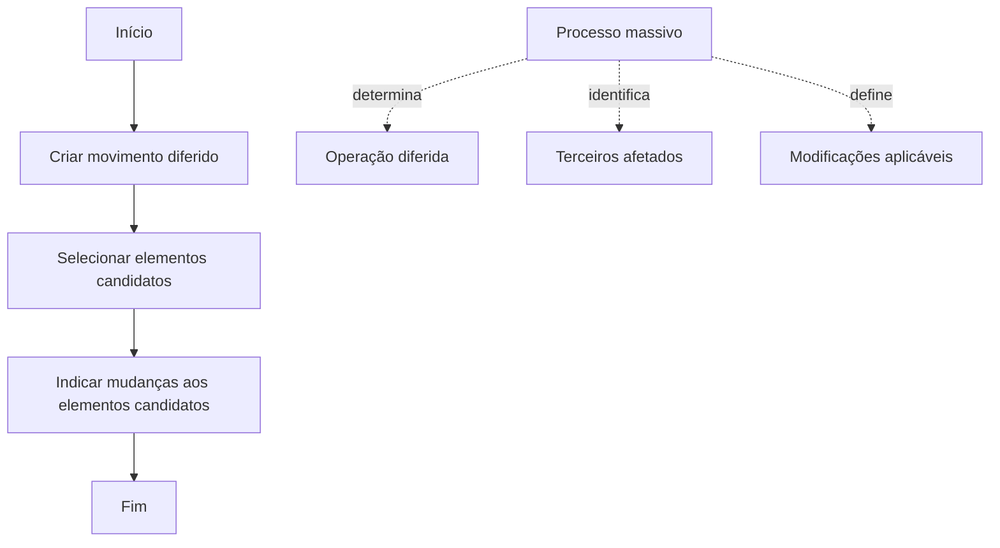

# Processo Massivo de Criação ou Modificação de Terceiros — Documentação Reef

## 1. Metadados do Documento
- **Arquivo de Origem:** Não identificado no conteúdo fornecido
- **Tipo de Documento:** Procedimento
- **Domínio / Sistema:** Reef / Mapfre
- **Público-Alvo:** Operação e usuários do sistema
- **Data/Versão Identificada:** Não identificada
- **Ciclo de Vida Identificado:** Approved
- **Proprietário Identificado:** `user:agonzalez_mapfre.com`

---

## 2. Resumo Executivo & Contexto de Negócio

O documento descreve o procedimento **“Crear Proceso Masivo Terceros”**, relacionado à execução diferida de operações sobre Terceiros no sistema Reef. Certas operações podem ser realizadas em linha ou de maneira diferida, conforme descrito no material.

Um processo massivo determina qual operação diferida será executada, quais Terceiros serão afetados e quais modificações esses Terceiros sofrerão. O documento não descreve critérios de seleção, regras de elegibilidade, tipos específicos de alteração ou contratos técnicos associados ao processo massivo.

O objetivo declarado é orientar as ações necessárias no sistema para permitir a execução diferida de uma operação de **Criação** ou **Modificação** de um Terceiro. Essa capacidade deve funcionar independentemente do Código ou dos Códigos de Atividade atribuídos ao Terceiro.

O procedimento operacional possui três etapas sequenciais: criar o movimento diferido, selecionar os elementos candidatos e indicar as mudanças para os elementos candidatos. O fluxo se encerra após o registro das mudanças.

---

## 3. Arquitetura, Componentes & Tecnologias Envolvidas

Os elementos explicitamente identificados no conteúdo são:

| Componente / Termo | Papel identificado no documento |
| :--- | :--- |
| Reef | Sistema ou domínio de documentação no qual o procedimento está registrado. |
| Mapfre | Contexto organizacional identificado na documentação. |
| Processo massivo | Processo que determina uma operação diferida, os Terceiros afetados e as modificações aplicáveis. |
| Movimento diferido | Etapa inicial criada para habilitar a execução diferida. |
| Elementos candidatos | Terceiros selecionados para serem afetados pelo processo massivo. |
| Códigos de Atividade | Códigos atribuídos ao Terceiro; o procedimento é independente da quantidade de códigos atribuídos. |
| Mapfredocument | Termo exibido na navegação da documentação. |
| Zeus | Termo exibido na navegação da documentação, sem detalhamento funcional adicional. |



> **Nota de Análise:** O documento não detalha arquitetura de software, APIs, microsserviços, bancos de dados, tecnologias de implementação, ambientes ou interfaces do sistema Reef.

---

## 4. Regras de Negócio, Especificações Funcionais & Processos

### Definição de processo massivo

Um processo massivo é o processo que determina simultaneamente:

1. Qual operação diferida será realizada.
2. Quais Terceiros serão afetados por essa operação diferida.
3. Quais modificações os Terceiros selecionados sofrerão.

### Modalidades de execução

O documento estabelece que certas operações podem ser executadas:

- **Em linha**; ou
- **De maneira diferida**.

Não há detalhamento sobre quais operações são elegíveis para cada modalidade, nem sobre os critérios que determinam a escolha entre execução em linha e execução diferida.

### Objetivo operacional

O procedimento prepara o sistema para executar, de forma diferida:

- Uma operação de **Criação de Terceiro**; ou
- Uma operação de **Modificação de Terceiro**.

A execução diferida independe do Código ou dos Códigos de Atividade atribuídos ao Terceiro.

### Processo sequencial

1. **Criar movimento diferido**  
   Criar o movimento que representa a operação a ser executada de forma diferida.

2. **Selecionar elementos candidatos**  
   Selecionar os elementos candidatos, entendidos no contexto como os Terceiros que serão afetados pela operação.

3. **Indicar mudanças aos elementos candidatos**  
   Registrar ou indicar as mudanças que serão aplicadas aos elementos candidatos selecionados.

4. **Fim**  
   O processo é concluído após a indicação das mudanças.

> **Nota de Análise:** O documento não especifica telas, campos obrigatórios, validações, permissões, critérios de seleção dos candidatos, aprovação, agendamento, execução técnica, tratamento de erros ou mecanismo de reversão do movimento diferido.

---

## 5. Tabelas de Parâmetros, Ambientes e Estruturas de Dados

| Item / Parâmetro | Descrição / Função | Tipo / Valores / Formato | Ambiente / Observações |
| :--- | :--- | :--- | :--- |
| Operação | Ação que será executada de forma diferida. | Criação ou Modificação de Terceiro. | O documento informa que determinadas operações podem ser realizadas em linha ou diferidamente. |
| Processo massivo | Determina a operação diferida, os Terceiros afetados e as modificações aplicáveis. | Processo operacional. | Não há detalhes de implementação técnica. |
| Movimento diferido | Movimento criado na primeira etapa do processo. | Etapa do fluxo. | Necessário antes da seleção dos elementos candidatos. |
| Elementos candidatos | Elementos selecionados para receber as alterações. | Terceiros afetados pela operação. | Não há critérios de elegibilidade documentados. |
| Mudanças | Alterações indicadas para os elementos candidatos. | Não especificado. | Não há catálogo de mudanças, campos ou regras de validação. |
| Terceiro | Entidade sujeita à criação ou modificação. | Entidade de negócio. | Pode possuir um ou mais Códigos de Atividade. |
| Código de Atividade | Código atribuído a um Terceiro. | Um ou mais códigos. | O processo é independente da quantidade de códigos atribuídos. |
| Owner | Proprietário registrado na documentação. | `user:agonzalez_mapfre.com` | Metadado da página de documentação. |
| Lifecycle | Estado do ciclo de vida da documentação. | `Approved` | Metadado da página de documentação. |
| Fonte | Indicação apresentada no cabeçalho. | `Source / VL` | O significado de `VL` não é detalhado. |

---

## 6. Bateria de Perguntas & Respostas para RAG (FAQ Sintético)

### P1: O que é um processo massivo de Terceiros no sistema Reef?
**R:** Um processo massivo é o processo que determina qual operação diferida será executada, quais Terceiros serão afetados por essa operação e quais modificações esses Terceiros sofrerão.

### P2: Quais modalidades de execução de operações são mencionadas no documento?
**R:** O documento informa que, temporariamente, certas operações podem ser realizadas em linha ou de maneira diferida. O material não especifica quais operações se enquadram em cada modalidade.

### P3: Qual é o objetivo do procedimento “Crear Proceso Masivo Terceros”?
**R:** O objetivo é conhecer as ações necessárias no sistema para estar em condições de executar de maneira diferida uma operação de Criação ou Modificação de um Terceiro.

### P4: O processo massivo depende dos Códigos de Atividade atribuídos ao Terceiro?
**R:** Não. O documento estabelece que a criação ou modificação diferida de um Terceiro deve ser possível independentemente do Código ou dos Códigos de Atividade atribuídos a esse Terceiro.

### P5: Qual é a primeira etapa do processo massivo?
**R:** A primeira etapa é criar o movimento diferido. O documento não detalha quais dados devem ser informados ou quais validações são realizadas nessa criação.

### P6: O que ocorre após a criação do movimento diferido?
**R:** Após criar o movimento diferido, devem ser selecionados os elementos candidatos, que representam os Terceiros a serem afetados pela operação diferida.

### P7: O que significa indicar mudanças aos elementos candidatos?
**R:** Significa informar ou registrar as alterações que serão aplicadas aos elementos candidatos selecionados. O documento não especifica quais tipos de mudanças são permitidos nem os campos envolvidos.

### P8: O documento define como os Terceiros candidatos devem ser selecionados?
**R:** Não. O documento identifica a etapa “Selecionar elementos candidatos”, mas não descreve filtros, critérios de seleção, regras de elegibilidade ou mecanismos de busca.

### P9: O documento descreve APIs ou contratos técnicos para o processo massivo?
**R:** Não. Não há métodos HTTP, URLs, contratos JSON, serviços, microsserviços ou interfaces técnicas descritos no conteúdo fornecido.

### P10: Quem é o proprietário identificado da documentação?
**R:** O proprietário exibido no conteúdo é `user:agonzalez_mapfre.com`.

---

## 7. Glossário de Termos, Siglas & Conceitos-Chave

- **Reef:** Sistema ou domínio de documentação mencionado no conteúdo.
- **Terceiro:** Entidade de negócio que pode ser criada ou modificada por meio de uma operação diferida.
- **Processo massivo:** Processo que determina a operação diferida, os Terceiros afetados e as modificações aplicáveis.
- **Operação diferida:** Operação cuja execução ocorre de maneira diferida, em contraposição à realização em linha.
- **Movimento diferido:** Movimento criado como primeira etapa do processo massivo.
- **Elementos candidatos:** Elementos selecionados para serem afetados pela operação; no contexto, Terceiros.
- **Código de Atividade:** Código ou conjunto de códigos atribuídos a um Terceiro.
- **VL:** Termo apresentado como parte de `Source / VL`; o documento não define seu significado.
- **Zeus:** Termo exibido na navegação da documentação, sem definição funcional no material.
- **Mapfredocument:** Termo exibido na navegação da documentação, sem definição adicional.

---

## 8. Notas Críticas, Riscos & Limitações

- O documento é conciso e não detalha a implementação técnica do processo massivo.
- Não foram identificados ambientes, URLs, servidores, rotas de log, credenciais, APIs, bancos de dados ou tecnologias.
- Não há especificação de critérios para selecionar elementos candidatos.
- Não há descrição de validações, mensagens de erro, permissões, aprovação, auditoria, agendamento ou monitoramento da execução diferida.
- Não há definição dos tipos de modificações que podem ser indicados para os Terceiros candidatos.
- O termo `VL` aparece no cabeçalho da documentação, mas seu significado não é apresentado.
- **Nota de Análise:** O documento lista o fluxo operacional do processo massivo, mas não detalha como o movimento diferido é efetivamente executado após a indicação das mudanças.

---

## 9. Conteúdo Bruto Estruturado (Referência Fiel)

```text
--- [PÁGINA 1 DE 1] ---

CREAR PROCESO MASIVO TERCEROS
¿En qué consiste?
Temporalmente, la ejecución de ciertas operaciones se puede realizar en línea o de manera diferida.
Al proceso que determina qué operación diferida se va a realizar, cuales van a ser los Terceros afectados por dicha operación y qué
modicaciones van a sufrir estos, se le denomina proceso masivo.

Objetivo
Conocer qué acciones se deben realizar en el Sistema para estar en disposición de ejecutar de manera diferida una operación de Creación o
Modicación de un Tercero, independientemente del Código ó Códigos de Actividad que este tenga asignados.

Proceso a seguir
CREAR
movimiento
diferido (1)

SELECCIONAR
elementos
candidatos (2)

INDICAR cambios
a elementos
candidatos (3)

FIN

1. CREAR movimiento diferido
2. SELECCIONAR elementos candidatos
3. INDICAR cambios a elementos candidatos

Documentation / DOCUMENTACIÓN Reef
DOCUMENTACIÓN Reef
Mapfredocument
DOCUMENTACIÓN Reef

Owner
user:agonzalez_mapfre.com

Lifecycle
Approved

Source
/
VL

Buscar Inicio Soluciones Arquitecturas APIs Componentes Cloud Documentación Zeus Reef Ayuda
ES
```
