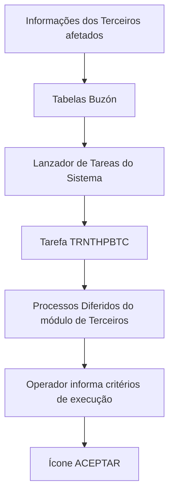

# Procedimento para Executar Processo Diferido Massivo de Terceiros no Sistema REEF

## 1. Metadados do Documento
- **Arquivo de Origem:** Não identificado no conteúdo fornecido
- **Tipo de Documento:** Procedimento
- **Domínio / Sistema:** REEF / módulo de Terceiros
- **Público-Alvo:** Operação, analistas funcionais e usuários do sistema
- **Data/Versão Identificada:** Não identificada

---

## 2. Resumo Executivo & Contexto de Negócio

O documento descreve o procedimento para executar um processo diferido massivo relacionado a Terceiros no Sistema REEF. O objetivo explicitamente declarado é orientar a execução de um processo diferido depois que as informações dos Terceiros afetados forem registradas nas diferentes Tabelas Buzón.

A execução ocorre por meio do Lanzador de Tareas do Sistema. O documento identifica a tarefa utilizada pelos Processos Diferidos do módulo de Terceiros pela chave `TRNTHPBTC`.

Para iniciar a tarefa `TRNTHPBTC`, o operador deve informar atributos ou critérios de execução. Os elementos citados incluem Código de Compañía, Fecha de Tratamiento, Identificador del Proceso Diferido, Orden, Volver a Procesar en caso de Error, Idioma, Usuario e Clave de Usuario.

Após o preenchimento dos critérios necessários, o procedimento termina com o acionamento do ícone **ACEPTAR**. O conteúdo fornecido não detalha os valores permitidos, formatos, obrigatoriedade, ordem operacional dos campos ou comportamento técnico do processamento.

---

## 3. Arquitetura, Componentes & Tecnologias Envolvidas

Os componentes explicitamente identificados são:

- **Sistema REEF:** Sistema no qual o processo é executado.
- **Módulo de Terceiros:** Módulo responsável pelos Processos Diferidos relacionados a Terceiros.
- **Tabelas Buzón:** Estruturas nas quais são detalhadas as informações dos Terceiros afetados antes da execução.
- **Lanzador de Tareas del Sistema:** Mecanismo utilizado para iniciar o processo diferido.
- **Tarefa `TRNTHPBTC`:** Chave da tarefa usada para executar Processos Diferidos do módulo de Terceiros.
- **Mapfredocument / DOCUMENTACIÓN Reef:** Referências de documentação presentes no conteúdo bruto.



> **Nota de Análise:** O documento não especifica interfaces, protocolos, APIs, bancos de dados, tecnologias de implementação, métodos HTTP, contratos de dados ou destinos do processamento executado pela tarefa `TRNTHPBTC`.

---

## 4. Regras de Negócio, Especificações Funcionais & Processos

### Processo operacional identificado

1. Detalhar as informações dos Terceiros afetados nas diferentes **Tabelas Buzón**.
2. Acessar o **Lanzador de Tareas del Sistema**.
3. Selecionar ou executar a tarefa cuja chave é `TRNTHPBTC`.
4. Informar os atributos ou critérios de execução apresentados para a tarefa.
5. Preencher, conforme aplicável, os campos:
   - Código de Compañía;
   - Fecha de Tratamiento;
   - Identificador del Proceso Diferido;
   - Orden;
   - Volver a Procesar en caso de Error;
   - Idioma;
   - Usuario;
   - Clave de Usuario.
6. Acionar o ícone **ACEPTAR** para concluir o lançamento da execução.

### Regras e restrições explicitamente sustentadas

- O processo deve ser executado **após** o detalhamento das informações dos Terceiros afetados nas Tabelas Buzón.
- Os Processos Diferidos do módulo de Terceiros são executados com a tarefa identificada pela chave `TRNTHPBTC`.
- O documento menciona a possibilidade de indicar se deve ocorrer novo processamento em caso de erro, por meio do critério **Volver a Procesar en caso de Error**.
- A confirmação final do procedimento é realizada pelo ícone **ACEPTAR**.

> **Nota de Análise:** O documento não define quais campos são obrigatórios, o significado operacional de `Orden`, os valores aceitos para `Idioma`, a semântica do Identificador del Proceso Diferido, nem o comportamento exato quando a opção de reprocessamento em caso de erro é utilizada.

---

## 5. Tabelas de Parâmetros, Ambientes e Estruturas de Dados

| Item / Parâmetro | Descrição / Função | Tipo / Valores / Formato | Ambiente / Observações |
| :--- | :--- | :--- | :--- |
| `TRNTHPBTC` | Chave da tarefa para execução dos Processos Diferidos do módulo de Terceiros. | Chave de tarefa. | Executada por meio do Lanzador de Tareas del Sistema. |
| Código de Compañía | Critério de execução listado para a tarefa. | Não especificado. | Aparece duas vezes no conteúdo extraído. |
| Fecha de Tratamiento | Critério de execução listado para a tarefa. | Data; formato não especificado. | Aparece duas vezes no conteúdo extraído. |
| Identificador del Proceso Diferido | Critério de execução relacionado ao processo diferido. | Não especificado. | O texto extraído apresenta caracteres corrompidos na palavra “Identificador”. |
| Orden | Critério de execução listado. | Não especificado. | Sem detalhamento funcional adicional. |
| Volver a Procesar en caso de Error | Critério que indica reprocessamento em caso de erro. | Não especificado. | Não há valores permitidos ou comportamento detalhado. |
| Idioma | Critério de execução listado. | Não especificado. | Aparece duas vezes no conteúdo extraído. |
| Usuario | Campo listado no encerramento do procedimento. | Não especificado. | Sem detalhamento adicional. |
| Clave de Usuario | Campo listado no encerramento do procedimento. | Não especificado. | Sem detalhamento adicional. |
| Tabelas Buzón | Estruturas que recebem as informações dos Terceiros afetados. | Estrutura de dados não detalhada. | Devem ser preenchidas antes da execução do processo. |
| Lanzador de Tareas del Sistema | Mecanismo de lançamento da tarefa. | Componente funcional do sistema. | Usado para iniciar o processo definido. |
| REEF | Sistema mencionado na documentação. | Sistema corporativo. | Referenciado como “DOCUMENTACIÓN Reef”. |

---

## 6. Bateria de Perguntas & Respostas para RAG (FAQ Sintético)

### P1: Qual é o objetivo do procedimento de execução de processo massivo de Terceiros?
**R:** O objetivo é conhecer o procedimento necessário para executar um processo diferido de Terceiros no Sistema REEF.

### P2: O que deve ser realizado antes de executar o processo diferido de Terceiros?
**R:** Antes da execução, as informações dos Terceiros afetados devem ser detalhadas nas diferentes Tabelas Buzón.

### P3: Qual componente do sistema é utilizado para iniciar o processo diferido?
**R:** A execução é iniciada pelo Lanzador de Tareas del Sistema.

### P4: Qual é a chave da tarefa que executa os Processos Diferidos do módulo de Terceiros?
**R:** A chave da tarefa é `TRNTHPBTC`.

### P5: Quais critérios de execução são citados para a tarefa `TRNTHPBTC`?
**R:** O documento cita Código de Compañía, Fecha de Tratamiento, Identificador del Proceso Diferido, Orden, Volver a Procesar en caso de Error, Idioma, Usuario e Clave de Usuario.

### P6: Como o procedimento é confirmado após informar os critérios de execução?
**R:** Após informar os critérios, o operador deve pressionar o ícone **ACEPTAR**.

### P7: O documento informa quais valores devem ser usados para Código de Compañía e Fecha de Tratamiento?
**R:** Não. O documento apenas lista Código de Compañía e Fecha de Tratamiento como atributos ou critérios de execução; ele não define valores válidos, formato de data ou regras de preenchimento.

### P8: O que significa a opção “Volver a Procesar en caso de Error”?
**R:** O documento a apresenta como um critério de execução relacionado ao reprocessamento em caso de erro. Não há detalhamento sobre seus valores, condições de ativação ou efeitos técnicos.

### P9: O documento especifica os métodos HTTP ou contratos JSON da tarefa `TRNTHPBTC`?
**R:** Não. O documento identifica a tarefa `TRNTHPBTC` e seus critérios de execução, mas não descreve APIs, métodos HTTP, contratos JSON ou integrações técnicas.

### P10: Existem ambientes, servidores, URLs ou rotas de log definidos no conteúdo fornecido?
**R:** Não. O conteúdo não apresenta mapeamentos de ambientes, servidores, URLs, portas, rotas de log ou parâmetros técnicos de infraestrutura.

---

## 7. Glossário de Termos, Siglas & Conceitos-Chave

- **ACEPTAR:** Ícone que deve ser pressionado ao final do procedimento de execução.
- **Clave de Usuario:** Campo denominado “chave de usuário” no conteúdo original.
- **Código de Compañía:** Critério de execução relacionado à companhia; sem definição adicional no documento.
- **Fecha de Tratamiento:** Critério de execução relacionado a uma data de tratamento; formato não informado.
- **Identificador del Proceso Diferido:** Critério associado à identificação do processo diferido; sem definição de formato ou valores.
- **Idioma:** Critério de execução referente ao idioma; valores não especificados.
- **Lanzador de Tareas:** Mecanismo do sistema usado para executar tarefas.
- **Orden:** Critério de execução citado sem detalhamento funcional.
- **Proceso Diferido:** Processo executado de forma diferida no módulo de Terceiros.
- **REEF:** Sistema citado nas referências de documentação.
- **Tabelas Buzón:** Tabelas que devem conter as informações dos Terceiros afetados antes do lançamento do processo.
- **Terceiros:** Entidade funcional tratada pelo módulo e pelo processo descrito.
- **`TRNTHPBTC`:** Chave da tarefa usada para executar Processos Diferidos do módulo de Terceiros.
- **Volver a Procesar en caso de Error:** Critério que se refere à possibilidade de reprocessar diante de erro.

---

## 8. Notas Críticas, Riscos & Limitações

- O texto extraído aparenta ter problemas de codificação em palavras como `denido` e `Identicador`, o que limita a auditoria literal de alguns trechos.
- Não foram identificados valores permitidos, formatos, tipos de campo ou obrigatoriedade dos critérios de execução.
- Não foram descritos mecanismos de autenticação, tratamento de credenciais, permissões, auditoria ou controle de acesso para `Usuario` e `Clave de Usuario`.
- Não há descrição do resultado esperado da execução, monitoramento da tarefa, consulta de status, logs, mensagens de erro ou estratégia de recuperação.
- Não há detalhamento sobre as Tabelas Buzón, incluindo nomes físicos, campos, regras de carga ou validações.
- Não foram identificados ambientes, servidores, URLs, APIs, integrações externas, tecnologias de implementação ou versões.
- A duplicidade de alguns campos no conteúdo extraído — Código de Compañía, Fecha de Tratamiento e Idioma — pode decorrer da própria estrutura visual do documento ou de falha de extração.

---

## 9. Conteúdo Bruto Estruturado (Referência Fiel)

```text
--- [PÁGINA 1 DE 2] ---

EJECUTAR Proceso Masivo TERCEROS
Objetivo
Conocer el procedimiento que se ha de seguir para ejecutar un proceso diferido de Terceros en el Sistema.
Ejecutar Proceso Diferido
Una vez se ha detallado la información de los Terceros afectados en las diferentes Tablas Buzón se tiene que ejecutar el proceso denido
mediante el Lanzador de Tareas del Sistema:
Los Procesos Diferidos del módulo de Terceros se ejecutan con la Tarea que tiene por clave: TRNTHPBTC, informando los siguientes
Atributos o criterios de ejecución...
Código de Compañía
Código de Compañía
Fecha de Tratamiento
Fecha de Tratamiento.
#### Identicador del Proceso Diferido
Orden
Volver a Procesar en caso de Error
Idioma
Idioma
Documentation / DOCUMENTACIÓN Reef
DOCUMENTACIÓN Reef
Mapfredocument
DOCUMENTACIÓN Reef
Owner
user:agonzalez_mapfre.com
Lifecycle
Approved Source
 / 
 VL
Buscar Inicio Soluciones Arquitecturas APIs Componentes Cloud Documentación Zeus Reef Ayuda
ES


--- [PÁGINA 2 DE 2] ---

Idioma
Usuario
Clave de Usuario
... y por último, se pulsa el icono ACEPTAR.
```
