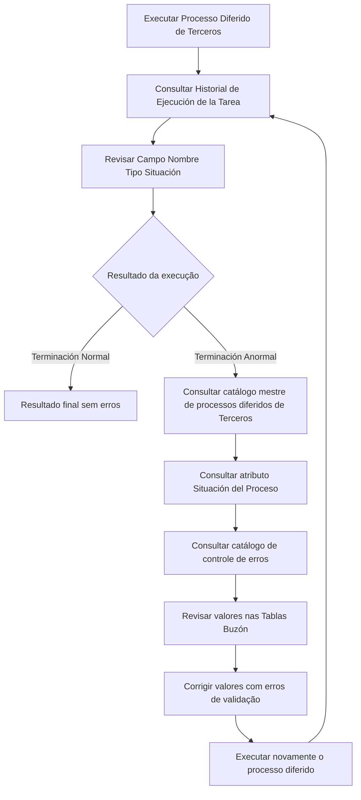

# Procedimento de Revisão do Processo Massivo Diferido de Terceros

## 1. Metadados do Documento
- **Arquivo de Origem:** `Não identificado — texto bruto fornecido`
- **Tipo de Documento:** `Procedimento`
- **Domínio / Sistema:** `Reef / Terceros / MAPFRE`
- **Público-Alvo:** `Operação e área de Tecnologia da empresa MAPFRE local`
- **Data/Versão Identificada:** `Não identificada`

---

## 2. Resumo Executivo & Contexto de Negócio

O documento descreve o procedimento para revisar o resultado da execução de um processo diferido massivo relacionado a **Terceros**. A verificação principal ocorre no **Historial de Ejecución de la Tarea**, com foco no campo denominado **Nombre Tipo Situación**.

O resultado esperado para uma execução sem erros é o valor **“Terminación Normal”**. Quando o processo apresentar o valor **“Terminación Anormal”**, o procedimento exige investigar a situação do processo no catálogo mestre de processos diferidos de Terceros e consultar o catálogo de controle de erros correspondente.

Após a identificação de erros, os valores registrados nas **Tablas Buzón** devem ser revisados e corrigidos quando as validações tiverem provocado falhas. O processo diferido deve então ser executado novamente, em aproximações sucessivas, até que seja obtido o resultado final.

A revisão do processo requer, no estado atual descrito pelo documento, a participação da área de Tecnologia da empresa MAPFRE local.

---

## 3. Arquitetura, Componentes & Tecnologias Envolvidas

Os elementos identificados no documento são:

- **Processo Massivo TERCEROS:** processo sujeito à revisão.
- **Processo Diferido:** processo cuja execução e resultado devem ser verificados.
- **Historial de Ejecución de la Tarea:** local de consulta do resultado da execução.
- **Campo Nombre Tipo Situación:** campo que indica a situação da execução.
- **Catálogo mestre de processos diferidos de Terceros:** fonte para consultar o atributo **Situación del Proceso**.
- **Catálogo de controle de erros dos processos diferidos de Terceros:** fonte para consultar detalhes de erros.
- **Tablas Buzón:** tabelas cujos valores devem ser revisados e corrigidos.
- **Área de Tecnologia da empresa MAPFRE local:** equipe cuja participação é necessária para a revisão.



> **Nota de Análise:** O documento não detalha métodos técnicos de execução, interfaces, tecnologias de persistência, contratos de integração, responsáveis específicos ou critérios de correção nas Tablas Buzón.

---

## 4. Regras de Negócio, Especificações Funcionais & Processos

1. O resultado do processo diferido deve ser comprovado após a execução.
2. A comprovação deve ser realizada no **Historial de Ejecución de la Tarea**.
3. A revisão deve incidir especificamente sobre o conteúdo do campo **Nombre Tipo Situación**.
4. Quando a execução terminar sem erros, o valor esperado no campo de situação é **“Terminación Normal”**.
5. Quando a execução terminar com erros, o valor apresentado é **“Terminación Anormal”**.
6. Diante de uma **“Terminación Anormal”**, deve-se acessar o catálogo mestre de processos diferidos de Terceros.
7. No catálogo mestre, deve-se verificar o valor do atributo **Situación del Proceso**.
8. Também deve ser consultado o detalhe disponível no catálogo de controle de erros dos processos diferidos de Terceros.
9. Os valores informados nas **Tablas Buzón** devem ser revisados.
10. Valores cujas validações tenham provocado erros devem ser corrigidos.
11. Após as correções, o processo diferido deve ser executado novamente.
12. A reexecução deve ocorrer por aproximações sucessivas até alcançar o resultado final.
13. A revisão do processo deve contar com a participação da área de Tecnologia da empresa MAPFRE local.

---

## 5. Tabelas de Parâmetros, Ambientes e Estruturas de Dados

| Item / Parâmetro | Descrição / Função | Tipo / Valores / Formato | Ambiente / Observações |
| :--- | :--- | :--- | :--- |
| Processo Massivo TERCEROS | Processo que deve ser revisado. | Não detalhado. | Relacionado ao domínio Terceros. |
| Processo Diferido | Processo executado e reexecutado durante a revisão. | Não detalhado. | Deve ser executado novamente após correções. |
| Historial de Ejecución de la Tarea | Local para comprovar o resultado da execução. | Registro de histórico. | Deve ser consultado após a execução. |
| Campo Nombre Tipo Situación | Campo específico a ser revisado no histórico de execução. | Situação textual. | Indica terminação normal ou anormal. |
| Terminación Normal | Resultado de execução concluída sem erros. | Valor textual. | Resultado esperado sem falhas. |
| Terminación Anormal | Resultado de execução concluída com erros. | Valor textual. | Exige investigação e correção. |
| Situación del Proceso | Atributo consultado no catálogo mestre de processos diferidos de Terceros. | Não detalhado. | Consultado após terminação anormal. |
| Catálogo de controle de erros | Fonte de detalhes sobre erros dos processos diferidos de Terceros. | Catálogo. | Consultado após terminação anormal. |
| Tablas Buzón | Tabelas cujos valores devem ser revisados e eventualmente corrigidos. | Valores não detalhados. | Corrigir valores afetados por validações com erro. |
| Área de Tecnologia MAPFRE local | Área cuja participação é necessária na revisão. | Equipe organizacional. | Participação explicitamente requerida. |

---

## 6. Bateria de Perguntas & Respostas para RAG (FAQ Sintético)

### P1: Onde deve ser verificado o resultado da execução do processo diferido de Terceros?
**R:** O resultado deve ser verificado no **Historial de Ejecución de la Tarea**, especificamente no conteúdo do campo **Nombre Tipo Situación**.

### P2: Qual valor indica que o processo diferido foi concluído sem erros?
**R:** O valor **“Terminación Normal”** indica que a execução do processo diferido terminou sem erros.

### P3: O que significa o resultado “Terminación Anormal”?
**R:** O valor **“Terminación Anormal”** indica que a execução do processo diferido terminou com erros e exige análise adicional.

### P4: Qual é o procedimento após identificar “Terminación Anormal”?
**R:** Deve-se acessar o catálogo mestre de processos diferidos de Terceros para consultar o atributo **Situación del Proceso** e verificar o detalhe no catálogo de controle de erros dos processos diferidos de Terceros.

### P5: O que deve ser analisado no catálogo mestre de processos diferidos de Terceros?
**R:** Deve ser analisado o valor do atributo **Situación del Proceso**.

### P6: O que deve ser feito com valores das Tablas Buzón que provocaram erros de validação?
**R:** Os valores informados nas **Tablas Buzón** devem ser revisados e aqueles cujas validações tenham provocado erros devem ser corrigidos.

### P7: O processo diferido deve ser executado novamente após a correção dos erros?
**R:** Sim. Após corrigir os valores nas Tablas Buzón, o processo diferido deve ser executado novamente para alcançar o resultado final.

### P8: Como deve ocorrer a reexecução do processo diferido?
**R:** A reexecução deve ocorrer por meio de **aproximações sucessivas**, repetindo a execução e a validação até obter o resultado final.

### P9: Qual equipe deve participar da revisão do processo?
**R:** A revisão deve ser realizada com a participação da área de Tecnologia da empresa **MAPFRE local**.

### P10: O documento informa quais validações específicas causam erros nas Tablas Buzón?
**R:** Não. O documento determina a revisão e correção dos valores cujas validações provocaram erros, mas não detalha as regras de validação nem os campos envolvidos.

---

## 7. Glossário de Termos, Siglas & Conceitos-Chave

- **Terceros:** domínio mencionado nos catálogos e no processo massivo; o documento não apresenta definição adicional.
- **Proceso Diferido:** processo cuja execução é revisada e, quando necessário, repetida.
- **Historial de Ejecución de la Tarea:** histórico usado para consultar o resultado da execução de uma tarefa.
- **Nombre Tipo Situación:** campo cujo conteúdo deve ser revisado no histórico de execução.
- **Terminación Normal:** situação que representa uma execução concluída sem erros.
- **Terminación Anormal:** situação que representa uma execução concluída com erros.
- **Situación del Proceso:** atributo consultado no catálogo mestre de processos diferidos de Terceros.
- **Tablas Buzón:** tabelas cujos valores devem ser revisados e corrigidos em caso de erros de validação.
- **MAPFRE:** empresa citada como responsável pela participação da área local de Tecnologia.
- **Reef:** termo presente na área de documentação; o documento não fornece uma definição funcional ou técnica.

---

## 8. Notas Críticas, Riscos & Limitações

- O documento não especifica os critérios técnicos que levam a **“Terminación Anormal”**.
- O documento não detalha a estrutura, os campos ou os mecanismos de correção das **Tablas Buzón**.
- Não são descritos prazos, responsáveis nominais, níveis de escalonamento ou procedimentos de aprovação para correções.
- A revisão depende da participação da área de Tecnologia da empresa MAPFRE local.
- Não há detalhamento de métodos HTTP, contratos JSON, bancos de dados, URLs, ambientes, logs ou integrações técnicas.
- O processo pode exigir múltiplas reexecuções por aproximações sucessivas, o que representa dependência operacional até alcançar o resultado final.

---

## 9. Conteúdo Bruto Estruturado (Referência Fiel)

```text
--- [PÁGINA 1 DE 1] ---

REVISAR Proceso Masivo TERCEROS
Revisar el Resultado de la Ejecución del Proceso Diferido
Una vez ejecutado el proceso se tiene que comprobar el resultado en el Historial de Ejecución de la Tarea: Especícamente revisar el
contenido del Campo Nombre Tipo Situación.
Si la ejecución ha terminado sin errores su valor será “Terminación Normal”, mientras que en caso contrario mostrará "Terminación
Anormal". En este caso se debe acceder al catálogo maestro de procesos diferidos de Terceros para conocer el valor del Atributo Situación
del Proceso además del detalle en el catálogo de control de errores de los procesos diferidos de Terceros.
Se deberán revisar los valores informados en las Tablas Buzón y corregir aquellos cuyas validaciones hayan provocado errores.
Tras ello se tendrá que ejecutar nuevamente el proceso diferido para llegar a su resultado nal mediante la ejecución de aproximaciones
sucesivas.
NOTA: La revisión del Proceso, hoy por hoy, se tiene que realizar con la participación del área de Tecnología de la empresa MAPFRE local.
Documentation / DOCUMENTACIÓN Reef
DOCUMENTACIÓN Reef
Mapfredocument
DOCUMENTACIÓN Reef
Owner
user:agonzalez_mapfre.com
Lifecycle
Approved Source
 /
 VL
Buscar Inicio Soluciones Arquitecturas APIs Componentes Cloud Documentación Zeus Reef Ayuda
ES
```
