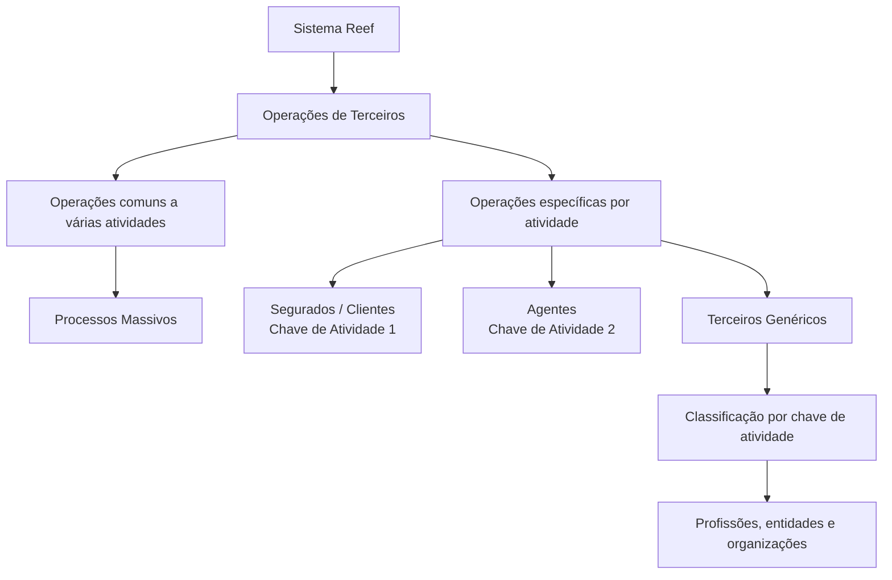
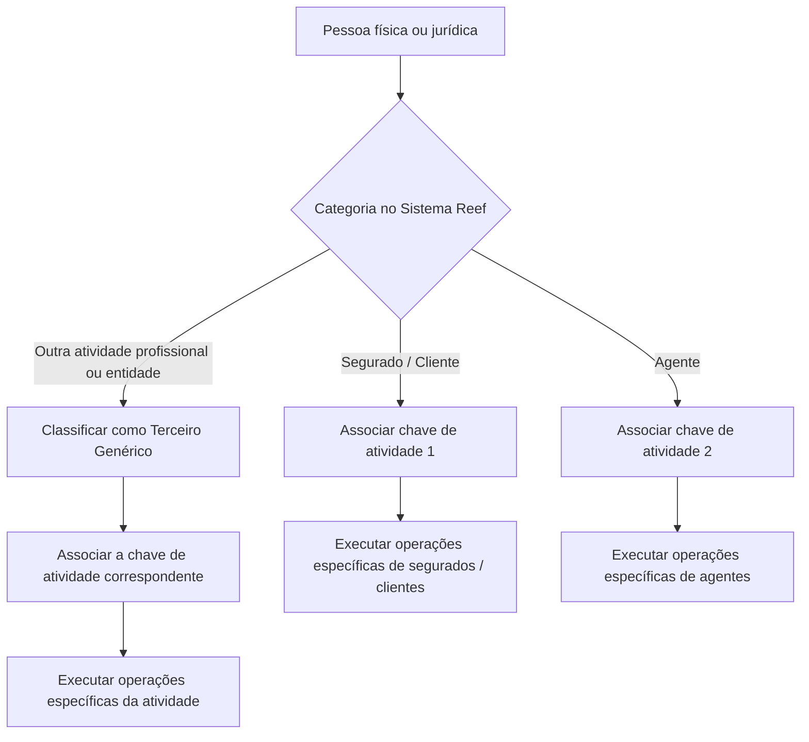

# Formação de Operações de Terceiros no Sistema Reef

## 1. Metadados do Documento
- **Arquivo de Origem:** Não identificado no conteúdo fornecido
- **Tipo de Documento:** Procedimento / Material de formação operacional
- **Domínio / Sistema:** Operações de Terceiros; Sistema Reef; Mapfredocument
- **Público-Alvo:** Operação, negócio e usuários responsáveis por atividades de terceiros
- **Data/Versão Identificada:** Não identificada

---

## 2. Resumo Executivo & Contexto de Negócio

O documento apresenta uma formação orientada às operações de terceiros contempladas no Sistema Reef. No contexto apresentado, pessoas físicas e pessoas jurídicas são tratadas como sinônimos de “Terceiros”, e esses termos podem ser utilizados indistintamente na documentação.

A estrutura funcional separa operações comuns a diversas atividades de terceiros das operações específicas de cada atividade. As operações comuns podem afetar duas ou mais atividades de terceiros e incluem a categoria de processos massivos.

O Sistema Reef identifica segurados ou clientes por meio da chave de atividade `1` e agentes por meio da chave de atividade `2`. Para as demais pessoas físicas ou jurídicas que exercem determinadas atividades profissionais, o documento estabelece a categoria de “Terceros Genéricos”.

A classificação de terceiros genéricos é baseada em uma chave de atividade numérica. O conteúdo disponibilizado relaciona diversas chaves a profissões, organizações ou tipos de entidades, como peritos, médicos, fornecedores, oficinas, clínicas, tribunais, depósitos e representantes legais.

---

## 3. Arquitetura, Componentes & Tecnologias Envolvidas

Os elementos explicitamente citados são:

| Componente / Termo | Papel identificado no documento |
| :--- | :--- |
| Sistema Reef | Sistema que contempla as operações de terceiros e identifica atividades por chave. |
| DOCUMENTACIÓN Reef | Área ou referência documental citada no conteúdo. |
| Mapfredocument | Repositório, ferramenta ou contexto documental mencionado no cabeçalho extraído. |
| Terceiros | Pessoas físicas ou jurídicas envolvidas nas atividades classificadas pelo Sistema Reef. |
| Segurados / Clientes | Categoria identificada pela chave de atividade `1`. |
| Agentes | Categoria identificada pela chave de atividade `2`. |
| Terceiros Genéricos | Pessoas físicas ou jurídicas classificadas em atividades profissionais específicas. |
| Processos Massivos | Categoria de operações comuns a várias atividades de terceiros. |



**Nota de Análise:** O conteúdo não descreve arquitetura de infraestrutura, APIs, métodos HTTP, contratos JSON, bancos de dados, servidores, URLs, portas ou integrações técnicas entre o Sistema Reef e o Mapfredocument.

---

## 4. Regras de Negócio, Especificações Funcionais & Processos

### 4.1 Definição de Terceiros

1. As operações de terceiros são as operações próprias ou particulares de cada atividade de terceiros contemplada no Sistema Reef.
2. Pessoas físicas e pessoas jurídicas são sinônimos de terceiros no contexto documental apresentado.
3. Os termos “pessoas físicas”, “pessoas jurídicas” e “terceiros” podem ser utilizados indistintamente na redação dos documentos.

### 4.2 Segmentação das Operações

1. Existem operações comuns a várias atividades de terceiros.
2. Uma operação comum pode afetar ou concernir a duas ou mais atividades de terceiros.
3. O documento identifica “Processos Masivos” como categoria dentro das operações comuns a várias atividades de terceiros.
4. Existem operações específicas para segurados ou clientes.
5. Existem operações específicas para agentes.
6. Existem operações específicas para terceiros genéricos.

### 4.3 Identificação por Chave de Atividade

1. O Sistema Reef identifica segurados ou clientes usando a chave de atividade `1`.
2. O Sistema Reef identifica agentes usando a chave de atividade `2`.
3. O Sistema Reef considera como terceiros genéricos as pessoas físicas ou jurídicas cujas atividades laborais correspondem às profissões ou entidades relacionadas na tabela de chaves de atividade.
4. Cada terceiro genérico deve ser associado à chave de atividade correspondente à sua profissão, entidade ou categoria indicada no documento.

### 4.4 Fluxo Conceitual de Classificação



**Nota de Análise:** O documento não detalha os passos operacionais executados após a classificação, critérios de alteração de chave, responsáveis pela manutenção cadastral ou regras de validação da chave de atividade.

---

## 5. Tabelas de Parâmetros, Ambientes e Estruturas de Dados

### 5.1 Categorias Principais de Terceiros

| Item / Parâmetro | Descrição / Função | Tipo / Valores / Formato | Ambiente / Observações |
| :--- | :--- | :--- | :--- |
| Terceiros | Termo utilizado para pessoas físicas e pessoas jurídicas. | Categoria conceitual. | Os termos podem ser utilizados indistintamente. |
| Segurados / Clientes | Categoria de terceiros identificada pelo Sistema Reef. | Chave de atividade `1`. | O documento menciona operações específicas para essa categoria. |
| Agentes | Categoria de terceiros identificada pelo Sistema Reef. | Chave de atividade `2`. | O documento menciona operações específicas para essa categoria. |
| Terceiros Genéricos | Pessoas físicas ou jurídicas cujas atividades correspondem às profissões e entidades listadas. | Chaves numéricas de atividade. | Abrange categorias a partir da chave `3`, conforme conteúdo fornecido. |
| Operações comuns | Operações que afetam duas ou mais atividades de terceiros. | Categoria operacional. | Inclui processos massivos. |
| Processos Massivos | Categoria citada entre as operações comuns a várias atividades. | Processo operacional. | Não há detalhamento adicional. |

### 5.2 Chaves de Atividade de Terceiros Genéricos

| Item / Parâmetro | Descrição / Função | Tipo / Valores / Formato | Ambiente / Observações |
| :--- | :--- | :--- | :--- |
| Chave de Atividade `3` | Peritos. | Código numérico. | Terceiro Genérico. |
| Chave de Atividade `4` | Inspetores. | Código numérico. | Terceiro Genérico. |
| Chave de Atividade `5` | Médicos. | Código numérico. | Terceiro Genérico. |
| Chave de Atividade `6` | Advogados. | Código numérico. | Terceiro Genérico. |
| Chave de Atividade `7` | Procuradores. | Código numérico. | Terceiro Genérico. |
| Chave de Atividade `10` | Fornecedores. | Código numérico. | Terceiro Genérico. |
| Chave de Atividade `11` | Executivos de Conta. | Código numérico. | Terceiro Genérico. |
| Chave de Atividade `12` | Cobradores. | Código numérico. | Terceiro Genérico. |
| Chave de Atividade `15` | Empregados. | Código numérico. | Terceiro Genérico. |
| Chave de Atividade `17` | Oficinas. | Código numérico. | Terceiro Genérico. |
| Chave de Atividade `18` | Clínicas. | Código numérico. | Terceiro Genérico. |
| Chave de Atividade `19` | Juizados. | Código numérico. | Terceiro Genérico. |
| Chave de Atividade `20` | Vidraceiros. | Código numérico. | Terceiro Genérico. |
| Chave de Atividade `21` | Chaveiros. | Código numérico. | Terceiro Genérico. |
| Chave de Atividade `22` | Encanadores. | Código numérico. | Terceiro Genérico. |
| Chave de Atividade `23` | Eletricistas. | Código numérico. | Terceiro Genérico. |
| Chave de Atividade `24` | Guinchos. | Código numérico. | Terceiro Genérico. |
| Chave de Atividade `25` | Investigadores. | Código numérico. | Terceiro Genérico. |
| Chave de Atividade `26` | Recuperadores. | Código numérico. | Terceiro Genérico. |
| Chave de Atividade `27` | Reguladores. | Código numérico. | Terceiro Genérico. |
| Chave de Atividade `28` | Ferreiros. | Código numérico. | Terceiro Genérico. |
| Chave de Atividade `29` | Tribunais. | Código numérico. | Terceiro Genérico. |
| Chave de Atividade `30` | Terceiros do Seguro MOTOR. | Código numérico. | Terceiro Genérico. |
| Chave de Atividade `31` | Terceiros do Seguro SALUD. | Código numérico. | Terceiro Genérico. |
| Chave de Atividade `32` | Terceiros do Seguro PATRIMONIALES. | Código numérico. | Terceiro Genérico. |
| Chave de Atividade `33` | Depósitos. | Código numérico. | Terceiro Genérico. |
| Chave de Atividade `34` | Cartórios. | Código numérico. | Terceiro Genérico. |
| Chave de Atividade `35` | Centros de Peritagem. | Código numérico. | Terceiro Genérico. |
| Chave de Atividade `36` | Delegacias. | Código numérico. | Terceiro Genérico. |
| Chave de Atividade `38` | Filial. | Código numérico. | Terceiro Genérico. |
| Chave de Atividade `45` | Representantes Legais. | Código numérico. | Terceiro Genérico. |

---

## 6. Bateria de Perguntas & Respostas para RAG (FAQ Sintético)

### P1: O que são terceiros no contexto do Sistema Reef?
**R:** No contexto do Sistema Reef, terceiros são pessoas físicas ou pessoas jurídicas. O documento estabelece que esses termos são sinônimos e podem ser usados indistintamente na documentação.

### P2: Como o Sistema Reef identifica segurados ou clientes?
**R:** O Sistema Reef identifica segurados ou clientes por meio da chave de atividade `1`.

### P3: Qual chave de atividade deve ser usada para agentes?
**R:** Agentes devem ser identificados no Sistema Reef pela chave de atividade `2`.

### P4: O que caracteriza uma operação comum a várias atividades de terceiros?
**R:** Uma operação comum a várias atividades de terceiros é uma operação que afeta ou concerne a duas ou mais atividades de terceiros, não ficando restrita a uma atividade específica.

### P5: O que são processos massivos no documento?
**R:** Processos massivos são citados como uma categoria de operações comuns a várias atividades de terceiros. O conteúdo fornecido não detalha quais operações compõem esses processos nem como são executados.

### P6: Quem é classificado como terceiro genérico?
**R:** Terceiros genéricos são pessoas físicas ou jurídicas cujas atividades laborais correspondem às profissões, entidades ou categorias relacionadas na tabela de chaves de atividade, como peritos, médicos, fornecedores, oficinas, clínicas e representantes legais.

### P7: Qual é a chave de atividade para médicos?
**R:** Médicos são classificados como terceiros genéricos com a chave de atividade `5`.

### P8: Qual chave deve ser atribuída a fornecedores?
**R:** Fornecedores devem ser classificados com a chave de atividade `10`.

### P9: Como são classificados os terceiros relacionados ao seguro MOTOR?
**R:** Os terceiros relacionados ao seguro MOTOR são classificados pela chave de atividade `30`, descrita como “Terceros Seg. MOTOR”.

### P10: Quais são as chaves para terceiros relacionados aos seguros SALUD e PATRIMONIALES?
**R:** Terceiros relacionados ao seguro SALUD usam a chave `31`, enquanto terceiros relacionados ao seguro PATRIMONIALES usam a chave `32`.

### P11: Qual chave corresponde a oficinas?
**R:** Oficinas são classificadas como terceiros genéricos pela chave de atividade `17`.

### P12: O documento especifica APIs ou contratos técnicos para operações de terceiros?
**R:** Não. O documento apresenta a classificação operacional de terceiros por chave de atividade, mas não detalha APIs, métodos HTTP, contratos JSON, URLs, portas, bancos de dados ou integrações técnicas.

---

## 7. Glossário de Termos, Siglas & Conceitos-Chave

- **Sistema Reef:** Sistema citado como responsável por contemplar operações de terceiros e identificar categorias por chave de atividade.
- **Terceiros:** Pessoas físicas ou jurídicas consideradas no contexto operacional do Sistema Reef.
- **Terceiros Genéricos:** Pessoas físicas ou jurídicas associadas a profissões, organizações ou categorias listadas por chave de atividade.
- **Chave de Atividade:** Código numérico utilizado pelo Sistema Reef para identificar a categoria ou atividade de um terceiro.
- **Processos Massivos:** Categoria de operações comuns a várias atividades de terceiros; não detalhada no conteúdo fornecido.
- **Mapfredocument:** Termo citado no cabeçalho de documentação; sua função específica não é detalhada no conteúdo.
- **MOTOR:** Designação utilizada para a categoria “Terceros Seg. MOTOR”.
- **SALUD:** Designação utilizada para a categoria “Terceros Seg. SALUD”.
- **PATRIMONIALES:** Designação utilizada para a categoria “Terceros Seg. PATRIMONIALES”.

---

## 8. Notas Críticas, Riscos & Limitações

- O nome do arquivo de origem, a data e a versão do documento não foram identificados no conteúdo fornecido.
- A terceira página termina com `... ...`; portanto, a tabela de chaves de atividade pode estar incompleta.
- O conteúdo contém indícios de extração com problema de codificação, como `Especíca` e `identica`.
- Não há detalhamento de fluxos operacionais, permissões, validações cadastrais, responsáveis, SLAs ou procedimentos de exceção.
- Não há descrição de interfaces, APIs, integrações, ambientes, rotas de logs, servidores, URLs ou tecnologias de implementação.
- **Nota de Análise:** O documento lista a classificação de terceiros e operações por categoria, mas não detalha os métodos operacionais executados para cada chave de atividade.

---

## 9. Conteúdo Bruto Estruturado (Referência Fiel)

```text
--- [PÁGINA 1 DE 3] ---

FORMACIÓN OPERACIONES de TERCEROS
Formación orientada a las Operaciones propias o particulares de cada una de las Actividades de Terceros contempladas en el Sistema.
Las personas físicas y jurídicas son sinónimos de Terceros por lo que en la redacción de los documentos se utilizarán estos términos
indistintamente.
Operaciones COMUNES a Varias Actividades de Terceros
Las siguientes operaciones atañen y conciernen no solamente a una Actividad Especíca sino a 2 o más Actividades de los Terceros.
Procesos Masivos
Operaciones especícas de Asegurados/Clientes
El Sistema identica a los Asegurados con la Clave de Actividad... 1.
Operaciones especícas de Agentes
El Sistema identica a los Agentes con la Clave de Actividad... 2.
Operaciones especícas de Terceros Genéricos
En el Sistema se consideran "Terceros Genéricos" todas aquellas personas físicas o jurídicas cuyas actividades laborales se corresponden
con las siguientes profesiones...
Clave Actividad Descripción
3 Peritos
4 Inspectores
5 Médicos
6 Abogados
7 Procuradores
Documentation / DOCUMENTACIÓN Reef
DOCUMENTACIÓN Reef
Mapfredocument
DOCUMENTACIÓN Reef
Owner
user:agonzalez_mapfre.com
Lifecycle
Approved Source
 /
VL
Buscar Inicio Soluciones Arquitecturas APIs Componentes Cloud Documentación Zeus Reef Ayuda
ES

--- [PÁGINA 2 DE 3] ---

Clave Actividad Descripción
10 Proveedores
11 Ejecutivos de Cta.
12 Cobradores
15 Empleados
17 Talleres
18 Clínicas
19 Juzgados
20 Cristaleros
21 Cerrajeros
22 Plomeros
23 Electricistas
24 Grúas
25 Investigadores
26 Recuperadores
27 Ajustadores
28 Herreros
29 Tribunales
30 Terceros Seg. MOTOR
31 Terceros Seg. SALUD
32 Terceros Seg. PATRIMONIALES
33 Depósitos
34 Notarías
35 Centros de Peritación
36 Comisarías
38 Filial
45 Representantes Legales

--- [PÁGINA 3 DE 3] ---

Clave Actividad Descripción
... ...
```
