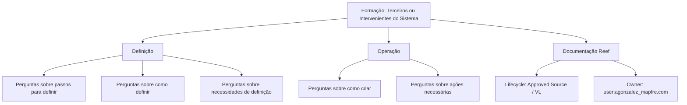

# Formação de Terceiros ou Intervenientes no Sistema — Documentação Reef

## 1. Metadados do Documento
- **Arquivo de Origem:** Não identificado no conteúdo fornecido
- **Tipo de Documento:** Manual Operacional / Material de Formação
- **Domínio / Sistema:** Módulo de Terceiros ou Intervenientes do Sistema; documentação Reef
- **Público-Alvo:** Usuários do módulo, operação e equipes que necessitam definir ou criar entidades no sistema
- **Data/Versão Identificada:** Não identificada

---

## 2. Resumo Executivo & Contexto de Negócio

O conteúdo apresenta uma formação relativa ao módulo de **Terceiros ou Intervenientes do Sistema**. A formação está organizada em dois grandes blocos: **Definição** e **Operação**.

O bloco de **Definição** é destinado a orientar perguntas sobre os passos necessários para definir elementos no módulo, incluindo dúvidas como “que passos devo seguir para poder definir” e “como se define”. O conteúdo também indica suporte a situações iniciadas por necessidades do usuário, como “o que devo fazer se necessito”.

O bloco de **Operação** é destinado a dúvidas práticas de uso do módulo. Os exemplos apresentados incluem perguntas sobre como criar entidades e quais ações executar para realizar determinadas operações.

O documento está associado à documentação Reef, incluindo referências a “Documentation / DOCUMENTACIÓN Reef”, “Mapfredocument” e um registro de propriedade identificado como `user:agonzalez_mapfre.com`. O conteúdo fornecido não detalha telas, regras específicas, contratos técnicos, APIs, modelos de dados ou procedimentos passo a passo.

---

## 3. Arquitetura, Componentes & Tecnologias Envolvidas

Os elementos identificados no conteúdo são:

| Componente / Elemento | Papel identificado no conteúdo |
| :--- | :--- |
| Módulo de Terceiros ou Intervenientes | Escopo funcional da formação apresentada. |
| Definição | Seção de formação voltada a dúvidas sobre definir elementos e passos necessários. |
| Operação | Seção de formação voltada a criação e execução de ações no módulo. |
| Documentação Reef | Contexto documental citado no rodapé/navegação. |
| Mapfredocument | Termo exibido no conteúdo de documentação. |
| Zeus | Item citado na navegação documental. |
| Soluções, Arquiteturas, APIs, Componentes, Cloud | Categorias ou itens de navegação exibidos. |
| `user:agonzalez_mapfre.com` | Proprietário identificado no conteúdo. |
| Lifecycle: Approved Source | Estado de ciclo de vida exibido no conteúdo. |
| VL | Valor exibido junto ao estado de ciclo de vida, sem detalhamento adicional. |



> **Nota de Análise:** O conteúdo fornecido não descreve uma arquitetura de software, integrações, microsserviços, tecnologias de implementação, URLs de ambiente, métodos HTTP ou contratos de API.

---

## 4. Regras de Negócio, Especificações Funcionais & Processos

### Organização funcional da formação

A formação relativa ao módulo de Terceiros ou Intervenientes está dividida nos seguintes apartados:

1. **Definição**
2. **Operação**

### Escopo da seção Definição

A seção **Definição** busca responder perguntas relacionadas à configuração ou definição de elementos no módulo, incluindo:

- Quais passos devem ser seguidos para poder definir algo.
- Como um elemento deve ser definido.
- Quais ações devem ser tomadas quando existir uma necessidade de definição.

### Escopo da seção Operação

A seção **Operação** busca responder perguntas relacionadas ao uso prático do módulo, incluindo:

- Como criar elementos.
- O que fazer para realizar uma ação.

> **Nota de Análise:** O documento não identifica quais entidades podem ser definidas ou criadas, nem apresenta critérios de validação, permissões, campos obrigatórios, cálculos, estados de processo ou exceções operacionais.

---

## 5. Tabelas de Parâmetros, Ambientes e Estruturas de Dados

| Item / Parâmetro | Descrição / Função | Tipo / Valores / Formato | Ambiente / Observações |
| :--- | :--- | :--- | :--- |
| Módulo de Terceiros ou Intervenientes | Escopo da formação apresentada. | Módulo funcional do sistema. | Não detalhado. |
| Definição | Apartado de formação para dúvidas sobre definir elementos. | Seção funcional. | Não detalha procedimentos. |
| Operação | Apartado de formação para dúvidas de criação e execução de ações. | Seção funcional. | Não detalha procedimentos. |
| Owner | Proprietário exibido na documentação. | `user:agonzalez_mapfre.com` | Valor literal extraído do conteúdo. |
| Lifecycle | Estado de ciclo de vida exibido. | `Approved Source` | Não há definição do ciclo de vida. |
| Valor complementar de Lifecycle | Texto exibido após o ciclo de vida. | `VL` | Significado não informado. |
| Idioma | Idioma exibido na navegação. | `ES` | Conteúdo principal em espanhol. |
| Navegação documental | Opções exibidas na interface de documentação. | Buscar, Inicio, Soluciones, Arquitecturas, APIs, Componentes, Cloud, Documentación, Zeus, Reef, Ayuda | Não são descritas como componentes técnicos. |

> **Nota de Análise:** Não foram fornecidos parâmetros técnicos, configurações de ambiente, servidores, caminhos de log, variáveis, modelos de dados ou URLs.

---

## 6. Bateria de Perguntas & Respostas para RAG (FAQ Sintético)

### P1: Qual é o objetivo da formação sobre Terceiros ou Intervenientes?
**R:** A formação é relativa ao módulo de Terceiros ou Intervenientes do Sistema e está organizada para responder dúvidas de Definição e Operação.

### P2: Quais são as divisões principais da formação do módulo de Terceiros ou Intervenientes?
**R:** A formação está dividida em dois apartados: **Definição** e **Operação**.

### P3: Que tipo de perguntas a seção Definição busca responder?
**R:** A seção Definição busca responder perguntas sobre os passos necessários para definir algo, sobre como algo é definido e sobre o que deve ser feito quando existe uma necessidade de definição.

### P4: A documentação explica os passos detalhados para definir elementos no módulo?
**R:** Não. O conteúdo apresenta exemplos de perguntas que a seção Definição deve responder, mas não fornece os passos detalhados, telas, campos ou critérios necessários para executar uma definição.

### P5: Que tipo de perguntas a seção Operação busca responder?
**R:** A seção Operação busca responder perguntas práticas, como “Como posso criar?” e “O que faço para poder fazer?”.

### P6: O documento informa quais entidades podem ser criadas no módulo de Terceiros ou Intervenientes?
**R:** Não. O conteúdo menciona a necessidade de responder como criar elementos, mas não identifica quais entidades, registros ou objetos podem ser criados.

### P7: Quem é o proprietário identificado na documentação?
**R:** O proprietário exibido no conteúdo é `user:agonzalez_mapfre.com`.

### P8: Qual é o estado de ciclo de vida indicado para a documentação?
**R:** O conteúdo apresenta o ciclo de vida como `Approved Source / VL`. O significado de `VL` não é detalhado.

### P9: O documento contém especificações de APIs ou contratos JSON?
**R:** Não. Embora “APIs” apareça na navegação documental, o conteúdo fornecido não descreve endpoints, métodos HTTP, payloads, autenticação ou contratos JSON.

### P10: Há informações sobre arquitetura, microsserviços ou infraestrutura?
**R:** Não. O conteúdo não apresenta componentes de arquitetura de software, microsserviços, servidores, bancos de dados, ambientes ou fluxos de integração.

---

## 7. Glossário de Termos, Siglas & Conceitos-Chave

- **Terceiros:** Termo usado para identificar o módulo de Terceiros ou Intervenientes do Sistema.
- **Intervenientes:** Termo apresentado como alternativa ou associação a Terceiros no nome do módulo.
- **Definição:** Seção da formação destinada a dúvidas sobre definir elementos e os passos necessários.
- **Operação:** Seção da formação destinada a dúvidas práticas, como criar ou executar ações.
- **Reef:** Nome citado no contexto da documentação.
- **Mapfredocument:** Termo exibido no conteúdo documental, sem definição adicional.
- **Lifecycle:** Campo exibido como ciclo de vida da documentação.
- **Approved Source:** Valor de ciclo de vida exibido no documento.
- **VL:** Sigla ou valor exibido junto ao ciclo de vida; significado não informado.
- **Zeus:** Termo exibido na navegação da documentação, sem definição adicional.

---

## 8. Notas Críticas, Riscos & Limitações

- O conteúdo fornecido é resumido e não contém instruções operacionais detalhadas.
- Não há descrição de entidades de negócio, campos, formulários, regras de validação ou permissões.
- Não foram identificados fluxos de exceção, responsabilidades por equipe ou dependências externas.
- Não há detalhes sobre APIs, integrações, ambientes, infraestrutura, logs ou mecanismos de segurança.
- O termo `VL` é apresentado sem expansão ou explicação.
- Os termos Reef, Mapfredocument e Zeus são mencionados, porém o conteúdo não explica suas funções ou relações técnicas.
- **Nota de Análise:** O documento lista o módulo de Terceiros ou Intervenientes, porém não detalha operações concretas, métodos, contratos, telas ou dados tratados pelo módulo.

---

## 9. Conteúdo Bruto Estruturado (Referência Fiel)

```text
--- [PÁGINA 1 DE 1] ---

FORMACIÓN TERCEROS
 En este apartado se encuentra la formación relativa al módulo de Terceros o Intervinientes del Sistema. Dicha formación está
dividida en los apartados siguientes:
Denición
Operación
DEFINICIÓN
Conseguir respuestas a preguntas como:
¿Qué pasos he de seguir para poder denir...?
¿Cómo se dene...?
¿Qué he de hacer si necesito...?
...
OPERACIÓN
Obtener respuestas a preguntas:
¿Cómo puedo crear...?
¿Qué hago para poder hacer...?
...
Documentation / DOCUMENTACIÓN Reef
DOCUMENTACIÓN Reef
Mapfredocument
DOCUMENTACIÓN Reef
Owner
user:agonzalez_mapfre.com
Lifecycle
Approved Source
 / 
 VL
Buscar Inicio Soluciones Arquitecturas APIs Componentes Cloud Documentación Zeus Reef Ayuda
ES
```
