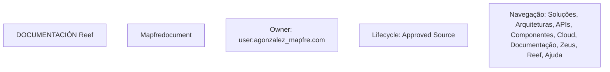

# Formação de Operação de Emissão — Processos Massivos (Comum)

## 1. Metadados do Documento
- **Arquivo de Origem:** `Não identificado no conteúdo extraído`
- **Tipo de Documento:** `Procedimento`
- **Domínio / Sistema:** `Reef / Mapfre`
- **Público-Alvo:** `Operação`
- **Data/Versão Identificada:** `Não identificada`

---

## 2. Resumo Executivo & Contexto de Negócio

O conteúdo extraído apresenta uma formação de operação de emissão voltada a **processos massivos**, identificada como material de uso comum. O documento inclui como conteúdo formativo a questão “¿Cómo puedo crear un proceso masivo?”, indicando foco na criação de processos massivos.

O material referencia a documentação do sistema **Reef**, incluindo os termos “Documentation / DOCUMENTACIÓN Reef” e “DOCUMENTACIÓN Reef”. A navegação exibida sugere que a documentação Reef disponibiliza acesso a áreas como Soluções, Arquiteturas, APIs, Componentes, Cloud, Documentação, Zeus, Reef e Ajuda.

O conteúdo também apresenta uma referência a **Mapfredocument**, além de metadados de documentação contendo o proprietário `user:agonzalez_mapfre.com` e o ciclo de vida `Approved Source`. Não há detalhamento adicional sobre a finalidade de Mapfredocument, o significado operacional de “Approved Source” ou as etapas para criar um processo massivo.

> **Nota de Análise:** O documento menciona a criação de processos massivos, mas não descreve procedimentos, pré-requisitos, telas, parâmetros, regras de validação, APIs ou fluxos operacionais.

---

## 3. Arquitetura, Componentes & Tecnologias Envolvidas

Os elementos explicitamente citados no conteúdo são:

- **Reef:** sistema ou área de documentação mencionada repetidamente.
- **Mapfredocument:** referência documental sem explicação funcional adicional.
- **Zeus:** item disponível na navegação da documentação Reef.
- **Soluções, Arquiteturas, APIs, Componentes e Cloud:** categorias ou áreas de navegação da documentação Reef.
- **Ajuda:** item de navegação disponível.
- **Idioma ES:** indicador de idioma exibido como `ES`.

Não há arquitetura técnica, integração entre sistemas, protocolos, serviços, bancos de dados, ambientes, URLs, métodos HTTP ou contratos de dados descritos no texto extraído.



> **Nota de Análise:** O diagrama apenas organiza entidades e termos explicitamente presentes no conteúdo. O documento não fornece relações técnicas ou fluxos confirmados entre Reef, Mapfredocument, Zeus e as demais áreas listadas.

---

## 4. Regras de Negócio, Especificações Funcionais & Processos

O conteúdo apresenta os seguintes pontos funcionais e operacionais:

1. O material é identificado como **“FORMACIÓN de OPERACIÓN de EMISIÓN - PROCESOS MASIVOS”**.
2. O escopo é marcado como **“(Común)”**.
3. Há uma seção de conteúdos formativos identificada como **“Contenidos formativos”**.
4. A pergunta de orientação funcional apresentada é:
   - **“¿Cómo puedo crear un proceso masivo?”**
5. O material referencia documentação Reef como fonte documental.
6. A documentação exibida possui:
   - proprietário: `user:agonzalez_mapfre.com`;
   - ciclo de vida: `Approved Source`;
   - indicador visual de idioma: `ES`.

Não foram identificadas regras de negócio detalhadas, critérios de elegibilidade, validações, cálculos, exceções, aprovações, responsabilidades por etapa ou instruções sequenciais para execução de processos massivos.

> **Nota de Análise:** O texto não detalha como criar, executar, monitorar, cancelar ou auditar um processo massivo de emissão.

---

## 5. Tabelas de Parâmetros, Ambientes e Estruturas de Dados

| Item / Parâmetro | Descrição / Função | Tipo / Valores / Formato | Ambiente / Observações |
| :--- | :--- | :--- | :--- |
| Formação de Operação de Emissão | Título do material de formação | `FORMACIÓN de OPERACIÓN de EMISIÓN - PROCESOS MASIVOS` | Marcado como `(Común)` |
| Processos Massivos | Tema principal do material | Processo operacional citado sem detalhamento | Não há procedimento descrito |
| Conteúdos formativos | Seção do material | `Contenidos formativos` | Inclui pergunta sobre criação de processo massivo |
| Pergunta formativa | Questão apresentada no conteúdo | `¿Cómo puedo crear un proceso masivo?` | Não há resposta ou instrução associada no extrato |
| Documentação Reef | Referência documental | `Documentation / DOCUMENTACIÓN Reef` | Também aparece como `DOCUMENTACIÓN Reef` |
| Mapfredocument | Referência citada | `Mapfredocument` | Sem definição funcional adicional |
| Owner | Proprietário da documentação | `user:agonzalez_mapfre.com` | Exibido como metadado |
| Lifecycle | Estado de ciclo de vida da documentação | `Approved Source` | Sem definição adicional no conteúdo |
| Idioma | Idioma exibido na interface | `ES` | Provavelmente indicador de idioma; não há explicação adicional |
| Navegação | Áreas listadas na interface de documentação | `Buscar`, `Inicio`, `Soluciones`, `Arquitecturas`, `APIs`, `Componentes`, `Cloud`, `Documentación`, `Zeus`, `Reef`, `Ayuda` | Nenhuma rota, URL ou comportamento foi informado |

---

## 6. Bateria de Perguntas & Respostas para RAG (FAQ Sintético)

### P1: Qual é o tema principal do material de formação?
**R:** O tema principal é a operação de emissão relacionada a processos massivos, conforme o título “FORMACIÓN de OPERACIÓN de EMISIÓN - PROCESOS MASIVOS”.

### P2: O material informa como criar um processo massivo?
**R:** O material apresenta a pergunta “¿Cómo puedo crear un proceso masivo?”, mas o conteúdo extraído não fornece etapas, parâmetros ou instruções para responder à pergunta.

### P3: Qual sistema ou repositório de documentação é mencionado?
**R:** O conteúdo menciona a documentação Reef por meio dos termos “Documentation / DOCUMENTACIÓN Reef” e “DOCUMENTACIÓN Reef”.

### P4: Quem é o proprietário identificado na documentação?
**R:** O proprietário exibido no conteúdo é `user:agonzalez_mapfre.com`.

### P5: Qual é o ciclo de vida informado para a documentação?
**R:** O ciclo de vida exibido é `Approved Source`.

### P6: Quais áreas estão disponíveis na navegação da documentação Reef?
**R:** A navegação lista: Buscar, Inicio, Soluciones, Arquitecturas, APIs, Componentes, Cloud, Documentación, Zeus, Reef e Ayuda.

### P7: O documento descreve APIs ou contratos de integração?
**R:** Não. Embora “APIs” apareça como item de navegação, o conteúdo extraído não descreve endpoints, métodos HTTP, payloads, autenticação ou contratos de integração.

### P8: O que é Mapfredocument no contexto apresentado?
**R:** Mapfredocument é citado no conteúdo, mas não recebe definição, descrição funcional ou relação técnica detalhada.

### P9: Qual idioma é indicado no conteúdo da documentação?
**R:** O indicador de idioma exibido é `ES`.

### P10: Existem informações sobre ambientes, servidores ou URLs?
**R:** Não. O conteúdo extraído não apresenta URLs, nomes de servidores, portas, ambientes de implantação ou configurações técnicas.

### P11: O material contém regras de negócio para processos massivos?
**R:** Não foram identificadas regras de negócio detalhadas. O material apenas indica processos massivos como tema de formação e apresenta uma pergunta sobre sua criação.

---

## 7. Glossário de Termos, Siglas & Conceitos-Chave

- **APIs:** Termo listado na navegação da documentação; o conteúdo não define seu significado ou uso específico.
- **Approved Source:** Valor exibido para o campo `Lifecycle`; o documento não explica o significado operacional desse estado.
- **Cloud:** Item de navegação listado na documentação Reef; não há detalhamento adicional.
- **DOCUMENTACIÓN Reef:** Referência à documentação associada ao termo Reef.
- **Lifecycle:** Campo de metadado associado ao valor `Approved Source`.
- **Mapfredocument:** Termo citado sem definição funcional adicional.
- **Owner:** Campo de metadado que identifica o proprietário da documentação.
- **Processos Massivos:** Tema do material de formação relacionado à operação de emissão.
- **Reef:** Sistema, área ou repositório documental mencionado no conteúdo.
- **Zeus:** Item de navegação da documentação Reef; não há descrição adicional.
- **ES:** Indicador de idioma exibido no conteúdo.

---

## 8. Notas Críticas, Riscos & Limitações

- O conteúdo extraído é resumido e não fornece o procedimento para criar processos massivos.
- Não há descrição de entradas, saídas, parâmetros, validações ou regras de negócio associadas aos processos massivos.
- Não foram identificados fluxos de aprovação, responsabilidades operacionais, tratamentos de exceção ou mecanismos de monitoramento.
- O documento não informa integrações, serviços, APIs, URLs, ambientes, credenciais, servidores ou tecnologias de implementação.
- Mapfredocument, Zeus e o estado `Approved Source` são citados sem definição contextual adicional.
- A classificação como “(Común)” é apresentada sem explicar seu impacto funcional ou organizacional.

---

## 9. Conteúdo Bruto Estruturado (Referência Fiel)

```text
--- [PÁGINA 1 DE 1] ---

FORMACIÓN de OPERACIÓN de EMISIÓN - PROCESOS MASIVOS
(Común)
 Contenidos formativos:
CONTENIDO
¿Cómo puedo crear un proceso masivo?
Documentation / DOCUMENTACIÓN Reef
DOCUMENTACIÓN Reef
Mapfredocument
DOCUMENTACIÓN Reef
Owner
user:agonzalez_mapfre.com
Lifecycle
Approved Source
 / 
 VL
Buscar Inicio Soluciones Arquitecturas APIs Componentes Cloud Documentación Zeus Reef Ayuda
ES
```
