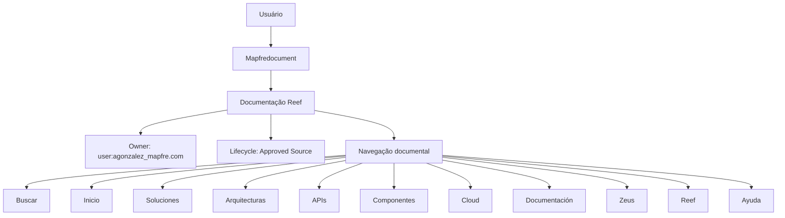

# Formação de Operação de Emissão (Comum) — Documentação Reef

## 1. Metadados do Documento
- **Arquivo de Origem:** `Não informado`
- **Tipo de Documento:** Material de formação operacional
- **Domínio / Sistema:** Reef / Mapfredocument
- **Público-Alvo:** Operação e negócio
- **Data/Versão Identificada:** Não identificada

---

## 2. Resumo Executivo & Contexto de Negócio

O conteúdo apresenta uma formação voltada à operação de emissão, identificada como comum, com orientação para operação e tipo de negócio. O material não descreve regras detalhadas de emissão, etapas operacionais, responsabilidades ou critérios de negócio.

A referência documental está associada a **Reef**, com menções a **Documentation / DOCUMENTACIÓN Reef**, **Mapfredocument** e ao estado de ciclo de vida **Approved Source**. O texto também identifica o proprietário como `user:agonzalez_mapfre.com`.

A extração inclui elementos de navegação de uma interface documental, como Busca, Início, Soluções, Arquiteturas, APIs, Componentes, Cloud, Documentação, Zeus, Reef e Ajuda. Não há detalhamento adicional sobre a finalidade funcional desses itens.

> **Nota de Análise:** O documento cita Reef, Mapfredocument e Zeus, porém não define suas responsabilidades, integrações, arquitetura técnica, APIs, URLs, ambientes ou contratos de dados.

---

## 3. Arquitetura, Componentes & Tecnologias Envolvidas

Os elementos identificados no conteúdo são:

- **Reef:** sistema, domínio ou área documental mencionada no título e na navegação.
- **Mapfredocument:** referência exibida na documentação.
- **Documentation / DOCUMENTACIÓN Reef:** área ou identificação documental associada a Reef.
- **Zeus:** item disponível na navegação.
- **Approved Source:** estado de ciclo de vida exibido.
- **Owner:** campo de proprietário, preenchido com `user:agonzalez_mapfre.com`.
- **VL:** texto exibido próximo ao status de ciclo de vida, sem definição no conteúdo.

O texto não apresenta arquitetura de software, componentes técnicos, microsserviços, bancos de dados, protocolos, tecnologias, integrações ou fluxos de dados. O diagrama abaixo representa exclusivamente a relação de navegação e identificação documental exibida na extração.



---

## 4. Regras de Negócio, Especificações Funcionais & Processos

O conteúdo apresenta as seguintes informações funcionais e operacionais:

1. Existe uma formação denominada **“FORMACIÓN de OPERACIÓN de EMISIÓN (Común)”**.
2. A formação é orientada à operação e ao tipo de negócio.
3. O documento contém a seção ou rótulo **“TIPOS DE OPERACIÓN”**, sem detalhar os tipos de operação existentes.
4. A documentação é associada a Reef por meio dos rótulos **“Documentation / DOCUMENTACIÓN Reef”** e **“DOCUMENTACIÓN Reef”**.
5. O proprietário indicado na documentação é `user:agonzalez_mapfre.com`.
6. O ciclo de vida indicado é **Approved Source**.
7. O conteúdo apresenta uma navegação documental com opções como Busca, Soluções, Arquiteturas, APIs, Componentes, Cloud, Documentação, Zeus, Reef e Ajuda.
8. O seletor ou identificador de idioma exibido é **ES**.

> **Nota de Análise:** Não foram extraídas regras de validação, cálculos, critérios de emissão, exceções operacionais, permissões, fluxos de aprovação ou instruções passo a passo.

---

## 5. Tabelas de Parâmetros, Ambientes e Estruturas de Dados

| Item / Parâmetro | Descrição / Função | Tipo / Valores / Formato | Ambiente / Observações |
| :--- | :--- | :--- | :--- |
| Formação | Formação voltada à operação de emissão comum | `FORMACIÓN de OPERACIÓN de EMISIÓN (Común)` | Sem data, versão ou instrutor identificados |
| Orientação | Público ou foco declarado da formação | Operação e tipo de negócio | Sem detalhamento adicional |
| Tipos de operação | Seção citada no material | `TIPOS DE OPERACIÓN` | Tipos não especificados |
| Área documental | Referência documental de Reef | `Documentation / DOCUMENTACIÓN Reef` | Sem URL ou repositório informado |
| Sistema/documento | Nome exibido na extração | `Mapfredocument` | Papel não detalhado |
| Owner | Proprietário do conteúdo documental | `user:agonzalez_mapfre.com` | Campo exibido como Owner |
| Lifecycle | Estado de ciclo de vida | `Approved Source` | O processo associado não é descrito |
| Identificador adicional | Texto exibido junto ao ciclo de vida | `VL` | Significado não definido |
| Idioma | Identificador exibido na navegação | `ES` | Sem explicação adicional |
| Navegação | Opções visíveis na interface documental | Buscar, Inicio, Soluciones, Arquitecturas, APIs, Componentes, Cloud, Documentación, Zeus, Reef, Ayuda | Relação técnica entre os itens não detalhada |

---

## 6. Bateria de Perguntas & Respostas para RAG (FAQ Sintético)

### P1: Qual é o tema principal do documento?
**R:** O documento trata de uma formação de operação de emissão comum, orientada à operação e ao tipo de negócio.

### P2: O documento descreve quais são os tipos de operação?
**R:** Não. O conteúdo apresenta o título ou seção `TIPOS DE OPERACIÓN`, mas não lista, define ou detalha os tipos de operação.

### P3: Qual sistema ou domínio é mencionado na documentação?
**R:** A documentação menciona Reef, por meio dos rótulos `Documentation / DOCUMENTACIÓN Reef` e `DOCUMENTACIÓN Reef`.

### P4: Quem é o proprietário identificado para a documentação Reef?
**R:** O campo Owner apresenta o valor `user:agonzalez_mapfre.com`.

### P5: Qual é o estado de ciclo de vida exibido no documento?
**R:** O campo Lifecycle apresenta o estado `Approved Source`.

### P6: O que significa o identificador “VL” exibido próximo ao ciclo de vida?
**R:** O documento exibe `VL`, mas não fornece sua expansão, definição ou função no contexto da documentação Reef.

### P7: O documento contém detalhes de APIs, microsserviços ou contratos de integração?
**R:** Não. Embora a navegação apresente o item `APIs`, a extração não descreve endpoints, métodos HTTP, contratos JSON, protocolos ou integrações técnicas.

### P8: Quais áreas estão disponíveis na navegação documental apresentada?
**R:** A navegação exibe: Buscar, Inicio, Soluciones, Arquitecturas, APIs, Componentes, Cloud, Documentación, Zeus, Reef e Ayuda.

### P9: Qual idioma é indicado na interface exibida?
**R:** A interface apresenta o identificador `ES`. O documento não explica formalmente o significado desse identificador.

### P10: O documento informa ambientes, URLs, servidores ou configurações de acesso?
**R:** Não. Não foram identificados URLs, nomes de servidores, ambientes, portas, credenciais ou parâmetros de configuração.

---

## 7. Glossário de Termos, Siglas & Conceitos-Chave

- **Reef:** nome citado como referência da documentação; sua definição funcional ou técnica não é apresentada.
- **Mapfredocument:** nome exibido no conteúdo; seu papel não é definido.
- **Owner:** campo que identifica o proprietário da documentação como `user:agonzalez_mapfre.com`.
- **Lifecycle:** campo que informa o ciclo de vida como `Approved Source`.
- **Approved Source:** estado de ciclo de vida exibido; seu fluxo ou critérios de aprovação não são descritos.
- **VL:** identificador exibido sem definição no conteúdo.
- **ES:** identificador exibido na navegação, sem explicação adicional.
- **Zeus:** item disponível na navegação documental, sem detalhamento funcional.

---

## 8. Notas Críticas, Riscos & Limitações

- O conteúdo extraído é resumido e não apresenta detalhamento suficiente para definir processos de emissão.
- Não há regras de negócio, condições de validação, exceções, cálculos ou etapas operacionais descritas.
- Não foram identificadas arquiteturas técnicas, integrações, APIs, ambientes, URLs, servidores ou tecnologias.
- Os termos Reef, Mapfredocument, Zeus e VL são citados sem definição contextual.
- A presença de itens de navegação não comprova funcionalidades, integrações ou relações técnicas entre eles.
- O estado `Approved Source` é exibido, mas os critérios, responsáveis e processo associados ao ciclo de vida não são informados.

---

## 9. Conteúdo Bruto Estruturado (Referência Fiel)

```text
--- [PÁGINA 1 DE 1] ---

FORMACIÓN de OPERACIÓN de EMISIÓN (Común)
 Formación orientada a la operación y tipo de negocio
TIPOS DE OPERACIÓN
 
  
 
  
 
Documentation / DOCUMENTACIÓN Reef
DOCUMENTACIÓN Reef
Mapfredocument
DOCUMENTACIÓN Reef
Owner
user:agonzalez_mapfre.com
Lifecycle
Approved Source
 / 
 VL
Buscar Inicio Soluciones Arquitecturas APIs Componentes Cloud Documentación Zeus Reef Ayuda
ES
```
