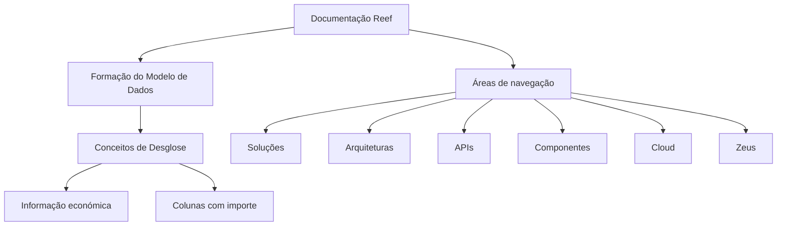

# Formação do Modelo de Dados — Conceitos de Desglose (Informação Económica)

## 1. Metadados do Documento
- **Arquivo de Origem:** Não identificado no conteúdo extraído
- **Tipo de Documento:** Material formativo / apresentação
- **Domínio / Sistema:** Reef; documentação Mapfre
- **Público-Alvo:** Não identificado
- **Data/Versão Identificada:** Não identificada

---

## 2. Resumo Executivo & Contexto de Negócio

O conteúdo extraído identifica um material denominado **“FORMACIÓN MODELO DE DATOS - CONCEPTOS DE DESGLOSE (Información económica)”**. O tema central declarado é a formação sobre modelo de dados e conceitos de *desglose*, associados a informação económica.

A secção de conteúdos formativos menciona explicitamente **“DESGLOSE - Columnas con importe ¿Cómo trabajan?”**, indicando que o documento pretende abordar o funcionamento de colunas com valores monetários. Contudo, o texto extraído não apresenta regras de cálculo, exemplos de valores, definições de campos ou detalhamento funcional dessas colunas.

O documento também referencia a documentação **Reef**, incluindo uma navegação com áreas como Soluções, Arquiteturas, APIs, Componentes, Cloud, Documentação, Zeus, Reef e Ajuda. A extração menciona ainda “Mapfredocument”, o estado de ciclo de vida “Approved Source”, o proprietário `user:agonzalez_mapfre.com` e a marcação `VL`.

**Nota de Análise:** o excerto disponível é predominantemente composto por título, menu de navegação e metadados de uma página documental. Não há descrição suficiente para reconstruir arquitetura, fluxos de integração, contratos técnicos ou regras de negócio detalhadas.

---

## 3. Arquitetura, Componentes & Tecnologias Envolvidas

Os elementos citados são:

| Componente / Termo | Evidência no conteúdo | Detalhamento disponível |
| :--- | :--- | :--- |
| Reef | “Documentation / DOCUMENTACIÓN Reef” | Referenciado como documentação; sem arquitetura ou funções descritas. |
| Mapfredocument | “Mapfredocument” | Apenas citado; sem explicação funcional. |
| Zeus | Item do menu de navegação | Apenas citado; sem explicação funcional. |
| APIs | Item do menu de navegação | Não há APIs, métodos, contratos ou endpoints descritos. |
| Cloud | Item do menu de navegação | Não há provedores, serviços ou ambientes descritos. |
| Arquiteturas | Item do menu de navegação | Não há diagramas ou padrões arquiteturais descritos. |



**Nota de Análise:** o diagrama representa somente relações temáticas e de navegação explicitamente observáveis no excerto. O conteúdo não descreve comunicação técnica, dependências, protocolos ou fluxos de dados entre Reef, Zeus, APIs e Cloud.

---

## 4. Regras de Negócio, Especificações Funcionais & Processos

1. O material formativo é associado ao **modelo de dados** e aos **conceitos de desglose** para **informação económica**.
2. É apresentada a questão temática: **“DESGLOSE - Columnas con importe ¿Cómo trabajan?”**
3. O conteúdo extraído não fornece resposta funcional, regra de cálculo, fórmula, condição de validação, origem de dados ou comportamento operacional para as colunas com importe.
4. A documentação Reef apresenta um estado de ciclo de vida identificado como **“Approved Source”**.
5. O idioma de navegação exibido no excerto é **“ES”**.

**Nota de Análise:** não foram identificados passos de processo, critérios de elegibilidade, regras de validação, transformações de dados ou exceções operacionais.

---

## 5. Tabelas de Parâmetros, Ambientes e Estruturas de Dados

| Item / Parâmetro | Descrição / Função | Tipo / Valores / Formato | Ambiente / Observações |
| :--- | :--- | :--- | :--- |
| Título do material | Formação sobre modelo de dados e conceitos de desglose | Texto | “FORMACIÓN MODELO DE DATOS - CONCEPTOS DE DESGLOSE” |
| Contexto de dados | Área informacional mencionada | Texto | “Información económica” |
| Conteúdo formativo | Tema relativo a desglose e colunas monetárias | Texto | “DESGLOSE - Columnas con importe ¿Cómo trabajan?” |
| Repositório documental | Referência à documentação Reef | Texto | “Documentation / DOCUMENTACIÓN Reef” |
| Proprietário | Identificador do proprietário exibido | Texto | `user:agonzalez_mapfre.com` |
| Lifecycle | Estado do ciclo de vida documental | Texto | “Approved Source” |
| Marcação adicional | Valor apresentado sem definição | Texto | `VL` |
| Idioma | Idioma exibido na interface | Código | `ES` |
| Navegação | Áreas disponíveis no menu | Lista | Buscar, Inicio, Soluciones, Arquitecturas, APIs, Componentes, Cloud, Documentación, Zeus, Reef, Ayuda |

---

## 6. Bateria de Perguntas & Respostas para RAG (FAQ Sintético)

### P1: Qual é o tema principal do material de formação?
**R:** O material aborda o **modelo de dados** e os **conceitos de desglose**, no contexto de **informação económica**.

### P2: O que o documento informa sobre as colunas com importe?
**R:** O documento apresenta o tema “DESGLOSE - Columnas con importe ¿Cómo trabajan?”, mas o excerto extraído não explica como essas colunas funcionam, quais campos possuem, nem como os valores são calculados.

### P3: Qual sistema ou repositório documental é mencionado?
**R:** O conteúdo menciona a **documentação Reef**, identificada pelos textos “Documentation / DOCUMENTACIÓN Reef”.

### P4: O documento descreve APIs ou endpoints técnicos?
**R:** Não. “APIs” aparece apenas como uma opção de navegação; não há métodos HTTP, URLs, contratos JSON, autenticação ou especificações de integração.

### P5: O documento apresenta uma arquitetura de software detalhada?
**R:** Não. “Arquiteturas”, “Componentes” e “Cloud” aparecem no menu, mas não há componentes técnicos, conexões, ambientes ou padrões arquiteturais descritos.

### P6: Qual é o estado de ciclo de vida identificado para o conteúdo?
**R:** O estado de ciclo de vida exibido é **“Approved Source”**.

### P7: Quem é o proprietário indicado no excerto?
**R:** O campo “Owner” apresenta o valor `user:agonzalez_mapfre.com`.

### P8: O que significa a marcação VL?
**R:** O excerto contém a marcação `VL`, mas não fornece uma definição para esse termo. Portanto, seu significado não pode ser inferido com segurança.

### P9: Qual idioma é exibido na documentação?
**R:** O idioma exibido é `ES`, conforme indicado no menu da documentação.

### P10: Zeus é descrito funcionalmente no documento?
**R:** Não. “Zeus” é apenas listado na navegação da página documental; o conteúdo não descreve a finalidade, arquitetura ou integração de Zeus.

---

## 7. Glossário de Termos, Siglas & Conceitos-Chave

- **Reef:** nome associado à documentação referenciada no excerto; a função do sistema não é detalhada.
- **Desglose:** termo apresentado como conceito do modelo de dados; não há definição formal no texto extraído.
- **Información económica:** contexto de informação económica associado ao tema de desglose.
- **Columnas con importe:** colunas com valor monetário ou importe; o comportamento não é detalhado.
- **APIs:** item de navegação; o documento não fornece especificações de interface.
- **Cloud:** item de navegação; nenhum serviço ou ambiente cloud é especificado.
- **Zeus:** item de navegação; sem definição disponível.
- **Lifecycle:** campo de ciclo de vida documental.
- **Approved Source:** valor exibido para o campo Lifecycle.
- **VL:** marcação presente no conteúdo sem definição.
- **ES:** código de idioma exibido na interface, correspondente ao espanhol no contexto da página.

---

## 8. Notas Críticas, Riscos & Limitações

- O conteúdo disponível não identifica o nome do arquivo original, autor formal, data, versão ou público-alvo.
- Não há detalhamento suficiente para definir o modelo de dados, tabelas, campos, tipos, chaves, relacionamentos ou regras de cálculo.
- Não há especificações de APIs, endpoints, protocolos, credenciais, ambientes, servidores ou rotas de logs.
- Não é possível afirmar o significado de `VL`, a função de Zeus ou o papel técnico de Reef além do que está explicitamente exibido.
- O tópico de colunas com importe é anunciado, mas não é explicado no texto extraído.

---

## 9. Conteúdo Bruto Estruturado (Referência Fiel)

```text
--- [PÁGINA 1 DE 1] ---

FORMACIÓN MODELO DE DATOS - CONCEPTOS DE DESGLOSE
(Información económica)
 Contenidos formativos:
CONTENIDO
DESGLOSE - Columnas con importe ¿Cómo trabajan?
Documentation / DOCUMENTACIÓN Reef
DOCUMENTACIÓN Reef
Mapfredocument
DOCUMENTACIÓN Reef
Owner
user:agonzalez_mapfre.com
Lifecycle
Approved Source
 / 
 VL
Buscar Inicio Soluciones Arquitecturas APIs Componentes Cloud Documentación Zeus Reef Ayuda
ES
```
