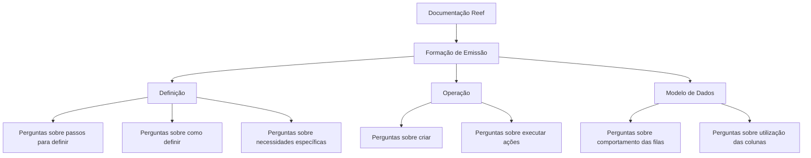

# Formação de Emissão — Documentação Reef

## 1. Metadados do Documento
- **Arquivo de Origem:** `Não identificado no conteúdo fornecido`
- **Tipo de Documento:** `Manual Operacional / Documentação de Formação`
- **Domínio / Sistema:** `Reef — módulo de emissão`
- **Público-Alvo:** `Utilizadores que necessitam de definir, operar ou consultar o modelo de dados do módulo de emissão`
- **Data/Versão Identificada:** `Não identificada`
- **Owner identificado:** `user:agonzalez_mapfre.com`
- **Lifecycle identificado:** `Approved Source`

---

## 2. Resumo Executivo & Contexto de Negócio

O documento apresenta a formação relativa ao módulo de emissão do sistema Reef. O conteúdo está organizado em três áreas declaradas: **Definição**, **Operação** e **Modelo de Dados**. A estrutura indica uma separação entre configuração ou definição do módulo, execução de atividades operacionais e consulta do comportamento ou estrutura dos dados.

A seção **Definição** destina-se a responder questões sobre os passos necessários para definir elementos, sobre o processo de definição e sobre o que fazer quando existe uma necessidade específica. O texto não identifica quais entidades, configurações, regras ou objetos podem ser definidos no módulo de emissão.

A seção **Operação** é apresentada como fonte para perguntas sobre criação de elementos e execução de ações. O conteúdo fornecido não detalha telas, perfis, comandos, fluxos operacionais, permissões, pré-requisitos ou resultados dessas operações.

A seção **Modelo de Dados** é descrita como referência para compreender o comportamento das filas e a utilização das colunas. Não são apresentados nomes de tabelas, estruturas, campos, tipos de dados, chaves, regras de persistência ou exemplos de valores.

O documento está associado à área de documentação Reef e contém referências de navegação para soluções, arquiteturas, APIs, componentes, cloud, documentação, Zeus, Reef e ajuda. Contudo, o texto não explica relações técnicas ou funcionais entre essas áreas.

---

## 3. Arquitetura, Componentes & Tecnologias Envolvidas

Os seguintes elementos são citados explicitamente:

| Componente / Área | Papel identificado no documento | Detalhamento disponível |
| :--- | :--- | :--- |
| Reef | Sistema ou domínio documental associado ao módulo de emissão | O texto apresenta a documentação Reef, mas não descreve a arquitetura do sistema Reef. |
| Módulo de emissão | Escopo da formação apresentada | Dividido em Definição, Operação e Modelo de Dados. |
| Definição | Área de formação para dúvidas sobre definir elementos ou necessidades | Não há objetos, etapas ou regras específicos. |
| Operação | Área de formação para dúvidas sobre criar ou executar ações | Não há procedimentos operacionais detalhados. |
| Modelo de Dados | Área de formação para dúvidas sobre filas e colunas | Não há esquema, tabelas ou campos apresentados. |
| Zeus | Item presente na navegação documental | Não há explicação sobre sua função ou integração. |
| Soluções, Arquiteturas, APIs, Componentes, Cloud, Documentação, Ajuda | Itens de navegação exibidos | Não há descrição técnica dos itens. |



> **Nota de Análise:** O conteúdo não descreve servidores, microsserviços, APIs, protocolos, tecnologias de implementação, integrações, ambientes ou contratos técnicos. O diagrama representa exclusivamente a organização temática declarada no texto.

---

## 4. Regras de Negócio, Especificações Funcionais & Processos

### 4.1 Estrutura da formação do módulo de emissão

A formação do módulo de emissão está dividida nos seguintes apartados:

1. **Definição**
2. **Operação**
3. **Modelo de Dados**

### 4.2 Escopo funcional da seção Definição

A seção Definição deve permitir obter respostas para perguntas como:

- Quais passos devem ser seguidos para poder definir algo.
- Como algo é definido.
- O que fazer quando for necessário atender uma necessidade específica.

O texto não especifica:

- Quais entidades podem ser definidas.
- Quais são os passos efetivos de definição.
- Quais validações devem ocorrer.
- Quais perfis ou permissões são necessários.
- Quais consequências decorrem de uma definição.
- Quais necessidades específicas são suportadas.

### 4.3 Escopo funcional da seção Operação

A seção Operação deve permitir obter respostas para perguntas como:

- Como criar algo.
- O que fazer para poder realizar algo.

O texto não especifica:

- Os elementos passíveis de criação.
- As ações operacionais disponíveis.
- A sequência operacional.
- Os critérios de sucesso, erro ou validação.
- Os responsáveis pela operação.
- As telas, rotas ou mecanismos para executar as ações.

### 4.4 Escopo funcional da seção Modelo de Dados

A seção Modelo de Dados deve responder perguntas como:

- Como as filas se comportam.
- Qual é o uso de uma coluna.

O texto não especifica:

- Nomes de filas.
- Regras de enfileiramento, consumo, ordenação, retenção ou reprocessamento.
- Nomes das colunas.
- Tipos, formatos ou domínios de valores das colunas.
- Relações entre tabelas ou estruturas.
- Regras de integridade, chaves ou mapeamentos.

---

## 5. Tabelas de Parâmetros, Ambientes e Estruturas de Dados

| Item / Parâmetro | Descrição / Função | Tipo / Valores / Formato | Ambiente / Observações |
| :--- | :--- | :--- | :--- |
| Formação de emissão | Conteúdo formativo relativo ao módulo de emissão | Dividida em Definição, Operação e Modelo de Dados | Associada à documentação Reef |
| Definição | Área para questões sobre definição de elementos e necessidades | Perguntas orientativas; não há parâmetros documentados | Sem detalhamento adicional |
| Operação | Área para questões sobre criação e execução de ações | Perguntas orientativas; não há procedimentos documentados | Sem detalhamento adicional |
| Modelo de Dados | Área para questões sobre comportamento de filas e uso de colunas | Perguntas orientativas; não há modelo de dados documentado | Sem detalhamento adicional |
| Owner | Proprietário identificado na página documental | `user:agonzalez_mapfre.com` | Exibido como Owner |
| Lifecycle | Estado de ciclo de vida exibido | `Approved Source` | Exibido na página documental |
| Idioma | Idioma indicado na navegação | `ES` | A maior parte do conteúdo está em espanhol |
| Navegação documental | Itens de navegação apresentados | Buscar, Inicio, Soluciones, Arquitecturas, APIs, Componentes, Cloud, Documentación, Zeus, Reef, Ayuda | Sem descrição funcional adicional |

> **Nota de Análise:** O documento não apresenta parâmetros técnicos, variáveis de configuração, URLs, servidores, portas, ambientes, caminhos de log, tabelas físicas ou campos estruturados além dos metadados e da organização temática.

---

## 6. Bateria de Perguntas & Respostas para RAG (FAQ Sintético)

### P1: Qual é o objetivo da formação de emissão na documentação Reef?
**R:** A formação de emissão reúne conteúdo relativo ao módulo de emissão e está organizada nas áreas de Definição, Operação e Modelo de Dados. O objetivo explícito é fornecer respostas a perguntas sobre definição, criação, execução de ações, comportamento de filas e uso de colunas.

### P2: Quais seções compõem a formação do módulo de emissão?
**R:** A formação do módulo de emissão está dividida em três seções: Definição, Operação e Modelo de Dados.

### P3: Que tipo de pergunta deve ser tratada na seção Definição?
**R:** A seção Definição deve responder perguntas sobre os passos necessários para definir algo, sobre como algo é definido e sobre o que fazer diante de uma necessidade específica. O documento não informa quais objetos ou configurações concretas são abrangidos.

### P4: O documento explica os passos exatos para definir elementos no módulo de emissão?
**R:** Não. O documento indica que a seção Definição deve responder perguntas sobre os passos para definir algo, mas não apresenta a sequência de etapas, validações, telas, parâmetros ou objetos envolvidos.

### P5: Que tipo de necessidade a seção Operação pretende atender?
**R:** A seção Operação pretende atender dúvidas sobre como criar algo e sobre o que fazer para poder realizar uma ação. O documento não detalha quais elementos podem ser criados nem quais operações estão disponíveis.

### P6: O documento descreve procedimentos operacionais do módulo de emissão?
**R:** Não. O texto apenas informa que a seção Operação deve responder dúvidas sobre criação e execução de ações. Não há procedimentos passo a passo, regras de autorização, comandos, telas ou exemplos operacionais.

### P7: O que pode ser consultado na seção Modelo de Dados?
**R:** A seção Modelo de Dados deve responder perguntas sobre como as filas se comportam e qual é o uso de uma coluna. O documento não identifica filas, tabelas, colunas, tipos de dados ou regras de persistência.

### P8: O comportamento das filas está detalhado no conteúdo fornecido?
**R:** Não. O documento apenas cita que o Modelo de Dados responde a perguntas sobre o comportamento das filas. Não há regras sobre consumo, ordem, retenção, processamento, falhas ou reprocessamento.

### P9: Existem colunas ou estruturas de dados especificadas no documento?
**R:** Não. O texto menciona que o Modelo de Dados pode responder sobre o uso de uma coluna, mas não apresenta nomes, descrições, formatos, tipos ou valores permitidos para colunas.

### P10: Qual é o sistema ou domínio associado ao documento?
**R:** O documento está associado à documentação Reef e trata do módulo de emissão. O texto não descreve a arquitetura, funcionalidades completas ou integrações do sistema Reef.

### P11: Quem é o proprietário identificado para a documentação?
**R:** O proprietário exibido no conteúdo é `user:agonzalez_mapfre.com`.

### P12: Qual estado de ciclo de vida é exibido no documento?
**R:** O estado de ciclo de vida exibido é `Approved Source`.

---

## 7. Glossário de Termos, Siglas & Conceitos-Chave

- **Reef:** Nome do sistema, domínio ou espaço documental associado ao módulo de emissão. O texto não expande o termo.
- **Módulo de emissão:** Módulo abordado pela formação apresentada. O documento não descreve seu escopo funcional completo.
- **Definição:** Seção da formação destinada a questões sobre passos para definir algo, como definir algo e tratamento de necessidades específicas.
- **Operação:** Seção da formação destinada a questões sobre criação de elementos e execução de ações.
- **Modelo de Dados:** Seção da formação destinada a questões sobre comportamento de filas e utilização de colunas.
- **Filas:** Elementos mencionados no contexto do Modelo de Dados. O documento não define seus mecanismos ou características.
- **Coluna:** Elemento de dados mencionado no contexto do Modelo de Dados. O documento não define suas propriedades.
- **Owner:** Campo que identifica o proprietário da documentação como `user:agonzalez_mapfre.com`.
- **Lifecycle:** Campo que exibe o estado de ciclo de vida da documentação.
- **Approved Source:** Valor exibido para Lifecycle.
- **Zeus:** Item presente no menu de navegação. O documento não explica seu significado ou função.
- **APIs:** Item presente no menu de navegação. O documento não fornece detalhes sobre interfaces de programação.
- **Cloud:** Item presente no menu de navegação. O documento não fornece detalhes sobre infraestrutura em nuvem.

---

## 8. Notas Críticas, Riscos & Limitações

- O conteúdo é predominantemente uma página de entrada ou índice formativo; não contém o detalhamento necessário para executar atividades de definição, operação ou consulta de modelo de dados.
- Não há especificação de APIs, métodos HTTP, contratos JSON, autenticação, integrações, microsserviços, tecnologias, servidores, URLs ou ambientes.
- Não há informações suficientes para derivar regras de negócio, fórmulas, critérios de validação, matrizes de permissão ou fluxos operacionais completos.
- O Modelo de Dados é apenas citado. Não há tabelas, entidades, filas, colunas, tipos, relacionamentos ou exemplos de registros.
- A presença de caracteres de substituição no texto extraído — como `Denición`, `las` e `denir` — sugere perda ou corrupção de caracteres durante a extração. A interpretação contextual mais provável é “Definición”, “filas” e “definir”, mas a transcrição bruta abaixo preserva a extração fornecida.
- **Nota de Análise:** O documento lista o módulo de emissão e suas três áreas de formação, porém não detalha funcionalidades, métodos, contratos, parâmetros ou fluxos internos do módulo.

---

## 9. Conteúdo Bruto Estruturado (Referência Fiel)

```text
--- [PÁGINA 1 DE 1] ---

FORMACIÓN EMISIÓN
 En este apartado se encuentra la formación relativa al módulo de emisión. Dicha formación está dividida en los apartados
siguientes:
Denición
Operación
Modelo de datos
DEFINICIÓN
Conseguir respuestas a preguntas del estilo:
¿Qué pasos he de seguir para poder denir...?
¿Cómo se dene...?
¿Qué hago si necesito...?
OPERACIÓN
Obtener respuestas a preguntas:
¿Cómo puedo crear...?
¿Qué hago para poder hacer...?
MODELO DE DATOS
Responde a preguntas tipo:
¿Cómo se comportan las las...?
¿Cuál es el uso de la columna...?
Documentation / DOCUMENTACIÓN Reef
DOCUMENTACIÓN Reef
Mapfredocument
DOCUMENTACIÓN Reef
Owner
user:agonzalez_mapfre.com
Lifecycle
Approved Source
 /
 VL
Buscar Inicio Soluciones Arquitecturas APIs Componentes Cloud Documentación Zeus Reef Ayuda
ES
```
