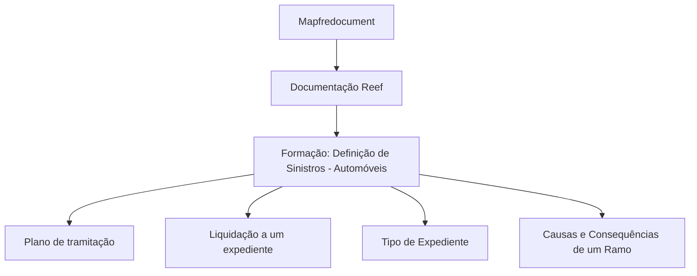

# Formação: Definição de Sinistros — Automóveis

## 1. Metadados do Documento
- **Arquivo de Origem:** Não identificado
- **Tipo de Documento:** Apresentação Executiva / Material de Formação
- **Domínio / Sistema:** Reef; sinistros de automóveis; documentação Mapfre
- **Público-Alvo:** Utilizadores responsáveis pela definição e tramitação de sinistros
- **Data/Versão Identificada:** Não identificada

---

## 2. Resumo Executivo & Contexto de Negócio

O conteúdo apresentado refere-se a uma formação sobre a definição de sinistros no domínio de **Automóveis**. O documento enumera questões operacionais relacionadas à configuração de planos de tramitação, liquidações de expedientes, tipos de expediente e causas/consequências associadas a um ramo.

A documentação está associada ao ambiente ou repositório **Reef**, com referências a “DOCUMENTACIÓN Reef” e “Mapfredocument”. O estado de ciclo de vida indicado é **Approved Source**, sugerindo que o material está classificado como uma fonte aprovada no repositório documental.

O texto não descreve os procedimentos, regras de cálculo, interfaces, campos obrigatórios, APIs, contratos ou sequências detalhadas para executar as definições de sinistros. Portanto, as perguntas listadas devem ser interpretadas como tópicos de formação, e não como instruções operacionais completas.

---

## 3. Arquitetura, Componentes & Tecnologias Envolvidas

### Componentes e referências identificadas

| Componente / Termo | Descrição sustentada pelo conteúdo |
| :--- | :--- |
| Reef | Repositório ou contexto documental citado como “DOCUMENTACIÓN Reef”. |
| Mapfredocument | Referência documental exibida no conteúdo. |
| Sinistros — Automóveis | Domínio funcional principal da formação. |
| Plano de tramitação | Elemento cuja definição é abordada como tópico do material. |
| Liquidação a um expediente | Processo ou capacidade cuja geração é abordada como tópico. |
| Tipo de Expediente | Elemento de configuração mencionado no conteúdo. |
| Causas Consequências de um Ramo | Elementos associados a um ramo e citados como tópico de definição. |
| Zeus | Item de navegação exibido na interface documental. |
| Cloud | Item de navegação exibido na interface documental. |
| APIs | Item de navegação exibido na interface documental. |



**Nota de Análise:** O conteúdo não descreve integrações técnicas, camadas de aplicação, microsserviços, protocolos, bases de dados, APIs ou fluxos de dados entre os componentes citados.

---

## 4. Regras de Negócio, Especificações Funcionais & Processos

O documento apresenta os seguintes tópicos funcionais:

1. **Definição de um plano de tramitação**
   - O material formula a questão: “¿Cómo puedo definir un plan de tramitación?”
   - Não são fornecidos passos, atributos, estados, critérios de validação ou regras de negócio para a definição do plano de tramitação.

2. **Geração de liquidação para um expediente**
   - O material formula a questão: “¿Qué tengo que definir para generar una liquidación a un expediente?”
   - Não são apresentados parâmetros, pré-requisitos, cálculos, aprovações ou resultados esperados para a liquidação.

3. **Definição de Tipo de Expediente**
   - O material formula a questão: “¿Cómo defino un Tipo de Expediente?”
   - Não há detalhamento dos campos, classificações ou impactos de um Tipo de Expediente.

4. **Definição de Causas e Consequências de um Ramo**
   - O material formula a questão: “¿Cómo defino las Causas Consecuencias de un Ramo?”
   - O conteúdo não define o conceito de ramo nem descreve a relação operacional entre causas e consequências.

---

## 5. Tabelas de Parâmetros, Ambientes e Estruturas de Dados

| Item / Parâmetro | Descrição / Função | Tipo / Valores / Formato | Ambiente / Observações |
| :--- | :--- | :--- | :--- |
| Formação | Material sobre definição de sinistros | “FORMACIÓN DEFINICIÓN de SINIESTROS- Automóviles” | Conteúdo em espanhol |
| Plano de tramitação | Tópico de configuração de sinistros | Não detalhado | Não informado |
| Liquidação a expediente | Tópico relativo à geração de liquidação | Não detalhado | Não informado |
| Tipo de Expediente | Tópico de definição | Não detalhado | Não informado |
| Causas Consequências de um Ramo | Tópico de definição associado a ramo | Não detalhado | Não informado |
| Documentação | Referência ao repositório ou domínio documental | “DOCUMENTACIÓN Reef” | Reef |
| Lifecycle | Estado de ciclo de vida do material | Approved Source | Exibido no conteúdo |
| Owner | Proprietário exibido na interface | `user:agonzalez_mapfre.com` | Valor reproduzido literalmente |
| Idioma | Idioma selecionado na interface | ES | Exibido na navegação |

---

## 6. Bateria de Perguntas & Respostas para RAG (FAQ Sintético)

### P1: Qual é o assunto principal do material de formação?
**R:** O material aborda a definição de sinistros no domínio de **Automóveis**, conforme o título “FORMACIÓN DEFINICIÓN de SINIESTROS- Automóviles”.

### P2: O documento explica como definir um plano de tramitação?
**R:** O documento identifica a definição de um plano de tramitação como uma questão de formação, mas não fornece os passos, campos, regras ou critérios necessários para realizar essa definição.

### P3: Quais configurações são mencionadas para gerar uma liquidação a um expediente?
**R:** O conteúdo pergunta o que deve ser definido para gerar uma liquidação a um expediente, mas não especifica parâmetros, validações, fórmulas, condições ou dependências para gerar essa liquidação.

### P4: O material detalha como definir um Tipo de Expediente?
**R:** Não. O Tipo de Expediente é citado como tema do conteúdo, porém não há descrição de atributos, valores permitidos, regras de associação ou processo de configuração.

### P5: O que o documento informa sobre Causas e Consequências de um Ramo?
**R:** O documento apresenta a definição de Causas Consequências de um Ramo como um tópico de formação. Não há detalhamento conceitual ou operacional sobre ramo, causa, consequência ou seus relacionamentos.

### P6: Qual sistema ou contexto documental é citado no conteúdo?
**R:** O conteúdo cita repetidamente “DOCUMENTACIÓN Reef”, indicando Reef como o contexto ou repositório documental relacionado ao material.

### P7: O conteúdo apresenta APIs ou contratos de integração?
**R:** Não. Embora “APIs” apareça como opção de navegação da interface, o material não fornece endpoints, métodos HTTP, contratos JSON, autenticação ou detalhes de integração.

### P8: Qual é o estado de ciclo de vida exibido para o documento?
**R:** O estado de ciclo de vida exibido é **Approved Source**.

### P9: Existe uma versão ou data identificada no texto?
**R:** Não. O conteúdo fornecido não apresenta data, versão, número de revisão ou histórico de alterações.

### P10: O documento contém instruções suficientes para configurar sinistros de automóveis?
**R:** Não. O conteúdo lista perguntas e temas de formação, mas não apresenta instruções executáveis, regras de negócio completas ou detalhes técnicos suficientes para configurar o processo.

---

## 7. Glossário de Termos, Siglas & Conceitos-Chave

- **Reef:** Nome citado no contexto de documentação; o conteúdo não fornece expansão ou definição adicional.
- **Sinistros:** Domínio funcional principal abordado no material.
- **Automóveis:** Segmento associado à formação sobre definição de sinistros.
- **Plano de tramitação:** Elemento de definição mencionado; sem especificação adicional no conteúdo.
- **Expediente:** Entidade ou processo relacionado à geração de liquidação; sem definição adicional no conteúdo.
- **Tipo de Expediente:** Classificação ou configuração mencionada; sem detalhamento adicional.
- **Ramo:** Termo associado a causas e consequências; sem definição adicional.
- **Lifecycle:** Campo de ciclo de vida exibido na interface documental.
- **Approved Source:** Valor do campo Lifecycle exibido para o material.
- **Mapfredocument:** Referência documental apresentada no conteúdo.
- **Zeus:** Item de navegação exibido, sem definição adicional.
- **APIs:** Item de navegação exibido, sem detalhes técnicos fornecidos.
- **Cloud:** Item de navegação exibido, sem detalhes técnicos fornecidos.

---

## 8. Notas Críticas, Riscos & Limitações

- O texto é predominantemente um índice de perguntas para formação e não contém as respetivas respostas ou procedimentos.
- Não há regras de negócio detalhadas para planos de tramitação, liquidações, tipos de expediente ou causas e consequências de ramo.
- Não foram identificados ambientes técnicos, URLs, credenciais, servidores, logs, APIs, versões, tecnologias de implementação ou contratos de dados.
- Alguns caracteres no conteúdo extraído apresentam codificação inconsistente, como “denir”, devendo ser preservados na referência bruta para auditoria.
- **Nota de Análise:** O documento cita Reef e Mapfredocument, mas não descreve a relação técnica ou funcional entre esses elementos.

---

## 9. Conteúdo Bruto Estruturado (Referência Fiel)

```text
--- [PÁGINA 1 DE 1] ---

FORMACIÓN DEFINICIÓN de SINIESTROS- Automóviles
CONTENIDO
¿Cómo puedo denir un plan de tramitación?
¿Qué tengo que denir para generar una liquidación a un expediente?
¿Cómo deno un Tipo de Expediente?
¿Cómo deno las Causas Consecuencias de un Ramo?
Documentation / DOCUMENTACIÓN Reef
DOCUMENTACIÓN Reef
Mapfredocument
DOCUMENTACIÓN Reef
Owner
user:agonzalez_mapfre.com
Lifecycle
Approved Source
 / 
 VL
Buscar Inicio Soluciones Arquitecturas APIs Componentes Cloud Documentación Zeus Reef Ayuda
ES
```
