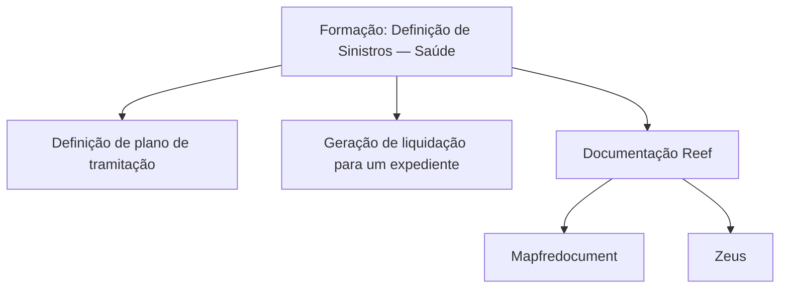

# Formação: Definição de Sinistros — Saúde

## 1. Metadados do Documento
- **Arquivo de Origem:** Não identificado
- **Tipo de Documento:** Apresentação Executiva / Material de Formação
- **Domínio / Sistema:** Gestão de sinistros de Saúde; documentação Reef; Mapfre
- **Público-Alvo:** Utilizadores envolvidos na definição e tramitação de sinistros de Saúde
- **Data/Versão Identificada:** Não identificada

---

## 2. Resumo Executivo & Contexto de Negócio

O documento apresenta um material de formação denominado **“FORMACIÓN DEFINICIÓN de SINIESTROS- Salud”**, relacionado ao domínio de definição de sinistros no contexto de Saúde. O conteúdo disponível identifica perguntas centrais sobre a definição de um plano de tramitação e sobre as definições necessárias para gerar uma liquidação para um expediente.

A fonte também referencia a **DOCUMENTACIÓN Reef** e apresenta um caminho de navegação relacionado a documentação, incluindo as áreas “Soluciones”, “Arquitecturas”, “APIs”, “Componentes”, “Cloud”, “Documentación”, “Zeus”, “Reef” e “Ayuda”.

O texto extraído não descreve procedimentos, regras de cálculo, fluxos operacionais, contratos de API, tecnologias, ambientes ou detalhes funcionais sobre os processos de tramitação e liquidação. Portanto, este artefato preserva os tópicos identificados sem inferir comportamentos não documentados.

---

## 3. Arquitetura, Componentes & Tecnologias Envolvidas

Os únicos componentes e contextos explicitamente citados são:

- **Sinistros — Saúde**
- **Reef**
- **Mapfredocument**
- **Zeus**
- Áreas de navegação: Soluciones, Arquitecturas, APIs, Componentes, Cloud, Documentación e Ayuda.

O texto não apresenta uma arquitetura técnica, relações de integração, fluxos de dados, microsserviços, protocolos ou responsabilidades entre os componentes citados.



> **Nota de Análise:** O documento menciona Reef, Mapfredocument e Zeus, mas não detalha as funções funcionais ou técnicas desses elementos no processo de sinistros de Saúde.

---

## 4. Regras de Negócio, Especificações Funcionais & Processos

O conteúdo fornece dois tópicos funcionais em formato de pergunta:

1. **Definição de plano de tramitação**
   - Pergunta identificada: “¿Cómo puedo definir un plan de tramitación?”
   - O texto não descreve as etapas, parâmetros, permissões, estados, validações ou regras necessárias para definir um plano de tramitação.

2. **Geração de liquidação para um expediente**
   - Pergunta identificada: “¿Qué tengo que definir para generar una liquidación a un expediente?”
   - O texto não informa quais dados, condições, regras de cálculo, aprovações ou configurações são exigidos para gerar a liquidação.

> **Nota de Análise:** Não há detalhamento adicional para transformar os tópicos apresentados em um procedimento operacional executável.

---

## 5. Tabelas de Parâmetros, Ambientes e Estruturas de Dados

| Item / Parâmetro | Descrição / Função | Tipo / Valores / Formato | Ambiente / Observações |
| :--- | :--- | :--- | :--- |
| Plano de tramitação | Tema relacionado à definição de um plano de tramitação | Não detalhado | Associado à formação de definição de sinistros de Saúde |
| Liquidação | Tema relacionado à geração de uma liquidação para um expediente | Não detalhado | O documento não especifica requisitos ou regras |
| Expediente | Entidade mencionada como destinatária de uma liquidação | Não detalhado | Não há estrutura de dados ou identificadores descritos |
| Reef | Referência de documentação | “DOCUMENTACIÓN Reef” | Não há versão, URL ou detalhe técnico |
| Mapfredocument | Item listado no contexto da documentação | Não detalhado | Relação com Reef não especificada |
| Zeus | Item listado no menu de documentação | Não detalhado | Função não especificada |
| Owner | Campo exibido no conteúdo bruto | `user:agonzalez_mapfre.com` | Valor preservado conforme extração |
| Lifecycle | Campo exibido no conteúdo bruto | `Approved Source` | Significado operacional não detalhado |
| Idioma | Opção exibida no conteúdo bruto | `ES` | Espanhol |

---

## 6. Bateria de Perguntas & Respostas para RAG (FAQ Sintético)

### P1: Qual é o tema principal do documento?
**R:** O documento é um material de formação intitulado “FORMACIÓN DEFINICIÓN de SINIESTROS- Salud”, relacionado à definição de sinistros no domínio de Saúde.

### P2: O documento explica como definir um plano de tramitação?
**R:** Não. O documento apresenta a pergunta “¿Cómo puedo definir un plan de tramitación?”, mas o conteúdo extraído não inclui as etapas, parâmetros ou regras para executar essa definição.

### P3: Quais configurações são necessárias para gerar uma liquidação para um expediente?
**R:** O conteúdo pergunta “¿Qué tengo que definir para generar una liquidación a un expediente?”, mas não informa quais configurações, campos, validações ou regras devem ser definidos.

### P4: O documento especifica regras de cálculo de liquidação?
**R:** Não. Não há fórmulas, critérios de cálculo, valores, condições de aprovação ou exceções de liquidação no texto fornecido.

### P5: Quais sistemas ou áreas de documentação são mencionados?
**R:** O conteúdo menciona Reef, Mapfredocument, Zeus, Soluciones, Arquitecturas, APIs, Componentes, Cloud, Documentación e Ayuda.

### P6: Há APIs, endpoints ou contratos técnicos descritos para sinistros de Saúde?
**R:** Não. Embora “APIs” apareça como item de navegação, o documento não apresenta endpoints, métodos HTTP, payloads, autenticação ou contratos de integração.

### P7: Existe uma arquitetura de integração entre Reef, Mapfredocument e Zeus?
**R:** Não. Reef, Mapfredocument e Zeus são citados, mas a fonte não descreve fluxos, responsabilidades, dependências ou interfaces entre esses elementos.

### P8: Qual é o status de ciclo de vida apresentado no documento?
**R:** O campo “Lifecycle” aparece com o valor “Approved Source”. O documento não explica os critérios ou o significado operacional desse status.

### P9: Quem é o proprietário identificado na documentação?
**R:** O conteúdo bruto apresenta o campo “Owner” com o valor `user:agonzalez_mapfre.com`.

### P10: Qual idioma aparece na interface ou navegação do documento?
**R:** O texto apresenta a indicação “ES”, compatível com conteúdo e menu em espanhol.

---

## 7. Glossário de Termos, Siglas & Conceitos-Chave

- **Sinistros — Saúde:** Domínio explicitamente indicado no título do material de formação.
- **Plano de tramitação:** Conceito citado como objeto de definição; o documento não fornece sua estrutura ou regras.
- **Liquidação:** Conceito citado em relação à geração de uma liquidação para um expediente; sem regras detalhadas.
- **Expediente:** Entidade mencionada como destinatária de uma liquidação; sem definição adicional.
- **Reef:** Nome associado à documentação no conteúdo extraído.
- **Mapfredocument:** Item mencionado no contexto de documentação.
- **Zeus:** Item listado no menu de navegação.
- **Lifecycle:** Campo de ciclo de vida apresentado com o valor “Approved Source”.
- **Owner:** Campo de propriedade apresentado com o valor `user:agonzalez_mapfre.com`.
- **ES:** Identificador de idioma exibido na interface.

---

## 8. Notas Críticas, Riscos & Limitações

- O conteúdo disponível é extremamente resumido e não contém desenvolvimento dos tópicos de formação.
- Não há instruções operacionais para definir planos de tramitação.
- Não há regras, requisitos, validações ou cálculos para gerar liquidações.
- Não há definição de entidades, modelos de dados, permissões, estados ou responsáveis pelo processo.
- Não há URLs, ambientes, versões, tecnologias, APIs ou detalhes de arquitetura verificáveis.
- A referência a Reef, Mapfredocument e Zeus não permite concluir que exista integração técnica entre esses elementos.

---

## 9. Conteúdo Bruto Estruturado (Referência Fiel)

```text
--- [PÁGINA 1 DE 1] ---

FORMACIÓN DEFINICIÓN de SINIESTROS- Salud
CONTENIDO
¿Cómo puedo denir un plan de tramitación?
¿Qué tengo que denir para generar una liquidación a un expediente?
Documentation / DOCUMENTACIÓN Reef
DOCUMENTACIÓN Reef
Mapfredocument
DOCUMENTACIÓN Reef
Owner
user:agonzalez_mapfre.com
Lifecycle
Approved Source
 / 
 VL
Buscar Inicio Soluciones Arquitecturas APIs Componentes Cloud Documentación Zeus Reef Ayuda
ES
```
