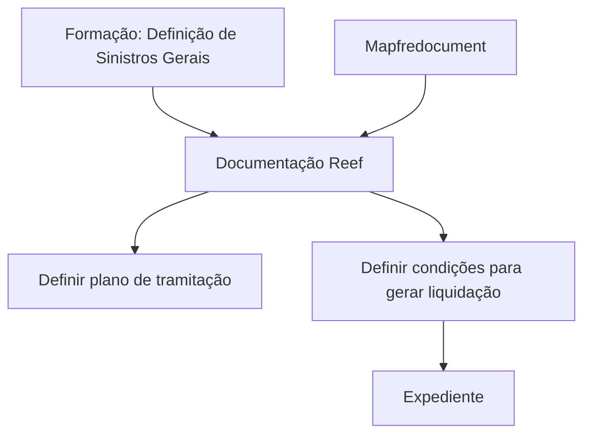
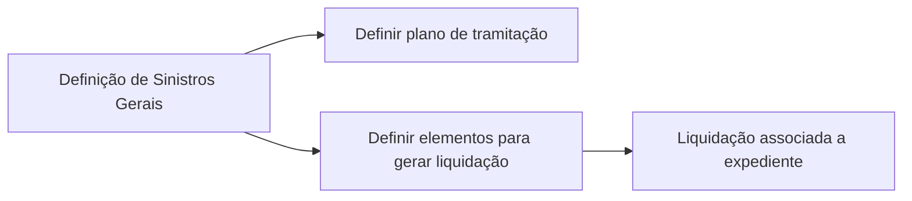

# Formação — Definição de Sinistros Gerais

## 1. Metadados do Documento
- **Arquivo de Origem:** Não identificado
- **Tipo de Documento:** Apresentação Executiva / Material de Formação
- **Domínio / Sistema:** Reef; Sinistros Gerais; Mapfre
- **Público-Alvo:** Usuários envolvidos na definição e tramitação de sinistros
- **Data/Versão Identificada:** Não identificada

---

## 2. Resumo Executivo & Contexto de Negócio

O documento apresenta uma formação sobre a definição de sinistros gerais no contexto de Reef. O conteúdo indica foco em atividades de configuração ou definição relacionadas ao processo de tramitação de sinistros.

A apresentação relaciona duas questões funcionais centrais: como definir um plano de tramitação e quais definições são necessárias para gerar uma liquidação para um expediente. O texto não detalha etapas, campos, regras de cálculo, contratos ou critérios de validação dessas atividades.

O material está associado à documentação Reef e ao ambiente documental Mapfredocument. A origem indicada no conteúdo possui ciclo de vida aprovado, com referência a `VL`.

O conteúdo extraído é resumido e não fornece descrição operacional adicional. Portanto, este relatório preserva os termos apresentados sem inferir comportamentos técnicos não documentados.

---

## 3. Arquitetura, Componentes & Tecnologias Envolvidas

Os elementos explicitamente citados são:

| Componente / Termo | Papel identificado no conteúdo |
| :--- | :--- |
| Reef | Sistema ou domínio documental mencionado como “DOCUMENTACIÓN Reef”. |
| Sinistros Gerais | Tema da formação e domínio funcional abordado. |
| Plano de tramitação | Elemento que o documento apresenta como passível de definição. |
| Liquidação | Processo ou resultado cuja geração para um expediente é mencionada. |
| Expediente | Entidade de negócio associada à geração de uma liquidação. |
| Mapfredocument | Ambiente, plataforma ou repositório documental citado no cabeçalho. |
| Zeus | Item disponível na navegação documental apresentada. |
| Arquiteturas | Categoria disponível na navegação documental apresentada. |
| APIs | Categoria disponível na navegação documental apresentada. |
| Componentes | Categoria disponível na navegação documental apresentada. |
| Cloud | Categoria disponível na navegação documental apresentada. |



> **Nota de Análise:** O conteúdo não descreve arquitetura de software, integrações, microsserviços, protocolos, APIs, bancos de dados ou tecnologias de implementação.

---

## 4. Regras de Negócio, Especificações Funcionais & Processos

### Definição de plano de tramitação

O documento formula a pergunta: “¿Cómo puedo definir un plan de tramitación?”. A extração não apresenta o procedimento, os campos necessários, os responsáveis, as condições de ativação ou as regras aplicáveis ao plano de tramitação.

### Geração de liquidação para expediente

O documento formula a pergunta: “¿Qué tengo que definir para generar una liquidación a un expediente?”. A extração não especifica quais definições são necessárias, nem descreve pré-requisitos, cálculos, validações, estados do expediente ou resultado esperado da liquidação.

### Fluxo funcional identificável



> **Nota de Análise:** O fluxo representa exclusivamente as relações declaradas pelos títulos e perguntas do material. Não há detalhamento suficiente para estabelecer sequência operacional obrigatória, regras de aprovação ou automações.

---

## 5. Tabelas de Parâmetros, Ambientes e Estruturas de Dados

| Item / Parâmetro | Descrição / Função | Tipo / Valores / Formato | Ambiente / Observações |
| :--- | :--- | :--- | :--- |
| Plano de tramitação | Elemento cuja definição é tratada na formação. | Não detalhado. | Associado ao tema de sinistros gerais. |
| Liquidação | Elemento que pode ser gerado para um expediente. | Não detalhado. | O documento não define pré-requisitos. |
| Expediente | Entidade que recebe ou está associada a uma liquidação. | Não detalhado. | Não são informados atributos ou estados. |
| Reef | Referência documental e de domínio. | “DOCUMENTACIÓN Reef”. | Disponível na navegação documental. |
| Mapfredocument | Referência a ambiente, plataforma ou repositório documental. | Texto literal: `Mapfredocument`. | Não há URL identificada. |
| Owner | Proprietário indicado no conteúdo. | `user:agonzalez_mapfre.com` | Mantido conforme texto extraído. |
| Lifecycle | Estado de ciclo de vida da fonte. | `Approved Source / VL` | Não há explicação para `VL`. |
| Idioma | Idioma exibido na navegação. | `ES` | O conteúdo principal está em espanhol. |

---

## 6. Bateria de Perguntas & Respostas para RAG (FAQ Sintético)

### P1: Qual é o tema central da formação apresentada?
**R:** O tema central é a definição de sinistros gerais, conforme o título “FORMACIÓN DEFINICIÓN de SINIESTROS-Generales”.

### P2: O documento explica como definir um plano de tramitação?
**R:** O documento apresenta a pergunta “¿Cómo puedo definir un plan de tramitación?”, mas o texto extraído não contém o procedimento, os parâmetros ou as regras para efetuar essa definição.

### P3: Quais definições são necessárias para gerar uma liquidação para um expediente?
**R:** O material pergunta “¿Qué tengo que definir para generar una liquidación a un expediente?”, porém não informa quais definições, campos, regras ou condições são necessários.

### P4: Qual sistema ou domínio documental é mencionado no conteúdo?
**R:** O conteúdo menciona “DOCUMENTACIÓN Reef”, indicando Reef como referência documental ou de domínio do material.

### P5: O documento fornece detalhes de APIs ou integrações do Reef?
**R:** Não. Embora a navegação apresente a categoria “APIs”, o texto não descreve endpoints, contratos, métodos HTTP, autenticação ou integrações.

### P6: O que é Mapfredocument segundo o documento?
**R:** Mapfredocument é citado no cabeçalho do conteúdo, mas o documento não explica se representa uma aplicação, repositório, ambiente ou serviço.

### P7: Qual é o status de ciclo de vida identificado para a fonte?
**R:** O conteúdo informa `Lifecycle Approved Source / VL`. Não há definição adicional para a sigla `VL`.

### P8: Quem é indicado como owner do documento?
**R:** O campo `Owner` apresenta o valor `user:agonzalez_mapfre.com`.

### P9: O documento contém regras de negócio para cálculo de liquidação?
**R:** Não. A extração apenas menciona a geração de uma liquidação para um expediente, sem valores, fórmulas, critérios ou regras de cálculo.

### P10: Quais categorias estão disponíveis na navegação documental exibida?
**R:** A navegação apresenta, entre outros itens: Buscar, Inicio, Soluciones, Arquitecturas, APIs, Componentes, Cloud, Documentación, Zeus, Reef e Ayuda.

---

## 7. Glossário de Termos, Siglas & Conceitos-Chave

- **Reef:** Referência documental ou de domínio mencionada como “DOCUMENTACIÓN Reef”.
- **Sinistros Gerais:** Tema funcional da formação apresentada.
- **Plano de tramitação:** Plano cuja definição é citada como questão da formação; o conteúdo não define seu significado operacional.
- **Liquidação:** Elemento que o documento menciona como gerável para um expediente; sem detalhamento funcional.
- **Expediente:** Entidade de negócio associada à geração de uma liquidação.
- **Mapfredocument:** Termo exibido no conteúdo; não há definição adicional.
- **Owner:** Campo que identifica o proprietário da fonte documental.
- **Lifecycle:** Campo de ciclo de vida da fonte documental.
- **VL:** Valor ou sigla exibida junto ao ciclo de vida; significado não identificado no texto.
- **Zeus:** Item de navegação documental; significado não detalhado.

---

## 8. Notas Críticas, Riscos & Limitações

- O conteúdo extraído é predominantemente um índice ou capa de formação, sem desenvolvimento dos tópicos apresentados.
- Não há regras operacionais para definição de plano de tramitação.
- Não há critérios, parâmetros, fórmulas ou validações para geração de liquidação em expediente.
- Não há especificações de APIs, integrações, arquitetura técnica, ambientes, URLs, credenciais ou rotas de logs.
- A sigla `VL` aparece no ciclo de vida da fonte, mas não é explicada.
- **Nota de Análise:** O documento cita Reef, Mapfredocument e Zeus, porém não fornece detalhes técnicos ou funcionais suficientes para caracterizá-los além dos termos literais apresentados.

---

## 9. Conteúdo Bruto Estruturado (Referência Fiel)

```text
--- [PÁGINA 1 DE 1] ---

FORMACIÓN DEFINICIÓN de SINIESTROS-Generales
CONTENIDO
¿Cómo puedo denir un plan de tramitación?
¿Qué tengo que denir para generar una liquidación a un expediente?
Documentation / DOCUMENTACIÓN Reef
DOCUMENTACIÓN Reef
Mapfredocument
DOCUMENTACIÓN Reef
Owner
user:agonzalez_mapfre.com
Lifecycle
Approved Source
 / 
 VL
Buscar Inicio Soluciones Arquitecturas APIs Componentes Cloud Documentación Zeus Reef Ayuda
ES
```
