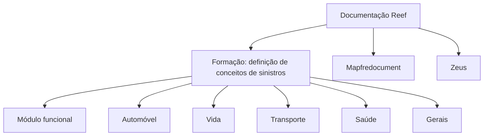

# Formação: Definição de Conceitos de Sinistros por Tipos de Negócio

## 1. Metadados do Documento
- **Arquivo de Origem:** Não identificado no conteúdo extraído
- **Tipo de Documento:** Material de formação / documentação
- **Domínio / Sistema:** Reef; Mapfredocument; conceitos de sinistros
- **Público-Alvo:** Não identificado
- **Data/Versão Identificada:** Não identificada

---

## 2. Resumo Executivo & Contexto de Negócio

O conteúdo apresenta uma formação sobre a definição de conceitos de sinistros. O objetivo declarado é definir os elementos e a ordem necessária para realizar operações com um módulo funcional.

A formação organiza os conceitos de sinistros por tipos de negócio. Os tipos explicitamente listados são Automóvel, Vida, Transporte, Saúde e Gerais.

O conteúdo também referencia a documentação Reef, Mapfredocument e a área de documentação Reef. Não há descrição adicional sobre a arquitetura, contratos, integrações, regras de cálculo ou operações específicas do módulo funcional.

A interface de documentação exibida contém opções de navegação como Soluções, Arquiteturas, APIs, Componentes, Cloud, Documentação, Zeus, Reef e Ajuda, além do idioma `ES`. O material identifica `user:agonzalez_mapfre.com` como owner e apresenta o ciclo de vida como `Approved Source / VL`.

---

## 3. Arquitetura, Componentes & Tecnologias Envolvidas

Os elementos técnicos e documentais identificados são:

- **Reef:** Referenciado como contexto de documentação.
- **Mapfredocument:** Referenciado no conteúdo como `Mapfredocument`.
- **Módulo funcional:** Mencionado como o elemento no qual podem ser realizadas operações após a definição dos conceitos.
- **Documentação Reef:** Área de documentação apresentada na interface.
- **Zeus:** Item de navegação da interface, sem detalhamento funcional.
- **APIs, Componentes, Cloud e Arquiteturas:** Categorias de navegação exibidas, sem detalhamento adicional.



> **Nota de Análise:** O conteúdo não descreve arquitetura de software, tecnologias de implementação, endpoints, métodos HTTP, contratos JSON, bancos de dados ou fluxos de integração.

---

## 4. Regras de Negócio, Especificações Funcionais & Processos

1. A formação trata da **definição de conceitos de sinistros**.
2. Devem ser definidos elementos e uma ordem necessária.
3. A finalidade declarada dessa definição e ordenação é permitir operações com um **módulo funcional**.
4. A definição de conceitos é classificada por tipos de negócio:
   - Automóvel;
   - Vida;
   - Transporte;
   - Saúde;
   - Gerais.
5. O conteúdo não especifica:
   - quais são os elementos que devem ser definidos;
   - qual é a ordem operacional detalhada;
   - quais operações podem ser executadas;
   - critérios de validação;
   - regras de cálculo;
   - responsabilidades por etapa;
   - exceções ou tratamento de erros.

---

## 5. Tabelas de Parâmetros, Ambientes e Estruturas de Dados

| Item / Parâmetro | Descrição / Função | Tipo / Valores / Formato | Ambiente / Observações |
| :--- | :--- | :--- | :--- |
| Tema da formação | Definição de conceitos de sinistros | Texto | Material de formação |
| Finalidade declarada | Permitir operações com um módulo funcional | Processo / objetivo | Sem operações detalhadas |
| Tipo de negócio | Classificação apresentada para definição de conceitos | Automóvel | Sem detalhamento adicional |
| Tipo de negócio | Classificação apresentada para definição de conceitos | Vida | Sem detalhamento adicional |
| Tipo de negócio | Classificação apresentada para definição de conceitos | Transporte | Sem detalhamento adicional |
| Tipo de negócio | Classificação apresentada para definição de conceitos | Saúde | Sem detalhamento adicional |
| Tipo de negócio | Classificação apresentada para definição de conceitos | Gerais | Sem detalhamento adicional |
| Documentação | Área documental referenciada | Documentation / DOCUMENTACIÓN Reef | Sem URL identificada |
| Sistema ou referência documental | Item textual citado | Mapfredocument | Função não detalhada |
| Owner | Responsável exibido no conteúdo | `user:agonzalez_mapfre.com` | Valor literal extraído |
| Lifecycle | Estado de ciclo de vida exibido | `Approved Source / VL` | Significado de `VL` não detalhado |
| Idioma | Idioma exibido na interface | `ES` | Não há explicação adicional |
| Navegação | Categorias exibidas | Buscar, Inicio, Soluciones, Arquitecturas, APIs, Componentes, Cloud, Documentación, Zeus, Reef, Ayuda | Itens de interface; funções não detalhadas |

---

## 6. Bateria de Perguntas & Respostas para RAG (FAQ Sintético)

### P1: Qual é o objetivo da formação sobre definição de conceitos de sinistros?
**R:** O objetivo declarado é definir os elementos e a ordem necessária para realizar operações com um módulo funcional.

### P2: Quais tipos de negócio são citados na definição de conceitos de sinistros?
**R:** O conteúdo lista os tipos de negócio Automóvel, Vida, Transporte, Saúde e Gerais.

### P3: O documento explica quais elementos precisam ser definidos antes de operar o módulo funcional?
**R:** Não. O documento afirma que elementos devem ser definidos, mas não identifica quais são esses elementos.

### P4: O documento detalha a ordem de execução das operações do módulo funcional?
**R:** Não. O conteúdo menciona que existe uma ordem necessária, porém não apresenta etapas, sequência operacional ou critérios de transição.

### P5: Quais operações do módulo funcional são descritas no material?
**R:** Nenhuma operação específica é descrita. O conteúdo somente informa que a definição de elementos e ordem permite realizar operações com um módulo funcional.

### P6: Quais referências documentais aparecem no conteúdo?
**R:** As referências documentais apresentadas são `Documentation / DOCUMENTACIÓN Reef`, `DOCUMENTACIÓN Reef` e `Mapfredocument`.

### P7: Quem aparece como owner do documento ou conteúdo documentado?
**R:** O owner exibido literalmente é `user:agonzalez_mapfre.com`.

### P8: Qual ciclo de vida está identificado na interface documental?
**R:** O ciclo de vida exibido é `Approved Source / VL`. O conteúdo não define o significado de `VL`.

### P9: Quais categorias de navegação aparecem na interface de documentação?
**R:** A interface mostra Buscar, Inicio, Soluciones, Arquitecturas, APIs, Componentes, Cloud, Documentación, Zeus, Reef e Ayuda.

### P10: Há detalhes sobre APIs, integrações ou contratos técnicos?
**R:** Não. Embora `APIs` apareça como item de navegação, o material não descreve endpoints, métodos HTTP, autenticação, payloads ou contratos de integração.

---

## 7. Glossário de Termos, Siglas & Conceitos-Chave

- **Sinistros:** Termo central da formação; o conteúdo não apresenta uma definição conceitual adicional.
- **Módulo funcional:** Módulo mencionado como destino das operações; não detalhado.
- **Reef:** Nome presente em referências de documentação e navegação; não expandido ou definido no conteúdo.
- **Mapfredocument:** Referência textual presente no documento; função não detalhada.
- **Zeus:** Item de navegação presente na interface; função não detalhada.
- **Lifecycle:** Campo de ciclo de vida exibido como `Approved Source / VL`.
- **VL:** Sigla ou valor exibido no campo Lifecycle; significado não informado.
- **ES:** Código de idioma exibido na interface; o conteúdo não fornece explicação adicional.

---

## 8. Notas Críticas, Riscos & Limitações

- O extrato possui baixa densidade de especificação funcional e técnica.
- Não há definição dos elementos necessários para operar o módulo funcional.
- Não há sequência operacional detalhada para os tipos de negócio listados.
- Não há regras de negócio específicas por Automóvel, Vida, Transporte, Saúde ou Gerais.
- Não há informações sobre arquitetura de software, infraestrutura, ambientes, URLs, credenciais, logs, APIs ou integrações.
- `Reef`, `Mapfredocument`, `Zeus` e `VL` são citados sem definição contextual suficiente.
- A classificação do material como documentação/formação é baseada nos rótulos visíveis; o conteúdo não apresenta versão, data, autoria formal ou nome de arquivo.

---

## 9. Conteúdo Bruto Estruturado (Referência Fiel)

```text
--- [PÁGINA 1 DE 1] ---

FORMACIÓN DEFINICIÓN de CONCEPTOS de SINIESTROS
 Elementos que se han de denir así como el orden necesario a seguir con el n de poder realizar operaciones con un módulo
funcional.
DEFINICIÓN POR TIPOS DE NEGOCIO
 AUTOMÓVIL
  VIDA
  TRANSPORTE
 SALUD
  GENERALES
Documentation / DOCUMENTACIÓN Reef
DOCUMENTACIÓN Reef
Mapfredocument
DOCUMENTACIÓN Reef
Owner
user:agonzalez_mapfre.com
Lifecycle
Approved Source
 / 
 VL
Buscar Inicio Soluciones Arquitecturas APIs Componentes Cloud Documentación Zeus Reef Ayuda
ES
```
