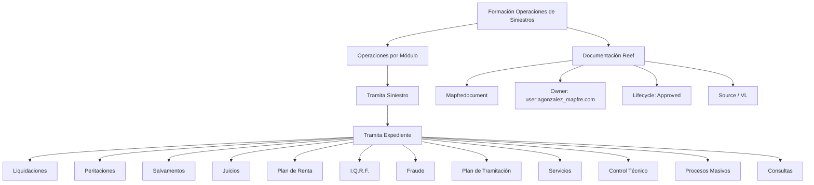

# Formação de Operações de Sinistros — Módulos de Tramitação e Documentação Reef

## 1. Metadados do Documento
- **Arquivo de Origem:** Não identificado no conteúdo fornecido
- **Tipo de Documento:** Apresentação Executiva
- **Domínio / Sistema:** Operações de Sinistros; Reef; MapfreDocument
- **Público-Alvo:** Operação, Negócio e usuários de documentação corporativa
- **Data/Versão Identificada:** Não identificada

---

## 2. Resumo Executivo & Contexto de Negócio

O conteúdo apresenta uma formação orientada às operações de sinistros, organizada segundo a operação e o tipo de negócio. A apresentação estrutura as operações por módulo e destaca a tramitação de sinistros e expedientes como temas centrais.

O fluxo funcional exibido inclui atividades ou módulos relacionados a liquidações, peritações, salvamentos, juízos, plano de renda, I.Q.R.F., fraude, plano de tramitação, serviços, controle técnico, processos massivos e consultas. O documento não descreve regras detalhadas, contratos de integração, responsáveis operacionais ou critérios de execução para essas atividades.

A documentação associada ao contexto é referenciada como “Documentación Reef”, “DOCUMENTACIÓN Reef” e “Mapfredocument”. O conteúdo também mostra uma interface de documentação com navegação para soluções, arquiteturas, APIs, componentes, cloud, documentação, Zeus, Reef e ajuda.

O registro exibido para a documentação Reef indica o usuário `agonzalez_mapfre.com`, lifecycle “Approved” e referência a “Source / VL”. Não há detalhamento adicional sobre o significado de “VL”, o processo de aprovação, permissões, versionamento ou governança documental.

---

## 3. Arquitetura, Componentes & Tecnologias Envolvidas

### Componentes e elementos identificados

| Componente / Elemento | Papel identificado no conteúdo | Detalhamento disponível |
| :--- | :--- | :--- |
| Operaciones de Siniestros | Domínio principal da formação apresentada | Organização por operação e tipo de negócio |
| Tramita Siniestro | Operação ou módulo citado | Não detalha fluxo, métodos ou regras |
| Tramita Expediente | Operação ou módulo citado | Associado à imagem de tramitação de expedientes |
| Liquidaciones | Módulo, atividade ou capacidade relacionada à tramitação | Sem detalhamento adicional |
| Peritaciones | Módulo, atividade ou capacidade relacionada à tramitação | Sem detalhamento adicional |
| Salvamentos | Módulo, atividade ou capacidade relacionada à tramitação | Sem detalhamento adicional |
| Juicios | Módulo, atividade ou capacidade relacionada à tramitação | Sem detalhamento adicional |
| Plan de Renta | Módulo, atividade ou capacidade relacionada à tramitação | Sem detalhamento adicional |
| I.Q.R.F. | Item ou módulo listado | Sigla não expandida no conteúdo |
| Fraude | Módulo, atividade ou capacidade relacionada à tramitação | Sem detalhamento adicional |
| Plan de Tramitación | Módulo ou plano de tramitação | Sem detalhamento adicional |
| Servicios | Módulo, atividade ou capacidade relacionada à tramitação | Sem detalhamento adicional |
| Control Técnico | Módulo, atividade ou capacidade relacionada à tramitação | Sem detalhamento adicional |
| Procesos Masivos | Módulo ou capacidade operacional | Sem detalhamento adicional |
| Consultas | Módulo ou capacidade operacional | Sem detalhamento adicional |
| Reef | Contexto de documentação corporativa | Referenciado em “Documentación Reef” |
| Mapfredocument | Sistema, repositório ou referência documental citada | Não detalhado |
| Zeus | Item de navegação na interface documental | Não detalhado |
| APIs | Categoria de navegação documental | Nenhuma API específica é apresentada |
| Cloud | Categoria de navegação documental | Nenhuma tecnologia ou ambiente é apresentado |



> **Nota de Análise:** O conteúdo apresenta uma hierarquia de módulos relacionados à tramitação de sinistros, mas não descreve integrações técnicas, protocolos, APIs, bancos de dados, métodos HTTP, contratos JSON, servidores, URLs ou ambientes de implantação.

---

## 4. Regras de Negócio, Especificações Funcionais & Processos

### Estrutura operacional apresentada

1. A formação é denominada **“FORMACIÓN OPERACIONES de SINIESTROS”**.
2. A formação é orientada à operação e ao tipo de negócio, conforme a frase: **“Formación orientada a la operación y tipo de negocio”**.
3. As operações são organizadas por módulo, conforme a seção **“OPERACIONES por MÓDULO”**.
4. O conteúdo identifica **“TRAMITA SINIESTRO”** como operação ou módulo de tramitação.
5. A tramitação inclui referência a uma imagem intitulada **“Imagen TRAMITACIÓN EXPEDIENTES”**.
6. O conteúdo identifica **“TRAMITA EXPEDIENTE”** como operação ou módulo associado à tramitação de expedientes.
7. Sob o contexto de tramitação de expediente, são listados: liquidaciones, peritaciones, salvamentos, juicios, plan de renta, I.Q.R.F., fraude, plan de tramitación, servicios, control técnico, procesos masivos e consultas.
8. Existe uma referência à documentação Reef e a Mapfredocument.
9. A documentação Reef exibida possui lifecycle identificado como **“Approved”**.
10. A documentação Reef exibida possui owner identificado como **`user:agonzalez_mapfre.com`**.

### Restrições de interpretação

- O conteúdo não especifica a sequência operacional entre os módulos listados.
- O conteúdo não determina se os itens apresentados são etapas obrigatórias, módulos independentes, categorias de negócio ou funcionalidades opcionais.
- O conteúdo não fornece regras de cálculo para liquidações, plano de renda, peritações, fraude ou controle técnico.
- O conteúdo não define o significado da sigla **I.Q.R.F.**
- O conteúdo não apresenta critérios de aprovação, rejeição, encaminhamento, encerramento ou reabertura de sinistros ou expedientes.
- O conteúdo não descreve autenticação, autorização, matriz de perfis ou permissões da documentação Reef.

---

## 5. Tabelas de Parâmetros, Ambientes e Estruturas de Dados

| Item / Parâmetro | Descrição / Função | Tipo / Valores / Formato | Ambiente / Observações |
| :--- | :--- | :--- | :--- |
| Formação | Formação de operações de sinistros | Texto: “FORMACIÓN OPERACIONES de SINIESTROS” | Sem data ou versão |
| Orientação da formação | Orientada à operação e tipo de negócio | Texto | Não detalha segmentos ou tipos de negócio |
| Organização funcional | Operações por módulo | Texto: “OPERACIONES por MÓDULO” | Não detalha a taxonomia dos módulos |
| Operação principal | Tramita Siniestro | Texto: “TRAMITA SINIESTRO” | Sem fluxo detalhado |
| Operação associada | Tramita Expediente | Texto: “TRAMITA EXPEDIENTE” | Associada a tramitação de expedientes |
| Módulo / atividade | Liquidaciones | Texto | Sem regras de liquidação |
| Módulo / atividade | Peritaciones | Texto | Sem regras de perícia |
| Módulo / atividade | Salvamentos | Texto | Sem detalhamento |
| Módulo / atividade | Juicios | Texto | Sem detalhamento |
| Módulo / atividade | Plan de Renta | Texto | Sem detalhamento |
| Módulo / atividade | I.Q.R.F. | Sigla não expandida | Sem detalhamento |
| Módulo / atividade | Fraude | Texto | Sem regras ou critérios de fraude |
| Módulo / atividade | Plan de Tramitación | Texto | Sem detalhamento |
| Módulo / atividade | Servicios | Texto | Sem detalhamento |
| Módulo / atividade | Control Técnico | Texto | Sem critérios técnicos |
| Módulo / atividade | Procesos Masivos | Texto | Sem descrição de execução |
| Módulo / atividade | Consultas | Texto | Sem tipos de consulta |
| Repositório / documentação | Documentación Reef | Texto | Também apresentado como “DOCUMENTACIÓN Reef” |
| Sistema ou referência documental | Mapfredocument | Texto | Não detalhado |
| Owner | Proprietário exibido para a documentação Reef | `user:agonzalez_mapfre.com` | O conteúdo não define se é usuário, grupo ou e-mail |
| Lifecycle | Estado do ciclo de vida do conteúdo | `Approved` | Sem processo de aprovação descrito |
| Source | Campo de origem exibido | `VL` | Significado de “VL” não identificado |
| Idioma da interface | Idioma exibido | `ES` | Interface apresentada em espanhol |
| Navegação documental | Itens disponíveis na interface | Buscar, Inicio, Soluciones, Arquitecturas, APIs, Componentes, Cloud, Documentación, Zeus, Reef, Ayuda | Nenhuma rota, URL ou permissão é fornecida |

---

## 6. Bateria de Perguntas & Respostas para RAG (FAQ Sintético)

### P1: Qual é o tema central da formação apresentada?
**R:** A formação trata de operações de sinistros. O conteúdo identifica o tema como “FORMACIÓN OPERACIONES de SINIESTROS” e informa que a formação é orientada à operação e ao tipo de negócio.

### P2: Como as operações de sinistros estão organizadas no documento?
**R:** As operações são organizadas por módulo, conforme a seção “OPERACIONES por MÓDULO”. O documento não detalha a estrutura técnica ou a sequência obrigatória entre os módulos.

### P3: Quais operações de tramitação são explicitamente citadas?
**R:** O conteúdo cita “TRAMITA SINIESTRO” e “TRAMITA EXPEDIENTE”. Também há uma referência visual intitulada “Imagen TRAMITACIÓN EXPEDIENTES”.

### P4: Quais módulos ou atividades estão relacionados à tramitação de expediente?
**R:** O documento lista liquidaciones, peritaciones, salvamentos, juicios, plan de renta, I.Q.R.F., fraude, plan de tramitación, servicios, control técnico, procesos masivos e consultas.

### P5: O documento define regras de cálculo para liquidaciones ou plan de renta?
**R:** Não. O conteúdo apenas lista “LIQUIDACIONES” e “PLAN DE RENTA” entre os elementos associados à tramitação de expediente. Não há fórmulas, critérios de cálculo, parâmetros ou condições de negócio apresentados.

### P6: O que significa a sigla I.Q.R.F.?
**R:** O significado de I.Q.R.F. não é definido no conteúdo fornecido. A sigla aparece apenas como um item listado no contexto de “TRAMITA EXPEDIENTE”.

### P7: Quais informações de governança estão disponíveis para a documentação Reef?
**R:** A documentação Reef exibida apresenta o owner `user:agonzalez_mapfre.com`, lifecycle “Approved” e a referência “Source / VL”. O conteúdo não explica o processo de aprovação nem o significado de “VL”.

### P8: Qual sistema ou repositório documental é citado junto à documentação Reef?
**R:** O conteúdo cita “Mapfredocument” no contexto de “Documentation / DOCUMENTACIÓN Reef”. Não há detalhes sobre funcionalidades, integração ou localização do sistema.

### P9: Quais categorias estão disponíveis na navegação da interface documental mostrada?
**R:** A navegação exibida contém Buscar, Inicio, Soluciones, Arquitecturas, APIs, Componentes, Cloud, Documentación, Zeus, Reef e Ayuda. O idioma exibido na interface é “ES”.

### P10: O documento descreve APIs, URLs, ambientes ou contratos de integração?
**R:** Não. Embora “APIs” e “Cloud” apareçam como itens de navegação da interface, o conteúdo não fornece nomes de APIs, URLs, portas, ambientes, protocolos, métodos HTTP ou contratos de dados.

### P11: O documento define um fluxo obrigatório entre peritaciones, fraude e control técnico?
**R:** Não. Peritaciones, fraude e control técnico são listados no conjunto relacionado a “TRAMITA EXPEDIENTE”, mas não existe uma sequência de execução, dependência ou regra de encaminhamento explícita.

### P12: Qual é o status de lifecycle apresentado para a documentação Reef?
**R:** O lifecycle exibido para a documentação Reef é “Approved”. O documento não informa quem aprovou, em que data ocorreu a aprovação ou quais critérios foram utilizados.

---

## 7. Glossário de Termos, Siglas & Conceitos-Chave

- **Siniestros:** Termo apresentado no título da formação; refere-se ao domínio de operações de sinistros no documento.
- **Tramita Siniestro:** Operação ou módulo listado no contexto de operações de sinistros.
- **Tramita Expediente:** Operação ou módulo listado para tramitação de expedientes.
- **Expediente:** Termo utilizado na expressão “TRAMITACIÓN EXPEDIENTES”; não recebe definição adicional.
- **Liquidaciones:** Item listado no contexto de tramitação de expediente.
- **Peritaciones:** Item listado no contexto de tramitação de expediente.
- **Salvamentos:** Item listado no contexto de tramitação de expediente.
- **Juicios:** Item listado no contexto de tramitação de expediente.
- **Plan de Renta:** Item listado no contexto de tramitação de expediente.
- **I.Q.R.F.:** Sigla listada no contexto de tramitação de expediente; significado não informado.
- **Fraude:** Item listado no contexto de tramitação de expediente.
- **Plan de Tramitación:** Item listado no contexto de tramitação de expediente.
- **Control Técnico:** Item listado no contexto de tramitação de expediente.
- **Procesos Masivos:** Item listado no contexto de tramitação de expediente.
- **Reef:** Contexto ou área de documentação corporativa citada no conteúdo.
- **Mapfredocument:** Sistema, repositório ou referência documental citada; sem definição adicional.
- **Lifecycle:** Campo de ciclo de vida exibido para a documentação Reef, com valor “Approved”.
- **Approved:** Estado de lifecycle exibido para a documentação Reef.
- **VL:** Valor exibido no campo “Source”; significado não informado.
- **Zeus:** Item de navegação apresentado na interface documental; sem definição adicional.

---

## 8. Notas Críticas, Riscos & Limitações

- O material contém principalmente títulos, categorias e listas de módulos; não apresenta detalhamento funcional aprofundado para cada item.
- Não foram identificadas regras de negócio explícitas para liquidações, peritações, fraude, plano de renda, controle técnico ou processos massivos.
- Não foram identificados contratos de integração, APIs, endpoints, URLs, métodos HTTP, esquemas de dados, credenciais, servidores ou ambientes.
- A sigla **I.Q.R.F.** não é expandida ou explicada.
- A referência **“Source / VL”** é apresentada sem contexto suficiente para identificar sua finalidade.
- O documento não explica a relação operacional entre “Tramita Siniestro” e “Tramita Expediente”.
- A imagem de tramitação de expedientes é apenas referenciada textualmente; seus elementos visuais e suas conexões não estão disponíveis no conteúdo bruto fornecido.
- A navegação para APIs, Cloud, Arquiteturas e Componentes não deve ser interpretada como evidência de tecnologias ou integrações específicas, pois nenhuma delas é descrita.

---

## 9. Conteúdo Bruto Estruturado (Referência Fiel)

```text
--- [PÁGINA 1 DE 1] ---

FORMACIÓN OPERACIONES de SINIESTROS
 Formación orientada a la operación y tipo de negocio
OPERACIONES por MÓDULO
 TRAMITA SINIESTRO
Imagen TRAMITACIÓN EXPEDIENTES
TRAMITA EXPEDIENTE
  LIQUIDACIONES
 PERITACIONES
  SALVAMENTOS
  JUICIOS
 PLAN DE RENTA
  I.Q.R.F.
  FRAUDE
 PLAN DE TRAMITACIÓN
  SERVICIOS
  CONTROL TÉCNICO
 PROCESOS MASIVOS
  CONSULTAS
Documentation / DOCUMENTACIÓN Reef
DOCUMENTACIÓN Reef
Mapfredocument
DOCUMENTACIÓN Reef
Owner
user:agonzalez_mapfre.com
Lifecycle
Approved Source
 / 
 VL
Buscar Inicio Soluciones Arquitecturas APIs Componentes Cloud Documentación Zeus Reef Ayuda
ES
```
