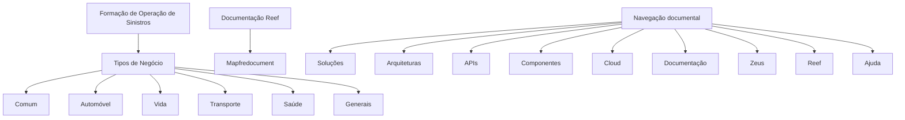

# Formação de Operação de Sinistros — Tipos de Negócio e Documentação Reef

## 1. Metadados do Documento
- **Arquivo de Origem:** Não identificado no conteúdo fornecido
- **Tipo de Documento:** Apresentação Executiva
- **Domínio / Sistema:** Operação de Sinistros; Reef; Mapfredocument
- **Público-Alvo:** Operação, Negócio e usuários de documentação corporativa
- **Data/Versão Identificada:** Não identificada

---

## 2. Resumo Executivo & Contexto de Negócio

O documento apresenta uma formação voltada à operação de sinistros, orientada pela operação e pelo tipo de negócio. O conteúdo identifica categorias de negócio associadas ao contexto de sinistros: Comum, Automóvel, Vida, Transporte, Saúde e Generais.

A apresentação também referencia a documentação Reef, apresentada sob os termos “Documentation / DOCUMENTACIÓN Reef” e “DOCUMENTACIÓN Reef”. O texto cita ainda o repositório ou ambiente “Mapfredocument”.

O conteúdo disponibilizado não detalha fluxos operacionais de sinistros, regras de elegibilidade, etapas de atendimento, responsabilidades por tipo de negócio ou contratos técnicos entre sistemas. A principal informação operacional explícita é a classificação por tipos de negócio.

O documento também exibe elementos de navegação de uma plataforma documental, incluindo Soluções, Arquiteturas, APIs, Componentes, Cloud, Documentação, Zeus, Reef e Ajuda. Esses elementos indicam uma estrutura de consulta documental, mas o texto não descreve suas funcionalidades.

---

## 3. Arquitetura, Componentes & Tecnologias Envolvidas

### Componentes e referências identificadas

| Componente / Referência | Classificação | Descrição sustentada pelo conteúdo |
| :--- | :--- | :--- |
| Operação de Sinistros | Domínio operacional | Tema central da formação apresentada. |
| Tipos de Negócio | Classificação funcional | Categorias listadas: Comum, Automóvel, Vida, Transporte, Saúde e Generais. |
| Reef | Documentação / sistema citado | Referenciado em “DOCUMENTACIÓN Reef” e na navegação da plataforma. |
| Mapfredocument | Repositório ou plataforma documental citada | Nome exibido no conteúdo, sem detalhamento funcional adicional. |
| Zeus | Sistema ou área de navegação citada | Item presente no menu de navegação, sem descrição adicional. |
| Soluções | Área de navegação | Item de navegação listado no conteúdo. |
| Arquiteturas | Área de navegação | Item de navegação listado no conteúdo. |
| APIs | Área de navegação | Item de navegação listado no conteúdo. |
| Componentes | Área de navegação | Item de navegação listado no conteúdo. |
| Cloud | Área de navegação | Item de navegação listado no conteúdo. |
| Ajuda | Área de navegação | Item de navegação listado no conteúdo. |



> **Nota de Análise:** O conteúdo não descreve integrações, protocolos, APIs, microsserviços, bancos de dados, ambientes técnicos ou fluxos de dados entre Reef, Mapfredocument, Zeus e a operação de sinistros.

---

## 4. Regras de Negócio, Especificações Funcionais & Processos

### Classificação por tipos de negócio

A formação de operação de sinistros está orientada pela operação e pelo tipo de negócio. Os tipos de negócio explicitamente listados são:

1. **Comum**
2. **Automóvel**
3. **Vida**
4. **Transporte**
5. **Saúde**
6. **Generais**

O documento não apresenta regras de encaminhamento, critérios de classificação, fórmulas de cálculo, validações, prazos, estados de sinistro, regras de aprovação ou procedimentos específicos para cada tipo de negócio.

### Documentação Reef

O conteúdo referencia a documentação Reef e o nome Mapfredocument. Também exibe um usuário proprietário e um estado de ciclo de vida:

- Owner: `user:agonzalez_mapfre.com`
- Lifecycle: `Approved Source`
- Identificador adicional exibido: `VL`

> **Nota de Análise:** O documento não informa o significado de “VL”, a função do proprietário listado, nem os critérios para que um conteúdo tenha o ciclo de vida “Approved Source”.

---

## 5. Tabelas de Parâmetros, Ambientes e Estruturas de Dados

| Item / Parâmetro | Descrição / Função | Tipo / Valores / Formato | Ambiente / Observações |
| :--- | :--- | :--- | :--- |
| Formação de Operação de Sinistros | Formação orientada à operação e ao tipo de negócio | Título / tema de apresentação | Não há ambiente identificado |
| Tipo de Negócio | Classificação usada no contexto da formação | Comum, Automóvel, Vida, Transporte, Saúde, Generais | Não há critérios de uso descritos |
| Reef | Referência de documentação | “Documentation / DOCUMENTACIÓN Reef” | Sem URL, versão ou configuração técnica |
| Mapfredocument | Plataforma ou repositório documental citado | Nome textual | Sem detalhamento adicional |
| Owner | Proprietário exibido para a documentação | `user:agonzalez_mapfre.com` | Papel e responsabilidades não detalhados |
| Lifecycle | Estado de ciclo de vida exibido | `Approved Source` | Critérios do estado não informados |
| Identificador | Valor adicional mostrado junto ao ciclo de vida | `VL` | Significado não identificado |
| Idioma | Idioma selecionado na navegação | `ES` | Interface apresentada em espanhol |
| Menu documental | Seções disponíveis na navegação | Buscar, Inicio, Soluciones, Arquitecturas, APIs, Componentes, Cloud, Documentación, Zeus, Reef, Ayuda | Funcionalidades não detalhadas |

---

## 6. Bateria de Perguntas & Respostas para RAG (FAQ Sintético)

### P1: Qual é o tema principal do documento?
**R:** O documento aborda a formação de operação de sinistros, orientada pela operação e pelos tipos de negócio associados ao contexto de sinistros.

### P2: Quais tipos de negócio são listados para a operação de sinistros?
**R:** Os tipos de negócio listados são Comum, Automóvel, Vida, Transporte, Saúde e Generais.

### P3: O documento explica como classificar um sinistro entre Automóvel, Vida, Transporte, Saúde ou Generais?
**R:** Não. O documento apenas lista os tipos de negócio e não descreve critérios, regras de decisão ou procedimentos de classificação de sinistros.

### P4: O que é Reef no conteúdo apresentado?
**R:** Reef é referenciado como documentação, por meio das expressões “Documentation / DOCUMENTACIÓN Reef” e “DOCUMENTACIÓN Reef”. O texto não detalha a arquitetura, as funcionalidades ou o escopo técnico de Reef.

### P5: O documento menciona algum repositório ou plataforma de documentação?
**R:** Sim. O conteúdo menciona “Mapfredocument”, mas não explica sua função, localização, URL, permissões ou integração com outros sistemas.

### P6: Quem aparece como proprietário da documentação Reef?
**R:** O proprietário exibido no conteúdo é `user:agonzalez_mapfre.com`.

### P7: Qual é o ciclo de vida mostrado para o conteúdo de documentação?
**R:** O ciclo de vida mostrado é `Approved Source`. O documento não define os critérios, responsáveis ou efeitos operacionais desse estado.

### P8: Quais áreas aparecem no menu de navegação documental?
**R:** O menu apresenta Buscar, Inicio, Soluciones, Arquitecturas, APIs, Componentes, Cloud, Documentación, Zeus, Reef e Ayuda.

### P9: O documento fornece URLs, endpoints de API ou configurações de ambiente?
**R:** Não. O conteúdo não apresenta URLs, endpoints, portas, credenciais, servidores, versões, ambientes ou parâmetros de implantação.

### P10: Existem fluxos de integração entre a operação de sinistros, Reef e Mapfredocument?
**R:** Não há fluxo de integração descrito. O documento cita a operação de sinistros, Reef e Mapfredocument, mas não estabelece tecnicamente como esses elementos se conectam.

---

## 7. Glossário de Termos, Siglas & Conceitos-Chave

- **Operação de Sinistros:** Contexto operacional abordado pela formação.
- **Sinistros:** Termo central do documento; não possui definição adicional no conteúdo fornecido.
- **Tipos de Negócio:** Classificação apresentada para a formação: Comum, Automóvel, Vida, Transporte, Saúde e Generais.
- **Reef:** Referência de documentação corporativa citada no conteúdo.
- **Mapfredocument:** Nome de plataforma ou repositório documental citado sem descrição funcional.
- **Owner:** Campo exibido para indicar o proprietário da documentação.
- **Lifecycle:** Campo que apresenta o estado do conteúdo documental.
- **Approved Source:** Valor apresentado no campo Lifecycle.
- **VL:** Identificador exibido no conteúdo; significado não detalhado.
- **ES:** Indicador de idioma exibido na interface; corresponde à apresentação em espanhol.

---

## 8. Notas Críticas, Riscos & Limitações

- O conteúdo é resumido e não descreve processos operacionais completos para a gestão de sinistros.
- Não há definição dos critérios que distinguem Comum, Automóvel, Vida, Transporte, Saúde e Generais.
- Não foram identificados contratos de API, métodos HTTP, estruturas JSON, URLs, versões, servidores, portas ou configurações de ambiente.
- Reef, Mapfredocument e Zeus são citados, porém não possuem descrição técnica ou funcional suficiente para inferir responsabilidades ou integrações.
- O valor `VL` é apresentado sem explicação.
- O ciclo de vida `Approved Source` é exibido sem definição de governança, responsáveis ou regras de aprovação.
- Não há detalhes adicionais sobre o papel do proprietário `user:agonzalez_mapfre.com`.

---

## 9. Conteúdo Bruto Estruturado (Referência Fiel)

```text
--- [PÁGINA 1 DE 1] ---

FORMACIÓN de OPERACIÓN de SINIESTROS
Formación orientada a la operación y tipo de negocio
TIPOS DE NEGOCIO
 COMÚN
  AUTOMÓVIL
  VIDA
 TRANSPORTE
  SALUD
  GENERALES
Documentation / DOCUMENTACIÓN Reef
DOCUMENTACIÓN Reef
Mapfredocument
DOCUMENTACIÓN Reef
Owner
user:agonzalez_mapfre.com
Lifecycle
Approved Source
 / 
 VL
Buscar Inicio Soluciones Arquitecturas APIs Componentes Cloud Documentación Zeus Reef Ayuda
ES
```
