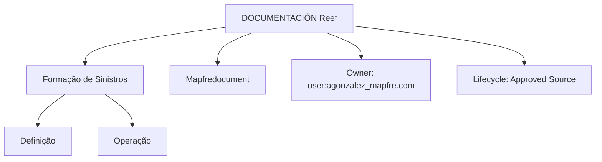

# Formação de Sinistros — Documentação Reef

## 1. Metadados do Documento
- **Arquivo de Origem:** Não identificado no conteúdo fornecido
- **Tipo de Documento:** Manual Operacional / Material de Formação
- **Domínio / Sistema:** Módulo de sinistros; Reef; Mapfredocument
- **Público-Alvo:** Utilizadores operacionais, analistas funcionais e equipas que consultam a documentação Reef
- **Data/Versão Identificada:** Não identificada

---

## 2. Resumo Executivo & Contexto de Negócio

O conteúdo apresentado introduz a formação relativa ao módulo de sinistros. A formação é organizada em dois eixos principais: **Definição** e **Operação**. Esta divisão indica uma separação entre atividades de configuração ou preparação do módulo e atividades práticas de utilização do módulo de sinistros.

A secção **Definição** é destinada a orientar perguntas relacionadas com a criação, configuração ou estabelecimento de elementos necessários no módulo. O documento exemplifica consultas como “Que passos devo seguir para poder definir...?”, “Como se define...?” e “O que faço se necessitar...?”. O conteúdo não especifica quais entidades, parâmetros, formulários ou regras podem ser definidos.

A secção **Operação** é destinada a orientar ações de utilização funcional do módulo de sinistros. São apresentados exemplos de consultas como “Como posso criar...?” e “O que faço para poder fazer...?”. O documento não detalha os procedimentos operacionais, telas, permissões, campos ou fluxos transacionais associados.

O material está associado a uma área de documentação denominada **DOCUMENTACIÓN Reef**, com referências a **Mapfredocument**, ao proprietário `user:agonzalez_mapfre.com`, ao ciclo de vida `Approved Source` e à navegação por áreas como Soluções, Arquiteturas, APIs, Componentes, Cloud, Documentação, Zeus e Reef.

---

## 3. Arquitetura, Componentes & Tecnologias Envolvidas

O conteúdo identifica os seguintes elementos documentais e funcionais:

| Componente / Área | Papel identificado no conteúdo |
| :--- | :--- |
| Formação de sinistros | Área de formação relativa ao módulo de sinistros. |
| Módulo de sinistros | Domínio funcional abordado pela formação. |
| Definição | Secção voltada a perguntas sobre definição e necessidades de configuração. |
| Operação | Secção voltada a perguntas sobre criação e execução de ações no módulo. |
| DOCUMENTACIÓN Reef | Área ou repositório de documentação referido no conteúdo. |
| Mapfredocument | Nome exibido na navegação ou identificação da documentação. |
| Zeus | Área de navegação mencionada junto de Reef. |
| Owner `user:agonzalez_mapfre.com` | Proprietário identificado para o conteúdo documentado. |
| Lifecycle `Approved Source` | Estado de ciclo de vida informado para o conteúdo. |



**Nota de Análise:** O conteúdo não apresenta arquitetura de software, microsserviços, integrações, contratos de API, bancos de dados, tecnologias de implementação, ambientes ou fluxos de dados do módulo de sinistros.

---

## 4. Regras de Negócio, Especificações Funcionais & Processos

### Estrutura da formação

A formação relativa ao módulo de sinistros está dividida nos seguintes apartados:

1. **Definição**
2. **Operação**

### Orientação da secção Definição

A secção Definição deve permitir obter respostas para perguntas do tipo:

1. Que passos devem ser seguidos para poder definir determinado elemento.
2. Como determinado elemento deve ser definido.
3. Que ação deve ser tomada quando existe uma necessidade específica.

O documento não identifica os objetos que podem ser definidos, nem apresenta sequência de telas, validações, regras de cálculo, campos obrigatórios, dependências ou responsabilidades.

### Orientação da secção Operação

A secção Operação deve permitir obter respostas para perguntas do tipo:

1. Como criar determinado elemento ou registo.
2. Que ação executar para conseguir realizar determinada operação.

O documento não identifica tipos de sinistro, estados operacionais, usuários responsáveis, regras de autorização, condições de criação, processos de aprovação ou ações posteriores à criação.

---

## 5. Tabelas de Parâmetros, Ambientes e Estruturas de Dados

| Item / Parâmetro | Descrição / Função | Tipo / Valores / Formato | Ambiente / Observações |
| :--- | :--- | :--- | :--- |
| Área de formação | Formação relativa ao módulo de sinistros. | Texto / área documental | Inserida em DOCUMENTACIÓN Reef. |
| Apartado 1 | Definição. | Secção funcional | Orientada a dúvidas sobre definição e necessidades. |
| Apartado 2 | Operação. | Secção funcional | Orientada a dúvidas sobre criação e realização de ações. |
| Owner | Proprietário do conteúdo. | `user:agonzalez_mapfre.com` | Valor literal apresentado no documento. |
| Lifecycle | Estado de ciclo de vida da documentação. | `Approved Source` | Valor literal apresentado no documento. |
| Idioma | Idioma exibido na navegação. | `ES` | O conteúdo principal está em espanhol. |
| Navegação | Áreas de acesso apresentadas. | Buscar; Inicio; Soluciones; Arquitecturas; APIs; Componentes; Cloud; Documentación; Zeus; Reef; Ayuda | Não há descrição funcional adicional para cada área. |

---

## 6. Bateria de Perguntas & Respostas para RAG (FAQ Sintético)

### P1: Qual é o tema principal do documento de formação?
**R:** O documento apresenta a formação relativa ao módulo de sinistros. A formação está organizada nas secções Definição e Operação.

### P2: Como está estruturada a formação do módulo de sinistros?
**R:** A formação do módulo de sinistros está dividida em dois apartados: Definição e Operação.

### P3: Que tipo de dúvidas a secção Definição pretende responder?
**R:** A secção Definição pretende responder a dúvidas sobre os passos necessários para definir algo, sobre como algo deve ser definido e sobre o que fazer quando surge uma necessidade específica.

### P4: O documento explica como definir entidades ou parâmetros específicos do módulo de sinistros?
**R:** Não. O documento apresenta exemplos de perguntas relacionadas com definição, mas não identifica entidades, parâmetros, campos, telas ou procedimentos específicos.

### P5: Que tipo de dúvidas a secção Operação pretende responder?
**R:** A secção Operação pretende responder a dúvidas sobre como criar algo e sobre o que fazer para conseguir realizar determinada ação no módulo de sinistros.

### P6: O documento detalha o processo de criação de um sinistro?
**R:** Não. O conteúdo apenas indica que a secção Operação deve responder a perguntas sobre criação, sem descrever etapas, regras, campos ou validações para criar um sinistro.

### P7: Qual é o repositório ou área documental mencionada no conteúdo?
**R:** O conteúdo menciona DOCUMENTACIÓN Reef e também exibe a identificação Mapfredocument.

### P8: Quem é identificado como proprietário da documentação?
**R:** O proprietário identificado no conteúdo é `user:agonzalez_mapfre.com`.

### P9: Qual é o ciclo de vida informado para o conteúdo?
**R:** O campo Lifecycle apresentado no conteúdo possui o valor `Approved Source`.

### P10: O documento descreve APIs, componentes técnicos ou arquitetura do módulo de sinistros?
**R:** Não. Embora a navegação apresente áreas como Arquiteturas, APIs, Componentes e Cloud, o conteúdo fornecido não descreve arquitetura técnica, APIs, integrações, tecnologias ou componentes do módulo de sinistros.

---

## 7. Glossário de Termos, Siglas & Conceitos-Chave

- **Sinistros:** Domínio funcional referido como módulo objeto da formação.
- **Definição:** Apartado da formação destinado a perguntas sobre como definir elementos ou atender necessidades de definição.
- **Operação:** Apartado da formação destinado a perguntas sobre criação e realização de ações.
- **DOCUMENTACIÓN Reef:** Área documental indicada no conteúdo.
- **Reef:** Nome associado à documentação e à área de navegação apresentada.
- **Mapfredocument:** Identificação exibida no conteúdo documental.
- **Owner:** Campo que identifica o proprietário do conteúdo.
- **Lifecycle:** Campo que identifica o estado de ciclo de vida do conteúdo.
- **Approved Source:** Valor apresentado para o campo Lifecycle.
- **Zeus:** Área de navegação mencionada junto com Reef.

---

## 8. Notas Críticas, Riscos & Limitações

- O conteúdo é introdutório e não detalha procedimentos concretos para definição ou operação no módulo de sinistros.
- Não foram identificados campos, parâmetros, regras de negócio específicas, fluxos de aprovação, estados de sinistro ou critérios de validação.
- Não foram identificados serviços, APIs, protocolos, URLs, ambientes, servidores, credenciais, caminhos de log ou tecnologias.
- A existência das secções Definição e Operação não permite inferir quais operações são suportadas pelo módulo.
- **Nota de Análise:** O documento menciona o módulo de sinistros, mas não detalha os processos funcionais, métodos de integração ou contratos técnicos expostos.
- **Nota de Análise:** As opções de navegação “Arquitecturas”, “APIs”, “Componentes” e “Cloud” são exibidas, porém não há conteúdo técnico associado a essas opções no trecho fornecido.

---

## 9. Conteúdo Bruto Estruturado (Referência Fiel)

```text
--- [PÁGINA 1 DE 1] ---

FORMACIÓN SINIESTROS
 En este apartado se encuentra la formación relativa al módulo de siniestros. Dicha formación está dividida en los apartados
siguientes:
Denición
Operación
DEFINICIÓN
Conseguir respuestas a preguntas del estilo:
¿Qué pasos he de seguir para poder denir...?
¿Cómo se dene...?
¿Qué hago si necesito...?
OPERACIÓN
Obtener respuestas a preguntas:
¿Cómo puedo crear...?
¿Qué hago para poder hacer...?
Documentation / DOCUMENTACIÓN Reef
DOCUMENTACIÓN Reef
Mapfredocument
DOCUMENTACIÓN Reef
Owner
user:agonzalez_mapfre.com
Lifecycle
Approved Source
 / 
 VL
Buscar Inicio Soluciones Arquitecturas APIs Componentes Cloud Documentación Zeus Reef Ayuda
ES
```
