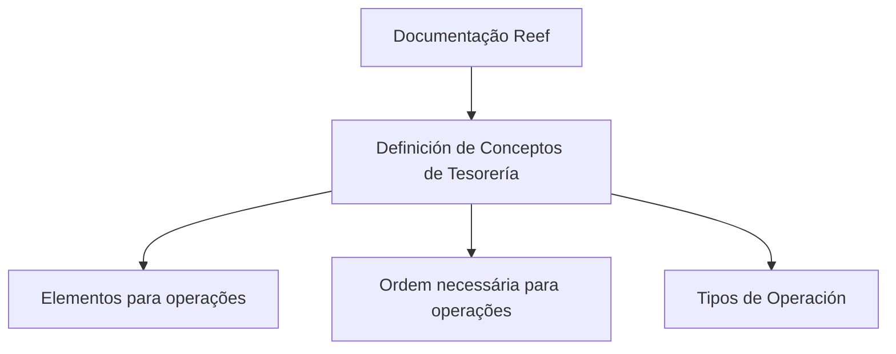
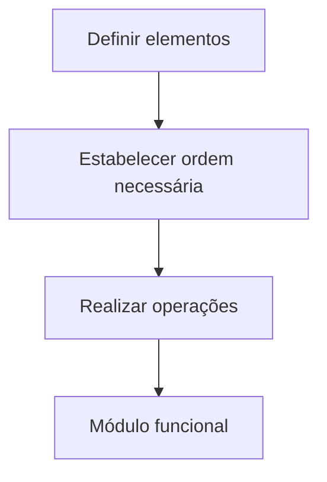

# Definición de Conceptos de Tesorería — Documentación Reef

## 1. Metadados do Documento
- **Arquivo de Origem:** Não identificado
- **Tipo de Documento:** Documentação funcional
- **Domínio / Sistema:** Tesouraria, Reef, Mapfre
- **Público-Alvo:** Negócio, desenvolvedores, arquitetos e operação
- **Data/Versão Identificada:** Não identificada

---

## 2. Resumo Executivo & Contexto de Negócio

O documento apresenta uma página de documentação denominada **“Definición de Conceptos de Tesorería”**, associada à documentação do sistema **Reef** e ao contexto corporativo **Mapfre**. O conteúdo declara como objetivo definir os elementos necessários e a ordem a seguir para realizar operações com um módulo funcional.

A seção identificada como **“Tipos de Operación”** sugere que o documento aborda classificações ou modalidades de operações de tesouraria. Entretanto, o trecho fornecido não detalha os tipos de operação, regras de execução, cálculos, validações ou fluxos funcionais correspondentes.

A origem parece ser uma plataforma corporativa de documentação, com elementos de navegação para Soluções, Arquiteturas, APIs, Componentes, Cloud, Documentação, Zeus, Reef e Ajuda. O artefato está identificado como aprovado, com referência a um proprietário associado ao endereço `user:agonzalez_mapfre.com`.

Não há informações suficientes para identificar integrações, contratos técnicos, ambientes, URLs, versões, tecnologias implementadas ou responsabilidades operacionais específicas.

---

## 3. Arquitetura, Componentes & Tecnologias Envolvidas

### Componentes e referências identificados

| Componente / Referência | Contexto identificado |
| :--- | :--- |
| Tesorería | Domínio funcional mencionado no título do documento. |
| Reef | Sistema ou área de documentação citada como “Documentation / DOCUMENTACIÓN Reef”. |
| Mapfre | Contexto corporativo indicado por “Mapfredocument” e pelo domínio do proprietário. |
| Zeus | Item de navegação da plataforma de documentação; não há detalhamento funcional. |
| Soluciones | Categoria de navegação. |
| Arquitecturas | Categoria de navegação. |
| APIs | Categoria de navegação. |
| Componentes | Categoria de navegação. |
| Cloud | Categoria de navegação. |
| Owner | Campo de propriedade documental. |
| Lifecycle | Campo de ciclo de vida documental. |
| Approved Source | Estado ou classificação exibida na fonte documental. |
| VL | Referência exibida junto ao estado documental, sem expansão ou explicação. |

> **Nota de Análise:** O conteúdo fornecido não descreve arquitetura de software, camadas, APIs, microsserviços, bancos de dados, tecnologias, protocolos ou fluxos de integração. Portanto, não é possível reconstruir um diagrama de arquitetura sem extrapolar o documento.



---

## 4. Regras de Negócio, Especificações Funcionais & Processos

### Objetivo funcional declarado

O documento estabelece que devem ser definidos:

1. Os elementos necessários para realizar operações.
2. A ordem que deve ser seguida para realizar operações.
3. A aplicação desses elementos e dessa ordem dentro de um módulo funcional.

### Processo identificado



### Regras e restrições explicitamente disponíveis

| Regra / Elemento | Descrição fiel ao conteúdo |
| :--- | :--- |
| Definição de conceitos de tesouraria | O documento trata da definição de conceitos no domínio de tesouraria. |
| Elementos necessários | Devem ser definidos os elementos requeridos para realizar operações. |
| Ordem necessária | Deve existir uma ordem a seguir para que as operações possam ser realizadas. |
| Módulo funcional | As operações referidas são realizadas com um módulo funcional. |
| Tipos de operação | O documento contém a seção “TIPOS DE OPERACIÓN”, mas não apresenta os tipos nem seus critérios. |

> **Nota de Análise:** O documento não detalha quais são os elementos, qual é a sequência operacional obrigatória, quais tipos de operação existem, nem os critérios de validação, cálculo, aprovação ou exceção.

---

## 5. Tabelas de Parâmetros, Ambientes e Estruturas de Dados

| Item / Parâmetro | Descrição / Função | Tipo / Valores / Formato | Ambiente / Observações |
| :--- | :--- | :--- | :--- |
| Título | Definição de conceitos de tesouraria. | Texto | Associado à documentação Reef. |
| Tipos de operação | Seção mencionada no documento. | Não detalhado | Não há lista de tipos de operação. |
| Elementos | Elementos que devem ser definidos para realizar operações. | Não detalhado | Não são enumerados no trecho fornecido. |
| Ordem necessária | Sequência necessária para realização de operações. | Não detalhado | Não há etapas específicas documentadas. |
| Módulo funcional | Contexto no qual as operações são realizadas. | Não detalhado | Nome do módulo não informado. |
| Owner | Responsável documental. | `user:agonzalez_mapfre.com` | Conforme conteúdo bruto. |
| Lifecycle | Campo de ciclo de vida documental. | `Approved Source / VL` | Sem definição de “VL”. |
| Idioma | Idioma exibido na interface. | `ES` | O conteúdo principal está em espanhol. |
| Navegação | Categorias disponíveis na interface documental. | Buscar, Inicio, Soluciones, Arquitecturas, APIs, Componentes, Cloud, Documentación, Zeus, Reef, Ayuda | Não representa necessariamente componentes integrados. |

---

## 6. Bateria de Perguntas & Respostas para RAG (FAQ Sintético)

### P1: Qual é o objetivo da documentação “Definición de Conceptos de Tesorería”?
**R:** O objetivo declarado é definir os elementos e a ordem necessária para realizar operações com um módulo funcional no contexto de tesouraria.

### P2: Quais elementos de tesouraria devem ser configurados para realizar operações?
**R:** O documento informa que existem elementos que devem ser definidos, mas não lista, nomeia ou descreve esses elementos no trecho disponível.

### P3: Qual sequência operacional deve ser seguida no módulo funcional?
**R:** O documento afirma que existe uma ordem necessária a seguir para realizar operações, porém não documenta as etapas dessa sequência.

### P4: Quais são os tipos de operação de tesouraria descritos?
**R:** O conteúdo apresenta a seção “TIPOS DE OPERACIÓN”, mas não detalha nenhum tipo de operação, suas regras ou condições de uso.

### P5: O documento descreve APIs ou contratos de integração?
**R:** Não. Embora “APIs” apareça na navegação da plataforma documental, o conteúdo não apresenta endpoints, métodos HTTP, contratos JSON, autenticação ou integrações.

### P6: Qual sistema ou repositório documental está associado ao conteúdo?
**R:** O conteúdo está associado à documentação Reef, exibida como “Documentation / DOCUMENTACIÓN Reef”.

### P7: Qual é o contexto corporativo identificado no documento?
**R:** O documento faz referência a Mapfre por meio do texto “Mapfredocument” e do proprietário `user:agonzalez_mapfre.com`.

### P8: Quem é o proprietário identificado da documentação?
**R:** O campo “Owner” apresenta o valor `user:agonzalez_mapfre.com`.

### P9: Qual é o estado de ciclo de vida indicado para o documento?
**R:** O campo “Lifecycle” apresenta o texto `Approved Source / VL`. O significado de “VL” não é explicado no conteúdo fornecido.

### P10: O documento fornece dados de ambiente, servidor, URL ou configuração técnica?
**R:** Não. O trecho disponível não contém URLs, nomes de servidores, portas, variáveis de ambiente, caminhos de log ou parâmetros técnicos.

---

## 7. Glossário de Termos, Siglas & Conceitos-Chave

- **Tesorería:** Domínio funcional mencionado no título; o documento não apresenta definição adicional.
- **Reef:** Sistema, área ou repositório de documentação citado no conteúdo.
- **Mapfre:** Referência corporativa identificada no conteúdo.
- **Tipos de Operación:** Seção relacionada a tipos de operação; não detalhada.
- **Módulo funcional:** Módulo no qual as operações devem ser realizadas; não identificado pelo nome.
- **Owner:** Campo que identifica o responsável pela documentação.
- **Lifecycle:** Campo que indica o ciclo de vida ou estado do documento.
- **Approved Source:** Estado exibido no campo de ciclo de vida; não há definição adicional.
- **VL:** Sigla ou referência exibida junto de “Approved Source”; significado não identificado.
- **Zeus:** Item de navegação exibido na plataforma; não há explicação funcional.

---

## 8. Notas Críticas, Riscos & Limitações

- O trecho fornecido possui conteúdo extremamente resumido e não detalha os conceitos de tesouraria mencionados.
- Não há definição dos elementos necessários para executar operações.
- Não há sequência operacional explícita, fluxos de exceção, critérios de validação ou regras de cálculo.
- A seção “TIPOS DE OPERACIÓN” não contém os tipos de operação correspondentes.
- Não foram identificados ambientes, APIs, URLs, bancos de dados, protocolos, logs ou responsabilidades operacionais.
- O significado de `VL`, apresentado no campo de ciclo de vida, não é explicado.
- O texto contém caracteres aparentemente corrompidos em “denir” e “n”; a interpretação contextual indica “definir” e “fin”, mas a referência bruta foi preservada abaixo.

---

## 9. Conteúdo Bruto Estruturado (Referência Fiel)

```text
--- [PÁGINA 1 DE 1] ---

EN CONSTRUCCIÓN
DEFINICIÓN de CONCEPTOS de TESORERÍA
Elementos que se han de denir así como el orden necesario a seguir con el n de poder realizar operaciones con un módulo
funcional.
TIPOS DE OPERACIÓN
Documentation / DOCUMENTACIÓN Reef
DOCUMENTACIÓN Reef
Mapfredocument
DOCUMENTACIÓN Reef
Owner
user:agonzalez_mapfre.com
Lifecycle
Approved Source
 /
 VL
Buscar Inicio Soluciones Arquitecturas APIs Componentes Cloud Documentación Zeus Reef Ayuda
ES
```
