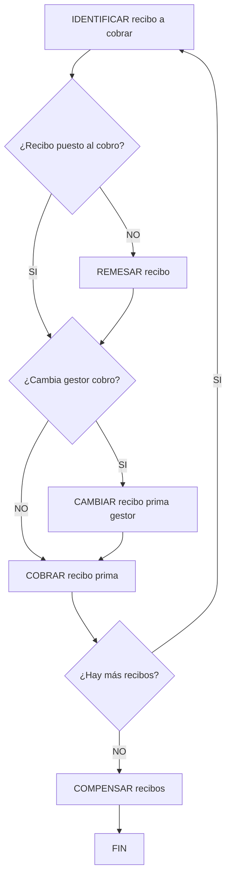

# Procedimento de Cobro de Recibos no Módulo de Tesouraria

## 1. Metadados do Documento
- **Arquivo de Origem:** Não identificado no conteúdo fornecido
- **Tipo de Documento:** Procedimento
- **Domínio / Sistema:** Reef / Tesouraria / Gestão de recibos de apólices
- **Público-Alvo:** Operação, negócio, tesouraria e utilizadores responsáveis pelo cobro de recibos
- **Data/Versão Identificada:** Não identificada

---

## 2. Resumo Executivo & Contexto de Negócio

O documento descreve o processo de **cobro de um recibo** associado a uma apólice de seguro. Durante as operações de emissão, é determinada a prima que o segurado deve pagar, considerando o tipo de risco e as coberturas contratadas.

A forma de cobrança depende do plano de pagamento acordado com o cliente. O plano pode gerar um único recibo correspondente ao valor total da prima para o período vigente ou múltiplos recibos, quando o pagamento é fracionado. O próprio plano de pagamento também determina o cálculo da parte da prima atribuída a cada recibo fracionado.

O módulo de tesouraria é responsável por registar e contabilizar o dinheiro recebido relativo à prima devida na apólice para um período determinado. O recebimento é associado a um recibo específico e altera a situação desse recibo para **cobrado**.

O objetivo operacional é realizar os passos necessários para registar a receção do valor pago pelo cliente na contabilidade e deixar registada a nova situação do recibo. O fluxo apresentado inclui identificação do recibo, eventual remessa, eventual alteração do gestor de cobrança, cobrança e compensação de recibos.

---

## 3. Arquitetura, Componentes & Tecnologias Envolvidas

O conteúdo apresenta componentes funcionais do domínio de seguros e tesouraria, sem detalhar arquitetura técnica, tecnologias, APIs, bases de dados, URLs, servidores, métodos HTTP ou contratos de integração.

| Componente / Conceito | Papel identificado no documento |
| :--- | :--- |
| Operações de emissão | Determinam a prima a pagar pelo segurado segundo o risco e as coberturas contratadas. |
| Plano de pagamento | Define se a prima gera um único recibo ou vários recibos fracionados; também determina o cálculo do valor por recibo em caso de fracionamento. |
| Apólice | Contexto contratual no qual existe uma prima devida e recibos associados a períodos de tempo. |
| Recibo | Unidade associada ao valor da prima a cobrar para um período determinado. |
| Módulo de tesouraria | Regista e contabiliza o dinheiro correspondente ao cobro da prima devida na apólice. |
| Gestor de cobrança | Entidade ou responsável de cobrança cuja alteração é considerada no fluxo. |
| Reef | Nome referido na navegação e na documentação apresentada. |
| Mapfredocument | Nome referido no rodapé ou navegação documental apresentada. |
| Zeus | Nome referido na navegação documental apresentada, sem detalhamento funcional. |



> **Nota de Análise:** O documento apresenta o fluxo visual de cobrança, mas não detalha os critérios que definem quando um recibo é considerado “posto ao cobro”, como ocorre a remessa, como é selecionado o gestor de cobrança ou quais lançamentos contabilísticos são gerados.

---

## 4. Regras de Negócio, Especificações Funcionais & Processos

### 4.1 Determinação da prima

1. Nas operações de emissão é determinada a prima que deve ser paga pelo segurado.
2. A determinação da prima considera:
   - O tipo de risco.
   - As coberturas contratadas.
3. A prima determinada gera recibos de acordo com o plano de pagamento escolhido pelo cliente.

### 4.2 Geração de recibos segundo o plano de pagamento

1. O plano de pagamento é acordado no momento da contratação.
2. O plano de pagamento pode gerar:
   - Um único recibo com o valor total da prima para o período vigente.
   - Vários recibos, quando o pagamento é fracionado.
3. Em caso de pagamento fracionado:
   - O número de recibos é determinado pelo plano de pagamento.
   - O cálculo da parte da prima correspondente a cada recibo também é determinado pelo plano de pagamento.

### 4.3 Registo de cobrança em tesouraria

1. O módulo de tesouraria regista o dinheiro recebido relativo ao cobro da prima devida na apólice.
2. O cobro está associado a um período de tempo determinado e, consequentemente, a um recibo.
3. Após a receção do valor pago pelo cliente:
   - O dinheiro deve ser registado na contabilidade.
   - A situação do recibo deve ser atualizada para **cobrado**.

### 4.4 Processo operacional de cobrança

O processo apresentado contém as seguintes atividades:

1. **IDENTIFICAR recibo a cobrar**
   - Identificar o recibo que será objeto da operação de cobrança.

2. **Verificar se o recibo está posto ao cobro**
   - O fluxo inclui a decisão “¿Recibo puesto al cobro?”.
   - Caso o recibo não esteja posto ao cobro, o fluxo apresenta a atividade de remessa.

3. **REMESAR recibo**
   - Efetuar a remessa do recibo quando aplicável no processo apresentado.

4. **Verificar se muda o gestor de cobrança**
   - O fluxo inclui a decisão “¿Cambia gestor cobro?”.

5. **CAMBIAR recibo prima gestor**
   - Alterar o gestor de cobrança do recibo de prima quando aplicável.

6. **COBRAR recibo prima**
   - Registar o cobro do recibo de prima.
   - O objetivo declarado é registar a receção do dinheiro e deixar o recibo na situação de cobrado.

7. **Verificar se existem mais recibos**
   - O fluxo inclui a decisão “¿Hay más recibos?”.
   - Quando houver mais recibos, o processo retorna à identificação de outro recibo a cobrar.

8. **COMPENSAR recibos**
   - Executar a compensação de recibos após o processamento dos recibos envolvidos no fluxo.

9. **FIN**
   - Encerrar o processo.

> **Nota de Análise:** O documento não especifica regras de elegibilidade, valores mínimos ou máximos, prazos, moedas, exceções, reversões de cobrança, perfis de autorização, estados intermediários do recibo ou critérios contabilísticos para a compensação.

---

## 5. Tabelas de Parâmetros, Ambientes e Estruturas de Dados

| Item / Parâmetro | Descrição / Função | Tipo / Valores / Formato | Ambiente / Observações |
| :--- | :--- | :--- | :--- |
| Prima | Valor que o segurado deve pagar. | Valor monetário; montante não especificado. | Determinada nas operações de emissão. |
| Tipo de risco | Critério utilizado para determinar a prima. | Não especificado. | Associado à emissão. |
| Coberturas contratadas | Critério utilizado para determinar a prima. | Não especificado. | Associadas à contratação da apólice. |
| Plano de pagamento | Define a forma de geração e, em caso de fracionamento, o cálculo dos recibos. | Único recibo ou pagamento fracionado. | Acordado durante a contratação. |
| Recibo | Registo associado ao valor da prima devido para um período. | Não especificado. | É identificado, pode ser remetido, ter gestor alterado, ser cobrado e compensado. |
| Período vigente | Período ao qual pode corresponder o valor total da prima num único recibo. | Não especificado. | Referido na geração de recibos. |
| Pagamento fracionado | Modalidade em que a prima é distribuída por múltiplos recibos. | Quantidade e cálculo definidos pelo plano de pagamento. | Não são indicadas periodicidades ou fórmulas. |
| Situação do recibo | Estado do recibo após a cobrança. | `cobrado` | O objetivo do processo é deixar evidência da nova situação. |
| Gestor de cobrança | Responsável ou entidade de cobrança associada ao recibo. | Não especificado. | Pode ser alterado no processo. |
| Módulo de tesouraria | Módulo que regista e contabiliza o dinheiro recebido. | Módulo funcional. | Não são informadas tecnologias, rotas ou integrações. |
| Compensação de recibos | Etapa final apresentada no fluxo. | Não especificado. | O documento não define regras de compensação. |
| Owner | Proprietário indicado na documentação. | `user:agonzalez_mapfre.com` | Informação exibida no rodapé documental. |
| Lifecycle | Estado de ciclo de vida indicado. | `Approved Source` | Informação exibida no rodapé documental. |
| Idioma da interface documental | Idioma indicado na navegação. | `ES` | O conteúdo principal encontra-se em espanhol. |

---

## 6. Bateria de Perguntas & Respostas para RAG (FAQ Sintético)

### P1: Qual é o objetivo do processo de cobro de recibos?
**R:** O objetivo é realizar os passos necessários para registar na contabilidade a receção do dinheiro pago pelo cliente e deixar registada a nova situação do recibo como cobrado.

### P2: Como é determinada a prima que o segurado deve pagar?
**R:** A prima é determinada nas operações de emissão, segundo o tipo de risco e as coberturas contratadas pelo segurado.

### P3: O plano de pagamento pode gerar mais de um recibo para a mesma prima?
**R:** Sim. Conforme o plano de pagamento acordado na contratação, pode ser gerado um único recibo pelo valor total da prima para o período vigente ou a prima pode ser fracionada em tantos recibos quanto o plano de pagamento determinar.

### P4: Quem determina o cálculo do valor de cada recibo em caso de pagamento fracionado?
**R:** O plano de pagamento determina o cálculo do valor da prima correspondente a cada recibo quando o pagamento é fracionado.

### P5: Qual é o papel do módulo de tesouraria no processo?
**R:** O módulo de tesouraria regista e contabiliza o dinheiro correspondente ao cobro da prima devida na apólice para um período determinado, ou seja, para um recibo.

### P6: Quais são as atividades principais do fluxo de cobrança?
**R:** O fluxo apresentado inclui identificar o recibo a cobrar, verificar se o recibo está posto ao cobro, remessar o recibo quando aplicável, verificar se há mudança de gestor de cobrança, alterar o gestor quando aplicável, cobrar o recibo de prima, verificar se existem mais recibos e compensar recibos antes do fim do processo.

### P7: Em que situação o fluxo inclui a atividade “REMESAR recibo”?
**R:** O diagrama do documento apresenta “REMESAR recibo” associado à decisão “¿Recibo puesto al cobro?”. O conteúdo não fornece critérios adicionais sobre a condição operacional, os dados exigidos ou o resultado da remessa.

### P8: O que acontece quando existe mudança de gestor de cobrança?
**R:** O fluxo apresenta a atividade “CAMBIAR recibo prima gestor”, indicando que o gestor de cobrança do recibo de prima pode ser alterado. O documento não detalha os critérios, os responsáveis, os dados alterados ou os controlos aplicáveis à mudança.

### P9: Qual é a situação esperada do recibo após a cobrança?
**R:** Após o registo da receção do dinheiro pago pelo cliente, o recibo deve ficar com a nova situação de cobrado.

### P10: O que acontece se houver mais recibos a processar?
**R:** O fluxo contém a decisão “¿Hay más recibos?”. Quando há mais recibos, o processo retorna à etapa de identificação de recibo a cobrar.

### P11: O documento especifica integrações técnicas, APIs ou contratos JSON para a cobrança?
**R:** Não. O conteúdo fornecido descreve o processo funcional de cobrança e apresenta componentes como apólice, recibo, plano de pagamento e módulo de tesouraria, mas não detalha APIs, métodos HTTP, contratos JSON, tecnologias, servidores ou URLs de integração.

### P12: Como funciona a compensação de recibos?
**R:** O fluxo inclui a atividade “COMPENSAR recibos” antes do fim do processo. Contudo, o documento não especifica a regra de negócio, os critérios contabilísticos, os estados envolvidos ou os efeitos da compensação.

---

## 7. Glossário de Termos, Siglas & Conceitos-Chave

- **Apólice:** Contrato de seguro no qual existe uma prima devida pelo segurado e recibos associados a períodos de tempo.
- **Cobertura contratada:** Cobertura de seguro considerada na determinação da prima.
- **Cobro / Cobrança:** Registo da receção do dinheiro pago pelo cliente relativamente à prima devida.
- **Compensar recibos:** Atividade final apresentada no fluxo de cobrança; o documento não detalha a sua regra funcional.
- **Emissão:** Operações nas quais é determinada a prima a pagar pelo segurado.
- **Gestor de cobrança:** Responsável ou entidade de cobrança do recibo, que pode ser alterado no fluxo.
- **Mapfredocument:** Termo exibido na navegação ou rodapé da documentação, sem definição adicional.
- **Plano de pagamento:** Acordo de pagamento que define a geração de um recibo único ou de recibos fracionados e o cálculo aplicável ao fracionamento.
- **Prima:** Valor que o segurado deve pagar, determinado conforme o tipo de risco e as coberturas contratadas.
- **Recibo:** Registo associado ao valor de prima devido numa apólice para um período de tempo.
- **Reef:** Nome apresentado no contexto da documentação e navegação.
- **Remesar recibo:** Atividade apresentada no processo de cobrança, sem detalhamento adicional no texto.
- **Tesouraria:** Módulo funcional que regista e contabiliza o dinheiro correspondente ao cobro da prima.
- **Zeus:** Termo exibido na navegação da documentação, sem definição funcional no conteúdo.

---

## 8. Notas Críticas, Riscos & Limitações

- O documento está identificado visualmente com a expressão **“EN CONSTRUCCIÓN”**, indicando que o conteúdo pode estar em construção.
- Não foi identificado nome de ficheiro, data, versão, autor técnico ou histórico de alterações.
- O fluxo apresenta decisões e atividades, mas não detalha integralmente as transições condicionais, critérios de decisão ou resultados de cada ramo.
- Não são especificados métodos de pagamento, canais de cobrança, moedas, regras de arredondamento, impostos, taxas ou fórmulas de cálculo da prima.
- Não são descritos os lançamentos contabilísticos produzidos pela cobrança, pela remessa ou pela compensação de recibos.
- Não existem informações sobre autenticação, autorização, perfis de utilizador, segregação de funções ou trilha de auditoria.
- O documento não informa como tratar falhas, cobrança parcial, cobrança duplicada, estorno, cancelamento, inadimplência, recibos vencidos ou conciliação bancária.
- Não há descrição de APIs, tecnologias, base de dados, mensageria, URLs, ambientes, servidores, logs ou monitorização.
- A atividade **“COMPENSAR recibos”** é mencionada sem definição operacional, contabilística ou técnica.
- Os termos **Reef**, **Zeus** e **Mapfredocument** são apresentados na navegação, sem detalhamento suficiente para estabelecer responsabilidades ou integrações.

---

## 9. Conteúdo Bruto Estruturado (Referência Fiel)

```text
--- [PÁGINA 1 DE 1] ---

EN CONSTRUCCIÓN
COBRAR un recibo
¿En que consiste?
En las operaciones de emisión se determina la prima que debe pagar el asegurado, según el tipo de riesgo y las coberturas contratadas. Se
generarán los recibos correspondientes al plan de pago elegido por el cliente.
De esta forma, según el plan de pago que se haya acordado en la contratación, se podrá generar un único recibo por el importe total de la
prima para el período vigente, o fraccionar el pago en tantos recibos como determine el plan de pago elegido. El cálculo del importe de la
prima correspondiente a cada recibo, en caso de pago fraccionado, lo determinará también el plan de pago.
En el módulo de tesorería se registra y contabiliza el dinero correspondiente al cobro de la prima adeudada en la póliza, para un determinado
período de tiempo, es decir, de un recibo.
Objetivo
Realizar los pasos necesarios para registrar la recepción del dinero abonado por el cliente, en la contabilidad y dejar constancia de la nueva
situación del recibo como cobrado.
Proceso a seguir
SI
NO SI
NO
SI
NOIDENTIFICAR
recibo a cobrar (1)
¿Recibo
puesto al
cobro?
REMESAR
recibo (2)
¿Cambia
gestor
cobro? CAMBIAR
recibo
prima
gestor (3)
COBRAR
recibo
prima (4)
¿Hay más
recibos?
COMPENSAR
recibos (5) FIN
1. IDENTIFICAR recibo a cobrar
2. REMESAR recibo
3. CAMBIAR recibo prima gestor
4. COBRAR recibo prima
5. COMPENSAR recibo
Checking links...
Documentation / DOCUMENTACIÓN Reef
DOCUMENTACIÓN Reef
Mapfredocument
DOCUMENTACIÓN Reef
Owner
user:agonzalez_mapfre.com
Lifecycle
Approved Source
 / 
 VL
Buscar Inicio Soluciones Arquitecturas APIs Componentes Cloud Documentación Zeus Reef Ayuda
ES
```
