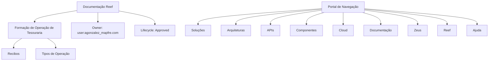

# Formação de Operação de Tesouraria (Recibos) — Documentação Reef

## 1. Metadados do Documento
- **Arquivo de Origem:** `Não identificado`
- **Tipo de Documento:** `Manual Operacional`
- **Domínio / Sistema:** `Reef / Operação de Tesouraria (Recibos)`
- **Público-Alvo:** `Operação`
- **Data/Versão Identificada:** `Não identificada`

---

## 2. Resumo Executivo & Contexto de Negócio

O conteúdo identifica uma formação orientada à operação de tesouraria, especificamente relacionada a **recibos**. O material menciona “Tipos de Operação”, mas não apresenta o detalhamento dos tipos, regras, procedimentos ou critérios operacionais.

A documentação está associada ao sistema ou domínio **Reef**, com referências a “Documentation / DOCUMENTACIÓN Reef”, “Mapfredocument” e “DOCUMENTACIÓN Reef”. O conteúdo também indica que o documento possui um proprietário identificado como `user:agonzalez_mapfre.com`.

O ciclo de vida indicado é **Approved**, sugerindo que o conteúdo possui estado de aprovação. A navegação apresentada inclui áreas como Soluções, Arquiteturas, APIs, Componentes, Cloud, Documentação, Zeus, Reef e Ajuda.

**Nota de Análise:** o trecho disponível não descreve processos detalhados de tesouraria, regras de negócio, cálculos, integrações, contratos técnicos, ambientes ou procedimentos de operação.

---

## 3. Arquitetura, Componentes & Tecnologias Envolvidas

Os elementos explicitamente citados são:

- **Reef:** domínio ou sistema associado à documentação.
- **Mapfredocument:** termo presente no conteúdo, sem descrição adicional.
- **Zeus:** item disponível na navegação, sem relação funcional detalhada.
- **Documentação:** área de navegação relacionada ao conteúdo.
- **APIs, Componentes, Cloud, Arquiteturas e Soluções:** categorias disponíveis na navegação; o documento não detalha componentes técnicos ou integrações.



---

## 4. Regras de Negócio, Especificações Funcionais & Processos

1. O material é denominado **“FORMACIÓN de OPERACIÓN de TESORERÍA (Recibos)”**.
2. A formação é explicitamente descrita como **“Formación orientada a la operación”**.
3. O conteúdo possui uma seção ou referência chamada **“TIPOS DE OPERACIÓN”**.
4. O trecho não detalha os tipos de operação, suas condições, etapas, responsáveis, validações ou exceções.
5. A documentação Reef apresenta estado de ciclo de vida **Approved**.
6. O proprietário apresentado é `user:agonzalez_mapfre.com`.

**Nota de Análise:** não há regras operacionais específicas para recibos no conteúdo fornecido.

---

## 5. Tabelas de Parâmetros, Ambientes e Estruturas de Dados

| Item / Parâmetro | Descrição / Função | Tipo / Valores / Formato | Ambiente / Observações |
| :--- | :--- | :--- | :--- |
| Formação | Formação de operação de tesouraria | `FORMACIÓN de OPERACIÓN de TESORERÍA (Recibos)` | Orientada à operação |
| Escopo operacional | Tipos de operação | `TIPOS DE OPERACIÓN` | Sem detalhamento adicional |
| Sistema / domínio | Documentação Reef | `Reef` | Citado repetidamente no conteúdo |
| Referência documental | Mapfredocument | `Mapfredocument` | Sem descrição adicional |
| Proprietário | Owner da documentação | `user:agonzalez_mapfre.com` | Identificado no conteúdo |
| Ciclo de vida | Estado documental | `Approved` | Texto também contém `Source / VL` |
| Idioma | Idioma exibido no portal | `ES` | Espanhol |
| Navegação | Áreas acessíveis no portal | Soluções, Arquiteturas, APIs, Componentes, Cloud, Documentação, Zeus, Reef, Ajuda | Não há URLs informadas |

---

## 6. Bateria de Perguntas & Respostas para RAG (FAQ Sintético)

### P1: Qual é o tema principal da documentação Reef apresentada?
**R:** O tema principal é a **formação de operação de tesouraria relacionada a recibos**, identificada pelo título “FORMACIÓN de OPERACIÓN de TESORERÍA (Recibos)”.

### P2: A formação de tesouraria é voltada para qual público ou atividade?
**R:** O conteúdo afirma que a formação é orientada à operação, por meio da expressão “Formación orientada a la operación”.

### P3: O documento detalha quais são os tipos de operação de tesouraria?
**R:** Não. O documento menciona “TIPOS DE OPERACIÓN”, mas o trecho fornecido não apresenta a lista, as regras ou os procedimentos para cada tipo de operação.

### P4: Qual sistema ou domínio está associado à documentação de operação de tesouraria?
**R:** A documentação está associada ao domínio ou sistema **Reef**, citado como “Documentation / DOCUMENTACIÓN Reef” e “DOCUMENTACIÓN Reef”.

### P5: Quem é o proprietário identificado para a documentação Reef?
**R:** O proprietário identificado é `user:agonzalez_mapfre.com`.

### P6: Qual é o estado do ciclo de vida da documentação?
**R:** O ciclo de vida indicado para a documentação é **Approved**.

### P7: O conteúdo informa APIs, contratos JSON ou métodos HTTP para a operação de recibos?
**R:** Não. Embora “APIs” apareça como item de navegação, o trecho não descreve APIs, métodos HTTP, contratos JSON, endpoints ou integrações técnicas.

### P8: Quais áreas estão disponíveis na navegação do portal mostrado?
**R:** A navegação apresenta as áreas: Buscar, Inicio, Soluciones, Arquitecturas, APIs, Componentes, Cloud, Documentación, Zeus, Reef e Ayuda.

### P9: O documento identifica ambientes, servidores, portas ou URLs?
**R:** Não. O conteúdo não fornece ambientes técnicos, nomes de servidores, portas, URLs ou caminhos de logs.

---

## 7. Glossário de Termos, Siglas & Conceitos-Chave

- **Reef:** domínio ou sistema relacionado à documentação; o trecho não fornece definição funcional adicional.
- **Tesouraria:** contexto operacional mencionado no título da formação.
- **Recibos:** escopo indicado entre parênteses no título da formação.
- **Tipos de Operação:** seção ou tópico citado sem detalhamento.
- **Owner:** proprietário da documentação, identificado como `user:agonzalez_mapfre.com`.
- **Lifecycle:** ciclo de vida documental; o estado apresentado é `Approved`.
- **Approved:** estado de aprovação indicado para a documentação.
- **Mapfredocument:** termo apresentado no conteúdo sem definição adicional.
- **Zeus:** item de navegação apresentado sem definição adicional.
- **ES:** indicação de idioma espanhol exibida no portal.

---

## 8. Notas Críticas, Riscos & Limitações

- O trecho é predominantemente um cabeçalho ou extrato de portal documental, sem conteúdo operacional aprofundado.
- “TIPOS DE OPERACIÓN” é mencionado, mas não possui detalhamento de regras, fluxos ou procedimentos.
- Não há descrição de arquitetura técnica, integrações, APIs, componentes, ambientes ou dependências.
- Não há informações sobre validações de recibos, tratamento de exceções, responsabilidades operacionais ou trilhas de auditoria.
- **Nota de Análise:** os termos “Mapfredocument”, “Zeus”, “Source” e “VL” aparecem sem definição contextual suficiente; qualquer interpretação adicional seria especulativa.

---

## 9. Conteúdo Bruto Estruturado (Referência Fiel)

```text
--- [PÁGINA 1 DE 1] ---

EN CONSTRUCCIÓN
FORMACIÓN de OPERACIÓN de TESORERÍA (Recibos)
 Formación orientada a la operación
TIPOS DE OPERACIÓN
Documentation / DOCUMENTACIÓN Reef
DOCUMENTACIÓN Reef
Mapfredocument
DOCUMENTACIÓN Reef
Owner
user:agonzalez_mapfre.com
Lifecycle
Approved Source
 / 
 VL
Buscar Inicio Soluciones Arquitecturas APIs Componentes Cloud Documentación Zeus Reef Ayuda
ES
```
