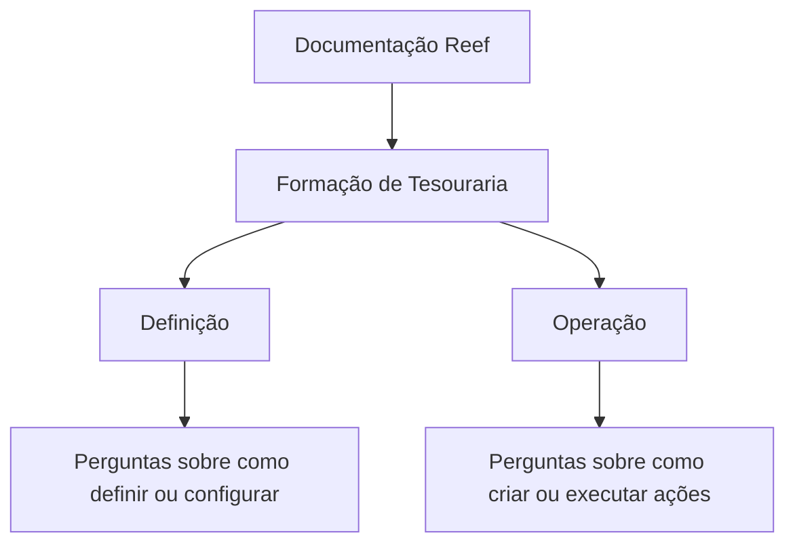

# Formação de Tesouraria — Documentação Reef

## 1. Metadados do Documento
- **Arquivo de Origem:** Não identificado no conteúdo fornecido
- **Tipo de Documento:** Manual Operacional / Material de Formação
- **Domínio / Sistema:** Tesouraria; documentação Reef
- **Público-Alvo:** Usuários do módulo de tesouraria
- **Data/Versão Identificada:** Não identificada

---

## 2. Resumo Executivo & Contexto de Negócio

O documento apresenta uma formação relacionada ao módulo de **Tesouraria**. A formação é organizada em dois blocos principais: **Definição** e **Operação**.

O bloco **Definição** é destinado a orientar usuários em perguntas sobre configuração e definição de elementos no módulo de tesouraria. O conteúdo exemplifica consultas como os passos necessários para definir algo, como realizar uma definição e o que fazer quando houver uma necessidade específica.

O bloco **Operação** é destinado a orientar usuários sobre ações práticas no módulo de tesouraria. As perguntas exemplificadas incluem como criar elementos e como executar determinadas ações.

O conteúdo também referencia o ambiente de documentação **Reef**, incluindo a identificação de proprietário `user:agonzalez_mapfre.com` e o ciclo de vida `Approved Source`. Não há detalhamento adicional sobre regras de tesouraria, telas, contratos, APIs, cálculos ou procedimentos operacionais concretos.

---

## 3. Arquitetura, Componentes & Tecnologias Envolvidas

Os elementos identificados no conteúdo são:

| Elemento | Papel identificado no documento | Detalhamento disponível |
| :--- | :--- | :--- |
| Tesouraria | Módulo ao qual a formação se refere | Não detalhado |
| Reef | Ambiente ou seção de documentação | Identificado como “DOCUMENTACIÓN Reef” |
| Mapfredocument | Elemento exibido na navegação/documentação | Não detalhado |
| Zeus | Item exibido no menu de navegação | Não detalhado |
| Owner | Campo de propriedade da documentação | Valor: `user:agonzalez_mapfre.com` |
| Lifecycle | Campo de ciclo de vida da documentação | Valor: `Approved Source` |
| VL | Identificador exibido junto ao ciclo de vida | Não detalhado |



> **Nota de Análise:** O conteúdo não descreve arquitetura de software, integrações, microsserviços, bancos de dados, APIs, ambientes de execução ou tecnologias de implementação.

---

## 4. Regras de Negócio, Especificações Funcionais & Processos

### Organização da formação

A formação de tesouraria está dividida nos seguintes apartados:

1. **Definição**
2. **Operação**

### Escopo do apartado Definição

O apartado **Definição** busca obter respostas para perguntas do tipo:

1. Quais passos devem ser seguidos para poder definir algo.
2. Como determinado elemento deve ser definido.
3. O que deve ser feito caso exista uma necessidade específica.

Não são fornecidos exemplos de objetos configuráveis, campos, validações, permissões, regras de cálculo ou procedimentos detalhados para definição.

### Escopo do apartado Operação

O apartado **Operação** busca obter respostas para perguntas do tipo:

1. Como criar determinado elemento.
2. O que deve ser feito para poder executar determinada ação.

Não são fornecidos fluxos operacionais detalhados, pré-requisitos, telas, dados de entrada, resultados esperados ou exceções para as operações.

---

## 5. Tabelas de Parâmetros, Ambientes e Estruturas de Dados

| Item / Parâmetro | Descrição / Função | Tipo / Valores / Formato | Ambiente / Observações |
| :--- | :--- | :--- | :--- |
| Formação de Tesouraria | Formação relativa ao módulo de tesouraria | Dividida em Definição e Operação | Conteúdo principal do documento |
| Definição | Apartado voltado a perguntas sobre definição e configuração | Perguntas orientativas | Não há procedimentos detalhados |
| Operação | Apartado voltado a perguntas sobre criação e execução | Perguntas orientativas | Não há procedimentos detalhados |
| Owner | Proprietário exibido para a documentação | `user:agonzalez_mapfre.com` | Documentação Reef |
| Lifecycle | Estado de ciclo de vida exibido | `Approved Source` | Documentação Reef |
| Identificador adicional | Texto exibido próximo ao ciclo de vida | `VL` | Sem descrição adicional |
| Idioma | Idioma exibido na navegação | `ES` | Interface/documentação |

---

## 6. Bateria de Perguntas & Respostas para RAG (FAQ Sintético)

### P1: Qual é o tema principal do documento de formação?
**R:** O documento apresenta formação relativa ao módulo de Tesouraria. A formação está organizada nos apartados Definição e Operação.

### P2: Quais são os apartados da formação de Tesouraria?
**R:** A formação de Tesouraria está dividida em dois apartados: Definição e Operação.

### P3: Que tipo de pergunta o apartado Definição procura responder?
**R:** O apartado Definição procura responder perguntas sobre os passos para definir algo, sobre como realizar uma definição e sobre o que fazer diante de uma necessidade específica.

### P4: O documento detalha os passos para definir objetos no módulo de Tesouraria?
**R:** Não. O documento apenas apresenta exemplos de perguntas que o apartado Definição deve responder. Não são descritos passos concretos, objetos configuráveis ou parâmetros de definição.

### P5: Que tipo de pergunta o apartado Operação procura responder?
**R:** O apartado Operação procura responder perguntas sobre como criar algo e sobre o que fazer para executar determinada ação.

### P6: O documento informa como criar elementos no módulo de Tesouraria?
**R:** Não em detalhe. O texto indica que o apartado Operação deve responder perguntas sobre criação, mas não apresenta instruções operacionais, telas ou dados necessários.

### P7: Qual ambiente de documentação é citado no conteúdo?
**R:** O conteúdo cita “DOCUMENTACIÓN Reef”, indicando Reef como o ambiente ou seção de documentação associada ao material de formação.

### P8: Quem é identificado como proprietário da documentação?
**R:** O campo Owner da documentação apresenta o valor `user:agonzalez_mapfre.com`.

### P9: Qual ciclo de vida é exibido para a documentação?
**R:** O campo Lifecycle apresenta o valor `Approved Source`.

### P10: O documento descreve APIs, microsserviços ou integrações do módulo de Tesouraria?
**R:** Não. O conteúdo fornecido não detalha APIs, microsserviços, contratos de integração, tecnologias, URLs, servidores ou fluxos técnicos de dados.

---

## 7. Glossário de Termos, Siglas & Conceitos-Chave

- **Tesouraria:** Módulo ao qual a formação apresentada no documento se refere.
- **Definição:** Apartado da formação destinado a perguntas sobre como definir ou configurar elementos.
- **Operação:** Apartado da formação destinado a perguntas sobre como criar elementos ou realizar ações.
- **Reef:** Nome citado na seção “DOCUMENTACIÓN Reef”.
- **Mapfredocument:** Termo exibido na navegação da documentação; o conteúdo não define sua função.
- **Zeus:** Termo exibido na navegação da documentação; o conteúdo não define sua função.
- **Owner:** Campo que identifica o proprietário da documentação.
- **Lifecycle:** Campo que identifica o ciclo de vida da documentação.
- **Approved Source:** Valor exibido no campo Lifecycle.
- **VL:** Identificador exibido no conteúdo, sem definição adicional.
- **ES:** Indicador de idioma exibido na interface.

---

## 8. Notas Críticas, Riscos & Limitações

- O arquivo de origem, a data e a versão do documento não foram identificados no conteúdo fornecido.
- O documento contém uma descrição resumida da formação, sem procedimentos detalhados para Definição ou Operação.
- Não há especificações de regras de negócio, estruturas de dados, APIs, integrações, ambientes técnicos, URLs, logs ou parâmetros de configuração.
- Os termos `Mapfredocument`, `Zeus` e `VL` aparecem no conteúdo, mas não recebem definição contextual.
- **Nota de Análise:** O conteúdo indica que a formação aborda o módulo de Tesouraria, porém não detalha funcionalidades concretas, objetos de negócio ou operações específicas do módulo.

---

## 9. Conteúdo Bruto Estruturado (Referência Fiel)

```text
--- [PÁGINA 1 DE 1] ---

FORMACIÓN TESORERÍA
 En este apartado se encuentra la formación relativa al módulo de tesorería. Dicha formación está dividida en los apartados
siguientes:
Denición
Operación
DEFINICIÓN
Conseguir respuestas a preguntas del estilo:
¿Qué pasos he de seguir para poder denir...?
¿Cómo se dene...?
¿Qué hago si necesito...?
OPERACIÓN
Obtener respuestas a preguntas:
¿Cómo puedo crear...?
¿Qué hago para poder hacer...?
Documentation / DOCUMENTACIÓN Reef
DOCUMENTACIÓN Reef
Mapfredocument
DOCUMENTACIÓN Reef
Owner
user:agonzalez_mapfre.com
Lifecycle
Approved Source
 / 
 VL
Buscar Inicio Soluciones Arquitecturas APIs Componentes Cloud Documentación Zeus Reef Ayuda
ES
```
