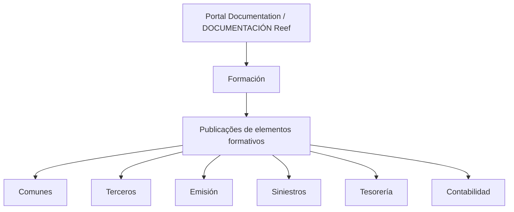

# Documentação Reef — Formação por Módulo

## 1. Metadados do Documento
- **Arquivo de Origem:** `Não identificado no conteúdo fornecido`
- **Tipo de Documento:** Manual Operacional
- **Domínio / Sistema:** Reef / Mapfre
- **Público-Alvo:** Desenvolvedores, Arquitetos, Operação e utilizadores do sistema Reef
- **Data/Versão Identificada:** Não identificada

---

## 2. Resumo Executivo & Contexto de Negócio

O documento apresenta a área de **Formación** da documentação do sistema **Reef**. Essa área publica elementos formativos direcionados a casos de uso concretos, com o objetivo de permitir a aquisição de conhecimentos funcionais e técnicos do sistema.

As publicações formativas são organizadas por módulo. Os módulos listados são: **Comunes**, **Terceros**, **Emisión**, **Siniestros**, **Tesorería** e **Contabilidad**.

O conteúdo também evidencia um portal de documentação identificado como **Documentation / DOCUMENTACIÓN Reef**, associado ao contexto **Mapfre** e à origem **Mapfredocument**. O registro apresenta ciclo de vida aprovado, indicado pelos termos **Lifecycle**, **Approved Source** e **VL**.

Não há detalhamento adicional sobre conteúdos de cada módulo, fluxos operacionais, APIs, contratos técnicos, permissões, ambientes, tecnologias ou procedimentos de consulta/publicação.

---

## 3. Arquitetura, Componentes & Tecnologias Envolvidas

Os componentes e conceitos explicitamente mencionados são:

- Portal de documentação Reef.
- Área de formação.
- Publicações formativas.
- Módulos funcionais: Comunes, Terceros, Emisión, Siniestros, Tesorería e Contabilidad.
- Navegação do portal: Buscar, Inicio, Soluciones, Arquitecturas, APIs, Componentes, Cloud, Documentación, Zeus, Reef e Ayuda.
- Referências de governança documental: Owner, Lifecycle e Approved Source.



> **Nota de Análise:** O conteúdo não descreve arquitetura de software, integrações, microsserviços, protocolos, tecnologias, URLs, ambientes ou contratos de API.

---

## 4. Regras de Negócio, Especificações Funcionais & Processos

1. A área denominada **Formación** contém a publicação de diferentes elementos formativos.
2. Os elementos formativos são orientados a casuísticas concretas.
3. Os elementos formativos permitem adquirir conhecimentos funcionais e técnicos do sistema.
4. As publicações são divididas por módulo.
5. Os módulos informados são:
   - Comunes;
   - Terceros;
   - Emisión;
   - Siniestros;
   - Tesorería;
   - Contabilidad.
6. O portal possui opções de navegação para Buscar, Inicio, Soluciones, Arquitecturas, APIs, Componentes, Cloud, Documentación, Zeus, Reef e Ayuda.
7. O item documental apresenta indicação de ciclo de vida e origem aprovada por meio dos campos **Lifecycle**, **Approved Source** e **VL**.

> **Nota de Análise:** O documento não especifica critérios de acesso, regras de publicação, responsáveis por módulo, periodicidade de atualização, estrutura dos materiais formativos ou fluxos de aprovação.

---

## 5. Tabelas de Parâmetros, Ambientes e Estruturas de Dados

| Item / Parâmetro | Descrição / Função | Tipo / Valores / Formato | Ambiente / Observações |
| :--- | :--- | :--- | :--- |
| Área | Seção que reúne publicações de formação | Formación | Portal Documentation / DOCUMENTACIÓN Reef |
| Objetivo formativo | Aquisição de conhecimentos relacionados ao sistema | Conhecimentos funcionais e técnicos | Orientado a casuísticas concretas |
| Organização | Critério de divisão das publicações | Por módulo | Seis módulos listados |
| Módulo | Conteúdo formativo comum | Comunes | Sem detalhamento adicional |
| Módulo | Conteúdo formativo relacionado a terceiros | Terceros | Sem detalhamento adicional |
| Módulo | Conteúdo formativo relacionado à emissão | Emisión | Sem detalhamento adicional |
| Módulo | Conteúdo formativo relacionado a sinistros | Siniestros | Sem detalhamento adicional |
| Módulo | Conteúdo formativo relacionado à tesouraria | Tesorería | Sem detalhamento adicional |
| Módulo | Conteúdo formativo relacionado à contabilidade | Contabilidad | Sem detalhamento adicional |
| Owner | Proprietário identificado no registro | `user:agonzalez_mapfre.com` | Valor literal extraído |
| Lifecycle | Campo de ciclo de vida documental | `Approved Source` | Valor apresentado no registro |
| Referência adicional | Identificador ou marca adicional | `VL` | Significado não detalhado |
| Origem documental | Identificação exibida no portal | Mapfredocument | Sem detalhamento adicional |
| Idioma | Idioma exibido na navegação | ES | Espanhol |

---

## 6. Bateria de Perguntas & Respostas para RAG (FAQ Sintético)

### P1: Qual é o objetivo da área Formación na documentação Reef?
**R:** A área Formación publica diferentes elementos formativos voltados a casuísticas concretas, permitindo a aquisição de conhecimentos funcionais e técnicos do sistema Reef.

### P2: Como as publicações de formação do Reef são organizadas?
**R:** As publicações da área Formación são divididas por módulo.

### P3: Quais módulos de formação são listados na documentação Reef?
**R:** Os módulos listados são Comunes, Terceros, Emisión, Siniestros, Tesorería e Contabilidad.

### P4: O documento descreve o conteúdo detalhado do módulo Terceros?
**R:** Não. O documento apenas lista Terceros como um módulo de formação e não apresenta conteúdo programático, regras ou procedimentos específicos desse módulo.

### P5: A documentação Reef inclui formação técnica e funcional?
**R:** Sim. O texto afirma que os elementos formativos permitem adquirir tanto conhecimentos funcionais quanto conhecimentos técnicos do sistema.

### P6: Qual é o proprietário identificado para o registro documental?
**R:** O campo Owner apresenta o valor literal `user:agonzalez_mapfre.com`.

### P7: Qual é o estado de ciclo de vida apresentado para o conteúdo?
**R:** O registro exibe os termos Lifecycle e Approved Source. O documento não explica o processo, os critérios ou o significado operacional desse estado.

### P8: Quais áreas podem ser acessadas pela navegação do portal?
**R:** A navegação apresenta Buscar, Inicio, Soluciones, Arquitecturas, APIs, Componentes, Cloud, Documentación, Zeus, Reef e Ayuda.

### P9: O documento informa APIs, endpoints ou contratos JSON do sistema Reef?
**R:** Não. Embora a navegação contenha uma opção chamada APIs, não há endpoints, métodos HTTP, contratos JSON, autenticação ou detalhes técnicos de integração no conteúdo fornecido.

### P10: Existe informação sobre ambientes, servidores ou URLs do Reef?
**R:** Não. O conteúdo fornecido não apresenta URLs, servidores, portas, nomes de ambientes ou parâmetros de infraestrutura.

---

## 7. Glossário de Termos, Siglas & Conceitos-Chave

- **Reef:** Sistema ou domínio identificado no portal de documentação e na seção DOCUMENTACIÓN Reef.
- **Formación:** Área destinada à publicação de elementos formativos.
- **Comunes:** Módulo de formação listado no documento.
- **Terceros:** Módulo de formação listado no documento.
- **Emisión:** Módulo de formação listado no documento.
- **Siniestros:** Módulo de formação listado no documento.
- **Tesorería:** Módulo de formação listado no documento.
- **Contabilidad:** Módulo de formação listado no documento.
- **Lifecycle:** Campo de ciclo de vida exibido no registro documental.
- **Approved Source:** Valor exibido para o ciclo de vida ou status da fonte documental.
- **Owner:** Campo que identifica o proprietário do registro.
- **VL:** Sigla ou identificador exibido no registro, sem definição adicional.
- **ES:** Indicador de idioma espanhol exibido na navegação.

---

## 8. Notas Críticas, Riscos & Limitações

- O conteúdo é resumido e não detalha os materiais, tópicos ou procedimentos associados a cada módulo de formação.
- Não há especificações de arquitetura, integrações, APIs, microsserviços, bancos de dados, tecnologias ou infraestrutura.
- Não são apresentados critérios de permissão, responsabilidades operacionais, processo de aprovação ou governança de publicação.
- Não há data, versão, histórico de alterações ou período de vigência identificável.
- O significado de **VL** não é definido no conteúdo.
- A presença da opção de navegação **APIs** não comprova a existência ou as características de APIs no escopo do documento.

---

## 9. Conteúdo Bruto Estruturado (Referência Fiel)

```text
--- [PÁGINA 1 DE 1] ---

FORMACIÓN
 En este apartado se encuentra la publicación de distintos elementos formativos orientados a casuísticas concretas que permiten
adquirir tanto conocimientos funcionales como técnicos del sistema.
Las publicaciones están divididas por módulo.
 COMUNES
  TERCEROS
  EMISIÓN
 SINIESTROS
  TESORERÍA
  CONTABILIDAD
Documentation / DOCUMENTACIÓN Reef
DOCUMENTACIÓN Reef
Mapfredocument
DOCUMENTACIÓN Reef
Owner
user:agonzalez_mapfre.com
Lifecycle
Approved Source
 / 
 VL
Buscar Inicio Soluciones Arquitecturas APIs Componentes Cloud Documentación Zeus Reef Ayuda
ES
```
