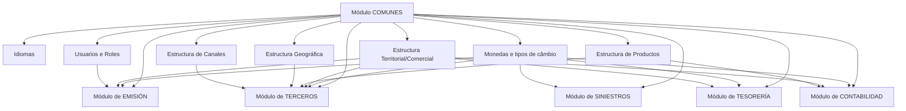

# Módulo COMUNES — Configuração Transversal para a Solução MAPFRE

## 1. Metadados do Documento
- **Arquivo de Origem:** Não identificado no conteúdo fornecido
- **Tipo de Documento:** Manual Operacional / Especificação Funcional
- **Domínio / Sistema:** Solução MAPFRE — Módulo COMUNES
- **Público-Alvo:** Desenvolvedores, Arquitetos, Operação, Analistas Funcionais e Negócio
- **Data/Versão Identificada:** Não identificada

---

## 2. Resumo Executivo & Contexto de Negócio

O módulo **COMUNES** configura, no âmbito da solução e de cada companhia, conceitos utilizados transversalmente pelos módulos de **Terceros**, **Emisión**, **Siniestros**, **Tesorería** e **Contabilidad**. O objetivo é centralizar definições e atributos compartilhados, garantindo que funcionalidades dependentes utilizem uma base comum de parametrização.

Os conceitos principais apresentados são **Idiomas**, **Monedas**, **Usuarios/Roles** e estruturas organizacionais de informação: **Geográfica**, **Territorial/Comercial**, **Produtos** e **Canales**. Essas estruturas permitem classificar informações operacionais e comerciais relacionadas a terceiros, apólices, sinistros, recibos, comissões, coberturas e lançamentos contábeis.

A característica central do módulo COMUNES é a **transversalidade**: conceitos e atributos configurados nele interagem total ou parcialmente com as funcionalidades dos demais módulos. O documento também estabelece a necessidade de **consistência e coerência lógica**, pois os mesmos atributos devem afetar de maneira equivalente todas as funcionalidades que os utilizam.

A estrutura comercial possui importância operacional significativa, pois seu terceiro nível pode ser associado a agentes, usuários emissores, apólices e movimentos de tesouraria. A estrutura de produtos, por sua vez, estabelece a classificação de seguros e apoia a relação entre ramos técnicos, coberturas e ramos contábeis.

O documento apresenta exemplos de parametrização para MAPFRE, incluindo estruturas geográficas da Espanha, canais de distribuição, setores de seguros e níveis comerciais. Os exemplos não devem ser interpretados como especificação completa de interfaces, contratos técnicos, métodos HTTP, bancos de dados ou integrações de infraestrutura.

---

## 3. Arquitetura, Componentes & Tecnologias Envolvidas

### Componentes e módulos citados

| Componente / Módulo | Papel descrito |
| :--- | :--- |
| **COMUNES** | Módulo transversal que configura conceitos e atributos utilizados nos demais módulos da solução. |
| **Terceros** | Utiliza parâmetros de instalação, estruturas geográficas, comerciais, de canais e de produtos, além de moedas associadas a dados bancários. |
| **Emisión** | Utiliza parâmetros de instalação, controles técnicos associados a papéis, numerações, estrutura comercial e moedas de emissão de apólices. |
| **Siniestros** | Pode utilizar divisas diferentes da moeda de emissão da apólice nas liquidações de expedientes. |
| **Tesorería** | Utiliza moedas, tipos de câmbio e o terceiro nível da estrutura comercial em movimentos de caixa, ordens de pagamento e cheques. |
| **Contabilidad** | Utiliza datas de processo, moedas, tipos de câmbio, estrutura comercial, ramos e ramos contábeis. |
| **Idiomas** | Define idiomas para visualização de literais e textos das telas da aplicação. |
| **Monedas / Divisas** | Define divisas e tipos de câmbio utilizados em operações de seguros, sinistros, cobranças, tesouraria e contabilidade. |
| **Usuarios/Roles** | Declara usuários do sistema e define funções que podem desempenhar por meio de papéis. |
| **Estructura Geográfica** | Organiza divisões geográficas em estrutura piramidal de cinco níveis. |
| **Estructura Territorial/Comercial** | Organiza comercialmente entidades seguradoras em estrutura piramidal de três níveis. |
| **Estructura de Productos** | Classifica seguros comercializados em estrutura de três níveis. |
| **Estructura de Canales** | Configura canais de comercialização, agrupamentos e fontes de produção. |



> **Nota de Análise:** O conteúdo fornecido descreve dependências funcionais entre módulos, mas não detalha APIs, métodos HTTP, contratos JSON, bancos de dados, mensagens assíncronas, protocolos de integração ou topologia de infraestrutura.

---

## 4. Regras de Negócio, Especificações Funcionais & Processos

### 4.1 Princípios do módulo COMUNES

1. O módulo COMUNES configura conceitos empregados transversalmente pelos módulos de Terceros, Emisión, Siniestros, Tesorería e Contabilidad.
2. Todos os conceitos e atributos configurados no módulo COMUNES podem interagir total ou parcialmente com funcionalidades dos demais módulos.
3. Os conceitos e atributos compartilhados devem produzir efeitos consistentes e logicamente coerentes nas funcionalidades que os utilizam.
4. Idiomas determinam os idiomas em que literais ou textos das telas podem ser visualizados.
5. Moedas e tipos de câmbio suportam operações como cálculo de prêmios de seguros, liquidações de sinistros e cobrança de recibos.
6. Pessoas que usam a solução devem ser declaradas como usuários do sistema.
7. As funções permitidas a cada usuário são atribuídas por meio de roles.

### 4.2 Estrutura geográfica

1. A estrutura geográfica permite cadastrar divisões geográficas de países.
2. A estrutura geográfica é piramidal e possui cinco níveis.
3. O exemplo da Espanha apresenta os níveis: **País**, **Comunidad/Ciudad Autónoma**, **Provincia**, **Municipio/Localidad** e **Distrito**.
4. Códigos postais não pertencem à estrutura geográfica.
5. Códigos postais são exibidos no gráfico apenas para facilitar a compreensão da estrutura postal.

### 4.3 Estrutura territorial/comercial

1. A estrutura territorial/comercial organiza comercialmente entidades seguradoras.
2. A estrutura territorial/comercial possui três níveis.
3. A estrutura comercial é uma abstração da estrutura geográfica.
4. O documento apresenta como modelo geral: **Compañía - MAPFRE**, **Nivel 1**, **Nivel 2** e **Nivel 3**.
5. Para MAPFRE Espanha, o exemplo apresentado utiliza: **Compañía MAPFRE España**, **Territorial**, **Subcentral** e **Oficina Comercial**.
6. O terceiro nível da estrutura comercial é utilizado por módulos como Emisión, Tesorería e Contabilidad.

### 4.4 Estrutura de produtos

1. A estrutura de produtos possui três níveis.
2. A estrutura de produtos permite configurar e classificar seguros comercializados por uma entidade seguradora.
3. O modelo apresentado contém os elementos: **Compañía**, **Sector**, **Subsector** e **Ramo Contable**.
4. No exemplo, seguros de VIDA e NO VIDA são tratados como setores.
5. VIDA Riesgo e VIDA Ahorro são classificados como subsetores do setor VIDA.
6. Automóviles, Mercancías e Empresas são possíveis subsetores do setor NO VIDA.
7. Ramos técnicos, como Hogar, Comercio e Comunidades, não pertencem à estrutura de produtos.
8. Coberturas, como Incendio e Robo, também não pertencem à estrutura de produtos.
9. Ramos técnicos e coberturas são apresentados no gráfico apenas para facilitar a compreensão da parametrização possível dos ramos contábeis.
10. Ramos contábeis são códigos usados na contabilidade para relacionar a estrutura técnica dos ramos técnicos à estrutura contábil das entidades.
11. A relação entre ramo técnico e ramo contábil é realizada no sistema no nível de cobertura.
12. Antes da definição de coberturas no sistema, a entidade deve definir a relação de possíveis ramos contábeis que poderão ser usados posteriormente na definição e configuração dessas coberturas.

### 4.5 Estrutura de canais

1. A estrutura de canais possui três níveis.
2. A estrutura de canais configura canais de comercialização pelos quais clientes distribuidores fecham a venda de um produto.
3. Clientes distribuidores incluem, entre outros exemplos, agentes exclusivos, agentes delegados e corretores.
4. Os níveis apresentados são: **Canales Distribución**, **Agrupaciones** e **Fuentes de Producción**.
5. Os dois primeiros níveis — Canais de Distribuição e Agrupamentos — possuem definição corporativa e uso obrigatório.
6. Agrupamentos do canal direto classificam seguros comercializados em escritórios da entidade seguradora, escritórios destinados a grandes contas, canais telefônicos por call center e canais web.
7. O cliente distribuidor direto é composto por pessoas, normalmente empregados, ou meios de distribuição que vendem para MAPFRE sem receber retribuição variável direta.

### 4.6 Integração com o módulo de TERCEROS

1. Parâmetros da instalação modulam a interface da solução no módulo de Terceros.
2. Esses parâmetros podem ativar, desativar ou modificar fluxos de captura de informações.
3. O fluxo de captura de um cliente pode variar conforme o cliente seja pessoa física ou companhia.
4. O módulo de Terceros utiliza níveis das estruturas geográfica, comercial, de canais e de produtos.
5. As estruturas são associadas a elementos principais, como terceiros, apólices, sinistros, recibos e comissões.
6. A estrutura geográfica é usada para identificação de localidades de nascimento ou constituição de pessoas físicas ou jurídicas.
7. A estrutura geográfica é usada em dados identificativos, contatos e obrigações fiscais dos segurados.
8. A estrutura geográfica é usada para identificação de endereços postais, de trabalho, de correspondência e outros.
9. Dados identificativos do segurado podem ser usados quando a pessoa for agente, tramitador de sinistros ou supervisor de sinistros, conforme a atividade do terceiro.
10. Moedas são associadas a informações de dados bancários de segurados, clientes e fornecedores.

### 4.7 Integração com o módulo de EMISIÓN

1. Parâmetros da instalação modificam o fluxo de captura e validação de informações no módulo de Emisión.
2. Controles Técnicos são regras de negócio que entidades MAPFRE podem estabelecer e executar dinamicamente no processo de emissão.
3. Controles Técnicos devem ser associados aos roles dos usuários para determinar quem pode autorizá-los.
4. Numerações de apólices e orçamentos podem utilizar, em sua composição, a estrutura comercial definida para a entidade.
5. À apólice são associados:
   - O terceiro nível da estrutura comercial do agente.
   - A fonte de produção do agente.
   - O terceiro nível da estrutura comercial do usuário emissor/subscritor.
   - A moeda na qual a apólice é emitida.
6. A moeda de emissão da apólice é a moeda em que os prêmios são calculados.

### 4.8 Integração com o módulo de SINIESTROS

1. A solução permite configurar liquidações de expedientes de sinistros utilizando divisas diferentes da moeda em que a apólice foi emitida.

### 4.9 Integração com o módulo de TESORERÍA

1. Divisas e tipos de câmbio são amplamente utilizados na maioria das funcionalidades de Tesorería.
2. O terceiro nível da estrutura comercial é associado à apólice pela chave do intermediário.
3. O terceiro nível da estrutura comercial é herdado por recibos, sinistros e outros elementos derivados da apólice.
4. Movimentos realizados por cajeros em Tesorería são determinados e armazenados com base no terceiro nível da estrutura comercial.
5. Numerações de ordens de pagamento e cheques utilizam, em sua formação, o terceiro nível da estrutura comercial definida para a entidade.

### 4.10 Integração com o módulo de CONTABILIDAD

1. O processo de fechamento contábil mensal é iniciado de acordo com as datas de processo configuradas para a entidade.
2. Moedas e tipos de câmbio são utilizados na geração de lançamentos contábeis.
3. O terceiro nível da estrutura comercial associado à apólice pela chave do intermediário determina a contabilização nos lançamentos.
4. Contas contábeis usadas nos diferentes lançamentos podem ter associados ramos e ramos contábeis definidos na estrutura de produtos da entidade.

---

## 5. Tabelas de Parâmetros, Ambientes e Estruturas de Dados

| Item / Parâmetro | Descrição / Função | Tipo / Valores / Formato | Ambiente / Observações |
| :--- | :--- | :--- | :--- |
| Idiomas | Define idiomas de visualização de literais e textos de tela. | Não detalhado. | Aplicação. |
| Monedas | Define divisas utilizadas pela solução. | Não detalhado. | Usada em Emisión, Siniestros, Tesorería, Contabilidad e dados bancários em Terceros. |
| Tipos de cambio | Permite operações com diferentes divisas. | Não detalhado. | Usado em cálculos, liquidações e lançamentos contábeis. |
| Usuarios | Pessoas declaradas para uso da solução. | Usuários do sistema. | Devem receber roles para desempenhar funções. |
| Roles | Define funções que os usuários podem desempenhar. | Papéis de autorização. | Usado para autorização de Controles Técnicos em Emisión. |
| Parámetros de la Instalación | Modula comportamento da interface e fluxos de captura/validação. | Não detalhado. | Citado para Terceros e Emisión. |
| Controles Técnicos | Regras de negócio dinâmicas no processo de emissão. | Regras associadas a roles. | Entidades MAPFRE podem estabelecer e executar essas regras. |
| Estructura Geográfica | Organiza divisões geográficas de países. | Piramidal, 5 níveis. | Códigos postais não pertencem à estrutura. |
| Estructura Comercial | Organiza comercialmente entidades seguradoras. | Piramidal, 3 níveis. | Abstração da estrutura geográfica. |
| Estructura de Productos | Classifica seguros comercializados. | Três níveis, conforme descrição do documento. | Relacionada a ramos contábeis no nível de cobertura. |
| Estructura de Canales | Configura canais de comercialização. | Três níveis. | Dois primeiros níveis são corporativos e obrigatórios. |
| Ramo Contable | Código contábil que relaciona estrutura técnica e estrutura contábil. | Exemplos: `222XXX001`, `222XXX002`. | Relação definida no nível de cobertura. |
| Fuente de Producción | Nível da estrutura de canais associado ao agente. | Não detalhado. | Associada à apólice em Emisión. |
| Tercer nivel comercial | Nível comercial associado a agentes, usuários, apólices e movimentos. | Não detalhado. | Relevante para Emisión, Tesorería e Contabilidad. |

### Estrutura geográfica da Espanha — exemplo

| Nível | Exemplos apresentados | Observações |
| :--- | :--- | :--- |
| País | `34 - España` | Primeiro nível da estrutura geográfica. |
| Comunidad/Ciudad Autónoma | `1 - Andalucía`, `13 - Madrid` | Segundo nível. |
| Provincia | `4 - Almería`, `11 - Cádiz`, `28 - Madrid` | Terceiro nível. |
| Municipio/Localidad | `127 - Las Rozas de Madrid`, `115 - Pozuelo de Alarcón`, `079 - Madrid` | Quarto nível. |
| Distrito | `01 - Centro`, `02 - Arganzuela`, `01 - Distrito Norte`, `02 - Distrito Centro` | Quinto nível. |
| Código postal | `28231`, `28230` | Não pertence à estrutura geográfica; exibido somente para compreensão da estrutura postal. |

### Estrutura de produtos MAPFRE — exemplo

| Nível / Elemento | Código / Valor | Observações |
| :--- | :--- | :--- |
| Compañía | MAPFRE | Entidade do exemplo. |
| Sector | `1 - VIDA` | Setor de seguros de vida. |
| Sector | `2 - NO VIDA` | Setor de seguros não vida. |
| Subsector | `10 - VIDA Riesgo` | Subsetor do setor VIDA. |
| Subsector | `11 - VIDA Ahorro` | Subsetor do setor VIDA. |
| Subsector | `20 - Automóviles` | Subsetor do setor NO VIDA. |
| Subsector | `21 - Mercancías` | Subsetor do setor NO VIDA. |
| Subsector | `22 - Empresas` | Subsetor do setor NO VIDA. |
| Ramo técnico | `Hogar - Ramo 300` | Não pertence à estrutura de produtos; apresentado para compreensão. |
| Ramo técnico | `Comercio - Ramo 301` | Não pertence à estrutura de produtos; apresentado para compreensão. |
| Ramo técnico | `Comunidades - Ramo 302` | Não pertence à estrutura de produtos; apresentado para compreensão. |
| Cobertura | `Cobertura de Incendio - 745` | Não pertence à estrutura de produtos; apresentada para compreensão. |
| Cobertura | `Cobertura de Robo - 766` | Não pertence à estrutura de produtos; apresentada para compreensão. |
| Ramo contábil | `222XXX001 - Incendio` | Código contábil. |
| Ramo contábil | `222XXX002 - Resto Coberturas` | Código contábil. |

### Estrutura de canais MAPFRE — exemplo

| Nível / Elemento | Código / Valor | Observações |
| :--- | :--- | :--- |
| Compañía | MAPFRE | Entidade do exemplo. |
| Canal de Distribución | `1 - Directo` | Definição corporativa e de uso obrigatório. |
| Canal de Distribución | `2 - Red Propia - Agencial` | Definição corporativa e de uso obrigatório. |
| Canal de Distribución | `3 - Red Externa - Corredores` | Definição corporativa e de uso obrigatório. |
| Canal de Distribución | `4 - Bancario` | Definição corporativa e de uso obrigatório. |
| Canal de Distribución | `5 - Acuerdos` | Definição corporativa e de uso obrigatório. |
| Agrupación | `10 - Oficinas Directas` | Definição corporativa e de uso obrigatório. |
| Agrupación | `11 - Directo Grandes Cuentas` | Definição corporativa e de uso obrigatório. |
| Agrupación | `12 - Directo Digital` | Definição corporativa e de uso obrigatório. |
| Agrupación | `13 - Directo Telefónico` | Definição corporativa e de uso obrigatório. |
| Agrupación | `24 - Delegados` | Definição corporativa e de uso obrigatório. |
| Agrupación | `25 - Agentes Exclusivos` | Definição corporativa e de uso obrigatório. |
| Agrupación | `36 - Agentes Vinculados` | Definição corporativa e de uso obrigatório. |
| Agrupación | `37 - Agentes No Vinculados` | Definição corporativa e de uso obrigatório. |
| Agrupación | `38 - Corredores Locales` | Definição corporativa e de uso obrigatório. |
| Agrupación | `39 - Corredores Globales` | Definição corporativa e de uso obrigatório. |
| Agrupación | `41 - Bancario` | Definição corporativa e de uso obrigatório. |
| Agrupación | `51 - Acuerdos` | Definição corporativa e de uso obrigatório. |
| Fuente de Producción | `1001 - Oficina Directa` | Terceiro nível da estrutura de canais. |
| Fuente de Producción | `1002 - Oficina de Gestión` | Terceiro nível da estrutura de canais. |
| Fuente de Producción | `1003 - Punto de Venta Directo` | Terceiro nível da estrutura de canais. |
| Fuente de Producción | `100x ...` | Demais valores não detalhados. |

### Estrutura comercial MAPFRE Espanha — exemplo

| Nível | Valores apresentados |
| :--- | :--- |
| Compañía | MAPFRE España |
| Territorial | Norte; Centro; Sur; Levante |
| Subcentral | León-Asturias; País Vasco-Cantabria; Galicia; Madrid, Canarias y Baleares; Castilla León/Castilla la Mancha; Extremadura y And. Occidental; Andalucía Oriental; Murcia, Ceuta y Melilla; Cataluña Pirenaica; Resto Cataluña; Valencia; Comunidad Valencia excepto Valencia |
| Oficina Comercial | Quart de Poblet, 1; Avenida El Castel, 34; Hermanos Miralles, 21; Palau de les Arts s/n |

---

## 6. Bateria de Perguntas & Respostas para RAG (FAQ Sintético)

### P1: Qual é a finalidade do módulo COMUNES na solução MAPFRE?
**R:** O módulo COMUNES configura, no nível da solução e da companhia, conceitos utilizados transversalmente pelos módulos de Terceros, Emisión, Siniestros, Tesorería e Contabilidad. Entre os conceitos principais estão idiomas, moedas, usuários, papéis e estruturas geográficas, comerciais, de produtos e de canais.

### P2: Quais conceitos são configurados no módulo COMUNES?
**R:** O documento identifica como conceitos principais do módulo COMUNES: Idiomas, Monedas, Usuarios/Roles e Estruturas. As estruturas descritas são a Estructura Geográfica, a Estructura Territorial/Comercial, a Estructura de Productos e a Estructura de Canales.

### P3: Como a estrutura geográfica é organizada no exemplo da Espanha?
**R:** A estrutura geográfica é piramidal e possui cinco níveis: País, Comunidad/Ciudad Autónoma, Provincia, Municipio/Localidad e Distrito. O documento ressalta que códigos postais não pertencem a essa estrutura, embora sejam exibidos no gráfico para facilitar a compreensão da estrutura postal.

### P4: Para que servem moedas e tipos de câmbio na solução?
**R:** Moedas e tipos de câmbio são utilizados para executar operações como cálculo de prêmios de seguro, cálculo de valores de liquidações em expedientes de sinistros e cobrança de recibos. Também são utilizados amplamente em Tesorería e na geração de lançamentos contábeis em Contabilidad.

### P5: Como usuários e roles são tratados no módulo COMUNES?
**R:** Pessoas que utilizam a solução devem ser declaradas como usuários no sistema. As funções que cada pessoa pode desempenhar são atribuídas por meio de roles. No módulo de Emisión, os Controles Técnicos devem ser associados aos roles para determinar quais usuários podem autorizá-los.

### P6: O que são Controles Técnicos no contexto do módulo de Emisión?
**R:** Controles Técnicos são regras de negócio que entidades MAPFRE podem estabelecer e executar dinamicamente no processo de emissão. O documento determina que esses controles sejam associados aos roles dos usuários para identificar quem pode autorizá-los.

### P7: Qual é a relação entre a estrutura comercial e uma apólice?
**R:** No módulo de Emisión, são associados à apólice o terceiro nível da estrutura comercial do agente, a fonte de produção do agente e o terceiro nível da estrutura comercial do usuário emissor/subscritor. A moeda de emissão da apólice também é associada, sendo a moeda utilizada para cálculo dos prêmios.

### P8: Como a estrutura comercial é utilizada em Tesorería?
**R:** O terceiro nível da estrutura comercial é associado à apólice a partir da chave do intermediário e é herdado pelos recibos, sinistros e outros elementos. Esse nível determina e armazena movimentos realizados por cajeros em Tesorería, além de participar da formação das numerações de ordens de pagamento e cheques.

### P9: Como os ramos contábeis se relacionam com a estrutura de produtos?
**R:** Ramos contábeis são códigos usados pela contabilidade para relacionar a estrutura técnica de ramos técnicos à estrutura contábil das entidades. A relação é efetuada no sistema no nível de cobertura; antes de configurar coberturas, a entidade deve definir os possíveis ramos contábeis utilizáveis.

### P10: Os ramos técnicos e as coberturas pertencem à estrutura de produtos?
**R:** Não. O documento informa que ramos técnicos, como Hogar, Comercio e Comunidades, e coberturas, como Incendio e Robo, não pertencem à estrutura de produtos. Eles são apresentados no gráfico somente para facilitar a compreensão da possível parametrização dos ramos contábeis.

### P11: Quais níveis da estrutura de canais possuem definição corporativa obrigatória?
**R:** Os dois primeiros níveis da estrutura de canais — Canales de Distribución e Agrupaciones — possuem definição corporativa e são de uso obrigatório. O terceiro nível é Fuentes de Producción.

### P12: Como o módulo COMUNES influencia o módulo de Terceros?
**R:** Parâmetros de instalação podem ativar, desativar ou modificar fluxos de captura de informações em Terceros. Além disso, o módulo utiliza estruturas geográficas, comerciais, de canais e de produtos para associar informações a terceiros, apólices, sinistros, recibos e comissões. Moedas também são usadas nos dados bancários de segurados, clientes e fornecedores.

### P13: Como a solução trata moedas diferentes em liquidações de sinistros?
**R:** O documento informa que a solução pode ser configurada para permitir que liquidações de expedientes do módulo de Siniestros utilizem divisas diferentes da moeda em que a apólice foi emitida.

### P14: Como a estrutura comercial influencia a contabilidade?
**R:** O terceiro nível da estrutura comercial associado à apólice pela chave do intermediário determina a contabilização nos lançamentos contábeis. Além disso, contas contábeis usadas nos lançamentos podem ter associados ramos e ramos contábeis definidos na estrutura de produtos da entidade.

---

## 7. Glossário de Termos, Siglas & Conceitos-Chave

- **COMUNES:** Módulo da solução responsável pela configuração transversal de conceitos utilizados pelos demais módulos.
- **Terceros:** Módulo que trata informações associadas a terceiros, incluindo pessoas físicas, jurídicas, segurados, clientes, fornecedores e participantes relacionados.
- **Emisión:** Módulo relacionado ao processo de emissão de apólices, captura, validação e aplicação de regras de negócio.
- **Siniestros:** Módulo relacionado a expedientes de sinistros e respectivas liquidações.
- **Tesorería:** Módulo relacionado a operações de tesouraria, movimentos de cajeros, ordens de pagamento e cheques.
- **Contabilidad:** Módulo relacionado a fechamento contábil, lançamentos e contas contábeis.
- **Idiomas:** Idiomas em que literais e textos de telas da aplicação podem ser visualizados.
- **Monedas / Divisas:** Moedas utilizadas pela solução e pelos processos operacionais.
- **Tipos de cambio:** Taxas de câmbio aplicáveis às operações com divisas.
- **Usuarios:** Pessoas declaradas no sistema para utilizar a solução.
- **Roles:** Papéis que definem funções e autorizações atribuídas aos usuários.
- **Estructura Geográfica:** Hierarquia de divisões geográficas de países, composta por cinco níveis no exemplo apresentado.
- **Estructura Territorial/Comercial:** Hierarquia comercial de entidades seguradoras; abstração da estrutura geográfica.
- **Estructura de Productos:** Estrutura de classificação dos seguros comercializados.
- **Estructura de Canales:** Estrutura que organiza os canais de comercialização, agrupamentos e fontes de produção.
- **Controles Técnicos:** Regras de negócio estabelecidas e executadas dinamicamente durante o processo de emissão.
- **Ramo técnico:** Elemento técnico de classificação de seguros, citado como não pertencente à estrutura de produtos.
- **Ramo Contable:** Código usado pela contabilidade para relacionar estrutura técnica e estrutura contábil.
- **Cobertura:** Elemento associado à configuração de seguros; a relação com ramo contábil ocorre nesse nível.
- **Fuente de Producción:** Terceiro nível da estrutura de canais, associado à origem comercial da produção.
- **Cliente distribuidor directo:** Pessoas, normalmente empregados, ou meios de distribuição que realizam vendas para MAPFRE sem receber retribuição variável direta.
- **Cajeros:** Agentes cujos movimentos em Tesorería são determinados e armazenados considerando o terceiro nível da estrutura comercial.

---

## 8. Notas Críticas, Riscos & Limitações

- O documento não identifica arquivo de origem, data, versão, autor técnico, sistema de versionamento ou vigência formal da especificação.
- O conteúdo é predominantemente funcional e conceitual; não fornece métodos HTTP, APIs, contratos de integração, formatos de mensagens, bancos de dados, URLs, portas, autenticação ou topologia de implantação.
- Os exemplos de estruturas para MAPFRE Espanha, produtos e canais são apresentados como exemplos de parametrização e não como catálogo completo.
- Códigos postais são explicitamente excluídos da estrutura geográfica, embora sejam exibidos visualmente para auxiliar a compreensão.
- Ramos técnicos e coberturas são explicitamente excluídos da estrutura de produtos; aparecem apenas para contextualizar a parametrização de ramos contábeis.
- A relação entre ramos técnicos e ramos contábeis é executada no nível de cobertura; a definição prévia de ramos contábeis disponíveis é uma dependência para a configuração posterior de coberturas.
- Os dois primeiros níveis da estrutura de canais possuem definição corporativa e uso obrigatório, o que limita autonomia local de parametrização nesses níveis.
- A autorização de Controles Técnicos depende da associação correta entre regras e roles de usuários.
- O processo de fechamento contábil mensal depende das datas de processo configuradas para cada entidade.
- **Nota de Análise:** O documento lista módulos e integrações funcionais, mas não detalha contratos técnicos ou responsabilidades de equipes para manutenção das estruturas e parâmetros.

---

## 9. Conteúdo Bruto Estruturado (Referência Fiel)

```text
--- [PÁGINA 1 DE 6] ---

INTRODUCCIÓN - Módulo COMUNES
Objetivo
La finalidad del módulo "COMUNES" es configurar en la Solución y a nivel de compañía determinados conceptos que serán empleados
transversalmente en los restantes módulos: Terceros, Emisión, Siniestros, Tesorería y Contabilidad.
Características
Principales Conceptos
Integración y Dependencias con Otros Módulos
Características
Transversalidad
Todos los conceptos del módulo y la definición/configuración de los atributos que los componen se emplean e interactúan total o
parcialmente en las funcionalidades del resto de módulos de la Solución.
Consistencia y coherencia lógica
Todos los conceptos del módulo y sus atributos afectan de igual manera a las funcionalidades de los módulos de la Solución que los
emplean.
Principales Conceptos
Idiomas
Monedas
Usuarios/Roles
Estructuras
Idiomas
Los Idiomas en los que se pueden visualizar los literales o textos de las pantallas de la aplicación.
Monedas
Las diferentes divisas y los tipos de cambio con las que puede operar el sistema para ejecutar determinadas operaciones como por ejemplo
para calcular los importes de las primas del Seguro, para calcular los importes de las liquidaciones en los expedientes de los siniestros, para
efectuar el cobro de los recibos, etcétera.
Documentation / DOCUMENTACIÓN Reef
DOCUMENTACIÓN Reef
Mapfredocument
DOCUMENTACIÓN Reef
Owner
user:agonzalez_mapfre.com
Lifecycle
Approved Source
 /
VL
Buscar Inicio Soluciones Arquitecturas APIs Componentes Cloud Documentación Zeus Reef Ayuda
ES

--- [PÁGINA 2 DE 6] ---

Usuarios y Roles
Las personas que utilizan la Solución han de estar declaradas como Usuarios en el Sistema además de tener asignadas las funciones que
pueden desempeñar en la Solución mediante el concepto y uso de los roles.
Estructuras
Las diferentes organizaciones de información Geográfica, Comercial, Productos y de Canales que se emplean en el resto de módulos
mediante su asociación a sus elementos principales: Terceros, Pólizas, Siniestros, Recibos, Comisiones, ...
Las principales estructuras de Información con las que cuenta el módulo son:
Estructura Geográfica
Esta Estructura permite establecer en el sistema las diferentes divisiones en las que se organizan geográficamente los países en una
estructura piramidal de 5 niveles.
Por ejemplo en la estructura geográfica de España los niveles serían:
ESTRUCTURA Geográfica España
País Comunidad/Ciudad Autónoma Provincia Municipio/Localidad Distrito
País 34 - España
1 - Andalucía
13 - Madrid
4 - Almería
11 - Cádiz
28 - Madrid
28 - Madrid
127 - Las Rozas de Madrid
115 - Pozuelo de Alarcón
079 - Madrid
01 - Centro
02 - Arganzuela
01 - Distrito Norte
02 - Distrito Centro
28231
28230
NOTA: Si bien los códigos postales no pertenecen a la estructura geográfica, se muestran en el gráfico por cuestiones de comprensión de la
estructura postal.
Estructura Territorial/Comercial
Esta Estructura piramidal de tres niveles permite establecer en el sistema las diferentes divisiones en las que se organizan comercialmente
las entidades aseguradoras (La Estructura Comercial no es más que una abstracción de la Estructura Geográfica).
ESTRUCTURA Comercial
Compañía - MAPFRE Nivel 1 Nivel 2 Nivel 3
Estructura de Productos
Esta Estructura de tres niveles permite configurar y clasificar los distintos Seguros que se comercializan en la entidad aseguradora.
ESTRUCTURA Productos MAPFRE
Compañía Sector Subsector Ramo Contable

--- [PÁGINA 3 DE 6] ---

Compañía - MAPFRE
Sector 1 - VIDA
Sector 2 - NO VIDA
Subsector 10 - VIDA Riesgo
Subsector 11 - VIDA Ahorro
Subsector 20 - Automóviles
Subsector 21 - Mercancías
Subsector 22 - Empresas
Hogar - Ramo 300
Comercio - Ramo 301
Comunidades - Ramo 302
Cobertura de Incendio - 745
Cobertura de Robo - 766
Ramo Contable 222XXX001 - Incendio
Ramo Contable 222XXX002 - Resto Coberturas
En este Ejemplo se han considerado los Seguros de VIDA y NO VIDA como Sectores, Los Seguros de VIDA Riesgo y VIDA Ahorro como
clasificaciones de los Subsectores del Sector VIDA y los Seguros de Automóviles, Mercancías y Empresas como los posibles Subsectores del
Sector NO VIDA.
NOTA: Si bien los ramos técnicos (Hogar, Comercio, Comunidades) asignados al Subsector de Empresas y las Coberturas de Incendio y Robo
configuradas en el ramo de Comercios no pertenecen a la Estructura de Productos, se muestran en el gráfico para facilitar la comprensión de
la posible parametrización de los Ramos Contables.
Los Ramos Contables no son sino unos códigos utilizados en la contabilidad que relacionan la estructura técnica de los Ramos Técnicos con
la estructura contable de las entidades (esta relación se efectúa en el Sistema a nivel de Cobertura por lo que previamente a la definición de
las Coberturas en el sistema se definirán a nivel de entidad la relación de posibles Ramos Contables que podrán ser utilizados posteriormente
en la definición y configuración de las Coberturas)
Estructura de Canales
Esta Estructura de tres niveles posibilita configurar los distintos Canales de comercialización por los que los Clientes Distribuidores (tales
como Agentes Exclusivos, Agentes Delegados y Corredores, ...) cierran la venta de un producto determinado.
ESTRUCTURA de Canales
Compañía - MAPFRE Canales Distribución Agrupaciones Fuentes de Producción
Los dos primeros niveles, Canales de Distribución y Agrupaciones, son niveles cuya definición es Corporativa y por tanto de empleo
obligatorio.

--- [PÁGINA 4 DE 6] ---

Compañía - MAPFRE
1 - Directo
2 - Red Propia - Agencial
3 - Red Externa - Corredores
4 - Bancario
5 - Acuerdos
10 - Oficinas Directas
11 - Directo Grandes Cuentas
12 - Directo Digital
13 - Directo Telefónico
24 - Delegados
25 - Agentes Exclusivos
36 - Agentes Vinculados
37 - Agentes No Vinculados
38 - Corredores Locales
39 - Corredores Globales
41 - Bancario
51 - Acuerdos
1001 - Oficina Directa
1002 - Oficina de Gestión
1003 - Punto de Venta Directo
100x ...
De esta manera, las agrupaciones del canal directo identifican y clasifican aquellos seguros que se han comercializado en las Oficinas de la
Entidad Aseguradora (separando de estas, el subconjunto de oficinas destinadas a la comercialización de seguros para Grandes Cuentas),
por medios telefónicos (vía call-center) o por vía Web (en la página web de la entidad aseguradora).
NOTA: El cliente distribuidor directo esta compuesto por aquellas personas, normalmente empleados, o medios de distribución que realizan
ventas para Mapfre sin percibir una Retribución Variable directa a cambio.
Integración y Dependencias con otros Módulos
Como ejemplos de integración y dependencia con los otros Módulos de la Solución ...
Con el Módulo de TERCEROS
Determinados Parámetros de la Instalación modulan el comportamiento de la interfaz de la Solución para el Módulo de Terceros activando,
desactivando o modificando los flujos de captura de su información (no es igual la captura de un Cliente si este es persona física que si es
una compañía)
Además en el módulo de Terceros se utilizan los distintos niveles de las estructuras geográficas, comercial, canales y de productos para su
asociación a elementos como:

--- [PÁGINA 5 DE 6] ---

La identificación de las Localidades de nacimiento o constitución de las personas físicas o jurídicas.
Los Datos Identificativos, de Contactos y de Obligaciones Fiscales en los Asegurados.
Las identificación de las Direcciones postales, de Trabajo, de correspondencia, etc.
Los datos identificativos del Asegurado, si la persona es un Agente, un Tramitador de Siniestros o un Supervisor de Siniestros (de
acuerdo con la actividad del Tercero)
Por otra parte, en el módulo de Terceros se utilizan las Monedas para su asociación en la información de los Datos Bancarios de los
Asegurados, Clientes, Proveedores,...
Con el Módulo de EMISIÓN
Determinados Parámetros de la Instalación modulan el comportamiento de la interfaz de la Solución para el Módulo de Emisión modificando
el flujo de captura y validación de la información.
Determinadas reglas de negocio que las entidades MAPFRE pueden establecer y ejecutar de manera dinámica en el proceso de Emisión,
conocidas como Controles Técnicos, se deben asociar a los Roles de los Usuarios para saber quién o quienes pueden autorizarlas.
Las Numeraciones de las Pólizas y Presupuestos pueden utilizar en su composición la estructura comercial definida para la entidad.
Además en el módulo de Emisión se asocian a la póliza:
El tercer nivel de la estructura comercial del agente.
La Fuente de Producción del Agente.
El tercer nivel de la estructura comercial a la que pertenece el Usuario Emisor/Suscriptor.
La Moneda en la que se emite la póliza y por tanto la moneda en la que se calculan las primas de la misma.
Con el Módulo de SINIESTROS
La solución permite configurar el que las Liquidaciones de los expedientes del módulo de Siniestros puedan emplear otras divisas diferentes
a la moneda en la que se emitió la póliza.
Con el Módulo de TESORERÍA
Las Divisas y sus tipos de cambio se utilizan ampliamente en la mayoría de las funcionalidades del Módulo.
Con el tercer nivel de la estructura comercial (que se asocia a la póliza a partir de la clave del intermediario y por ende se hereda en sus
recibos, siniestros, etcétera) se determinan y almacenan los movimientos realizados por los Cajeros en la Tesorería como por ejemplo:
Las numeraciones de las órdenes de pago y cheques utilizan en su formación el tercer nivel de la estructura comercial definida para la
entidad.
Con el Módulo de CONTABILIDAD
De acuerdo con las fechas de procesos configuradas para la entidad, se iniciará el proceso de cierre contable mensual.
Las Monedas y sus tipos de cambio se utilizan en la generación de los Asientos Contables del Módulo.
Con el tercer nivel de la estructura comercial que se asocia a la póliza a partir de la clave del intermediario se determina la contabilización en
los asientos.
Las Cuentas Contables que se emplean en los diferentes asientos pueden tener asociados los Ramos y los Ramos Contables definidos en la
estructura de productos de la entidad.
--
Por ejemplo en la estructura comercial de MAPFRE España los niveles serían:
ESTRUCTURA Comercial
Compañía - MAPFRE Territorial Subcentral Oficina Comercial

--- [PÁGINA 6 DE 6] ---

Compañía MAPFRE España
Norte
Centro
Sur
Levante
León-Asturias
País Vasco-Cantabria
Galicia
Madrid, Canarias y Baleares
Castilla León/Castilla la Mancha
Extremadura y And. Occidental
Andalucía Oriental
Murcia, Ceuta y Melilla
Cataluña Pirenaica
Resto Cataluña
Valencia
Comunidad Valencia excepto Valencia
Quart de Poblet, 1
Avenida El Castel, 34
Hermanos Miralles, 21
Palau de les Arts s/n
Checking links...
```
