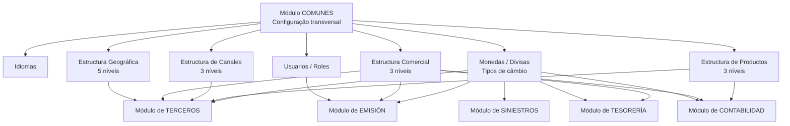

# Módulo COMUNES do Reef.core — Configuração Transversal para MAPFRE

## 1. Metadados do Documento
- **Arquivo de Origem:** `Não identificado no conteúdo fornecido`
- **Tipo de Documento:** `Manual Funcional / Arquitetura Funcional`
- **Domínio / Sistema:** `Reef.core — Solução MAPFRE, módulo COMUNES`
- **Público-Alvo:** `Desenvolvedores, Arquitetos, Operação e Negócio`
- **Data/Versão Identificada:** `Não identificada`

---

## 2. Resumo Executivo & Contexto de Negócio

O módulo **COMUNES** do Reef.core centraliza a configuração, no nível da Solução e da companhia, de conceitos utilizados transversalmente pelos módulos de **Terceros, Emisión, Siniestros, Tesorería e Contabilidad**. A finalidade declarada é assegurar que conceitos compartilhados sejam definidos uma única vez e reutilizados de maneira coerente nas funcionalidades subsequentes da Solução.

Os conceitos principais identificados são **Idiomas**, **Monedas**, **Usuarios/Roles** e estruturas organizacionais de informação: **Geográfica**, **Comercial**, **Productos** e **Canales**. Essas definições sustentam a visualização de textos da aplicação, a operação com divisas e tipos de câmbio, o controle de permissões de usuários e a classificação de entidades, produtos, canais e localizações.

A transversalidade é uma característica central do módulo COMUNES. Os atributos configurados no módulo podem ser empregados total ou parcialmente pelos demais módulos. O documento também estabelece o princípio de consistência e coerência lógica: um mesmo conceito e seus atributos devem afetar de forma equivalente todas as funcionalidades que os utilizam.

No contexto operacional, as estruturas configuradas em COMUNES são associadas a entidades como terceiros, apólices, sinistros, recibos e comissões. Por exemplo, o terceiro nível da estrutura comercial pode influenciar a numeração de documentos, a determinação de movimentos de tesouraria e a contabilização de lançamentos. As moedas e seus tipos de câmbio também são reutilizados em emissão, sinistros, tesouraria e contabilidade.

---

## 3. Arquitetura, Componentes & Tecnologias Envolvidas

### Componentes e conceitos identificados

| Componente / Conceito | Descrição sustentada pelo documento |
| :--- | :--- |
| **Reef.core** | Âmbito tecnológico no qual o conceito de Rol representa as funções que um usuário pode executar no sistema. |
| **Módulo COMUNES** | Módulo transversal responsável por configurar conceitos reutilizados por outros módulos da Solução. |
| **Terceros** | Módulo que utiliza parâmetros de instalação, estruturas e moedas em dados e associações de terceiros. |
| **Emisión** | Módulo que usa parâmetros de instalação, controles técnicos, papéis, estruturas comerciais e moedas para emissão. |
| **Siniestros** | Módulo cujas liquidações podem usar divisas diferentes da moeda de emissão da apólice. |
| **Tesorería** | Módulo que utiliza amplamente divisas e tipos de câmbio e registra movimentos relacionados à estrutura comercial. |
| **Contabilidad** | Módulo que usa datas de processo, moedas, tipos de câmbio, estrutura comercial, ramos e ramos contábeis. |
| **Idiomas** | Idiomas nos quais os textos e literais das telas da aplicação podem ser visualizados. |
| **Monedas / Divisas** | Divisas e tipos de câmbio usados para executar determinadas operações do sistema. |
| **Usuarios** | Pessoas declaradas no sistema e autorizadas a executar funções por meio da atribuição de roles. |
| **Roles** | Agrupamentos de uma ou mais funcionalidades que determinam o que um usuário pode realizar e executar. |
| **Estructura Geográfica** | Organização geográfica de países em estrutura piramidal de cinco níveis. |
| **Estructura Comercial** | Organização comercial de entidades seguradoras em estrutura piramidal de três níveis. |
| **Estructura de Productos** | Classificação técnica de tipos de seguros, organizada em estrutura piramidal de três níveis. |
| **Estructura de Canales** | Organização das formas pelas quais agentes vinculados à estrutura comercial concluem vendas de produtos. |
| **Controles Técnicos** | Regras de negócio configuráveis dinamicamente durante o processo de emissão; requerem associação a roles para autorização. |
| **Ramos Contables** | Chaves associadas a coberturas que as relacionam à conta na qual será realizada sua contabilização. |



**Nota de Análise:** o documento apresenta relações funcionais entre módulos, estruturas e conceitos configuráveis, mas não detalha interfaces técnicas, métodos HTTP, contratos JSON, bases de dados, versões de tecnologia, URLs, servidores ou mecanismos específicos de integração.

---

## 4. Regras de Negócio, Especificações Funcionais & Processos

### 4.1 Princípios do módulo COMUNES

1. O módulo COMUNES configura conceitos empregados transversalmente nos módulos de Terceros, Emisión, Siniestros, Tesorería e Contabilidad.
2. Os conceitos e atributos definidos no módulo COMUNES são utilizados e interagem, total ou parcialmente, com funcionalidades dos demais módulos da Solução.
3. Um conceito configurado no módulo COMUNES deve produzir efeito equivalente nas funcionalidades dos módulos que o utilizam, garantindo consistência e coerência lógica.

### 4.2 Idiomas

1. Os idiomas definem os idiomas disponíveis para visualização de literais ou textos nas telas da aplicação.
2. O documento não especifica idiomas concretos, mecanismo de tradução, catálogos de mensagens ou processo de manutenção de textos.

### 4.3 Moedas, divisas e tipos de câmbio

1. As moedas representam as diferentes divisas com as quais o sistema pode operar.
2. Os tipos de câmbio são associados ao uso de moedas para execução de determinadas operações.
3. No módulo de Terceros, as moedas podem ser associadas a informações bancárias de segurados, clientes e fornecedores.
4. No módulo de Emisión, a moeda associada à apólice determina a moeda de cálculo dos respectivos prêmios.
5. No módulo de Siniestros, as liquidações de expedientes podem usar divisas diferentes da moeda em que a apólice foi emitida.
6. No módulo de Tesorería, divisas e tipos de câmbio são usados amplamente na maioria das funcionalidades.
7. No módulo de Contabilidad, moedas e tipos de câmbio são utilizados na geração de lançamentos contábeis.

### 4.4 Usuários e roles

1. As pessoas que utilizam a Solução devem ser declaradas como usuários no sistema.
2. Cada usuário deve receber as funções que pode desempenhar por meio da atribuição de roles.
3. Um rol representa funções que uma pessoa desempenha em empresa ou organização; no contexto tecnológico do Reef.core, representa as funções que um usuário pode realizar e executar no sistema.
4. Um rol pode agrupar múltiplas funcionalidades ou servir uma única funcionalidade do sistema.
5. Um usuário pode possuir um ou mais roles.
6. Em Emisión, os controles técnicos devem ser associados aos roles dos usuários para identificar quem pode autorizá-los.

### 4.5 Estrutura geográfica

1. A estrutura geográfica permite estabelecer as divisões geográficas dos países no sistema.
2. A divisão geográfica é modelada por uma estrutura piramidal de cinco níveis.
3. O exemplo de Espanha apresenta os níveis: **País**, **Comunidad/Ciudad Autónoma**, **Provincia**, **Municipio/Localidad** e **Distrito**.
4. Códigos postais não pertencem à estrutura geográfica, embora sejam apresentados graficamente para facilitar a compreensão da estrutura postal.
5. No módulo de Terceros, níveis das estruturas geográfica, comercial, de canais e de produtos são usados em associações a elementos relevantes.

### 4.6 Estrutura comercial

1. A estrutura comercial configura as divisões que organizam comercialmente as entidades seguradoras.
2. A estrutura comercial possui organização piramidal de três níveis.
3. A estrutura comercial é uma abstração da estrutura geográfica adaptada às necessidades específicas da companhia.
4. Em Emisión, a numeração de apólices e orçamentos pode utilizar a estrutura comercial definida para a entidade.
5. Em Emisión, devem ser associados à apólice:
   - o terceiro nível da estrutura comercial do agente;
   - a fonte de produção do agente;
   - o terceiro nível da estrutura comercial à qual pertence o usuário emissor/subscritor;
   - a moeda de emissão da apólice.
6. Em Tesorería, o terceiro nível da estrutura comercial é associado à apólice a partir da chave do intermediário, sendo herdado por recibos, sinistros e outros elementos.
7. Em Tesorería, esse terceiro nível é usado para determinar e armazenar movimentos realizados por caixas.
8. A formação das numerações de ordens de pagamento e cheques utiliza o terceiro nível da estrutura comercial definido para a entidade.
9. Em Contabilidad, o terceiro nível da estrutura comercial associado à apólice pela chave do intermediário determina a contabilização em lançamentos.

### 4.7 Estrutura de produtos e ramos contábeis

1. A estrutura de produtos organiza e classifica tecnicamente os tipos de seguros comercializados pela entidade seguradora.
2. A estrutura de produtos possui organização piramidal de três níveis.
3. O exemplo apresenta a classificação por **Compañía**, **Sector**, **Subsector** e **Ramo**.
4. No exemplo, seguros de **VIDA** e **NO VIDA** são tratados como setores.
5. No exemplo, **VIDA Riesgo** e **VIDA Ahorro** são subsectores do setor VIDA.
6. No exemplo, **Automóviles**, **Mercancías** e **Empresas** são subsectores do setor NO VIDA.
7. Coberturas de Incendio e Robo e seus ramos contábeis são exibidos para compreensão da possível parametrização dos ramos contábeis, mas não pertencem à estrutura de produtos.
8. Ramos contábeis são chaves associadas a coberturas que as relacionam à conta onde será efetuada sua contabilização.
9. A associação entre ramo contábil e cobertura ocorre durante a definição da cobertura no ramo.
10. Em Contabilidad, as contas contábeis utilizadas em lançamentos podem ter associados os ramos e ramos contábeis definidos na estrutura de produtos da entidade.

### 4.8 Estrutura de canais

1. A estrutura de canais configura as formas pelas quais agentes vinculados à estrutura comercial da entidade seguradora concluem a venda de produtos.
2. A estrutura de canais possui organização piramidal de três níveis.
3. Os níveis **Clientes Distribuidores** e **Agrupaciones** possuem definição corporativa e uso obrigatório.
4. As agrupações do canal direto identificam e classificam seguros comercializados:
   - em escritórios da entidade seguradora;
   - em escritórios voltados a Grandes Cuentas;
   - por meios telefônicos, via call center;
   - por meio web, na página da entidade seguradora.
5. O cliente distribuidor direto é composto por pessoas, normalmente empregados, ou meios de distribuição que realizam vendas para MAPFRE sem receber retribuição variável direta.

### 4.9 Integração funcional com Terceros

1. Parâmetros de instalação modulam o comportamento da interface da Solução no módulo de Terceros.
2. Esses parâmetros podem ativar, desativar ou modificar fluxos de captura de informações.
3. A captura de informações de cliente pode variar, por exemplo, conforme o cliente seja pessoa física ou companhia.
4. As estruturas geográfica, comercial, de canais e de produtos podem ser utilizadas em Terceros para associação a:
   - identificação de localidades de nascimento ou constituição de pessoas físicas ou jurídicas;
   - dados identificativos, de contato e de obrigações fiscais de segurados;
   - endereços postais, de trabalho, de correspondência e outros;
   - dados identificativos de segurados que sejam agentes, tramitadores de sinistros ou supervisores de sinistros, conforme a atividade do terceiro.
5. As moedas são usadas para associação à informação de dados bancários de segurados, clientes e fornecedores.

### 4.10 Integração funcional com Emisión

1. Parâmetros de instalação modulam o comportamento da interface de Emisión ao modificar os fluxos de captura e validação de informações.
2. Regras de negócio que entidades MAPFRE podem estabelecer e executar dinamicamente durante a emissão são denominadas Controles Técnicos.
3. Controles Técnicos devem ser associados aos roles de usuários para identificar os usuários autorizados a aprová-los.
4. Numerações de apólices e orçamentos podem utilizar a estrutura comercial da entidade.
5. A apólice associa o terceiro nível da estrutura comercial do agente, a fonte de produção do agente, o terceiro nível comercial do usuário emissor/subscritor e a moeda de emissão.

### 4.11 Integração funcional com Siniestros

1. A Solução permite configurar o uso, nas liquidações de expedientes do módulo de Siniestros, de divisas diferentes da moeda de emissão da apólice.

### 4.12 Integração funcional com Tesorería

1. Divisas e seus tipos de câmbio são utilizados amplamente na maior parte das funcionalidades de Tesorería.
2. O terceiro nível da estrutura comercial, associado à apólice por meio da chave do intermediário e herdado por recibos, sinistros e outros elementos, determina e armazena movimentos feitos por caixas.
3. As numerações de ordens de pagamento e cheques incorporam o terceiro nível da estrutura comercial definido para a entidade.

### 4.13 Integração funcional com Contabilidad

1. Conforme as datas de processo configuradas para a entidade, é iniciado o processo de fechamento contábil mensal.
2. Moedas e tipos de câmbio são usados na geração dos lançamentos contábeis.
3. O terceiro nível da estrutura comercial associado à apólice pela chave do intermediário determina a contabilização nos lançamentos.
4. Contas contábeis usadas em lançamentos podem ter ramos e ramos contábeis da estrutura de produtos associados.

---

## 5. Tabelas de Parâmetros, Ambientes e Estruturas de Dados

| Item / Parâmetro | Descrição / Função | Tipo / Valores / Formato | Ambiente / Observações |
| :--- | :--- | :--- | :--- |
| Idiomas | Define os idiomas para visualização de literais e textos das telas. | Idiomas não especificados. | Aplicação / Solução. |
| Monedas | Define as divisas usadas para operações do sistema. | Divisas não especificadas. | Utilizada em Terceros, Emisión, Siniestros, Tesorería e Contabilidad. |
| Tipos de câmbio | Suportam operações realizadas com moedas e divisas. | Valores e periodicidade não especificados. | Uso amplo em Tesorería; utilizado em Contabilidad. |
| Usuario | Pessoa declarada no sistema. | Um usuário pode ter um ou mais roles. | Reef.core. |
| Rol | Define funções que um usuário pode executar. | Pode conter uma ou múltiplas funcionalidades. | Usado para autorizar Controles Técnicos em Emisión. |
| Estrutura Geográfica | Organiza divisões geográficas dos países. | Pirâmide de cinco níveis. | Códigos postais não integram formalmente a estrutura. |
| Estrutura Comercial | Organiza comercialmente entidades seguradoras. | Pirâmide de três níveis. | Abstração da estrutura geográfica adaptada à companhia. |
| Estrutura de Produtos | Classifica tecnicamente os tipos de seguros. | Pirâmide de três níveis. | Exemplo inclui Compañía, Sector, Subsector e Ramo. |
| Estrutura de Canais | Organiza as formas de venda de produtos pelos agentes. | Pirâmide de três níveis. | Clientes Distribuidores e Agrupaciones são corporativos e obrigatórios. |
| Controles Técnicos | Regras de negócio executáveis dinamicamente na emissão. | Associação obrigatória a roles para autorização. | Emisión. |
| Ramo Contable | Chave associada a cobertura para relacionamento com conta contábil. | Exemplos: `222XXX001`, `222XXX002`. | A associação é feita na definição da cobertura no ramo. |
| Terceiro nível comercial do agente | Nível comercial associado à apólice. | Terceiro nível da estrutura comercial. | Afeta Emisión, Tesorería e Contabilidad. |
| Fonte de Produção do Agente | Informação associada à apólice em Emisión. | Não detalhada. | Estrutura de Canais / Emisión. |
| Moeda de emissão da apólice | Moeda em que a apólice é emitida e os prêmios são calculados. | Moeda não especificada. | Emisión. |
| Datas de processos | Datas configuradas para a entidade. | Não detalhadas. | Disparam o fechamento contábil mensal em Contabilidad. |

### Exemplo de estrutura geográfica da Espanha

| Nível | Valores apresentados no documento |
| :--- | :--- |
| País | `34 - España` |
| Comunidad/Ciudad Autónoma | `1 - Andalucía`; `13 - Madrid` |
| Provincia | `4 - Almería`; `11 - Cádiz`; `28 - Madrid` |
| Municipio/Localidad | `127 - Las Rozas de Madrid`; `115 - Pozuelo de Alarcón`; `079 - Madrid` |
| Distrito | `01 - Centro`; `02 - Arganzuela`; `01 - Distrito Norte`; `02 - Distrito Centro` |
| Código postal | `28231`; `28230` — exibidos para compreensão, mas não pertencem à estrutura geográfica. |

### Exemplo de estrutura de produtos MAPFRE

| Nível / Elemento | Valores apresentados no documento |
| :--- | :--- |
| Compañía | `Compañía - MAPFRE` |
| Sector | `Sector 1 - VIDA`; `Sector 2 - NO VIDA` |
| Subsector | `10 - VIDA Riesgo`; `11 - VIDA Ahorro`; `20 - Automóviles`; `21 - Mercancías`; `22 - Empresas` |
| Ramo | `Hogar - Ramo 300`; `Comercio - Ramo 301`; `Comunidades - Ramo 302` |
| Cobertura exibida | `Cobertura de Incendio - 745`; `Cobertura de Robo - 766` |
| Ramo Contable exibido | `222XXX001 - Incendios`; `222XXX002 - Resto Coberturas` |

### Exemplo de estrutura de canais MAPFRE

| Nível / Elemento | Valores apresentados no documento |
| :--- | :--- |
| Compañía | `Compañía - MAPFRE` |
| Clientes Distribuidores | `1 - Directo`; `2 - Red Propia - Agencial`; `3 - Red Externa - Corredores`; `4 - Bancario`; `5 - Acuerdos` |
| Agrupaciones | `10 - Oficinas Directas`; `11 - Directo Grandes Cuentas`; `12 - Directo Digital`; `13 - Directo Telefónico`; `24 - Delegados`; `25 - Agentes Exclusivos`; `36 - Agentes Vinculados`; `37 - Agentes No Vinculados`; `38 - Corredores Locales`; `39 - Corredores Globales`; `41 - Bancario`; `51 - Acuerdos` |
| Fuentes de Producción | `1001 - Oficina Directa`; `1002 - Oficina de Gestión`; `1003 - Punto de Venta Directo`; `100x ...` |

---

## 6. Bateria de Perguntas & Respostas para RAG (FAQ Sintético)

### P1: Qual é a finalidade do módulo COMUNES no Reef.core?
**R:** O módulo COMUNES configura, no nível da Solução e da companhia, conceitos empregados transversalmente pelos módulos de Terceros, Emisión, Siniestros, Tesorería e Contabilidad. Entre os conceitos configurados estão idiomas, moedas, usuários, roles e estruturas geográficas, comerciais, de produtos e de canais.

### P2: Quais conceitos principais são configurados pelo módulo COMUNES?
**R:** O documento identifica como conceitos principais do módulo COMUNES os Idiomas, Monedas, Usuarios/Roles e as estruturas de informação Geográfica, Comercial, de Productos e de Canales.

### P3: Como os roles controlam as permissões de usuários no Reef.core?
**R:** Usuários precisam estar declarados no sistema e receber roles que representam as funções que podem executar. Um rol pode agrupar várias funcionalidades ou apenas uma funcionalidade, e um usuário pode receber um ou mais roles. Em Emisión, os roles identificam quem pode autorizar Controles Técnicos.

### P4: Quantos níveis possui a estrutura geográfica e quais são os níveis do exemplo da Espanha?
**R:** A estrutura geográfica possui cinco níveis. No exemplo da Espanha, os níveis apresentados são País, Comunidad/Ciudad Autónoma, Provincia, Municipio/Localidad e Distrito. Os códigos postais são exibidos apenas para facilitar a compreensão da estrutura postal e não pertencem formalmente à estrutura geográfica.

### P5: Para que serve a estrutura comercial no módulo COMUNES?
**R:** A estrutura comercial organiza comercialmente as entidades seguradoras em uma estrutura piramidal de três níveis. Ela é uma abstração da estrutura geográfica adaptada às necessidades da companhia e pode ser utilizada na composição de numerações de apólices, orçamentos, ordens de pagamento e cheques, além de influenciar movimentos de tesouraria e contabilizações.

### P6: O que são Ramos Contables e quando eles são associados às coberturas?
**R:** Ramos Contables são chaves associadas às coberturas que as relacionam à conta onde sua contabilização será realizada. A associação entre ramo contábil e cobertura ocorre no momento da definição da cobertura no ramo. As contas contábeis usadas em lançamentos podem ter ramos e ramos contábeis associados.

### P7: Como o módulo COMUNES influencia o módulo de Terceros?
**R:** Parâmetros de instalação podem ativar, desativar ou modificar fluxos de captura de informações de Terceros, inclusive distinguindo a captura de um cliente pessoa física da captura de uma companhia. Terceros também utiliza estruturas geográficas, comerciais, de canais e de produtos para associar localidades, dados identificativos, contatos, obrigações fiscais, endereços e dados de terceiros que atuem como agentes ou profissionais de sinistros. Moedas podem ser associadas aos dados bancários de segurados, clientes e fornecedores.

### P8: Como a moeda da apólice é utilizada no módulo de Emisión?
**R:** Em Emisión, a moeda é associada à apólice. Essa moeda é a moeda em que a apólice é emitida e, consequentemente, a moeda em que seus prêmios são calculados.

### P9: As liquidações de sinistros precisam usar a mesma moeda da apólice?
**R:** Não necessariamente. O documento informa que a Solução permite configurar que as liquidações de expedientes do módulo de Siniestros utilizem divisas diferentes da moeda em que a apólice foi emitida.

### P10: Quais níveis da estrutura de canais são obrigatórios corporativamente?
**R:** Os dois primeiros níveis, Clientes Distribuidores e Agrupaciones, possuem definição corporativa e são de uso obrigatório, conforme o documento.

### P11: Como o terceiro nível da estrutura comercial afeta Tesorería?
**R:** O terceiro nível da estrutura comercial é associado à apólice pela chave do intermediário e é herdado por recibos, sinistros e outros elementos. Em Tesorería, ele determina e armazena movimentos realizados por caixas. A numeração de ordens de pagamento e cheques também utiliza esse terceiro nível comercial.

### P12: O que inicia o processo de fechamento contábil mensal?
**R:** O processo de fechamento contábil mensal é iniciado de acordo com as datas de processos configuradas para a entidade. O documento não detalha os valores dessas datas, as regras de calendário ou o mecanismo técnico de execução do fechamento.

---

## 7. Glossário de Termos, Siglas & Conceitos-Chave

- **COMUNES:** Módulo transversal do Reef.core que configura conceitos reutilizados nos demais módulos da Solução.
- **Reef.core:** Contexto tecnológico citado para representar as funções que usuários podem realizar no sistema por meio de roles.
- **Terceros:** Módulo utilizado para gestão de informações associadas a terceiros, como segurados, clientes, fornecedores, agentes e outros perfis.
- **Emisión:** Módulo relacionado à captura, validação e emissão de apólices e orçamentos.
- **Siniestros:** Módulo relacionado a expedientes e liquidações de sinistros.
- **Tesorería:** Módulo que utiliza divisas, tipos de câmbio e estrutura comercial em diversas funcionalidades e movimentos de caixa.
- **Contabilidad:** Módulo que realiza processos como fechamento contábil mensal e geração de lançamentos contábeis.
- **Usuario:** Pessoa declarada no sistema que utiliza a Solução.
- **Rol:** Conjunto de uma ou mais funcionalidades que determina o que um usuário pode realizar e executar.
- **Moneda / Divisa:** Moeda utilizada pelo sistema em operações, emissão de apólices, dados bancários, liquidações e lançamentos.
- **Tipo de cambio:** Tipo de câmbio associado ao uso de divisas.
- **Estructura Geográfica:** Estrutura de cinco níveis para modelar divisões geográficas de países.
- **Estructura Comercial:** Estrutura piramidal de três níveis para modelar a organização comercial de uma entidade seguradora.
- **Estructura de Productos:** Estrutura usada para organizar e classificar tecnicamente tipos de seguros.
- **Estructura de Canales:** Estrutura usada para configurar formas de venda de produtos por agentes ligados à estrutura comercial.
- **Clientes Distribuidores:** Nível corporativo e obrigatório da estrutura de canais.
- **Agrupaciones:** Nível corporativo e obrigatório da estrutura de canais.
- **Fuentes de Producción:** Elemento da estrutura de canais associado à apólice em Emisión.
- **Controles Técnicos:** Regras de negócio que entidades MAPFRE podem configurar e executar dinamicamente durante a emissão.
- **Ramo:** Classificação apresentada na estrutura de produtos.
- **Ramo Contable:** Chave associada a uma cobertura e à conta contábil em que será realizada a contabilização.
- **Cobertura:** Elemento de seguro ao qual pode ser associado um ramo contábil.
- **Intermediario:** Chave utilizada para associar à apólice o terceiro nível da estrutura comercial.

---

## 8. Notas Críticas, Riscos & Limitações

- **Nota de Análise:** o documento é predominantemente funcional e conceitual. Não descreve componentes de infraestrutura, protocolos, APIs, esquemas de banco de dados, contratos de integração, URLs, portas, autenticação ou procedimentos de implantação.
- **Nota de Análise:** o documento menciona parâmetros de instalação que modulam comportamentos em Terceros e Emisión, mas não lista os nomes desses parâmetros, valores permitidos, regras de precedência ou telas de configuração.
- **Risco de autorização:** os Controles Técnicos de Emisión dependem da correta associação aos roles dos usuários. O documento não detalha critérios de segregação de funções, trilha de auditoria ou mecanismo de revisão de permissões.
- **Risco de consistência transversal:** as estruturas e seus atributos são reutilizados por vários módulos. Alterações de configuração podem afetar captura de dados, emissão, tesouraria e contabilidade.
- **Limitação de modelo geográfico:** códigos postais são exibidos no exemplo da estrutura geográfica, mas não pertencem formalmente a essa estrutura.
- **Limitação de detalhamento:** o documento lista exemplos de valores para estruturas de produtos e canais, mas não declara que os valores apresentados representam um catálogo completo.
- **Dependência funcional:** a contabilização depende da associação entre estrutura comercial, apólices, intermediários, ramos, ramos contábeis e contas contábeis.
- **Nota de Análise:** o documento lista o sistema Reef.core e os módulos relacionados, porém não detalha métodos HTTP, contratos JSON, topologia de microsserviços ou contratos técnicos expostos.

---

## 9. Conteúdo Bruto Estruturado (Referência Fiel)

```text
--- [PÁGINA 1 DE 5] ---

INTRODUCCIÓN - Módulo COMUNES
Objetivo
La finalidad del módulo "COMUNES" es configurar en la Solución y a nivel de compañía determinados conceptos que serán empleados
transversalmente en los restantes módulos: Terceros, Emisión, Siniestros, Tesorería y Contabilidad.
Características
Principales Conceptos
Integración y Dependencias con Otros Módulos
Características
Transversalidad
Todos los conceptos del módulo y la definición/configuración de los atributos que los componen se emplean e interactúan total o
parcialmente en las funcionalidades del resto de módulos de la Solución.
Consistencia y coherencia lógica
Todos los conceptos del módulo y sus atributos afectan de igual manera a las funcionalidades de los módulos de la Solución que los
emplean.
Principales Conceptos
Idiomas
Monedas
Usuarios/Roles
Estructuras
Idiomas
Los Idiomas en los que se pueden visualizar los literales o textos de las pantallas de la aplicación.
Monedas
Las diferentes divisas y los tipos de cambio con las que puede operar el sistema para ejecutar determinadas operaciones.
Ejemplo:
Documentation / DOCUMENTACIÓN Reef
DOCUMENTACIÓN Reef
Mapfredocument
DOCUMENTACIÓN Reef
Owner
user:agonzalez_mapfre.com
Lifecycle
Approved Source
 /
 VL
Buscar Inicio Soluciones Arquitecturas APIs Componentes Cloud Documentación Zeus Reef Ayuda
ES

--- [PÁGINA 2 DE 5] ---

Usuarios y Roles
Las personas que utilizan la Solución han de estar declaradas como Usuarios en el Sistema además de tener asignadas las funciones que
pueden desempeñar en la Solución mediante el concepto y uso de los roles.
El concepto del Rol está vinculado a la función que una Persona desempeña en una empresa u organización y en el ámbito tecnológico de
Reef.core se refiere a las funciones que un Usuario puede realizar y ejecutar en el Sistema, teniendo en cuenta que
Un Rol puede agrupar un conjunto de funcionalidades o servir a una única funcionalidad del Sistema, y
Un Usuario puede tener asignados uno o varios Roles.
Estructuras
Las diferentes organizaciones de información Geográfica, Comercial, Productos y de Canales que se emplean en el resto de módulos
mediante su asociación a sus elementos principales: Terceros, Pólizas, Siniestros, Recibos, Comisiones, ...
Las principales estructuras de Información con las que cuenta el módulo son:
Estructura Geográfica
Esta Estructura permite establecer en el sistema las diferentes divisiones en las que se organizan geográficamente los países. Esta división
se realiza a través de una estructura piramidal de 5 niveles.
Por ejemplo en la estructura geográfica de España los niveles serían:
ESTRUCTURA Geográfica España
País Comunidad/Ciudad Autónoma Provincia Municipio/Localidad Distrito
País 34 - España
1 - Andalucía
13 - Madrid
4 - Almería
11 - Cádiz
28 - Madrid
28 - Madrid
127 - Las Rozas de Madrid
115 - Pozuelo de Alarcón
079 - Madrid
01 - Centro
02 - Arganzuela
01 - Distrito Norte
02 - Distrito Centro
28231
28230
Si bien los códigos postales no pertenecen a la estructura geográfica, se muestran en el gráfico por cuestiones de comprensión de la
estructura postal.
Estructura Comercial
En esta estructura se configuran las diferentes divisiones en las que se organizan comercialmente las entidades aseguradoras. Esta división
se realiza a través de una estructura piramidal de tres niveles.
La estructura comercial no es más que una abstracción de la estructura geográfica adaptada a las necesidades específicas de la compañía.
De esta manera y a modo de ejemplo la estructura comercial de España se organizaría de acuerdo a las siguientes divisiones:

--- [PÁGINA 3 DE 5] ---

ESTRUCTURA Comercial
Compañía - MAPFRE Nivel 1 Nivel 2 Nivel 3
Estructura de Productos
En esta estructura se organizan y clasifican técnicamente los distintos tipos de seguros que se comercializan en la entidad aseguradora. Esta
división se realiza a través de una estructura piramidal de tres niveles.
ESTRUCTURA Productos MAPFRE
Compañía Sector Subsector Ramo
Compañía - MAPFRE
Sector 1 - VIDA
Sector 2 - NO VIDA
Subsector 10 - VIDA Riesgo
Subsector 11 - VIDA Ahorro
Subsector 20 - Automóviles
Subsector 21 - Mercancías
Subsector 22 - Empresas
Hogar - Ramo 300
Comercio - Ramo 301
Comunidades - Ramo 302
Cobertura de Incendio - 745
Cobertura de Robo - 766
Ramo Contable 222XXX001 - Incendios
Ramo Contable 222XXX002 - Resto Coberturas
En este Ejemplo se han considerado los Seguros de VIDA y NO VIDA como Sectores, Los Seguros de VIDA Riesgo y VIDA Ahorro como
clasificaciones de los Subsectores del Sector VIDA y los Seguros de Automóviles, Mercancías y Empresas como los posibles Subsectores del
Sector NO VIDA.
Si bien las Coberturas de Incendio y Robo configuradas en el ramo de Comercios así como sus Ramos Contables de "Incendios" y "Resto
de Garantías" no pertenecen a la Estructura de Productos, se muestran en el gráfico para facilitar la comprensión en la posible
parametrización de los Ramos Contables.
Los ramos contables son claves, asociadas a las coberturas, que las relacionan con la cuenta sobre la que se va a realizar su contabilización.
La asociación del ramo contable con la cobertura se realiza en el momento de la definición de la cobertura en el ramo.
Estructura de Canales
En esta estructura se configuran las diferentes formas por las cuales los agentes adscritos a la estructura comercial de la entidad
aseguradora cierran la venta de sus productos. Esta división se realiza a través de una estructura piramidal de tres niveles.”
ESTRUCTURA de Canales
Compañía - MAPFRE Clientes Distribuidores Agrupaciones Fuentes de Producción
Los dos primeros niveles, Clientes Distribuidores y Agrupaciones, son niveles cuya definición es Corporativa y por tanto de empleo
obligatorio.

--- [PÁGINA 4 DE 5] ---

Compañía - MAPFRE
1 - Directo
2 - Red Propia - Agencial
3 - Red Externa - Corredores
4 - Bancario
5 - Acuerdos
10 - Oficinas Directas
11 - Directo Grandes Cuentas
12 - Directo Digital
13 - Directo Telefónico
24 - Delegados
25 - Agentes Exclusivos
36 - Agentes Vinculados
37 - Agentes No Vinculados
38 - Corredores Locales
39 - Corredores Globales
41 - Bancario
51 - Acuerdos
1001 - Oficina Directa
1002 - Oficina de Gestión
1003 - Punto de Venta Directo
100x ...
De esta manera, las agrupaciones del canal directo identifican y clasifican aquellos seguros que se han comercializado en las Oficinas de la
Entidad Aseguradora (separando de estas, el subconjunto de oficinas destinadas a la comercialización de seguros para Grandes Cuentas),
por medios telefónicos (vía call-center) o por vía Web (en la página web de la entidad aseguradora).
El cliente distribuidor directo esta compuesto por aquellas personas, normalmente empleados, o medios de distribución que realizan
ventas para MAPFRE sin percibir una Retribución Variable directa a cambio.
Integración y Dependencias con otros Módulos
Como ejemplos de integración y dependencia con los otros Módulos de la Solución ...
Con el Módulo de TERCEROS
Determinados Parámetros de la Instalación modulan el comportamiento de la interfaz de la Solución para el Módulo de Terceros activando,
desactivando o modificando los flujos de captura de su información (no es igual la captura de un Cliente si este es persona física que si es
una compañía)

--- [PÁGINA 5 DE 5] ---

Además en el módulo de Terceros se utilizan los distintos niveles de las estructuras geográficas, comercial, canales y de productos para su
asociación a elementos como:
La identificación de las Localidades de nacimiento o constitución de las personas físicas o jurídicas.
Los Datos Identificativos, de Contactos y de Obligaciones Fiscales en los Asegurados.
Las identificación de las Direcciones postales, de Trabajo, de correspondencia, etc.
Los datos identificativos del Asegurado, si la persona es un Agente, un Tramitador de Siniestros o un Supervisor de Siniestros (de
acuerdo con la actividad del Tercero)
Por otra parte, en el módulo de Terceros se utilizan las Monedas para su asociación en la información de los Datos Bancarios de los
Asegurados, Clientes, Proveedores,...
Con el Módulo de EMISIÓN
Determinados Parámetros de la Instalación modulan el comportamiento de la interfaz de la Solución para el Módulo de Emisión modificando
el flujo de captura y validación de la información.
Determinadas reglas de negocio que las entidades MAPFRE pueden establecer y ejecutar de manera dinámica en el proceso de Emisión,
conocidas como Controles Técnicos, se deben asociar a los Roles de los Usuarios para saber quién o quienes pueden autorizarlas.
Las Numeraciones de las Pólizas y Presupuestos pueden utilizar en su composición la estructura comercial definida para la entidad.
Además en el módulo de Emisión se asocian a la póliza:
El tercer nivel de la estructura comercial del agente.
La Fuente de Producción del Agente.
El tercer nivel de la estructura comercial a la que pertenece el Usuario Emisor/Suscriptor.
La Moneda en la que se emite la póliza y por tanto la moneda en la que se calculan las primas de la misma.
Con el Módulo de SINIESTROS
La solución permite configurar el que las Liquidaciones de los expedientes del módulo de Siniestros puedan emplear otras divisas diferentes
a la moneda en la que se emitió la póliza.
Con el Módulo de TESORERÍA
Las Divisas y sus tipos de cambio se utilizan ampliamente en la mayoría de las funcionalidades del Módulo.
Con el tercer nivel de la estructura comercial (que se asocia a la póliza a partir de la clave del intermediario y por ende se hereda en sus
recibos, siniestros, etcétera) se determinan y almacenan los movimientos realizados por los Cajeros en la Tesorería como por ejemplo:
Las numeraciones de las órdenes de pago y cheques utilizan en su formación el tercer nivel de la estructura comercial definida para la
entidad.
Con el Módulo de CONTABILIDAD
De acuerdo con las fechas de procesos configuradas para la entidad, se iniciará el proceso de cierre contable mensual.
Las Monedas y sus tipos de cambio se utilizan en la generación de los Asientos Contables del Módulo.
Con el tercer nivel de la estructura comercial que se asocia a la póliza a partir de la clave del intermediario se determina la contabilización en
los asientos.
Las Cuentas Contables que se emplean en los diferentes asientos pueden tener asociados los Ramos y los Ramos Contables definidos en la
estructura de productos de la entidad.
Checking links...
```
