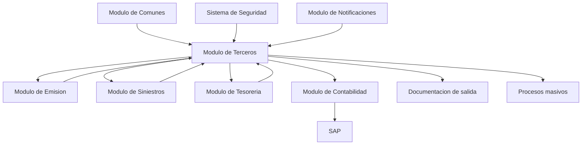
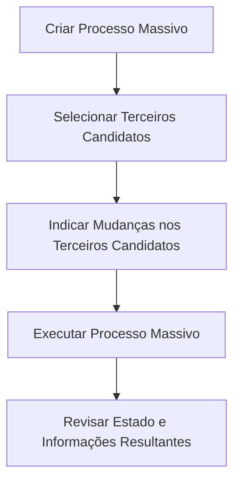

# Reef.core — Módulo de Terceiros: Conceitos, Estruturas de Informação, Operações e Integrações

## 1. Metadados do Documento
- **Arquivo de Origem:** Não informado; texto extraído de documento com 12 páginas.
- **Tipo de Documento:** Manual funcional / documentação de solução.
- **Domínio / Sistema:** Reef.core — Módulo de Terceros (Terceiros), MAPFRE.
- **Público-Alvo:** Desenvolvedores, arquitetos, analistas funcionais, operação e áreas de negócio.
- **Data/Versão Identificada:** Não identificada.

---

## 2. Resumo Executivo & Contexto de Negócio

O módulo de **Terceros** do Reef.core centraliza o cadastro, a manutenção, a consulta, a classificação e a organização de informações de terceiros vinculados à entidade seguradora MAPFRE. No contexto do módulo, o termo **Tercero** representa tanto pessoas físicas quanto pessoas jurídicas.

O módulo permite que cada terceiro seja associado a uma ou mais **Atividades**, que representam classificações funcionais e determinam dados complementares, operações disponíveis e participação em processos corporativos. Exemplos citados incluem segurados, agentes, peritos, empregados, supervisores de sinistros, tramitadores, seguradoras, resseguradoras, brokers, entidades bancárias, escritórios bancários e estruturas comerciais.

A solução busca estabelecer uma **visão única do terceiro**, consolidando e padronizando dados por meio de regras de unificação, normalização e estandardização. Essa visão única reduz consultas a sistemas distintos, melhora a qualidade da interação com clientes e terceiros e fornece informação consolidada para processos comerciais, operacionais, de emissão, sinistros, tesouraria e contabilidade.

A estrutura funcional é baseada em catálogos de configuração, estruturas de informação comuns e estruturas específicas por atividade. Os dados básicos e identificativos, assim como estruturas complementares exigidas pela atividade do terceiro, são obrigatórios. O módulo também suporta processos massivos, geração de documentação e consulta de histórico de alterações, quando habilitado para a atividade aplicável.

O documento descreve dependências importantes com o módulo de **Comunes**, responsável por configurações como companhia, idioma, moeda, estrutura comercial, estrutura de produto, canais de distribuição, segurança e notificações. O documento não detalha contratos de integração, endpoints, métodos HTTP, modelos JSON, banco de dados, APIs ou mecanismos técnicos de comunicação entre módulos.

---

## 3. Arquitetura, Componentes & Tecnologias Envolvidas

### Componentes funcionais identificados

| Componente / Módulo | Papel descrito no documento |
| :--- | :--- |
| **Reef.core** | Plataforma na qual o módulo de Terceros está inserido. |
| **Módulo de Terceros** | Gerencia cadastro, alteração, consulta, classificação, processos massivos e documentação de terceiros. |
| **Módulo de Comunes** | Fornece parâmetros e catálogos previamente configurados para uso adequado do módulo de Terceros. |
| **Módulo de Emisión** | Identifica tomador, contratante, segurado, condutores, beneficiários e outros terceiros no processo de emissão de apólices. |
| **Módulo de Siniestros** | Utiliza terceiros beneficiários para liquidações; utiliza fornecedores e beneficiários de faturas em processos de faturação. |
| **Módulo de Tesorería** | Utiliza tomador da apólice ou pagador do recibo como responsável pelo pagamento de prêmios. |
| **Módulo de Contabilidad** | Utiliza agentes em lançamentos de comissões e terceiros em lançamentos de resseguro para consolidação em SAP. |
| **Módulo de Notificaciones** | Configura documentos que podem ser gerados e enviados pelo módulo de Terceros. |
| **Sistema de Seguridad** | Define usuários e papéis para permitir ou restringir acesso às atividades e informações de terceiros. |
| **SAP** | Citado como sistema que exige a chave do terceiro para consolidação de contas de prêmios e comissões de empresas do grupo. |

### Dependências de configuração

| Dependência | Função |
| :--- | :--- |
| Compañía | Define a companhia ou companhias localmente constituídas da entidade seguradora MAPFRE. |
| Idioma | Define os idiomas suportados pela aplicação. |
| Moneda | Define moedas, taxas de câmbio e câmbios cruzados utilizados em movimentos econômicos, cobrança, pagamento, cálculo de prêmios e validação de valores. |
| Estructura Comercial | Define níveis e denominações da estrutura comercial de cada companhia. |
| Estructura Producto | Define níveis de estrutura de produtos e ramos contábeis de cada companhia. |
| Estructura Canales de Distribución | Define canais de distribuição e sua relação com terceiros cuja atividade seja Agente. |
| Sistema de Seguridad | Define usuários e papéis de acesso às atividades e informações de terceiros. |
| Notificaciones | Define documentos e documentação que podem ser gerados e enviados pelo módulo. |



> **Nota de Análise:** O documento descreve relações funcionais entre módulos, mas não detalha arquitetura física, protocolos, APIs, filas, bancos de dados, endpoints, autenticação técnica, formatos de mensagem ou contratos de dados.

---

## 4. Regras de Negócio, Especificações Funcionais & Processos

### 4.1 Conceito de terceiro

- Em linguagem jurídica, **persona física** é um ser humano.
- **Persona jurídica** corresponde a entidades.
- No Reef.core, o termo **Tercero** é utilizado para referir-se indistintamente a pessoas físicas e pessoas jurídicas.
- Todo terceiro, pessoa física ou jurídica, deve ser associado a uma ou mais classificações denominadas **Atividades**.
- As atividades determinam as tarefas desempenhadas pelo terceiro em relação à MAPFRE como entidade seguradora.

### 4.2 Atividades e impactos funcionais

| Atividade / Exemplo | Impacto funcional descrito |
| :--- | :--- |
| Intermediário ou Agente — código `[2]` | Permite participação automática no processo de devengo de comissões da MAPFRE. A remuneração pode incluir parte proporcional dos prêmios obtidos pela atividade comercial, intervenção ou colaboração. |
| Perito — código `[3]` | Pode participar de tarefas específicas de atribuição e perícia no processo de Gestão de Siniestros y Prestaciones. |
| Empleado — código `[15]` | Pode beneficiar-se automaticamente de desconto comercial na contratação de apólices no processo de Emisión. |
| Asegurado / Cliente — código `[1]` | Possui operação específica de modificação e estruturas exclusivas de informação do segurado. |
| Supervisor de Siniestros — código `[8]` | Possui estrutura e operação específica de modificação. |
| Tramitador de Siniestros — código `[9]` | Possui estrutura e operação específica de modificação. |
| Aseguradora — código `[13]` | Possui estrutura e operação específica de modificação. |
| Reaseguradora — código `[14]` | Possui estrutura e operação específica de modificação. |
| Broker de Seguros — código `[16]` | Possui estrutura e operação específica de modificação. |
| Empleado de Agencia/Agente — código `[37]` | Possui estrutura e operação específica de modificação. |
| Compañía MAPFRE Local — código `[39]` | Possui estrutura e operação específica de modificação. |
| Entidad Bancaria — código `[40]` | Possui estrutura e operação específica de modificação. |
| Oficina Bancaria — código `[41]` | Possui estrutura e operação específica de modificação. |
| Nivel 1 Estructura Comercial — código `[42]` | Possui estrutura e operação específica de modificação. |
| Nivel 2 Estructura Comercial — código `[43]` | Possui estrutura e operação específica de modificação. |
| Nivel 3 Estructura Comercial — código `[44]` | Possui estrutura e operação específica de modificação. |

### 4.3 Estruturas obrigatórias

- As estruturas que registram **Dados Básicos** e **Dados Identificativos** são obrigatórias.
- Estruturas que complementam a informação conforme a atividade também são obrigatórias.
- A captura de informações é modulada pela configuração da instalação e pela natureza do terceiro, por exemplo, pessoa física, companhia, agente ou segurado.

### 4.4 Operações suportadas

| Grupo de operação | Operação | Regra funcional |
| :--- | :--- | :--- |
| Criar terceiros | Crear Tercero | Captura informações em todas ou parte das estruturas comuns, independentemente da atividade associada. |
| Criar terceiros | Crear Asegurado | Além da criação do terceiro, exige registro das estruturas específicas de segurado. |
| Criar terceiros | Crear Asegurado Partiendo de Otro | Cria segurado com base em segurado preexistente, usando dados básicos ou outra estrutura de informação durante a operação. |
| Criar terceiros | Crear Agente | Além da criação do terceiro, exige estruturas específicas de agentes. |
| Criar terceiros | Crear como Tercero No Deseado | Após criar agente, terceiro genérico, supervisor, tramitador, seguradora, resseguradora, broker ou empregado de agência/agente, pode-se registrar a estrutura que o identifica como terceiro não desejado. |
| Criar terceiros | Crear Tercero Genérico | Exige estrutura específica dos terceiros genéricos. |
| Criar terceiros | Crear Supervisor | Exige estrutura específica de supervisores. |
| Criar terceiros | Crear Tramitador | Exige estruturas próprias de tramitadores. |
| Criar terceiros | Crear Aseguradora | Exige estrutura própria de seguradoras. |
| Criar terceiros | Crear Reaseguradora | Exige estrutura específica de companhias resseguradoras. |
| Criar terceiros | Crear Broker | Exige estrutura específica de broker. |
| Criar terceiros | Crear Empleado de Agencia/Agente | Exige estrutura específica de empregado de agência/agente. |
| Criar terceiros | Crear Compañía | Exige estrutura relativa às companhias. |
| Criar terceiros | Crear Entidad Bancaria | Exige estrutura específica de entidades bancárias. |
| Criar terceiros | Crear Oficina Bancaria | Exige bloco de informação específico de oficina bancária. |
| Criar terceiros | Crear Nivel 1, 2 ou 3 Estructura Comercial | Exige bloco específico correspondente ao nível comercial criado. |
| Criar terceiros | Crear Proveedor | Exige blocos específicos de fornecedores. |
| Modificar terceiros | Modificar Tercero | Permite alterar a maior parte das informações, exceto dados que identificam inequivocamente o terceiro. |
| Modificar terceiros | Modificar Tercero como Tercero No Deseado | Permite alterar a estrutura que identifica o terceiro como não desejado. |
| Consultar terceiros | Consultar vía Datos del Tercero | Recupera informações usando subconjunto de dados do terceiro como critério de busca. |
| Consultar terceiros | Consultar vía Medios de Contacto | Recupera informações usando meio de contato como critério de busca. |
| Consultar terceiros | Consultar por Situación en Histórico | Recupera versão selecionada do histórico e mostra alterações em relação à situação anterior imediata. Nem todas as atividades possuem histórico habilitado. |
| Consultar terceiros | Consultar por Situación en Vigor | Recupera a última situação do terceiro, ou situação vigente. |
| Processos massivos | Crear Proceso Masivo | Configura processo para criar ou modificar terceiros conforme os códigos de atividade associados ou futuros. |
| Processos massivos | Seleccionar Terceros Candidatos | Seleciona pessoas físicas ou jurídicas que participarão do processo massivo. |
| Processos massivos | Indicar Cambios en Terceros Candidatos | Define mudanças que serão aplicadas aos terceiros participantes. |
| Processos massivos | Ejecutar Proceso Masivo | Executa o processamento massivo de terceiros. |
| Processos massivos | Revisar Estado Proceso Masivo | Permite revisar estado e informações relacionadas aos terceiros após a execução. |
| Documentação | Generar Documentación | Gera e envia documentos de saída conforme configuração do módulo de Notificaciones e habilitação da funcionalidade pela atividade do terceiro. |

### 4.5 Fluxo de processo massivo



### 4.6 Regras de integração

- O módulo de **Comunes** modula comportamento da interface do módulo de Terceros, ativando, desativando ou alterando fluxos de captura.
- No módulo de **Emisión**, são identificados tomador/contratante e outros terceiros conforme a configuração do produto.
- Em automóveis, tomador e segurado normalmente coincidem, mas o país e a definição do produto podem exigir condutores e beneficiários.
- No módulo de **Siniestros**, terceiros beneficiários identificados durante a emissão são utilizados para pagamento de liquidações.
- Em faturação, fornecedores e beneficiários da fatura devem estar cadastrados no módulo de Terceros, com meios de contato e dados bancários identificados.
- No módulo de **Tesorería**, tomador da apólice ou pagador do recibo é apresentado como responsável pelo pagamento de prêmios.
- No módulo de **Contabilidad**, agentes responsáveis pela comercialização são utilizados em lançamentos de comissões.
- Em lançamentos de resseguro, contas de prêmios e comissões com empresas do grupo usam a chave do terceiro por requisito de consolidação no SAP.

---

## 5. Tabelas de Parâmetros, Ambientes e Estruturas de Dados

### 5.1 Catálogos comuns

| Item / Parâmetro | Descrição / Função | Tipo / Valores / Formato | Ambiente / Observações |
| :--- | :--- | :--- | :--- |
| Documentos Identificadores | Define documentos que identificam individual e inequivocamente os terceiros. | Exemplos: NIF, DNI. | Comum para pessoas físicas e jurídicas. |
| Agrupaciones | Define subconjuntos de terceiros com ao menos uma característica comum. | Catálogo. | Comum. |
| Categorías | Define classes estabelecidas em profissão, carreira ou atividade. | Catálogo. | Comum. |
| Clasificación | Define ordenações para organizar atividades de terceiros. | Catálogo. | Comum. |
| Códigos Calidad | Define propriedades para caracterizar e valorar terceiros em relação a outros. | Catálogo. | Comum. |
| Entidades de Cobro / Pago | Define entidades comercializadoras de meios de cobrança e pagamento. | Catálogo. | Comum. |
| Medios de Cobro / Pago | Define meios de cobrança e pagamento de terceiros. | Contas bancárias, cartões e outros. | Comum. |
| Token | Define tipos de tokens utilizáveis nos meios de cobrança e pagamento. | Catálogo. | Comum. |
| Régimen Fiscal | Define regimes fiscais, direitos e obrigações derivados de atividade econômica. | Catálogo. | Comum. |
| Rating | Define classificações de solvência de terceiros pessoas jurídicas. | Catálogo. | Aplicável a pessoas jurídicas. |
| Perfil Financiero | Define atributos e características socioeconômicas e financeiras. | Catálogo. | Comum. |
| Parentescos / Relaciones | Define parentescos e relações intercompanhias. | Catálogo. | Pessoas físicas e jurídicas, respectivamente. |
| Departamentos | Configura departamentos das empresas. | Catálogo. | Comum. |
| Cargos de Personas Políticamente Expuestas | Define possíveis cargos de terceiros politicamente expostos. | Catálogo. | Comum. |
| Consentimientos | Define manifestações de vontade para tratamento de dados pessoais. | Catálogo. | Comum. |
| Causas Inhabilitación | Define motivos operacionais para baixa ou inabilitação. | Catálogo. | Comum. |

### 5.2 Catálogos específicos por tipo de pessoa

| Item / Parâmetro | Descrição / Função | Tipo / Valores / Formato | Ambiente / Observações |
| :--- | :--- | :--- | :--- |
| Estados del Permiso de Conducir | Define estados ou situações de licenças e permissões de condução. | Catálogo. | Exclusivo para pessoas físicas. |
| Profesiones | Define empregos ou ocupações exercidos mediante remuneração, salário ou retribuição. | Catálogo. | Exclusivo para pessoas físicas. |
| Titulaciones | Define titulações que os terceiros podem possuir. | Catálogo. | Exclusivo para pessoas físicas. |
| Nivel de Estudios | Define graus ou níveis educacionais concluídos. | Catálogo. | Exclusivo para pessoas físicas. |
| Tipos de Personas Jurídicas | Define formas de constituição ou classificações de pessoas jurídicas. | Catálogo. | Exclusivo para pessoas jurídicas. |
| Actividad Económica | Configura atividades econômicas de terceiros pessoas jurídicas. | Catálogo. | Exclusivo para pessoas jurídicas. |
| Cargos de Accionistas | Define cargos ou empregos de acionistas. | Catálogo. | Exclusivo para pessoas jurídicas. |

### 5.3 Estruturas de informação comuns

| Estrutura | Descrição / Função | Tipo / Valores / Formato | Ambiente / Observações |
| :--- | :--- | :--- | :--- |
| Datos Básicos del Tercero | Contém dados que identificam inequivocamente o terceiro, como atividade, tipo e chave de documento identificador. Inclui dados que não podem ser alterados durante a vida do terceiro. | Estrutura obrigatória. | Pessoas físicas e jurídicas. |
| Datos Identificativos del Tercero | Distingue pessoa física de jurídica, registra categoria, condição de pessoa politicamente exposta e complementa dados básicos. | Estrutura obrigatória. | Pessoas físicas e jurídicas. |
| Obligaciones Fiscales | Determina se o terceiro possui obrigações fiscais em outros países. | Estrutura comum. | Pessoas físicas e jurídicas. |
| Personas Políticamente Expuestas | Identifica terceiro como pessoa politicamente exposta ou informa familiar/colaborador com esse status e vínculo. | Estrutura comum. | Pessoas físicas e jurídicas. |
| Contactos | Define meios e métodos de contato. | Estrutura comum. | Pessoas físicas e jurídicas. |
| Direcciones | Registra endereços e tipologia, como residencial, trabalho e correspondência. | Estrutura comum. | Pessoas físicas e jurídicas. |
| Documentos Alternativos | Registra documentos alternativos ao documento identificador principal. | Estrutura comum. | Pessoas físicas e jurídicas. |
| Representantes Legales | Registra representantes legais do terceiro. | Estrutura comum. | Pessoas físicas e jurídicas. |
| Datos Bancarios | Registra meios de cobrança e pagamento fornecidos pelo terceiro. | Contas bancárias, cartões e outros. | Pessoas físicas e jurídicas. |
| Accionistas | Identifica acionistas e respectivos percentuais acionários. | Estrutura comum. | Aplicável conforme terceiro. |
| Terceros No Deseados | Identifica terceiro como não desejado sob perspectiva comercial e técnica. | Estrutura comum. | Aplicável após criação para atividades descritas. |

### 5.4 Estruturas específicas por atividade

| Estrutura | Descrição / Função | Tipo / Valores / Formato | Ambiente / Observações |
| :--- | :--- | :--- | :--- |
| Información del Asegurado | Complementa dados básicos e identificativos do segurado. | Estrutura específica. | Exclusiva para segurados. |
| Consentimientos | Identifica consentimentos concedidos pelo segurado à entidade seguradora. | Estrutura específica. | Exclusiva para segurados. |
| Perfil Analítico | Registra dados do perfil analítico conforme cálculos locais, como probabilidades de up-selling, cross-selling e abandono. | Estrutura específica. | Exclusiva para segurados. |
| Licencia/Permiso de Conducir | Registra licença ou carteira de motorista. | Estrutura específica. | Exclusiva para segurados. |
| Información del Agente | Complementa dados básicos e identificativos do agente. | Estrutura específica. | Exclusiva para agentes. |
| Fuentes de Producción | Identifica fontes habilitadas ao agente: distribuidor, canal, atributos de vínculo, localização, oferta de produtos e canal de origem. | Estrutura específica. | Exclusiva para agentes. |
| Cuadros de Comisiones Habilitados | Registra quadros de comissão que podem ser usados pelo agente. | Estrutura específica. | Exclusiva para agentes. |
| Oficinas Habilitadas | Identifica escritórios comerciais onde o agente pode emitir produção. | Estrutura específica. | Exclusiva para agentes. |
| Información de los Terceros Genéricos | Complementa dados básicos e identificativos de terceiros genéricos. | Estrutura específica. | Exclusiva à atividade correspondente. |
| Información de los Supervisores | Complementa dados de supervisores de sinistros. | Estrutura específica. | Exclusiva à atividade correspondente. |
| Información de los Tramitadores | Complementa dados de tramitadores de sinistros. | Estrutura específica. | Exclusiva à atividade correspondente. |
| Información Aseguradora | Complementa dados de companhias seguradoras. | Estrutura específica. | Exclusiva à atividade correspondente. |
| Información Reaseguradora | Complementa dados de companhias resseguradoras. | Estrutura específica. | Exclusiva à atividade correspondente. |
| Información Broker | Complementa dados de brokers de seguros. | Estrutura específica. | Exclusiva à atividade correspondente. |
| Información Empleados de Agencia/Agente | Complementa dados de empregados de agência ou agente. | Estrutura específica. | Exclusiva à atividade correspondente. |
| Información Compañía | Complementa dados de companhias MAPFRE locais. | Estrutura específica. | Exclusiva à atividade correspondente. |
| Información Entidad Bancaria | Complementa dados de entidades bancárias. | Estrutura específica. | Exclusiva à atividade correspondente. |
| Información Oficina Bancaria | Adiciona informações de escritórios bancários. | Estrutura específica. | Exclusiva à atividade correspondente. |
| Información Nivel 1, 2 e 3 Estructura Comercial | Registra informações específicas dos níveis da estrutura comercial. | Estrutura específica. | Exclusiva à atividade correspondente. |

---

## 6. Bateria de Perguntas & Respostas para RAG (FAQ Sintético)

### P1: O que é um “Tercero” no módulo de Terceros do Reef.core?
**R:** No Reef.core, “Tercero” é o termo utilizado para representar tanto pessoas físicas quanto pessoas jurídicas. O módulo registra, organiza, classifica, consulta e mantém a informação desses terceiros conforme suas atividades e estruturas de informação aplicáveis.

### P2: Quais dados do terceiro não podem ser modificados?
**R:** A operação **Modificar Tercero** permite modificar a maior parte da informação do terceiro, exceto os dados que o identificam inequivocamente como terceiro. O documento associa esses dados à estrutura de **Datos Básicos del Tercero**, que inclui, por exemplo, atividade, tipo de documento identificador e chave.

### P3: Quais estruturas são obrigatórias no cadastro de um terceiro?
**R:** O documento estabelece que as estruturas de **Datos Básicos del Tercero** e **Datos Identificativos del Tercero** são obrigatórias. Também são obrigatórias as estruturas complementares exigidas pela atividade associada ao terceiro.

### P4: Como um agente participa do processo de comissões?
**R:** Quando uma pessoa é identificada com a atividade de Intermediário ou Agente, código `[2]`, ela pode entrar automaticamente no processo de devengo de comissões da MAPFRE. A remuneração pode incluir parcela proporcional dos prêmios obtidos por sua atividade comercial, intervenção ou colaboração.

### P5: Como funciona a consulta do histórico de um terceiro?
**R:** A operação **Consultar Tercero por Situación en Histórico** permite acessar informações conforme uma versão selecionada do histórico de situações do terceiro. A consulta apresenta as mudanças da situação escolhida em comparação com a situação imediatamente anterior. Nem todas as atividades possuem histórico de mudanças habilitado.

### P6: Quais são as etapas de um processo massivo de terceiros?
**R:** O processo massivo é composto por: criar o processo massivo, selecionar terceiros candidatos, indicar alterações para os candidatos, executar o processo e revisar o estado e as informações resultantes da execução.

### P7: Quando a documentação de um terceiro pode ser gerada e enviada?
**R:** A geração e o envio de documentação dependem da configuração expressamente realizada no módulo de Notificaciones e de a atividade do terceiro permitir ou ter habilitada essa funcionalidade. O documento exemplifica o envio ao regulador do contrato laboral com a MAPFRE ao criar um intermediário por meio da operação **Crear Agente**.

### P8: Qual é a relação entre o módulo de Terceros e o módulo de Emisión?
**R:** No processo de Emisión, o módulo identifica o tomador ou contratante do seguro e outros terceiros conforme a configuração do produto. Em seguros de automóveis, tomador e segurado normalmente coincidem, mas país e produto podem exigir identificação de condutores e beneficiários.

### P9: Como o módulo de Terceros é utilizado no processo de sinistros?
**R:** No processo de sinistros, terceiros beneficiários previamente identificados na emissão da apólice são utilizados para o pagamento das liquidações. Em faturação, fornecedores e beneficiários de faturas devem estar registrados no módulo com dados de contato e dados bancários para permitir contato e pagamentos.

### P10: Como o módulo contribui para a visão única do terceiro?
**R:** O módulo disponibiliza uma visão única utilizando os melhores dados por meio de regras de unificação, normalização e estandardização. Essa consolidação permite que áreas de negócio utilizem informação comum, melhora a interação com o terceiro e reduz a necessidade de consultar múltiplos sistemas.

### P11: Quais dados específicos devem ser registrados para um agente?
**R:** Além dos dados comuns, o agente possui estruturas específicas para informações do agente, fontes de produção, quadros de comissões habilitados e escritórios habilitados. As fontes de produção identificam distribuidor, canal de comercialização e atributos adicionais de vínculo, localização, oferta de produtos e canal de origem.

### P12: Qual é a dependência do módulo de Contabilidad em relação ao módulo de Terceros?
**R:** Na contabilização de comissões, são apresentadas liquidações realizadas ao agente responsável pela comercialização da apólice. Em lançamentos de resseguro relativos a movimentos de prêmios, contas de prêmios e comissões com empresas do grupo utilizam a chave do terceiro devido a um requisito de consolidação no SAP.

---

## 7. Glossário de Termos, Siglas & Conceitos-Chave

- **Reef.core:** Sistema/plataforma no qual está inserido o módulo de Terceros.
- **Tercero:** Pessoa física ou pessoa jurídica registrada no módulo.
- **Actividad:** Classificação associada ao terceiro que determina tarefas, estruturas de informação e operações aplicáveis.
- **Persona Física:** Ser humano.
- **Persona Jurídica:** Entidade com personalidade jurídica.
- **Asegurado:** Segurado ou cliente com estruturas específicas de informação.
- **Agente:** Terceiro associado à atividade de agente/intermediário, com participação no processo de comissões.
- **Tercero No Deseado:** Classificação de terceiro não desejado sob ponto de vista comercial e técnico.
- **NIF:** Número de Identificação Fiscal.
- **DNI:** Documento Nacional de Identidade.
- **PEP / Persona Políticamente Expuesta:** Pessoa politicamente exposta ou pessoa relacionada a esse status.
- **Emisión:** Módulo/processo de emissão de apólices.
- **Siniestros:** Módulo/processo de sinistros.
- **Tesorería:** Módulo/processo relacionado a cobranças e pagamentos.
- **Contabilidad:** Módulo/processo contábil.
- **SAP:** Sistema citado como destino de consolidação para determinados movimentos de resseguro.
- **Up-selling:** Probabilidade analítica de venda de produtos ou serviços adicionais.
- **Cross-selling:** Probabilidade analítica de venda cruzada de produtos ou serviços.
- **Devengo de comisiones:** Processo de apuração ou reconhecimento de comissões.
- **Tomador / Contratante:** Pessoa responsável pela contratação do seguro.
- **Beneficiario:** Terceiro beneficiário de seguro, liquidação ou fatura.
- **Broker:** Broker de seguros.
- **Tramitador:** Terceiro que atua no tratamento de sinistros.
- **Supervisor de Siniestros:** Terceiro que supervisiona sinistros.

---

## 8. Notas Críticas, Riscos & Limitações

- O documento não apresenta especificações de API, contratos JSON, endpoints, métodos HTTP, mecanismos de autenticação, protocolos de integração, tecnologias de banco de dados ou topologia de infraestrutura.
- Não foram identificadas URLs de ambientes, servidores, portas, caminhos de logs, variáveis de configuração ou parâmetros de deployment.
- Nem todas as atividades de terceiros possuem histórico de alterações habilitado.
- A geração de documentação depende de configuração prévia no módulo de Notificaciones e da habilitação da funcionalidade pela atividade do terceiro.
- A operação de modificação não permite alterar os dados que identificam inequivocamente o terceiro.
- A captura de dados depende de parâmetros previamente configurados no módulo de Comunes.
- O documento cita a funcionalidade reforçada para identificação e gestão de fornecedores, mas não detalha quais estruturas, campos ou regras específicas são aplicáveis aos fornecedores.
- O documento cita integração com SAP para consolidação de resseguro, mas não detalha mecanismo técnico, frequência, formato de dados ou tratamento de falhas.

---

## 9. Conteúdo Bruto Estruturado (Referência Fiel)

```text
--- [PÁGINAS 1 A 12] ---

O conteúdo bruto de referência corresponde integralmente à extração fornecida na solicitação, incluindo as seções:
- Introducción — Módulo de TERCEROS.
- Objetivo, dependencias, conceitos principais e operações suportadas.
- Dependências com COMPAÑÍA, IDIOMA, MONEDA, ESTRUCTURA COMERCIAL,
  ESTRUCTURA PRODUCTO, ESTRUCTURA CANALES de DISTRIBUCIÓN,
  SISTEMA de SEGURIDAD e NOTIFICACIONES.
- Conceitos de Terceros, Actividades e catálogos de configuração.
- Catálogos comuns, catálogos de pessoas físicas e catálogos de pessoas jurídicas.
- Estruturas de informação comuns, de asegurados, agentes e demais atividades.
- Operações de criação, modificação, consulta, processos massivos e documentação.
- Características do módulo, incluindo classificação, visão única do terceiro,
  afinidade de dados, produtividade, suporte comercial e histórico de modificações.
- Integrações com COMUNES, EMISIÓN, SINIESTROS, TESORERÍA e CONTABILIDAD.

Nota de fidelidade: a extração original contém caracteres de codificação corrompidos,
como “conguración”, “identicación” e “modicación”. Esses caracteres foram preservados
no texto-fonte fornecido e normalizados apenas nas seções analíticas deste artefato.
```
