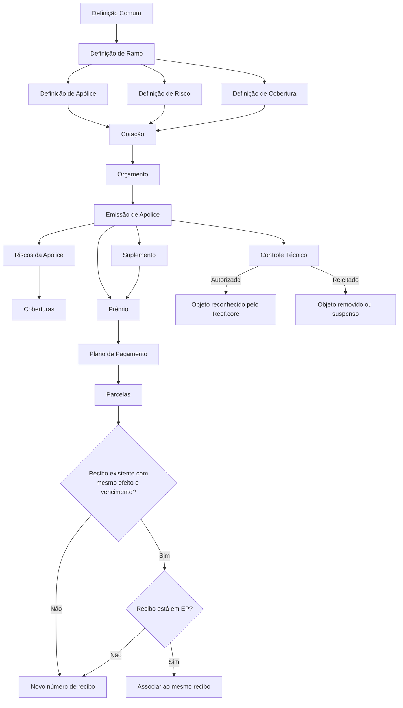
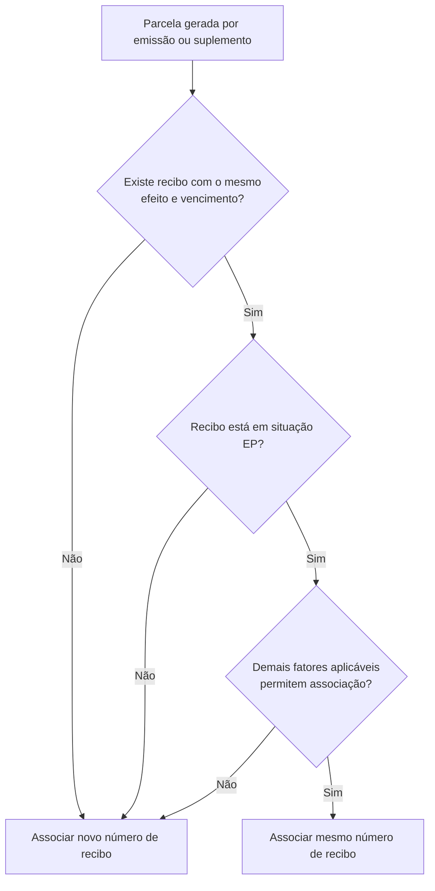
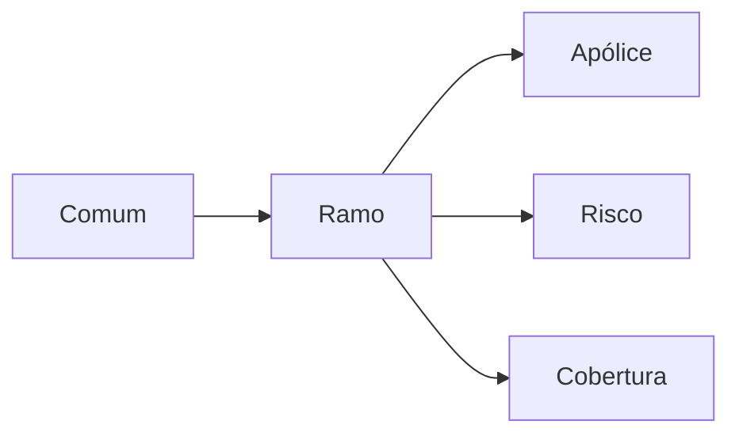

# Módulo de Emissão Reef.core — Conceitos, Configuração de Ramo e Operações de Seguros

## 1. Metadados do Documento
- **Arquivo de Origem:** Não identificado no conteúdo bruto fornecido
- **Tipo de Documento:** Manual Operacional / Especificação Funcional
- **Domínio / Sistema:** Reef.core — módulo de emissão de seguros MAPFRE
- **Público-Alvo:** Arquitetos, desenvolvedores, analistas funcionais, equipes de operação e negócio de seguros
- **Data/Versão Identificada:** Não identificada

---

## 2. Resumo Executivo & Contexto de Negócio

O documento descreve o módulo de emissão do Reef.core, responsável por criar e modificar contratos de seguros. O módulo organiza os elementos necessários para contratação, precificação, gestão de riscos, coberturas, apólices, suplementos, cotações, orçamentos, parcelas e recibos.

A emissão é configurável para múltiplos ramos de negócio, incluindo automóvel, saúde, vida, transporte e diversos. A configuração prévia do ramo determina a estrutura dos dados, os atributos exigidos, as coberturas disponíveis, as regras de negócio, os cálculos, as modificações permitidas e os mecanismos de controle técnico.

O modelo funcional diferencia claramente cotação e orçamento. A cotação fornece preços por meio de uma ou mais simulações, admitindo valores pré-estabelecidos pela MAPFRE para reduzir as informações solicitadas ao cliente. O orçamento exige 100% das informações do cliente, pode incluir múltiplos riscos, gerar comissões e simular resseguro.

O módulo também controla o ciclo financeiro da apólice. Prêmios são distribuídos em parcelas conforme o plano de pagamento; parcelas podem ser associadas a recibos existentes quando coincidirem efeito, vencimento e condições de situação. A documentação detalha os estados de recibo `EP`, `RE` e `CT`, além das regras de reutilização ou criação de números de recibo.

O Reef.core suporta operações de nova produção, suplemento, substituição, controles técnicos, inspeções, processos massivos e consultas. O documento não apresenta contratos de API, métodos HTTP, esquemas JSON, topologia de infraestrutura, URLs, portas ou detalhes de persistência técnica.

---

## 3. Arquitetura, Componentes & Tecnologias Envolvidas

### Componentes e entidades funcionais identificados

| Componente / Entidade | Função no domínio |
| :--- | :--- |
| **Reef.core** | Sistema que suporta o módulo de emissão e reconhece objetos aprovados, como apólices, orçamentos, aplicações e pré-renovações. |
| **Módulo de Emissão** | Módulo para criação e alteração de seguros, cotações, orçamentos, apólices, suplementos, parcelas e recibos. |
| **Ramo** | Definição que determina estruturas, regras, operações e comportamento de um negócio de seguros. |
| **Risco** | Pessoa, bem ou entidade segurada, como pessoa, veículo ou residência. |
| **Cobertura** | Proteção contratada para um risco e regra de prestação da MAPFRE quando ocorre evento coberto. |
| **Apólice** | Contrato que registra riscos, coberturas, condições e prêmio do seguro. |
| **Suplemento** | Modificação registrada sobre uma apólice ou aplicação. |
| **Cotação** | Simulação de preço para contratação de risco e coberturas. |
| **Orçamento** | Proposição de seguro com informação integral do cliente, possível compromisso de manutenção de preço, comissões e simulação de resseguro. |
| **Parcela** | Fração do prêmio resultante da criação ou modificação da apólice. |
| **Recibo** | Associação de uma ou mais parcelas com mesmo efeito e vencimento, sujeita a regras de situação. |
| **PLATEA** | Plataforma tecnológica de luta contra fraude desenvolvida pela MAPFRE, integrada por definições do ramo. |
| **Controle técnico** | Regras que podem interromper contratação e exigir autorização ou rejeição. |
| **Inspeção** | Revisão de risco antes ou durante contratação. |
| **Processo massivo** | Processo em lote para criar ou alterar orçamentos, apólices e aplicações. |



### Fluxo de decisão para associação de parcelas a recibos



> **Nota de Análise:** O documento descreve arquitetura funcional e relações de domínio. Não detalha tecnologias de implementação, microsserviços, banco de dados, interfaces técnicas, autenticação, URLs ou ambientes de execução.

---

## 4. Regras de Negócio, Especificações Funcionais & Processos

### 4.1 Risco

Um risco identifica o que ou quem é segurado. Exemplos apresentados:

- Pessoa em seguro de saúde.
- Veículo em seguro de automóvel.
- Residência em seguro residencial.

Um risco é composto por:

- **Vigência:** efeito e vencimento do risco, representando o período coberto.
- **Terceiros:** pessoas físicas ou jurídicas que exercem papéis no risco, como segurado, condutor e entidade financeira.
- **Atributos:** características identificadoras do risco, algumas capazes de influenciar o custo do seguro.
- **Coberturas:** proteções contratadas para o risco.

Exemplos de atributos citados:

| Tipo de risco | Atributos exemplificados |
| :--- | :--- |
| Pessoa | Documento de identidade, data de nascimento, sexo, endereço de residência, fumante, prática de esportes de risco. |
| Veículo | Marca, modelo, ano de fabricação, valor, matrícula e uso do veículo. |
| Residência | Estado, província, localidade, código postal, endereço e tipo de construção. |

### 4.2 Cobertura

A cobertura identifica contra o que o risco está protegido e estabelece a prestação da MAPFRE caso ocorra roubo, quebra, dano, lesão, doença ou outro evento coberto.

Uma cobertura pode conter:

- **Soma segurada:** valor máximo que a MAPFRE pode pagar quando a cobertura é acionada.
- **Franquia:** valor ou limite pelo qual o cliente responde.
- **Detalhamento econômico:** conceitos que compõem o custo da cobertura.
- **Atributos:** características complementares da cobertura.

A franquia possui, entre outros, dois usos documentados:

1. **Participação financeira do cliente:** em roubo com franquia de 10%, o cliente responde por 10% do custo da prestação e a MAPFRE responde por 90%.
2. **Limite de prestação:** substituição de veículo com franquia de sete dias limita a disponibilização do veículo substituto a sete dias.

### 4.3 Apólice

A apólice é o contrato no qual são registrados:

- O risco segurado.
- As coberturas contratadas.
- As condições em que a MAPFRE responderá.
- O prêmio, custo resultante da contratação.

Uma apólice pode conter múltiplos riscos. A informação é organizada em dois níveis:

| Nível | Exemplos de informações |
| :--- | :--- |
| **Apólice** | Moeda do prêmio, plano de pagamento, tomador e informações comuns a todos os riscos. |
| **Risco** | Efeito e vencimento, atributos do objeto ou pessoa segurada, terceiros envolvidos e coberturas. |

### 4.4 Suplemento

Suplemento é qualquer modificação registrada sobre uma apólice ou risco. A alteração pode ou não modificar o prêmio.

No exemplo do documento, o código postal influencia o custo:

| Código postal | Custo |
| :--- | ---: |
| 10 | 100,00 |
| 20 | 200,00 |
| 30 | 300,00 |
| 40 | 400,00 |
| 50 | 500,00 |

Para uma apólice com código postal `30` e custo `300,00`:

- Alteração para código postal `10`: custo passa para `100,00`; corresponde devolução ao cliente.
- Alteração para código postal `50`: custo passa para `500,00`; corresponde cobrança ao cliente.
- Modificação sem impacto no código postal: não gera valor favorável ao cliente nem à MAPFRE.

### 4.5 Cotação

A cotação oferece o custo de contratação de risco e coberturas por meio de simulação. Parte das informações pode ser fornecida pelo cliente e outra parte pode ser pré-estabelecida pela MAPFRE.

Cenários documentados para não solicitar determinada informação ao cliente:

1. A informação é desconhecida pelo cliente, como o canal de contratação — internet, banco ou presencial — e já está previamente definido.
2. O cliente conhece a informação, mas a MAPFRE define um valor padrão para reduzir a quantidade de dados solicitados, como assumir que não pratica esporte perigoso.

O documento apresenta nove simulações derivadas de três pacotes e três planos de pagamento:

| Simulação | Pacote | Plano de pagamento |
| :--- | :--- | :--- |
| 1 | Ouro | Anual |
| 2 | Ouro | Semestral |
| 3 | Ouro | Trimestral |
| 4 | Prata | Anual |
| 5 | Prata | Semestral |
| 6 | Prata | Trimestral |
| 7 | Bronze | Anual |
| 8 | Bronze | Semestral |
| 9 | Bronze | Trimestral |

Em condições normais, a cotação não gera obrigação para o cliente nem para a MAPFRE.

### 4.6 Orçamento

O orçamento pode obrigar a MAPFRE durante um período determinado, por exemplo, preservando o prêmio caso haja alteração tarifária antes da conversão em apólice.

Diferenças fundamentais:

| Critério | Cotação | Orçamento |
| :--- | :--- | :--- |
| Número de simulações | Uma ou várias | Uma |
| Informação pré-estabelecida | Sim | Não |
| Informação fornecida pelo cliente | Parcial, conforme a simulação | 100% |
| Gera comissões | Não | Sim |
| Simula resseguro | Não | Sim |
| Suporta vários riscos | Não | Sim |

O orçamento também produz informação equivalente à apólice para fins de comissão e distribuição simulada de resseguro.

### 4.7 Parcelas

A parcela é o custo resultante da criação ou alteração de uma apólice, distribuído segundo o plano de pagamento.

Exemplo de apólice com prêmio de `1.000,00` dividido em quatro parcelas:

| Movimento | Total | Parcela 1 | Parcela 2 | Parcela 3 | Parcela 4 |
| :--- | ---: | ---: | ---: | ---: | ---: |
| Nova apólice | 1.000,00 | 250,00 | 250,00 | 250,00 | 250,00 |

Exemplo de suplemento que reduz o prêmio em `400,00`:

| Movimento | Total | Parcela 1 | Parcela 2 | Parcela 3 | Parcela 4 |
| :--- | ---: | ---: | ---: | ---: | ---: |
| Suplemento | -400,00 | -100,00 | -100,00 | -100,00 | -100,00 |

Para uma vigência de `01 Janeiro 2023` a `01 Janeiro 2024`, prêmio `1.000,00` e plano trimestral:

| Parcela | Efeito | Vencimento | Valor |
| :--- | :--- | :--- | ---: |
| 1 | 01 Janeiro 2023 | 01 Abril 2023 | 250,00 |
| 2 | 01 Abril 2023 | 01 Julho 2023 | 250,00 |
| 3 | 01 Julho 2023 | 01 Outubro 2023 | 250,00 |
| 4 | 01 Outubro 2023 | 01 Janeiro 2024 | 250,00 |

O Reef.core gera todas as parcelas, inclusive as de efeito futuro. Portanto, se o movimento for realizado em 15 de abril de 2023, as parcelas de julho e outubro já existem no sistema desde esse momento.

### 4.8 Recibos

Um recibo associa uma ou mais parcelas. Para integração de uma parcela a um recibo existente, são exigidas, entre outras, as seguintes condições:

1. Efeito e vencimento da parcela devem ser iguais ao efeito e vencimento do recibo.
2. O recibo não pode ter sido enviado ao cliente nem cobrado.
3. No modelo apresentado, o recibo deve estar em situação `EP`.

| Situação | Descrição | Efeito chegou? | Está na MAPFRE? | Foi cobrado? |
| :--- | :--- | :---: | :---: | :---: |
| `EP` | Emitido pendente | Não | Sim | Não |
| `RE` | Remesado | Sim | Não | Não |
| `CT` | Cobrado | Sim | Não | Sim |

No exemplo de suplemento:

| Parcela do suplemento | Período | Resultado | Motivo |
| :--- | :--- | :--- | :--- |
| 1 | 01 Janeiro 2023 a 01 Abril 2023 | Novo recibo `R-105` | Recibo `R-101` existe, mas está cobrado (`CT`). |
| 2 | 01 Abril 2023 a 01 Julho 2023 | Novo recibo `R-106` | Recibo `R-102` existe, mas está remesado (`RE`) e fora da MAPFRE. |
| 3 | 01 Julho 2023 a 01 Outubro 2023 | Recibo `R-103` | Mesmo período; recibo está pendente (`EP`), na MAPFRE e não cobrado. |
| 4 | 01 Outubro 2023 a 01 Janeiro 2024 | Recibo `R-104` | Mesmo período; recibo está pendente (`EP`), na MAPFRE e não cobrado. |

### 4.9 Características suportadas pelo módulo

O módulo de emissão suporta:

- Múltiplos tipos de negócio.
- Vigências inferiores, iguais ou superiores a um ano.
- Apólices temporárias, renováveis por temporalidade ou por período.
- Resseguro cedido, aceito ou inexistente.
- Cosseguro cedido, aceito ou inexistente.
- Uma ou mais unidades de risco por apólice.
- De um a seis agentes por apólice.
- Múltiplas figuras intervenientes, incluindo tomador e segurado.
- Planos de pagamento de definição aberta.
- Definição livre de riscos, coberturas, detalhes de cobertura e detalhes econômicos.
- Cálculos automáticos, manuais ou mistos.
- Retenção de apólice para autorização ou rejeição.
- Particularização por cliente, afetando estrutura, comportamento e cálculo.
- Independência de interface: operação pelas telas fornecidas ou por outros tipos de tela.

### 4.10 Definição de ramo

A definição de ramo estabelece:

- Elementos necessários à contratação.
- Estrutura de atributos de risco.
- Coberturas participantes.
- Informações obrigatórias e dependentes.
- Comportamento dos elementos.
- Tipos de modificações permitidas.

Níveis documentados de definição:



### 4.11 Operações suportadas

| Grupo | Operações principais documentadas |
| :--- | :--- |
| **Orçamento** | Cotar apólice, emitir orçamento, emitir desde suspensão, emitir desde orçamento, emitir desde apólice, emitir declaração. |
| **Nova produção** | Emitir apólice, emitir desde suspensão, emitir multiusuário, emitir desde orçamento, emitir aplicação, emitir aplicação desde suspensão, emitir aplicação desde declaração. |
| **Suplemento** | Alterar, anular modificação, alterar plano de pagamento, alterar agente, reduzir capital por sinistro, restituir capital, estender vigência, regularizar, renovar, cancelar e reabilitar. |
| **Substituição** | Substituir apólice e substituir apólice renovando. |
| **Controle técnico** | Autorizar ou rejeitar orçamento, apólice, pré-renovação, declaração, aplicação e respectivas modificações. |
| **Inspeção** | Criar, modificar, autorizar, rejeitar e consultar inspeção. |
| **Processos massivos** | Criar, filtrar, indicar alterações, excepcionar, lançar e consultar processo massivo. |
| **Consultas** | Consultar orçamento, apólice, pré-renovação, cotação de apólice e aplicação. |

---

## 5. Tabelas de Parâmetros, Ambientes e Estruturas de Dados

### 5.1 Definições comuns

| Item / Parâmetro | Descrição / Função | Tipo / Valores / Formato | Ambiente / Observações |
| :--- | :--- | :--- | :--- |
| Companhia | Define companhias localmente constituídas da entidade seguradora MAPFRE. | Definição organizacional | Nível comum |
| Moeda | Define divisas, tipos de câmbio e câmbios cruzados para movimentos econômicos. | Moedas e taxas | Aplica-se a cobrança, pagamento, prêmio e validações de valor. |
| Estrutura comercial | Define níveis e denominações da estrutura comercial de cada companhia. | Estrutura organizacional | Nível comum |
| Estrutura de produto | Define níveis da estrutura de produtos e ramos contábeis. | Estrutura de produto | Nível comum |
| Estrutura de canais de distribuição | Define canais e sua relação com terceiros que atuam como agentes. | Estrutura de canais | Nível comum |
| Quadro de comissão | Define agrupadores de comissões. | Configuração de comissão | Nível comum |
| Agente | Define pessoas físicas e jurídicas que trabalham como intermediários ou agentes. | Terceiros | Nível comum |
| Conceito econômico | Define conceitos de recibo de prêmios. | Conceito financeiro | Nível comum |
| Documentos de entrada/saída | Define documentos gerados, enviados ou solicitados nas operações. | Documentos | Nível comum e ramo |
| Controle técnico | Define regras que permitem ou não finalizar operações. | Regras de negócio | Nível comum e demais níveis |
| PLATEA | Define integração com ativo de combate a fraude. | Integração funcional | Nível comum e ramo |

### 5.2 Parâmetros de ramo

| Item / Parâmetro | Descrição / Função | Tipo / Valores / Formato | Ambiente / Observações |
| :--- | :--- | :--- | :--- |
| Numeração | Determina elementos e ordem de composição do número de apólice e orçamento. | Regras de numeração | Nível ramo |
| Ramo | Fixa características gerais das apólices, como dias por ano, coletivos, cláusulas e tipo temporal. | Configuração de ramo | Nível ramo |
| Suplemento | Define tipos de alteração permitidos, como cancelamento, reabilitação e renovação. | Catálogo de operações | Nível ramo |
| Contrato | Altera definição de ramo para um ou mais clientes. | Condições, valores ou grupos de valores | Nível ramo |
| Subcontrato | Altera condições de contrato. | Condições, valores ou grupos de valores | Exemplo: condições de grupo empresarial. |
| Apólice grupo | Conjunto de apólices independentes sujeito a exceções de contrato e/ou subcontrato. | Individual, coletiva ou multirriscos | Nível ramo |
| Apólice cliente | Chave adicional para unir apólices de cliente ou colaborador. | Chave de negócio | Nível ramo |
| Dias de carência | Dias adicionados ao efeito de um recibo para determinar cancelamento por falta de pagamento. | Número de dias | Nível ramo |
| Cancelamento por falta de pagamento | Define parâmetros para identificar apólices a cancelar por inadimplência. | Regras de processo | Nível ramo |
| Cotação rápida | Define simulações, dados solicitados, dados omitidos e valores predefinidos. | Processo de cotação | Nível ramo |
| Contexto | Permite criar contextos nos quais determinados atributos não são exibidos. | Regras de visibilidade | Nível ramo |

### 5.3 Parâmetros de apólice

| Item / Parâmetro | Descrição / Função | Tipo / Valores / Formato | Ambiente / Observações |
| :--- | :--- | :--- | :--- |
| Meses de duração mínimo/máximo | Define limites de vigência da apólice. | Número de meses | Nível apólice |
| Dias de antecipação/atraso | Define dias anteriores ou posteriores à data atual para fixar efeito em criação ou modificação. | Número de dias | Nível apólice |
| Moeda | Define moedas possíveis de emissão. | Moedas | Afeta capitais, prêmios, comissões e recibos. |
| Valor mínimo | Define valores mínimos para geração de recibo. | Valor monetário | Nível apólice |
| Quadro de cosseguro | Define previamente companhias participantes do risco. | Companhias e participação | Uso posterior em emissão. |
| Escala | Define parcela de prêmio para apólice não anual sem cálculo proporcional ao tempo. | Regra de cálculo | Nível apólice |
| Intervenção | Define figuras da contratação, como tomador, segurado e condutor. | Papéis de terceiros | Nível apólice e risco |
| Cláusula | Define estipulações contratuais que especificam, ampliam, revogam ou modificam o seguro. | Texto contratual | Nível apólice, risco e cobertura |
| Texto anexo | Define possibilidade de inclusão manual de estipulações contratuais. | Texto contratual | Nível apólice |
| Plano de pagamento | Define fracionamento do pagamento do seguro. | Parcelamento | Nível apólice |
| Plano de pagamento por cliente | Aplica plano de pagamento específico por cliente mesmo que o ramo não o possua. | Regra por cliente | Nível apólice |
| Revalorização / depreciação | Define aumento ou redução do valor de risco. | Regra de valor | Nível apólice |
| Atributo | Registra características necessárias disponíveis no Reef.core. | Atributos | Pode conter desconto que afeta apólice. |
| Ocorrência | Grupo de atributos solicitado múltiplas vezes. | Coleção repetível | Exemplo: matérias transportadas com limitação de quantidade. |

### 5.4 Estados de recibo

| Código | Nome | Efeito chegou? | Na MAPFRE? | Cobrado? | Elegível para associação de parcela, conforme exemplo? |
| :--- | :--- | :---: | :---: | :---: | :---: |
| `EP` | Emitido pendente | Não | Sim | Não | Sim |
| `RE` | Remesado | Sim | Não | Não | Não |
| `CT` | Cobrado | Sim | Não | Sim | Não |

---

## 6. Bateria de Perguntas & Respostas para RAG (FAQ Sintético)

### P1: Qual é a finalidade do módulo de emissão do Reef.core?
**R:** O módulo de emissão do Reef.core cria e modifica contratos de seguros. Ele suporta a gestão de riscos, coberturas, cotações, orçamentos, apólices, suplementos, parcelas, recibos, comissões e simulação de resseguro.

### P2: Qual é a diferença entre uma cotação e um orçamento no Reef.core?
**R:** A cotação fornece uma ou várias simulações de preço e pode usar informações predefinidas pela MAPFRE para reduzir dados solicitados ao cliente. O orçamento usa 100% das informações fornecidas pelo cliente, corresponde a uma única simulação, pode conter vários riscos, gera comissões, simula resseguro e pode preservar o preço durante determinado período.

### P3: Quando uma parcela pode ser associada a um recibo existente?
**R:** A parcela pode ser associada a recibo existente quando o efeito e o vencimento são iguais aos do recibo e quando o recibo está em condição elegível. No exemplo do documento, o recibo deve estar em situação `EP`, emitido pendente, na MAPFRE e não cobrado. Se alguma condição não for atendida, a parcela recebe novo número de recibo.

### P4: Por que uma parcela de suplemento recebe novo recibo quando existe recibo com o mesmo período?
**R:** A existência de recibo com o mesmo efeito e vencimento não é suficiente. Se o recibo estiver cobrado (`CT`) ou remesado (`RE`), a parcela não pode ser integrada nele. No exemplo, parcelas de janeiro e abril receberam `R-105` e `R-106` porque os recibos originais estavam, respectivamente, cobrados e remesados.

### P5: O Reef.core gera parcelas futuras no momento da emissão ou suplemento?
**R:** Sim. O documento informa que o Reef.core gera parcelas mesmo quando o efeito é futuro. Em uma operação realizada em 15 de abril de 2023, parcelas com efeito em julho e outubro já são geradas e existem no sistema naquele momento.

### P6: O que é um suplemento e como ele pode afetar o prêmio?
**R:** Suplemento é toda modificação registrada em uma apólice ou risco. Ele pode alterar ou não o prêmio. No exemplo de código postal, mudar de `30` para `10` reduz o custo de `300,00` para `100,00`, gerando devolução; mudar de `30` para `50` eleva o custo a `500,00`, gerando cobrança.

### P7: Quais elementos compõem um risco no módulo de emissão?
**R:** Um risco é composto por vigência, terceiros, atributos e coberturas. A vigência define efeito e vencimento; terceiros representam papéis como segurado, condutor e entidade financeira; atributos identificam o risco; e coberturas definem as proteções contratadas.

### P8: O que a franquia representa em uma cobertura?
**R:** A franquia pode representar a parcela do custo pela qual o cliente responde em caso de sinistro, como 10% em caso de roubo. Também pode representar limite de uso de uma prestação, como veículo substituto limitado a sete dias.

### P9: Quais são os principais níveis de definição do ramo?
**R:** Os níveis de definição são comum, ramo, apólice, risco e cobertura. O nível comum contém definições transversais, como companhia, moeda, estrutura comercial e PLATEA. Os demais níveis configuram comportamento específico do ramo, apólice, risco e cobertura.

### P10: O que ocorre quando uma apólice ou orçamento é retido por controle técnico?
**R:** Um objeto retido por controle técnico precisa ser autorizado ou rejeitado. Quando autorizado, passa a ser reconhecido pelo restante do Reef.core. Quando rejeitado, pode desaparecer do Reef.core ou ser transformado em objeto suspenso, permitindo alterar as informações que motivaram o controle técnico.

### P11: Quais formas de cálculo são suportadas pelo módulo?
**R:** O módulo suporta cálculos automáticos, manuais ou mistos. O cálculo misto combina uma parcela automática com uma parcela manual.

### P12: Como funciona a emissão de apólice multiusuário?
**R:** Na emissão multiusuário, vários usuários incluem riscos paralelamente. Depois que todos os riscos são incluídos, um dos usuários gera a apólice.

---

## 7. Glossário de Termos, Siglas & Conceitos-Chave

- **Apólice:** Contrato de seguro que registra riscos, coberturas, condições e prêmio.
- **Aplicação:** Operação equivalente à emissão de apólice com duração temporária inferior a um ano e baseada em apólice marco.
- **Cobertura:** Proteção contratada e obrigação principal do contrato de seguro.
- **Controle técnico:** Regra de negócio que pode impedir finalização e exigir aprovação ou rejeição.
- **Cotação:** Simulação de custo de seguro.
- **CT:** Situação de recibo “Cobrado”.
- **Efeito:** Data a partir da qual risco, parcela ou recibo produz efeitos.
- **EP:** Situação de recibo “Emitido pendente”.
- **Franquia:** Valor, percentual ou limite pelo qual o segurado responde.
- **MAPFRE:** Entidade seguradora citada como responsável pela prestação de seguro.
- **PLATEA:** Plataforma tecnológica de luta contra fraude desenvolvida pela MAPFRE.
- **Prêmio:** Custo do seguro.
- **RE:** Situação de recibo “Remesado”.
- **Recibo:** Associação de uma ou mais parcelas de apólice.
- **Resseguro:** Cessão total ou parcial do risco a terceiro.
- **Risco:** Pessoa, bem ou entidade segurada.
- **Suplemento:** Modificação registrada sobre apólice ou aplicação.
- **Tomador:** Figura interveniente da contratação de seguro.
- **Vencimento:** Data final de vigência de risco, parcela ou recibo.

---

## 8. Notas Críticas, Riscos & Limitações

- O documento define regras funcionais e de negócio, mas não especifica APIs, contratos JSON, métodos HTTP, eventos técnicos, bancos de dados, mensageria, mecanismos de autenticação, observabilidade, URLs ou ambientes.
- A associação entre parcela e recibo depende de fatores adicionais não detalhados: o documento afirma expressamente que existem “mais fatores” que influenciam a decisão.
- A documentação apresenta exemplos de cálculo de prêmio e distribuição em parcelas, mas não define fórmulas tarifárias completas.
- O controle técnico pode remover objetos do Reef.core quando rejeitados; fluxos operacionais devem considerar esse efeito.
- Processos massivos podem produzir diferentes resultados: alguns objetos são criados ou alterados, outros podem falhar e outros podem ficar retidos em controle técnico.
- Operações de vida, como anticipo, redução, resgate, resgate parcial e prorrogado, são descritas funcionalmente, sem regras de cálculo, critérios de elegibilidade ou contratos operacionais detalhados.
- A documentação contém trechos com problemas de extração de caracteres, como `modicación`, mas o significado funcional é inferível pelo contexto textual.
- **Nota de Análise:** O documento cita integração com PLATEA, porém não detalha interfaces, eventos, protocolos, dados transmitidos ou responsabilidade técnica da integração.

---

## 9. Conteúdo Bruto Estruturado (Referência Fiel)

```text
--- [PÁGINA 1 DE 24] ---

INTRODUCCIÓN - Módulo de emisión

Objetivo
Básicamente la meta de este módulo es la de crear y modificar pólizas. Además de póliza, existen otros elementos a los que se les puede denominar como intermedios o de apoyo que facilitan alcanzar dicha meta. Estos elementos son las cotizaciones y presupuestos.

Para que el módulo sea operativo (al igual que el resto), es necesario realizar un proceso de definición previo que permitirá estructurar, determinar reglas y operaciones permitidas.

Los puntos que abarcan este documento son:
- PRINCIPALES CONCEPTOS
- ENTRADAS/SALIDAS
- CARACTERÍSTICAS PRINCIPALES
- DEFINICIÓN DE RAMO
- OPERACIONES QUE SE SOPORTAN

--- [PÁGINA 2 DE 24] ---

RIESGO
Es el qué o quien se asegura. Este puede ser una persona en un seguro de salud, un vehículo en un seguro de automóvil o una vivienda en un seguro de hogar.

Los riesgos tienen vigencia, terceros, atributos y coberturas.

Vigencia:
Especifica cuál es el efecto y el vencimiento del riesgo. Es decir, el tiempo que el riesgo está cubierto.

Terceros:
Se identifica qué personas físicas y/o jurídicas cumplen con cierto rol en el riesgo:
- Asegurado
- Conductor
- Entidad financiera
- Etc.

Atributos:
Documento de identidad, fecha de nacimiento, sexo, domicilio, fumador, práctica de deportes de riesgo, marca, modelo, año de fabricación, valor de vehículo, matrícula, uso de vehículo, estado, provincia, localidad, código postal, dirección y tipo de construcción.

--- [PÁGINA 3 DE 24] ---

COBERTURA
Elemento que identifica contra qué está amparado el riesgo y determina la prestación que MAPFRE realizará si el riesgo resulta afectado.

La cobertura puede estar compuesta por:
- Suma asegurada
- Franquicia
- Desglose económico
- Atributos

Suma asegurada:
Importe máximo que MAPFRE puede desembolsar en caso de afectación cubierta.

Franquicia:
- Importe por el que el cliente responde en caso de siniestro.
- Puede actuar como límite de prestación.

Desglose económico:
Detalle de conceptos que afectan económicamente y que, sumados, suponen el coste de cobertura.

--- [PÁGINA 4 DE 24] ---

PÓLIZA
Contrato en el que se registra el riesgo amparado, las coberturas contratadas y el coste denominado prima.

Una póliza puede albergar más de un riesgo.

Información a nivel de póliza:
- Moneda de la prima
- Plan de pago
- Tomador

Información a nivel de riesgo:
- Efecto y vencimiento
- Características del riesgo
- Personas intervinientes
- Coberturas

SUPLEMENTO
Cada modificación realizada sobre una póliza. Puede afectar o no al coste del seguro, a favor del cliente o de MAPFRE.

--- [PÁGINAS 5 A 7 DE 24] ---

COTIZACIÓN
Ofrece el coste de contratar un riesgo y coberturas a partir de una simulación. Puede utilizar información proporcionada por el cliente e información fijada previamente por MAPFRE.

PRESUPUESTO
Puede implicar obligaciones de MAPFRE durante un periodo, como mantener el coste antes de la conversión a póliza. El cliente proporciona el 100% de información. Puede incluir uno o varios riesgos, generar comisiones y simular reaseguro.

CUOTA
Coste resultante de crear o modificar una póliza, distribuido según plan de pago.

Las cuotas futuras son generadas por Reef.core aunque su efecto sea posterior a la fecha de realización del movimiento.

--- [PÁGINAS 8 A 10 DE 24] ---

RECIBO
Resultado de asociar una o varias cuotas de una póliza.

Para asociar una cuota a un recibo:
- Efecto y vencimiento de cuota y recibo deben coincidir.
- El recibo no debe haber sido enviado al cliente ni cobrado.
- En el ejemplo, el recibo debe estar en situación EP.

SITUACIONES:
EP — Emitido pendiente — No llegó el efecto — Está en MAPFRE — No cobrado.
RE — Remesado — Llegó el efecto — No está en MAPFRE — No cobrado.
CT — Cobrado — Llegó el efecto — No está en MAPFRE — Cobrado.

Si no se cumplen las condiciones, la cuota toma un nuevo número de recibo.

--- [PÁGINAS 11 A 13 DE 24] ---

ENTRADAS/SALIDAS
- Generación de cotizaciones.
- Generación de presupuestos.
- Generación de pólizas.
- Salidas de recibos, comisiones y reaseguro.

CARACTERÍSTICAS PRINCIPALES
- Múltiples tipos de negocio.
- Vigencias inferiores, iguales o superiores a un año.
- Pólizas temporales y renovables.
- Resseguro y cosseguro.
- Uno o varios riesgos.
- De uno a seis agentes.
- Varios intervinientes.
- Múltiples planes de pago.
- Definición libre de riesgos, coberturas y detalle económico.
- Cálculos automáticos, manuales o mixtos.
- Retención para autorización o rechazo.
- Particularización por cliente.
- Independencia de frontal.

--- [PÁGINAS 13 A 18 DE 24] ---

DEFINICIÓN DE RAMO

Niveles de definición:
- Común
- Ramo
- Póliza
- Riesgo
- Cobertura

Definiciones comunes:
- Compañía
- Moneda
- Estructura comercial
- Estructura de producto
- Estructura de canales de distribución
- Cuadro de comisión
- Agente
- Concepto económico
- Documentos de entrada/salida
- Control técnico
- PLATEA

Definiciones de ramo:
- Numeración
- Ramo
- Suplemento
- Contrato
- Subcontrato
- Póliza grupo
- Póliza cliente
- Días de gracia
- Anulación por falta de pago
- Cotización rápida
- Contexto
- PLATEA
- Documentos entrada/salida

Definiciones de póliza, riesgo y cobertura:
- Duración mínima/máxima
- Días de adelanto/atraso
- Moneda
- Importe mínimo
- Cuadro de cosseguro
- Escala
- Intervención
- Cláusula
- Texto anexo
- Plan de pago
- Revalorización/depreciación
- Atributo
- Ocurrencia
- Modalidad
- Comisión
- Inspección
- Límite
- Intervalo
- Franquicia
- Concepto de desglose
- Tarifa multivariable

--- [PÁGINAS 18 A 24 DE 24] ---

OPERACIONES QUE SE SOPORTAN

PRESUPUESTO:
- COTIZAR póliza
- EMITIR presupuesto
- EMITIR presupuesto desde suspensión
- EMITIR presupuesto desde presupuesto
- EMITIR presupuestos desde póliza
- EMITIR declaración

NUEVA PRODUCCIÓN:
- EMITIR póliza
- EMITIR póliza desde suspensión
- EMITIR póliza multiusuario
- EMITIR póliza desde presupuesto
- EMITIR aplicación
- EMITIR aplicación desde suspensión
- EMITIR aplicación desde declaración

SUPLEMENTO:
- ALTERAR póliza
- ALTERAR póliza desde suspensión
- ALTERAR póliza temporalmente
- ALTERAR póliza anualidad anterior
- ALTERAR aplicación
- ANULAR póliza modificación
- ANULAR póliza modificación temporal
- ALTERAR póliza plan pago
- ALTERAR póliza cambio agente
- DISMINUIR póliza por siniestro
- RESTITUIR póliza capital
- EXTENDER póliza vigencia
- REGULARIZAR póliza
- CREAR aportación extraordinaria
- CREAR anticipo
- CREAR cobro de anticipo
- CREAR prorrogado
- CREAR reducción
- CREAR rescate
- CREAR rescate parcial
- ELIMINAR rescate parcial
- LIQUIDAR póliza
- PRERENOVAR póliza
- RENOVAR póliza
- CONVERTIR RENOVACIÓN
- ANULAR póliza
- ANULAR póliza extinción riesgo
- REHABILITAR póliza
- REHABILITAR póliza extensión vigencia
- REHABILITAR póliza sin extensión vigencia
- REHABILITAR póliza modificando cualquier dato

REEMPLAZO:
- REEMPLAZAR póliza
- REEMPLAZAR póliza renovando

CONTROL TÉCNICO:
- AUTORIZAR presupuesto, póliza, prerenovación, declaración y aplicación.
- RECHAZAR presupuesto, póliza, prerenovación, declaración y aplicación.
- Rechazos con posibilidad de suspensión para corrección.

INSPECCIÓN:
- CREAR inspección
- MODIFICAR inspección
- AUTORIZAR inspección
- RECHAZAR inspección
- CONSULTAR inspección

PROCESOS MASIVOS:
- CREAR proceso masivo
- FILTRAR proceso masivo
- INDICAR CAMBIO proceso masivo
- EXCEPCIONAR proceso masivo
- LANZAR proceso masivo
- CONSULTAR proceso masivo

CONSULTAS:
- CONSULTAR presupuesto
- CONSULTAR póliza
- CONSULTAR prerenovación
- CONSULTAR cotización póliza
- CONSULTAR aplicación
```
