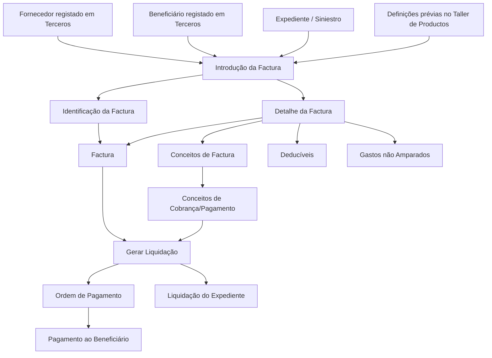

# Módulo de Faturação Reef/Mapfre — Especificação Funcional de Facturas, Liquidações e Definições

## 1. Metadados do Documento
- **Arquivo de Origem:** Não identificado no conteúdo extraído
- **Tipo de Documento:** Manual Operacional / Especificação Funcional
- **Domínio / Sistema:** Reef / Mapfre — módulo de Facturação associado a sinistros e expedientes
- **Público-Alvo:** Analistas funcionais, equipas de negócio, operação, desenvolvimento e arquitetura
- **Data/Versão Identificada:** Não identificada

---

## 2. Resumo Executivo & Contexto de Negócio

O documento descreve o módulo de **Facturação** do ambiente Reef/Mapfre, cujo objetivo é permitir a ordenação de pagamento ou cobrança a pessoas físicas ou jurídicas que participaram num expediente. A operação é baseada numa factura, como no exemplo apresentado de uma factura hospitalar.

A factura afeta a avaliação do expediente: a criação de uma factura implica a sua valoração, a modificação de uma factura altera essa valoração e a liquidação de uma factura realiza uma liquidação associada ao expediente. O módulo suporta operações em linha e diferidas.

A capacidade de liquidação depende do detalhe económico de cada conceito da factura. Os conceitos de factura são associados a conceitos de cobrança/pagamento, permitindo a liquidação automática de um expediente. O documento exemplifica conceitos de saúde, como medicamentos, anestesia, bloco operatório e raios X, relacionados com o conceito de pagamento `S01 Indemnización Clínicas`.

O módulo é parametrizável e o comportamento da aplicação depende de definições prévias realizadas no **Taller de Productos**. A parametrização está distribuída por níveis de definição: comum, geral, setor e ramo. Estes níveis controlam, entre outros aspetos, erros, tipos de danos, causas de gastos não amparados, detalhamento económico, valores iniciais e condições de controlo técnico.

A introdução de dados de factura requer que tanto o fornecedor como o beneficiário estejam registados no sistema **Terceros**, incluindo meios de contacto e meios de cobrança/pagamento. A factura contém identificação, detalhe e liquidação; com os dados introduzidos, o módulo gera uma ordem de pagamento para o beneficiário especificado.

---

## 3. Arquitetura, Componentes & Tecnologias Envolvidas

### Componentes e entidades citados

| Componente / Entidade | Papel descrito no documento | Observações |
| :--- | :--- | :--- |
| Módulo de Facturação | Ordena pagamentos ou cobranças através de facturas | Cobre funcionalidades de facturação |
| Factura | Registo utilizado para pagamento/cobrança e liquidação de expediente | Pode estar liquidada ou não liquidada |
| Expediente / Siniestro | Caso afetado pela factura e respetiva liquidação | A factura deve identificar o expediente |
| Beneficiário | Destinatário especificado para pagamento | Deve estar registado em Terceros |
| Fornecedor | Entidade fornecedora associada à factura | Deve estar registado em Terceros |
| Terceros | Sistema de registo de fornecedor e beneficiário | Armazena contacto e meios de cobrança/pagamento |
| Taller de Productos | Origem das definições prévias que condicionam a aplicação | O documento não detalha o funcionamento |
| Conceito de factura | Item detalhado incluído na factura | Associado a conceito de cobrança/pagamento |
| Conceito de cobrança/pagamento | Conceito associado ao detalhe da factura | Permite liquidação automática |
| Gastos não amparados | Conceitos que a companhia não cobre, paga ou reembolsa | Exemplos: aluguer de televisão e bombons |
| Liquidação | Ordem de pagamento gerada com base na factura | Pode ser modificada ou anulada em determinadas operações |
| Reef | Contexto documental identificado na interface apresentada | O documento não detalha a tecnologia da plataforma |
| Mapfre | Contexto corporativo identificado no conteúdo | O documento não detalha a arquitetura organizacional |



### Fluxo funcional identificado

1. O fornecedor e o beneficiário devem estar previamente registados em **Terceros**.
2. A factura é introduzida e identificada com o sinistro/expediente, fornecedor, beneficiário, data estimada de pagamento e moeda de pagamento.
3. O detalhe da factura identifica os conceitos afetados, deducíveis e gastos não amparados.
4. Cada conceito de factura deve possuir o respetivo valor económico para permitir a geração da liquidação.
5. Os conceitos de factura são associados a conceitos de cobrança/pagamento.
6. A geração da liquidação usa as informações introduzidas na factura.
7. A liquidação gera uma ordem de pagamento para o beneficiário especificado.
8. A factura e a liquidação podem ser modificadas ou anuladas conforme o estado de liquidação.

> **Nota de Análise:** O documento apresenta o fluxo funcional do módulo, mas não detalha tecnologias de implementação, APIs, contratos JSON, métodos HTTP, bases de dados, URLs, servidores, autenticação ou rotas de logs.

---

## 4. Regras de Negócio, Especificações Funcionais & Processos

### 4.1 Finalidade do módulo de Facturação

O módulo permite ordenar o pagamento ou a cobrança a uma pessoa física ou jurídica que tenha intervindo no expediente, através de uma factura. O exemplo citado é uma factura de hospital.

### 4.2 Relação entre factura, valoração e liquidação

| Evento | Efeito descrito |
| :--- | :--- |
| Criar factura | Valoriza o expediente |
| Modificar factura | Altera a valoração do expediente |
| Liquidar factura | Realiza uma liquidação no expediente |

### 4.3 Conceitos de factura e liquidação automática

Os conceitos que podem constar em facturas apresentadas por um segurado ou fornecedor devem ser definidos. Estes conceitos são associados aos conceitos de pagamento para permitir a liquidação automática de um expediente.

| Detalhe da Factura | Conceito de Cobrança/Pagamento |
| :--- | :--- |
| Medicinas | `S01 Indemnización Clínicas` |
| Anestesia | `S01 Indemnización Clínicas` |
| Quirófano | `S01 Indemnización Clínicas` |
| Rayos X | `S01 Indemnización Clínicas` |

### 4.4 Gastos não amparados

Gastos não amparados são conceitos que a companhia não cobre, não paga e não reembolsa.

| Exemplo de gasto não amparado | Tratamento |
| :--- | :--- |
| Alquiler de Televisión | Não coberto, não pago e não reembolsado |
| Bombones | Não coberto, não pago e não reembolsado |
| Outros conceitos equivalentes | Não cobertos, não pagos e não reembolsados |

### 4.5 Características funcionais

| Característica | Regra ou comportamento |
| :--- | :--- |
| Cobertura funcional | O módulo contém todas as funcionalidades necessárias para ordenar pagamento ou cobrança por factura |
| Parametrização | O comportamento da aplicação depende de definições prévias no Taller de Productos |
| Importes económicos | Cada conceito de factura deve ter o respetivo valor detalhado para permitir gerar uma liquidação |
| Registo de beneficiário | Fornecedor e beneficiário devem estar registados em Terceros |
| Dados em Terceros | Devem incluir meios de contacto e meios de cobrança/pagamento |
| Finalidade do registo | Permitir pagamentos e contacto com as entidades envolvidas |

### 4.6 Elementos obrigatórios da Facturação

Uma factura é composta pelos elementos de identificação, detalhe da factura e liquidação.

#### Identificação

A identificação da factura deve incluir:

- Sinistro/expediente afetado pela factura.
- Fornecedor da factura.
- Beneficiário da factura.
- Registo do beneficiário no sistema Terceros.
- Data estimada de pagamento.
- Moeda de pagamento.
- Outros dados não especificados no documento.

#### Detalhe da factura

O detalhe da factura deve identificar:

- Conceitos afetados pela factura.
- Deducíveis.
- Gastos não amparados.

#### Liquidação da factura

Com a informação introduzida na factura, deve ser gerada uma ordem de pagamento e uma liquidação para pagar ao beneficiário especificado.

### 4.7 Níveis de definição e parametrização

| Nível | Elemento de definição | Função descrita |
| :--- | :--- | :--- |
| Comum | Controlo técnico | Definição de erros e tipos de erros |
| Geral | Tipo de expediente | Permite definir os tipos de danos utilizáveis pelo módulo de facturação |
| Geral | Causa processo | Permite catalogar as causas dos gastos não amparados |
| Setor | Desglose conceito cobro pago factura | Determina o desdobramento económico e o detalhe da factura, por exemplo medicamentos, ressonância e honorários de anestesista |
| Setor | Desglose por tipo factura y tipo de expediente | Determina, por tipo de factura e tipo de expediente, qual desdobramento económico é permitido |
| Ramo | Causa processo | Cataloga as causas de gastos não amparados para operações de cada ramo |
| Ramo | Valores iniciales | Permite definir valores iniciais para atributos da factura |
| Ramo | Controlo técnico | Define em que condições se podem paralisar operações de plano de renda ou obrigação de ser autorizada |

### 4.8 Operações disponíveis para Facturas

As operações de factura podem ser realizadas tanto em linha como de forma diferida.

| Operação | Estado da factura | Comportamento descrito |
| :--- | :--- | :--- |
| Criar facturação | Não especificado | Permite introduzir uma factura |
| Modificar facturação liquidada | Liquidada e não paga | Permite alterar informação da factura, modificando a liquidação |
| Modificar facturação não liquidada | Não liquidada | Permite alterar informação da factura |
| Gerar liquidação facturação | Com informação de factura introduzida | Permite criar uma liquidação a partir dos dados da factura |
| Anular facturação liquidada | Liquidada | Permite anular uma factura e a respetiva liquidação |
| Anular facturação não liquidada | Não liquidada | Permite anular uma factura |
| Consultar facturação | Qualquer estado não restringido no documento | Mostra toda a informação da factura |

---

## 5. Tabelas de Parâmetros, Ambientes e Estruturas de Dados

### 5.1 Estrutura funcional da factura

| Item / Parâmetro | Descrição / Função | Tipo / Valores / Formato | Ambiente / Observações |
| :--- | :--- | :--- | :--- |
| Sinistro/expediente | Identifica o caso afetado pela factura | Identificador não detalhado | Deve ser informado na identificação |
| Fornecedor da factura | Entidade fornecedora associada à factura | Pessoa física ou jurídica | Deve estar registado em Terceros |
| Beneficiário da factura | Entidade que receberá o pagamento | Pessoa física ou jurídica | Deve estar registado em Terceros |
| Data estimada de pagamento | Data prevista para pagamento | Formato não especificado | Parte da identificação da factura |
| Moeda de pagamento | Moeda aplicável ao pagamento | Valores não especificados | Parte da identificação da factura |
| Conceitos de factura | Itens aos quais a factura se refere | Exemplos: medicinas, anestesia, quirófano, rayos X | Associados a conceitos de cobrança/pagamento |
| Deducíveis | Elementos a identificar no detalhe | Valores não especificados | Parte do detalhe da factura |
| Gastos não amparados | Itens não cobertos, pagos ou reembolsados | Exemplos: aluguer de televisão, bombons | Parte do detalhe da factura |
| Importe económico | Valor de cada conceito | Formato monetário não especificado | Necessário para gerar liquidação |
| Liquidação | Resultado da informação introduzida | Ordem de pagamento | Direcionada ao beneficiário especificado |

### 5.2 Registo de entidades em Terceros

| Item / Parâmetro | Descrição / Função | Tipo / Valores / Formato | Ambiente / Observações |
| :--- | :--- | :--- | :--- |
| Fornecedor | Entidade que participa na introdução da factura | Pessoa física ou jurídica | Registo obrigatório em Terceros |
| Beneficiário | Entidade destinatária do pagamento | Pessoa física ou jurídica | Registo obrigatório em Terceros |
| Meios de contacto | Dados para contacto com fornecedor e beneficiário | Não detalhado | Mantidos em Terceros |
| Meios de cobrança/pagamento | Dados necessários para executar pagamentos | Não detalhado | Mantidos em Terceros |

### 5.3 Definições por nível

| Item / Parâmetro | Descrição / Função | Tipo / Valores / Formato | Ambiente / Observações |
| :--- | :--- | :--- | :--- |
| Nível comum | Definições não exclusivas do módulo de sinistros, necessárias para a definição | Controlo técnico | Inclui erros e tipos de erros |
| Nível geral | Definições aplicáveis a todos os expedientes possíveis de facturação | Tipo de expediente; causa processo | Define tipos de danos e causas de gastos não amparados |
| Nível setor | Definições exclusivas de todos os ramos do setor definido | Desglose económico; tipos de factura e expediente | Controla detalhe económico permitido |
| Nível ramo | Definições exclusivas do ramo definido | Causa processo; valores iniciais; controlo técnico | Inclui causas, atributos e condições de paralisação |

### 5.4 Ambientes, servidores e integrações

| Item / Parâmetro | Descrição / Função | Tipo / Valores / Formato | Ambiente / Observações |
| :--- | :--- | :--- | :--- |
| Ambiente técnico | Não especificado | Não identificado | O documento não informa DEV, QA, UAT, PROD ou equivalentes |
| URLs | Não especificadas | Não identificadas | Não há URLs operacionais ou de integração |
| Servidores | Não especificados | Não identificados | Não há mapeamento de infraestrutura |
| Rotas de logs | Não especificadas | Não identificadas | Não há caminhos ou variáveis de logging |
| APIs / contratos | Não especificados | Não identificados | Não há métodos HTTP, endpoints ou contratos JSON |

---

## 6. Bateria de Perguntas & Respostas para RAG (FAQ Sintético)

### P1: Qual é o objetivo do módulo de Facturação no Reef/Mapfre?
**R:** O módulo de Facturação permite ordenar o pagamento ou a cobrança a pessoas físicas ou jurídicas que tenham intervindo num expediente, através de uma factura. O documento apresenta como exemplo uma factura hospitalar.

### P2: Como a criação, modificação e liquidação de uma factura afetam o expediente?
**R:** A criação de uma factura valoriza o expediente. A modificação de uma factura altera a valoração do expediente. A liquidação de uma factura realiza uma liquidação associada ao expediente.

### P3: Que informações devem ser identificadas numa factura?
**R:** A factura deve identificar o sinistro ou expediente afetado, o fornecedor da factura, o beneficiário da factura, a data estimada de pagamento e a moeda de pagamento. O documento também indica que existem outros dados, sem os detalhar.

### P4: Que entidades devem estar registadas em Terceros para introduzir dados de uma factura?
**R:** Tanto o fornecedor como o beneficiário da factura devem estar registados no sistema Terceros. O registo deve incluir meios de contacto e meios de cobrança/pagamento, para permitir pagamentos e contacto com essas entidades.

### P5: O que são gastos não amparados no módulo de Facturação?
**R:** Gastos não amparados são conceitos que a companhia não cobre, não paga e não reembolsa. O documento cita como exemplos o aluguer de televisão e bombons.

### P6: Qual é a relação entre conceitos de factura e conceitos de cobrança/pagamento?
**R:** Os conceitos que podem constar nas facturas de um segurado ou fornecedor são associados a conceitos de cobrança/pagamento. Esta associação permite realizar a liquidação automática de um expediente.

### P7: Quais conceitos de uma factura de saúde estão associados a `S01 Indemnización Clínicas`?
**R:** No exemplo apresentado, os conceitos Medicinas, Anestesia, Quirófano e Rayos X estão associados ao conceito de cobrança/pagamento `S01 Indemnización Clínicas`.

### P8: Que dados devem constar no detalhe de uma factura?
**R:** O detalhe da factura deve identificar os conceitos afetados pela factura, os deducíveis e os gastos não amparados. Para gerar uma liquidação, deve também ser detalhado o importe económico de cada conceito de factura.

### P9: Quais operações podem ser realizadas sobre uma factura?
**R:** As operações disponíveis são criar facturação, modificar facturação liquidada, modificar facturação não liquidada, gerar liquidação de facturação, anular facturação liquidada, anular facturação não liquidada e consultar facturação. Estas operações podem ser realizadas em linha ou de forma diferida.

### P10: O que acontece ao modificar uma factura liquidada mas não paga?
**R:** A operação de modificação de facturação liquidada permite alterar a informação de uma factura liquidada e não paga, modificando também a liquidação associada.

### P11: Quais níveis de definição condicionam o comportamento do módulo de Facturação?
**R:** O documento define quatro níveis: comum, geral, setor e ramo. O nível comum inclui controlo técnico, erros e tipos de erros; o geral inclui tipo de expediente e causa processo; o setor define o desdobramento económico e as combinações permitidas por tipo de factura e tipo de expediente; o ramo define causas de gastos não amparados, valores iniciais e controlo técnico.

### P12: O que determina o “desglose por tipo factura y tipo de expediente”?
**R:** Esta definição, localizada no nível de setor, determina qual desdobramento económico ou detalhe de factura é permitido para uma combinação de tipo de factura e tipo de expediente. O documento exemplifica itens como medicamentos, ressonância e honorários de anestesista.

---

## 7. Glossário de Termos, Siglas & Conceitos-Chave

- **Beneficiário:** Pessoa física ou jurídica especificada como destinatária do pagamento da factura.
- **Causa processo:** Definição utilizada para catalogar causas de gastos não amparados.
- **Conceito de cobrança/pagamento:** Conceito associado ao detalhe de factura para permitir liquidação automática.
- **Conceito de factura:** Item detalhado incluído numa factura, como medicamentos, anestesia, bloco operatório ou raios X.
- **Controlo técnico:** Elemento de definição associado a erros, tipos de erros e, no nível de ramo, a condições de paralisação de operações.
- **Deducíveis:** Elementos que devem ser identificados no detalhe da factura; o documento não fornece definição adicional.
- **Desglose:** Desdobramento económico ou detalhe permitido para a factura.
- **Expediente / Siniestro:** Caso afetado pela factura, pela valoração e pela liquidação.
- **Factura:** Registo usado para ordenar pagamento ou cobrança a participantes de um expediente.
- **Gastos não amparados:** Conceitos não cobertos, pagos ou reembolsados pela companhia.
- **Liquidação:** Processo gerado a partir da informação da factura para criar uma ordem de pagamento ao beneficiário.
- **Mapfre:** Referência corporativa presente no conteúdo documental.
- **Reef:** Referência de sistema ou contexto documental indicada na interface apresentada.
- **Ramo:** Nível de definição exclusivo do ramo que está a ser definido.
- **Setor:** Nível de definição exclusivo de todos os ramos do setor definido.
- **Taller de Productos:** Origem das definições prévias das quais depende o comportamento da aplicação.
- **Terceros:** Sistema no qual fornecedor e beneficiário devem estar registados, com meios de contacto e de cobrança/pagamento.
- **`S01 Indemnización Clínicas`:** Conceito de cobrança/pagamento associado no exemplo aos conceitos de saúde da factura.

---

## 8. Notas Críticas, Riscos & Limitações

- O documento não identifica o nome do arquivo de origem, versão, data de publicação ou data de atualização.
- O documento não descreve tecnologias de implementação, linguagens, frameworks, persistência de dados, infraestrutura, URLs, APIs, métodos HTTP, contratos JSON, autenticação ou autorização.
- Não são informados ambientes técnicos, servidores, portas, domínios, rotas de logs, métricas ou procedimentos de monitorização.
- O documento informa que o comportamento é parametrizável e depende de definições prévias no Taller de Productos, mas não descreve como estas definições são criadas, aprovadas, publicadas ou versionadas.
- Não são detalhadas regras de cálculo monetário, arredondamento, conversão de moeda, impostos, limites de valor ou tratamento de erros.
- Não são especificados os estados completos de ciclo de vida da factura, embora sejam mencionados os estados liquidada, não liquidada e liquidada não paga.
- **Nota de Análise:** O documento lista operações de criação, modificação, liquidação, anulação e consulta, mas não detalha permissões por perfil, validações de transição de estado ou impactos contabilísticos.
- **Nota de Análise:** O documento menciona “plano de renda” e “obligación de ser autorizada” no controlo técnico de ramo, sem explicação funcional adicional.

---

## 9. Conteúdo Bruto Estruturado (Referência Fiel)

```text
--- [PÁGINA 1 DE 4] ---

INTRODUCCIÓN - Módulo Facturación
OBJETIVO
La nalidad de este módulo es poder ordenar el pago/cobro a personas físicas o jurídicas que hayan intervenido en el expediente, a través de
una factura, por ejemplo factura de un hospital. Cuando creamos una factura, valoramos el expediente, cuando modicamos una factura,
cambiamos la valoración, cuando liquidamos una factura, realizamos una liquidación al expediente.
Concepto
Detalle de la factura
Gastos no Amparados
Características
Elementos de una factura
Deniciones de Factura
Operaciones de Factura
Conceptos
Detalle de Factura
Se denirán los conceptos que pueden tener las facturas que presente un asegurado o un proveedor. Estos conceptos estarán unidos a los
conceptos de pago para poder realizar una liquidación de un expediente automáticamente.
Ejemplo factura de Salud:
Detalle de la Factura | Concepto Cobro Pago
1 Medicinas | S01 Indemnización Clínicas
2 Anestesia | S01 Indemnización Clínicas
3 Quirófano | S01 Indemnización Clínicas
4 Rayos X | S01 Indemnización Clínicas
Documentation / DOCUMENTACIÓN Reef
DOCUMENTACIÓN Reef
Mapfredocument
DOCUMENTACIÓN Reef
Owner
user:agonzalez_mapfre.com
Lifecycle
Approved Source
 / 
 VL
Buscar Inicio Soluciones Arquitecturas APIs Componentes Cloud Documentación Zeus Reef Ayuda
ES


--- [PÁGINA 2 DE 4] ---

Gastos no amparados
Son aquellos conceptos que la compañía no cubre, no va a pagar, ni reembolsar. Ejemplo:
Alquiler de Televisión
Bombones
Etc.
Características
Cubre todas las funcionalidades de la facturación
Este módulo, contiene todas las funcionalidades necesarias para ordenar el pago o el cobro a una persona física o jurídica a través de
una factura.
Parametrizable
El módulo es parametrizable y el comportamiento de la aplicación depende de las deniciones previas (Taller de Productos).
Importes económicos
Para poder generar una liquidación, se ha de detallar el importe de cada concepto de factura.
Registro de Beneciario
Para introducir los datos de una factura tanto el proveedor como el beneciario de la misma, tienen que estar registrados en el sistema
(Terceros), con sus medios de contacto, sus medios de cobro / pago, para poder realizar pagos y para poder contactar con ellos.
Elementos de la Facturación
Una factura está compuesta de varios elementos:
FACTURACIÓN
IDENTIFICACIÓN DETALLE DE LA
FACTURA LIQUIDACIÓN
Datos Identicación
Se tiene que identicar:
Siniestro/expediente al que afecta la factura
Proveedor de la Factura
Beneciario de la Factura (Tiene que estar registrado en Terceros)
Fecha estimada de pago
Moneda de pago
Etc.
Detalle de la Factura
Se tendrá que identicar los conceptos a los que afecta la factura, los deducibles y los gastos no amparados.
Liquidación de la Factura
Con la información introducida se generará una orden de pago, liquidación para pagar al beneciario especicado.
Deniciones de Facturación
Los elementos de denición atienden a distintos niveles:


--- [PÁGINA 3 DE 4] ---

NIVELES DE DEFINICIÓN
COMÚN GENERAL SECTOR RAMO
COMÚN
En este nivel se encuentran deniciones que NO son exclusivas del módulo de siniestros, pero son
necesarias para poder realizar la denición. Entre otras deniciones se encuentra:
CONTROL TÉCNICO
Denición de errores, tipos de Errores
GENERAL
En este nivel se encuentran deniciones que afectarán a todos los posibles expedientes de facturación
TIPO EXPEDIENTE
Permite denir los Tipos de Daños que va a poder utilizar el
módulo de facturación
CAUSA PROCESO
Permite catalogar los causas de los gastos no amparados
SECTOR
Son exclusivas para todos los ramos del sector que se está deniendo
DESGLOSE CONCEPTO COBRO PAGO FACTURA
Determinar el desglose económico, el detalle de la factura . Por
ejemplo medicinas, resonancia, honorarios anestesista...
DESGLOSE POR TIPO FACTURA Y TIPO DE EXPEDIENTE
Determina por tipo de factura y tipo de expediente, que desglose
económico es permitido, el detalle de la factura . Por ejemplo
medicinas, resonancia, honorarios anestesista...
RAMO
Son exclusivas del ramo que se está deniendo
CAUSA PROCESO
Permite catalogar las causas de gastos no
amparados por los que se quiere realizar
las operaciones para cada ramo. Estos
son gastos que no se cubren
VALORES INICIALES
Permite denir valores iniciales para
atributos de la factura
CONTROL TÉCNICO
Denir en qué condiciones se puede
paralizar las operaciones de plan de renta
u obligación de ser autorizada
Operaciones de Factura


--- [PÁGINA 4 DE 4] ---

FACTURA
Operaciones que se pueden realizar con las facturas, se pueden realizar tanto en línea como diferido
CREAR facturación
Permite ingresar una factura
MODIFICAR facturación liquidada
Permite cambiar información de factura
liquidada no pagada, modicando la
liquidación
MODIFICAR facturación no liquidada
Permite cambiar información de una
factura
GENERAR liquidación facturación
Permite crear una liquidación a partir de la
información introducida en la factura
ANULAR facturación liquidada
Permite anular una factura y su liquidación
ANULAR facturación no liquidada
Permite anular una factura
CONSULTAR facturación
Se muestra toda la información de la
factura
```
