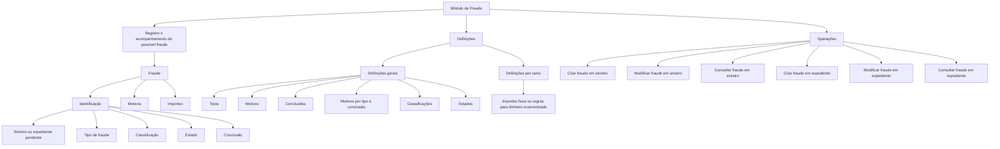
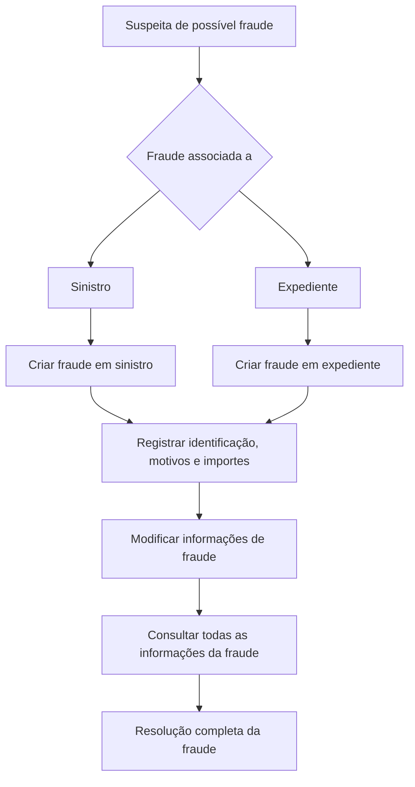

# Módulo de Fraude — Registro, Definições e Operações sobre Sinistros e Expedientes

## 1. Metadados do Documento
- **Arquivo de Origem:** Não identificado no conteúdo fornecido
- **Tipo de Documento:** Manual Funcional / Apresentação Executiva
- **Domínio / Sistema:** DOCUMENTACIÓN Reef — módulo de Fraude
- **Público-Alvo:** Negócio, analistas funcionais, desenvolvedores, arquitetura e operação
- **Data/Versão Identificada:** Não identificada
- **Owner identificado:** `user:agonzalez_mapfre.com`
- **Lifecycle identificado:** Approved
- **Source identificado:** VL

---

## 2. Resumo Executivo & Contexto de Negócio

O documento apresenta o módulo de Fraude, cuja finalidade é registrar e acompanhar potenciais fraudes que podem prejudicar a companhia caso não recebam acompanhamento. O ciclo de acompanhamento abrange desde a suspeita de fraude associada a um segurado, fornecedor ou outra entidade até a resolução completa do caso.

O módulo de Fraude possui caráter aberto e suporta múltiplos tipos de negócio, incluindo seguros de Automóvel, Saúde e outros ramos não especificados. A configuração por catálogos permite definir o comportamento e as características atribuídas ao módulo.

Cada fraude é estruturada em três elementos principais: identificação, motivos e importes. A identificação relaciona a fraude a um sinistro ou expediente pendente e registra atributos como tipo, classificação, estado e conclusão da fraude.

O documento também descreve definições gerais e definições específicas por ramo. As definições gerais incluem tipos, motivos, conclusões, classificações, estados e motivos por tipo e conclusão. As definições por ramo abrangem importes fixos ou regras de negócio para cálculo de dinheiro economizado.

As operações funcionais disponibilizadas permitem criar, modificar e consultar fraudes tanto no contexto de sinistros quanto no contexto de expedientes. O conteúdo não detalha contratos de integração, APIs, persistência de dados, métodos HTTP, perfis de acesso ou critérios de transição entre estados.

---

## 3. Arquitetura, Componentes & Tecnologias Envolvidas

O documento não descreve uma arquitetura técnica de software com servidores, bancos de dados, APIs, microsserviços ou tecnologias de implementação. A arquitetura funcional identificável é composta pelo módulo de Fraude, suas definições configuráveis e suas operações sobre sinistros e expedientes.

### Componentes funcionais identificados

| Componente | Função identificada |
| :--- | :--- |
| Módulo de Fraude | Registra e realiza acompanhamento de possíveis fraudes até a resolução. |
| Fraude | Entidade composta por identificação, motivos e importes. |
| Identificação do Fraude | Registra associação com sinistro ou expediente pendente, tipo, classificação, estado e conclusão. |
| Motivos do Fraude | Registra as razões associadas à fraude. |
| Importes do Fraude | Registra honorários e valor economizado. |
| Definições Gerais | Configura comportamentos aplicáveis a todos os ramos. |
| Definições por Ramo | Configura importes fixos ou regras de negócio para cálculo de dinheiro economizado. |
| Operações de Fraude | Permite criar, modificar e consultar fraudes em sinistros e expedientes. |
| DOCUMENTACIÓN Reef | Repositório ou contexto documental identificado no texto. |
| Mapfredocument | Termo identificado no cabeçalho documental; sua função não é detalhada. |



> **Nota de Análise:** O documento descreve a estrutura funcional do módulo de Fraude, mas não detalha arquitetura física, tecnologias, interfaces, contratos JSON, métodos HTTP, mecanismos de autenticação ou integração com sistemas externos.

---

## 4. Regras de Negócio, Especificações Funcionais & Processos

### 4.1 Finalidade do módulo de Fraude

O módulo de Fraude permite registrar todos os possíveis casos de fraude cujo não acompanhamento poderia prejudicar a companhia. O registro pode iniciar quando existe suspeita de fraude relacionada a um segurado, fornecedor ou outra parte não especificada.

O acompanhamento da fraude ocorre desde a suspeita inicial até a resolução completa do caso.

### 4.2 Abrangência de negócio

O módulo suporta múltiplos tipos de negócio. O documento cita explicitamente:

- Automóvel;
- Saúde;
- Outros tipos de seguros não especificados.

### 4.3 Configuração do módulo

O comportamento e as características do módulo de Fraude são definidos por catálogos. O texto não informa quais catálogos existem, seus campos, responsáveis pela manutenção ou regras de versionamento.

### 4.4 Estrutura de uma fraude

Uma fraude é composta pelos seguintes elementos:

1. **Identificação**
2. **Motivos**
3. **Importes**

#### Identificação da fraude

A identificação da fraude deve registrar, conforme apresentado:

- Sinistro ou expediente pendente afetado pela fraude;
- Tipo de fraude;
- Classificação da fraude;
- Estado da fraude;
- Conclusão da fraude;
- Outros atributos não detalhados no documento.

#### Motivos da fraude

O elemento de motivos contém as razões da fraude. O documento fornece exemplos de motivos configuráveis, mas não estabelece obrigatoriedade, cardinalidade ou regras de validação.

#### Importes da fraude

Os importes da fraude incluem:

- Importe de honorários;
- Importe economizado.

### 4.5 Definições de fraude

As definições atendem a dois níveis:

- **Geral:** definições aplicáveis a todos os ramos;
- **Ramo:** definições específicas por ramo.

#### Definições gerais

As definições gerais configuram o comportamento do módulo de Fraude para todos os ramos e incluem:

- Tipos de fraude;
- Motivos de fraude;
- Tipo de conclusão;
- Motivos por tipo e conclusão;
- Classificação de fraudes;
- Estados de fraude.

#### Tipos de fraude identificados

O documento apresenta os seguintes exemplos:

- Fraude identificada sem provas;
- Fraude parcial;
- Fraude confirmada.

#### Motivos de fraude identificados

O documento apresenta os seguintes exemplos:

- Delinquência organizada;
- Reclama valor superior ao autorizado;
- Reclama os mesmos danos;
- Reclama lesões fora do acidente.

#### Conclusões identificadas

O documento cita:

- Procedente;
- Rejeitado.

#### Classificações identificadas

O documento cita:

- Fraude dolosa;
- Fraude ocasional.

#### Estados identificados

O documento cita os seguintes exemplos de estado:

- Atribuído;
- Revisão;
- Revisão D.I.S.M.A.

> **Nota de Análise:** O texto lista estados de fraude, mas não descreve transições permitidas, estado inicial, estado final, responsáveis por cada estado ou condições para alteração de estado.

### 4.6 Definições por ramo

As definições por ramo abrangem:

- Importes fixos;
- Regras de negócio para calcular dinheiro economizado.

> **Nota de Análise:** O documento não apresenta fórmulas, parâmetros, limites, moedas ou exemplos de cálculo para os importes ou para o dinheiro economizado.

### 4.7 Operações de fraude

| Operação | Entidade associada | Regra funcional descrita |
| :--- | :--- | :--- |
| Criar fraude sinistro | Sinistro | Permite registrar uma fraude em um sinistro. |
| Modificar fraude sinistro | Sinistro | Permite modificar as informações de fraude de um sinistro. |
| Consultar fraude sinistro | Sinistro | Mostra todas as informações de uma fraude associada a um sinistro. |
| Criar fraude expediente | Expediente | Permite registrar uma fraude em um expediente. |
| Modificar fraude expediente | Expediente | Permite modificar as informações de fraude de um expediente. |
| Consultar fraude expediente | Expediente | Mostra todas as informações de uma fraude associada a um expediente. |



---

## 5. Tabelas de Parâmetros, Ambientes e Estruturas de Dados

### 5.1 Estrutura funcional da fraude

| Item / Parâmetro | Descrição / Função | Tipo / Valores / Formato | Ambiente / Observações |
| :--- | :--- | :--- | :--- |
| Fraude | Registro de um possível caso de fraude sujeito a acompanhamento até resolução. | Entidade funcional | Pode estar associada a sinistro ou expediente. |
| Identificação | Elemento que caracteriza a fraude. | Conjunto de atributos | Inclui sinistro/expediente pendente, tipo, classificação, estado e conclusão. |
| Motivos | Razões associadas à fraude. | Catálogo ou lista de motivos | Regras de obrigatoriedade não especificadas. |
| Importes | Valores relacionados à fraude. | Valores monetários | Inclui honorários e importe economizado. |
| Sinistro / expediente pendente | Registro afetado pela fraude. | Referência funcional | O documento não informa identificador ou formato. |
| Tipo de fraude | Categoria da fraude. | Catálogo | Exemplos incluem fraude identificada sem provas, parcial e confirmada. |
| Classificação da fraude | Classificação do caso de fraude. | Catálogo | Exemplos incluem fraude dolosa e fraude ocasional. |
| Estado da fraude | Situação em que a fraude se encontra. | Catálogo | Exemplos incluem atribuído, revisão e revisão D.I.S.M.A. |
| Conclusão da fraude | Resultado ou conclusão atribuída à fraude. | Catálogo | Exemplos incluem procedente e rejeitado. |
| Importe de honorários | Valor de honorários relacionado à fraude. | Importe monetário | Moeda, precisão e regra de cálculo não especificadas. |
| Importe economizado | Valor economizado relacionado à fraude. | Importe monetário ou resultado de regra | Pode ser fixo ou calculado por regra de negócio por ramo. |

### 5.2 Catálogos e definições gerais

| Item / Parâmetro | Descrição / Função | Tipo / Valores / Formato | Ambiente / Observações |
| :--- | :--- | :--- | :--- |
| Nível geral | Definições aplicáveis a todos os ramos. | Nível de definição | Configura comportamentos do módulo de Fraude. |
| Nível ramo | Definições aplicáveis por ramo. | Nível de definição | Relacionado a importes e regras de cálculo do dinheiro economizado. |
| Tipos | Define tipos de fraude. | Catálogo | Fraude identificada sem provas; fraude parcial; fraude confirmada. |
| Motivos | Define motivos da fraude. | Catálogo | Delinquência organizada; reclama valor superior ao autorizado; reclama os mesmos danos; reclama lesões fora do acidente. |
| Conclusão | Define tipos de conclusão. | Catálogo | Procedente; rejeitado. |
| Motivos por tipo e conclusão | Relaciona motivos de fraude com tipos de conclusão. | Catálogo relacional | Critérios de associação não especificados. |
| Classificação | Define classificação dos casos de fraude. | Catálogo | Fraude dolosa; fraude ocasional. |
| Estados | Define estados possíveis da fraude. | Catálogo | Atribuído; revisão; revisão D.I.S.M.A. |
| Importes | Define importes por ramo. | Valor fixo ou regra de negócio | Destinado ao cálculo de dinheiro economizado. |

### 5.3 Ambientes, servidores e URLs

| Item / Parâmetro | Descrição / Função | Tipo / Valores / Formato | Ambiente / Observações |
| :--- | :--- | :--- | :--- |
| Ambientes | Não identificados. | Não informado | O documento não apresenta URLs, servidores, portas ou ambientes. |
| Rotas de log | Não identificadas. | Não informado | O documento não apresenta caminhos, variáveis ou ferramentas de log. |
| APIs | Não identificadas. | Não informado | O documento não detalha endpoints, contratos ou métodos HTTP. |

---

## 6. Bateria de Perguntas & Respostas para RAG (FAQ Sintético)

### P1: Qual é a finalidade do módulo de Fraude?
**R:** O módulo de Fraude permite registrar e acompanhar possíveis fraudes que, se não receberem acompanhamento, poderiam prejudicar a companhia. O acompanhamento ocorre desde a suspeita de fraude relacionada a um segurado, fornecedor ou outra entidade até a resolução completa do caso.

### P2: Quais elementos compõem uma fraude no módulo de Fraude?
**R:** Uma fraude é composta por três elementos: identificação, motivos e importes. A identificação descreve o caso e sua associação com sinistro ou expediente; os motivos registram as razões da fraude; e os importes incluem honorários e valor economizado.

### P3: Quais informações devem ser registradas na identificação de uma fraude?
**R:** A identificação deve incluir o sinistro ou expediente pendente afetado pela fraude, o tipo de fraude, a classificação da fraude, o estado da fraude e a conclusão da fraude. O documento também indica que podem existir outros atributos, mas não os detalha.

### P4: Quais tipos de fraude são apresentados como exemplos no documento?
**R:** O documento cita como exemplos de tipos de fraude: fraude identificada sem provas, fraude parcial e fraude confirmada. Não é informado se a lista é fechada ou se novos tipos podem ser configurados.

### P5: Quais motivos de fraude são citados?
**R:** Os exemplos de motivos apresentados são delinquência organizada, reclama valor superior ao autorizado, reclama os mesmos danos e reclama lesões fora do acidente.

### P6: Quais conclusões podem ser registradas para uma fraude?
**R:** O documento cita dois exemplos de conclusão: procedente e rejeitado. Não são descritas regras que determinem quando cada conclusão deve ser aplicada.

### P7: Quais estados de fraude são mencionados?
**R:** Os estados mencionados são atribuído, revisão e revisão D.I.S.M.A. O documento não detalha o fluxo de transição entre esses estados, nem os responsáveis por realizar as alterações.

### P8: O módulo de Fraude atende apenas seguros de Automóvel?
**R:** Não. O documento informa que o módulo possui caráter aberto e pode trabalhar com múltiplos tipos de negócio, citando seguros de Automóvel, Saúde e outros tipos não especificados.

### P9: Como são configuradas as definições do módulo de Fraude?
**R:** As definições são organizadas em dois níveis: geral e ramo. O nível geral contém definições aplicáveis a todos os ramos, como tipos, motivos, conclusões, classificações e estados. O nível de ramo contém importes fixos ou regras de negócio para calcular dinheiro economizado.

### P10: Quais operações podem ser executadas sobre uma fraude associada a um sinistro?
**R:** Para fraudes associadas a sinistros, o módulo permite criar fraude em sinistro, modificar fraude em sinistro e consultar fraude em sinistro. A consulta mostra todas as informações da fraude associada ao sinistro.

### P11: Quais operações podem ser executadas sobre uma fraude associada a um expediente?
**R:** Para fraudes associadas a expedientes, o módulo permite criar fraude em expediente, modificar fraude em expediente e consultar fraude em expediente. A consulta mostra todas as informações da fraude associada ao expediente.

### P12: Como o dinheiro economizado é calculado no módulo de Fraude?
**R:** O documento informa que, nas definições por ramo, podem existir importes fixos ou regras de negócio para calcular o dinheiro economizado. Contudo, o documento não fornece fórmulas, parâmetros, moedas ou exemplos de cálculo.

---

## 7. Glossário de Termos, Siglas & Conceitos-Chave

- **Fraude:** Possível caso de fraude registrado e acompanhado pelo módulo até a resolução completa.
- **Sinistro:** Entidade à qual uma fraude pode ser associada; o documento não fornece definição adicional.
- **Expediente:** Entidade à qual uma fraude pode ser associada; o documento não fornece definição adicional.
- **Ramo:** Nível de definição específico usado para configurar importes fixos ou regras de cálculo de dinheiro economizado.
- **Identificação:** Elemento da fraude que registra associação com sinistro ou expediente, tipo, classificação, estado e conclusão.
- **Motivos:** Elemento da fraude que registra as razões relacionadas ao caso.
- **Importes:** Elemento da fraude que inclui importe de honorários e importe economizado.
- **Fraude identificada sem provas:** Exemplo de tipo de fraude apresentado pelo documento.
- **Fraude parcial:** Exemplo de tipo de fraude apresentado pelo documento.
- **Fraude confirmada:** Exemplo de tipo de fraude apresentado pelo documento.
- **Fraude dolosa:** Exemplo de classificação de fraude apresentado pelo documento.
- **Fraude ocasional:** Exemplo de classificação de fraude apresentado pelo documento.
- **Procedente:** Exemplo de conclusão de fraude apresentado pelo documento.
- **Rejeitado:** Exemplo de conclusão de fraude apresentado pelo documento.
- **D.I.S.M.A.:** Sigla citada no estado “revisão D.I.S.M.A.”; o significado não é definido no documento.
- **DOCUMENTACIÓN Reef:** Contexto ou repositório documental identificado no cabeçalho.
- **Mapfredocument:** Termo apresentado no cabeçalho documental; sua definição não é fornecida.

---

## 8. Notas Críticas, Riscos & Limitações

- O documento não identifica o nome do arquivo de origem, data, versão ou autor além do campo `Owner`.
- Não há descrição de arquitetura técnica, APIs, bancos de dados, mensageria, integrações, servidores, URLs, portas ou ambientes.
- Não são informados métodos HTTP, contratos de entrada e saída, estruturas JSON, identificadores técnicos ou regras de persistência.
- Não existem regras explícitas para transição entre os estados de fraude, incluindo estado inicial, estados finais, permissões ou validações.
- Não são apresentados perfis de acesso, matriz de permissões ou responsabilidades por operação.
- O cálculo de dinheiro economizado é mencionado, mas fórmulas, parâmetros, moedas, limites e exemplos não são detalhados.
- Não há regras de obrigatoriedade para tipo, classificação, estado, conclusão, motivos ou importes.
- O significado da sigla **D.I.S.M.A.** não é definido.
- O documento cita configurações por catálogos, mas não identifica os catálogos tecnicamente, seus atributos ou seus processos de manutenção.
- O texto afirma que o módulo cobre todas as funcionalidades necessárias para registrar e acompanhar fraudes, porém não enumera todos os fluxos de exceção, encerramento, auditoria ou notificação.

---

## 9. Conteúdo Bruto Estruturado (Referência Fiel)

```text
--- [PÁGINA 1 DE 3] ---

INTRODUCIR - Fraude
OBJETIVO
La nalidad de este módulo es poder registrar todos los posibles fraudes, que si no se realiza un seguimiento la compañía saldría
perjudicada. Se registra desde que se sospecha el posible fraude de un asegurado o de un proveedor etc, hasta su completa resolución.
Características
Elementos de un Fraude
Deniciones de Fraude
Operaciones de Fraude
Características
Múltiples tipos de negocio
El carácter abierto del módulo facilita la posibilidad de trabajar seguros del tipo:
Automóvil
Salud
Etc.
Congurable
Mediante catálogos vamos a poder denir el comportamiento y las características que le vamos a dar al modulo de Juicios.
Cubre todas las funcionalidades de los fraudes
Este módulo, contiene todas las funcionalidades necesarias para registrar y realizar un seguimiento de los fraudes .
Elementos de un Fraude
Un fraude está compuesto de varios elementos
FRAUDE
IDENTIFICACIÓN MOTIVOS IMPORTES
Documentation / DOCUMENTACIÓN Reef
DOCUMENTACIÓN Reef
Mapfredocument
DOCUMENTACIÓN Reef
Owner
user:agonzalez_mapfre.com
Lifecycle
Approved Source
 / 
 VL
Buscar Inicio Soluciones Arquitecturas APIs Componentes Cloud Documentación Zeus Reef Ayuda
ES


--- [PÁGINA 2 DE 3] ---

Identicación del Fraude
En este elemento del fraude se deberá identicar:
Siniestro/expediente pendiente, al que va afectar el fraude
Tipo de Fraude
Clasicación del Fraude
Estado del Fraude
Conclusión del Fraude
Etc.
Motivos del Fraude
Este elemento contiene cuales son las razones del Fraude.
Importes del Fraude
Importe honorarios
Importe ahorrado
Deniciones de Fraude
Los elementos de denición atienden a distintos niveles:
NIVELES DE DEFINICIÓN
GENERAL RAMO
GENERAL
Deniciones para todos los Ramos
FRAUDE DEFINICIÓN
Denición de comportamientos del
módulo
TIPOS
Tipos de Fraude: Fraude identicado sin
pruebas, Fraude parcial, Fraude
Conrmado...
MOTIVOS
Motivos del Fraude: Delincuencia
organizada, Reclama monto superior al
autorizado, Reclama los mismos daños,
Reclama lesiones fuera del accidente...
CONCLUSIÓN
Tipo de Conclusión: Procedente,
Rechazado
MOTIVOS POR TIPO Y CONCLUSIÓN
Motivos de Fraude por tipos de conclusión
CLASIFICACIÓN
Clasicación de los fraudes: fraude
doloso, fraude ocasional
ESTADOS
Estado en el que se puede encontrar el
Fraude: asignado, revisión, revisión
D.I.S.M.A.,
RAMO


--- [PÁGINA 3 DE 3] ---

Deniciones por Ramos
IMPORTES
Importes jos o reglas de negocio para calcular dinero ahorrado
Operaciones de Fraude
FRAUDE
Operaciones de FRAUDE
CREAR fraude siniestro
Permite registrar un Fraude en un siniestro
MODIFICAR fraude siniestro
Permite modicar la información de
Fraude de un siniestro
CREAR fraude expediente
Permite registrar un Fraude en un
expediente
MODIFICAR fraude expediente
Permite modicar la información de
Fraude de un expediente
CONSULTAR fraude siniestro
Muestra toda la información de un Fraude
asociado a un siniestro
CONSULTAR fraude expediente
Muestra toda la información de un Fraude
asociado a un expediente
```
