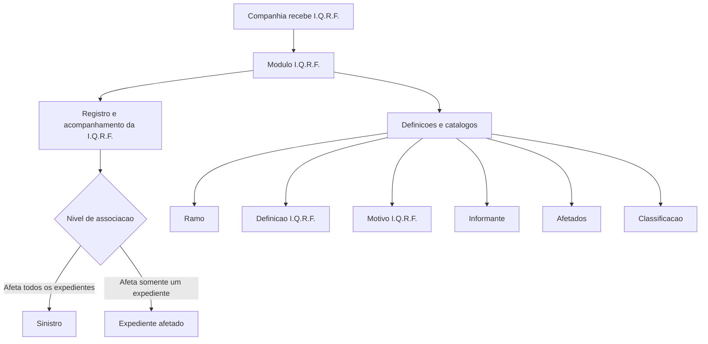

# Módulo I.Q.R.F. — Registro, Definição e Operações de Incidências, Queixas, Reclamações e Felicitações

## 1. Metadados do Documento
- **Arquivo de Origem:** Não identificado no conteúdo fornecido
- **Tipo de Documento:** Manual Operacional
- **Domínio / Sistema:** Reef / I.Q.R.F. / Mapfre
- **Público-Alvo:** Desenvolvedores, Arquitetos, Operação e Negócio
- **Data/Versão Identificada:** Não identificada

---

## 2. Resumo Executivo & Contexto de Negócio

O documento descreve o módulo I.Q.R.F., cuja finalidade é registrar todas as Incidências, Queixas, Reclamações e Felicitações recebidas pela companhia. O registro permite que as ocorrências sejam avaliadas e que ações sejam tomadas quando necessário.

O módulo I.Q.R.F. possui caráter aberto para suportar múltiplos tipos de negócio, incluindo, entre os exemplos citados, Automóvel e Saúde. O comportamento e as características do módulo são configuráveis por meio de catálogos.

Uma I.Q.R.F. pode ser associada a um sinistro ou a um expediente. Quando a I.Q.R.F. afeta todos os expedientes de um sinistro, o registro ocorre no nível do sinistro; quando afeta somente um expediente, a associação é feita exclusivamente com o expediente afetado.

O documento apresenta os elementos que compõem uma I.Q.R.F., os níveis de definição aplicáveis, os dados de identificação, os motivos, os meios de contato dos envolvidos e as operações de criação, modificação e consulta para sinistros e expedientes.

---

## 3. Arquitetura, Componentes & Tecnologias Envolvidas

O conteúdo não detalha uma arquitetura técnica de software, APIs, protocolos, bancos de dados, microsserviços ou tecnologias de infraestrutura. A estrutura funcional apresentada é composta pelo módulo I.Q.R.F., seus catálogos de definição e as entidades de negócio sinistro e expediente.

### Componentes e conceitos identificados

| Componente / Conceito | Descrição baseada no documento |
| :--- | :--- |
| I.Q.R.F. | Registro de Incidências, Queixas, Reclamações e Felicitações. |
| Módulo I.Q.R.F. | Módulo para registrar e acompanhar I.Q.R.F.s recebidas pela companhia. |
| Sinistro | Entidade à qual uma I.Q.R.F. pode ser associada. |
| Expediente | Entidade à qual uma I.Q.R.F. pode ser associada quando somente um expediente é afetado. |
| Ramo | Nível de definição que permite definições distintas por ramo. |
| Definição I.Q.R.F. | Define valores padrão e validações dos atributos de I.Q.R.F. |
| Motivo I.Q.R.F. | Define os motivos de uma Incidência, Queixa, Reclamação ou Felicitação. |
| Informante | Define os possíveis informantes de uma I.Q.R.F. |
| Afetados | Define os possíveis afetados por uma I.Q.R.F. |
| Classificação | Define a classificação de uma I.Q.R.F. |
| Catálogos | Mecanismo citado para configurar comportamento e características do módulo. |



> **Nota de Análise:** O documento não detalha métodos HTTP, contratos JSON, persistência de dados, autenticação, URLs, ambientes, versões de componentes ou integrações técnicas.

---

## 4. Regras de Negócio, Especificações Funcionais & Processos

### Finalidade do módulo

O módulo I.Q.R.F. permite registrar todas as Incidências, Queixas, Reclamações e Felicitações que chegam à companhia, para que possam ser avaliadas e para que seja possível atuar quando necessário.

### Características funcionais

- O módulo suporta múltiplos tipos de negócio.
- Entre os tipos de negócio citados estão Automóvel e Saúde.
- O módulo é configurável por meio de catálogos.
- Os catálogos permitem definir o comportamento e as características atribuídas ao módulo I.Q.R.F.
- O módulo contém funcionalidades necessárias para registrar e realizar o acompanhamento das I.Q.R.F.s.

### Associação com sinistro ou expediente

- Uma I.Q.R.F. pode afetar todos os expedientes de um sinistro.
- Quando uma I.Q.R.F. afeta todos os expedientes de um sinistro, o registro deve ocorrer no nível do sinistro.
- Uma I.Q.R.F. também pode afetar somente um expediente.
- Quando uma I.Q.R.F. afeta somente um expediente, a I.Q.R.F. deve ser associada exclusivamente ao expediente afetado.

### Elementos de identificação da I.Q.R.F.

Na identificação de uma I.Q.R.F., devem ser considerados os seguintes elementos:

- Sinistro ou expediente pendente ao qual a I.Q.R.F. irá afetar.
- Tipo de I.Q.R.F.
- Estado da I.Q.R.F.
- Data de abertura.
- Afetado pela I.Q.R.F.
- Resolução.
- Outros dados não especificados pelo documento, indicados por “Etc.”.

### Motivos e meios de contato

- O elemento de motivos contém as razões da I.Q.R.F.
- O elemento de meios de contato contém os meios de contato dos envolvidos na I.Q.R.F. quando esses meios não estiverem registrados.

### Níveis de definição

Os elementos de definição atendem a diferentes níveis:

1. **Ramo I.Q.R.F.**
   - Permite definições diferentes por ramo.

2. **Definição I.Q.R.F.**
   - Define valores padrão e validações dos atributos da I.Q.R.F.

3. **I.Q.R.F.**
   - Aplica definições para todos os ramos, sem distinção.

4. **Motivo I.Q.R.F.**
   - Define os motivos possíveis de uma Incidência, Queixa, Reclamação ou Felicitação.

5. **Informante**
   - Define os possíveis informantes de uma Incidência, Queixa, Reclamação ou Felicitação.

6. **Afetados**
   - Define os possíveis afetados de uma Incidência, Queixa, Reclamação ou Felicitação.

7. **Classificação**
   - Define a classificação de uma Incidência, Queixa, Reclamação ou Felicitação.

### Operações disponíveis

| Operação | Escopo | Regra funcional descrita |
| :--- | :--- | :--- |
| Criar I.Q.R.F. sinistro | Sinistro | Permite registrar uma Incidência, Queixa, Reclamação ou Felicitação em um sinistro. |
| Modificar I.Q.R.F. sinistro | Sinistro | Permite alterar uma Incidência, Queixa, Reclamação ou Felicitação em sinistros. |
| Criar I.Q.R.F. expediente | Expediente | Permite registrar uma Incidência, Queixa, Reclamação ou Felicitação em um expediente. |
| Modificar I.Q.R.F. expediente | Expediente | Permite alterar uma Incidência, Queixa, Reclamação ou Felicitação em um expediente. |
| Consultar I.Q.R.F. sinistro | Sinistro | Mostra todas as informações de I.Q.R.F. de um sinistro. |
| Consultar I.Q.R.F. expediente | Expediente | Mostra todas as informações de I.Q.R.F. de um expediente. |

---

## 5. Tabelas de Parâmetros, Ambientes e Estruturas de Dados

| Item / Parâmetro | Descrição / Função | Tipo / Valores / Formato | Ambiente / Observações |
| :--- | :--- | :--- | :--- |
| Sinistro / expediente pendente | Identifica o sinistro ou expediente que será afetado pela I.Q.R.F. | Não especificado | Elemento de identificação da I.Q.R.F. |
| Tipo de I.Q.R.F. | Identifica o tipo da I.Q.R.F. | Incidência, Queixa, Reclamação ou Felicitação | Não há valores adicionais especificados. |
| Estado da I.Q.R.F. | Identifica o estado da I.Q.R.F. | Não especificado | O documento não enumera estados possíveis. |
| Data de abertura | Registra a data de abertura da I.Q.R.F. | Data; formato não especificado | Elemento de identificação. |
| Afetado pela I.Q.R.F. | Identifica a pessoa ou entidade afetada pela I.Q.R.F. | Não especificado | Definições de possíveis afetados são previstas. |
| Resolução | Registra a resolução da I.Q.R.F. | Não especificado | O documento não detalha critérios ou estados de resolução. |
| Motivo I.Q.R.F. | Representa a razão da I.Q.R.F. | Não especificado | Definido por meio de Motivo I.Q.R.F. |
| Meios de contato | Contém meios de contato dos envolvidos quando não estiverem registrados. | Não especificado | Aplicável aos envolvidos na I.Q.R.F. |
| Ramo | Permite definições diferentes por ramo. | Não especificado | Nível de definição. |
| Definição I.Q.R.F. | Define valores padrão e validações de atributos de I.Q.R.F. | Valores padrão e validações não especificados | Nível de definição. |
| Informante | Define possíveis informantes da I.Q.R.F. | Não especificado | Nível de definição. |
| Classificação | Define a classificação da I.Q.R.F. | Não especificado | Nível de definição. |
| Tipo de negócio | Identifica negócios suportados pelo módulo. | Automóvel, Saúde e outros não especificados | O módulo possui caráter aberto. |
| Catálogos | Configuram comportamento e características do módulo. | Não especificado | Não são detalhados catálogos concretos. |

---

## 6. Bateria de Perguntas & Respostas para RAG (FAQ Sintético)

### P1: Qual é a finalidade do módulo I.Q.R.F.?
**R:** O módulo I.Q.R.F. serve para registrar todas as Incidências, Queixas, Reclamações e Felicitações que chegam à companhia, permitindo que sejam avaliadas e que a companhia atue quando necessário.

### P2: Quais tipos de negócio o módulo I.Q.R.F. pode atender?
**R:** O documento informa que o módulo possui caráter aberto para atender múltiplos tipos de negócio. Automóvel e Saúde são apresentados como exemplos de tipos de negócio suportados.

### P3: Como o comportamento do módulo I.Q.R.F. é configurado?
**R:** O comportamento e as características do módulo I.Q.R.F. são configuráveis por meio de catálogos. O documento não identifica os nomes nem os campos dos catálogos.

### P4: Quando uma I.Q.R.F. deve ser registrada no nível de sinistro?
**R:** Uma I.Q.R.F. deve ser registrada no nível de sinistro quando a ocorrência afetar todos os expedientes vinculados a esse sinistro.

### P5: Quando uma I.Q.R.F. deve ser associada a um expediente?
**R:** Uma I.Q.R.F. deve ser associada somente ao expediente afetado quando a ocorrência não afetar todos os expedientes do sinistro e impactar exclusivamente aquele expediente.

### P6: Quais informações devem ser identificadas em uma I.Q.R.F.?
**R:** A identificação de uma I.Q.R.F. inclui o sinistro ou expediente pendente afetado, o tipo da I.Q.R.F., o estado, a data de abertura, o afetado pela I.Q.R.F. e a resolução. O documento também indica que podem existir outros elementos não detalhados.

### P7: Para que serve a definição I.Q.R.F.?
**R:** A definição I.Q.R.F. serve para definir valores padrão e validações dos atributos da I.Q.R.F. O documento não especifica quais atributos, valores padrão ou validações são configurados.

### P8: Qual é a função do Motivo I.Q.R.F.?
**R:** O Motivo I.Q.R.F. define os motivos de uma Incidência, Queixa, Reclamação ou Felicitação. O elemento de motivos contém as razões associadas à I.Q.R.F.

### P9: O que acontece quando os meios de contato dos envolvidos não estão registrados?
**R:** O elemento de meios de contato da I.Q.R.F. contém os meios de contato dos envolvidos quando esses meios não estiverem previamente registrados.

### P10: Quais operações existem para I.Q.R.F. associada a sinistro?
**R:** Para sinistro, existem as operações de criar I.Q.R.F. sinistro, modificar I.Q.R.F. sinistro e consultar I.Q.R.F. sinistro. A consulta mostra todas as informações de I.Q.R.F. do sinistro.

### P11: Quais operações existem para I.Q.R.F. associada a expediente?
**R:** Para expediente, existem as operações de criar I.Q.R.F. expediente, modificar I.Q.R.F. expediente e consultar I.Q.R.F. expediente. A consulta mostra todas as informações de I.Q.R.F. do expediente.

### P12: O que significa o nível de definição por ramo?
**R:** O nível Ramo I.Q.R.F. permite que existam definições diferentes por ramo. O documento não descreve os ramos disponíveis nem as diferenças de configuração aplicáveis a cada ramo.

---

## 7. Glossário de Termos, Siglas & Conceitos-Chave

- **I.Q.R.F.:** Incidências, Queixas, Reclamações e Felicitações.
- **Módulo I.Q.R.F.:** Módulo corporativo destinado ao registro e acompanhamento de I.Q.R.F.s.
- **Sinistro:** Entidade à qual uma I.Q.R.F. pode ser registrada quando a ocorrência afeta todos os expedientes associados.
- **Expediente:** Entidade à qual uma I.Q.R.F. pode ser associada quando somente um expediente é afetado.
- **Ramo:** Nível de definição que permite definições diferentes por ramo.
- **Motivo I.Q.R.F.:** Definição das razões de uma Incidência, Queixa, Reclamação ou Felicitação.
- **Informante:** Possível origem ou comunicante de uma I.Q.R.F.
- **Afetados:** Possíveis pessoas ou entidades afetadas por uma I.Q.R.F.
- **Classificação:** Definição da classificação de uma Incidência, Queixa, Reclamação ou Felicitação.
- **Catálogos:** Mecanismo de configuração do comportamento e das características do módulo.
- **Reef:** Nome presente na documentação de origem, sem definição funcional adicional no conteúdo fornecido.
- **Mapfre:** Nome presente na documentação de origem, sem definição organizacional adicional no conteúdo fornecido.

---

## 8. Notas Críticas, Riscos & Limitações

- O documento não identifica o nome do arquivo de origem, data, versão, autor ou histórico de revisões.
- O conteúdo não apresenta arquitetura técnica detalhada, APIs, contratos, tecnologias, integrações, bancos de dados, URLs, servidores, logs ou ambientes.
- Os valores possíveis para tipo, estado, classificação, motivo, informante, afetado e resolução não são especificados.
- O documento declara que a Definição I.Q.R.F. contém valores padrão e validações, mas não detalha os atributos, regras de validação ou valores padrão.
- O documento menciona catálogos configuráveis, mas não descreve suas estruturas, permissões, responsáveis ou processo de administração.
- A operação “Modificar I.Q.R.F. expediente” contém o termo “expedienteo” no conteúdo bruto, aparente erro de transcrição ou tipografia.
- Não há detalhamento adicional sobre “Etc.” nos elementos de identificação.

---

## 9. Conteúdo Bruto Estruturado (Referência Fiel)

```text
--- [PÁGINA 1 DE 3] ---

INTRODUCIR - I.Q.R.F.
OBJETIVO
La nalidad de este módulo es poder registrar todos las Incidencias, Quejas, Reclamaciones y Felicitaciones que lleguen a la compañía, para
poder ser evaluadas y actuar si fuese necesario.
Características
Elementos de una I.Q.R.F.
Deniciones de I.Q.R.F.
Operaciones de I.Q.R.F.
Características
Múltiples tipos de negocio
El carácter abierto del módulo facilita la posibilidad de trabajar seguros del tipo:
Automóvil
Salud
Etc.
Congurable
Mediante catálogos vamos a poder denir el comportamiento y las características que le vamos a dar al modulo de IQRF's.
Cubre todas las funcionalidades de los I.Q.R.F
Este módulo, contiene todas las funcionalidades necesarias para registrar y realizar un seguimiento de las I.Q.R.F.'s .
Se puede asociar a un siniestro o a un expediente
La I.Q.R.F. puede afectar a todos los expedientes de un siniestro, y se registrará a nivel de siniestro o sólo a un expediente, en ese caso se
asociará sólo a el expediente afectado.
Elementos de una I.Q.R.F.
Las I.Q.R.F.'s están compuestas de varios elementos
Documentation / DOCUMENTACIÓN Reef
DOCUMENTACIÓN Reef
Mapfredocument
DOCUMENTACIÓN Reef
Owner
user:agonzalez_mapfre.com
Lifecycle
Approved Source
 / 
 VL
Buscar Inicio Soluciones Arquitecturas APIs Componentes Cloud Documentación Zeus Reef Ayuda
ES


--- [PÁGINA 2 DE 3] ---

I.Q.R.F.
IDENTIFICACIÓN MOTIVOS MEDIOS DE CONTACTOS
Identicación de la I.Q.R.F.
En este elemento de la I.Q.R.F. se deberá identicar:
Siniestro/expediente pendiente, al que va afectar el I.Q.R.F.
Tipo de I.Q.R.F.
Estado del I.Q.R.F.
Fecha de apertura
Afectado por la I.Q.R.F.
Resolución
Etc.
Motivos del I.Q.R.F.
Este elemento contiene cuales son las razones del I.Q.R.F.
Medios de contactos de implicados I.Q.R.F.
Este elemento contiene los medios de contacto implicados por la I.Q.R.F. si estos no estuvieran registrados.
Deniciones de I.Q.R.F.
Los elementos de denición atienden a distintos niveles:
NIVELES DE DEFINICIÓN
RAMO I.Q.R.F.
RAMO
Deniciones diferentes por Ramo
DEFINICIÓN IQRF
Dene valores por defecto y validaciones de los atributos de IQRF
I.Q.R.F.
Deniciones para todos los ramos sin distinción
MOTIVO IQRF
Denición de los motivos de una
Incidencia, Queja, Reclamación o
Felicitación
INFORMANTE
Denición de los posibles informantes de
una Incidencia, Queja, Reclamación o
Felicitación
AFECTADOS
Denición de los posibles afectados por
una Incidencia, Queja, Reclamación o
Felicitación


--- [PÁGINA 3 DE 3] ---

CLASIFICACIÓN
Denición de la clasicación de una
Incidencia, Queja, Reclamación o
Felicitación
Operaciones de I.Q.R.F.
I.Q.R.F.
Todas las Operaciones que se pueden realizar I.Q.R.F.
CREAR IQRF siniestro
Permite registrar una Incidencia, Queja,
Reclamación o Felicitación a un siniestro
MODIFICAR IQRF siniestro
Permite cambiar una Incidencia, Queja,
Reclamación o Felicitación a un siniestros
CREAR IQRF expediente
Permite registrar una Incidencia, Queja,
Reclamación o Felicitación a un
expediente
MODIFICAR IQRF expediente
Permite cambiar una Incidencia, Queja,
Reclamación o Felicitación a un
expedienteo
CONSULTAR IQRF siniestro
Muestra toda la información de IQRF de
un siniestro
CONSULTAR IQRF expediente
Muestra toda la información de IQRF de
un expediente
```
