# Módulo de Juicios — Registro, Configuração, Operações e Acompanhamento de Processos Judiciais

## 1. Metadados do Documento
- **Arquivo de Origem:** `Não identificado no conteúdo bruto fornecido`
- **Tipo de Documento:** `Manual Funcional / Apresentação de Módulo`
- **Domínio / Sistema:** `Reef / Módulo de Juicios (Juízos / Processos Judiciais)`
- **Público-Alvo:** `Analistas funcionais, equipes de negócio, operação, desenvolvedores e arquitetos`
- **Data/Versão Identificada:** `Não identificada`

---

## 2. Resumo Executivo & Contexto de Negócio

O documento descreve o módulo **Juicios**, destinado ao registro e acompanhamento de processos judiciais vinculados à companhia. O módulo abrange tanto situações em que a companhia demanda um terceiro, pessoa física ou jurídica, quanto situações em que um terceiro demanda a companhia.

O escopo funcional apresentado cobre a composição de um juízo, as informações de demanda e sentença, atributos adicionais, terceiros relacionados, valores financeiros, definições configuráveis e operações disponíveis. O módulo é apresentado como capaz de registrar e acompanhar os dados necessários ao ciclo de vida de um processo judicial.

O módulo Juicios suporta múltiplos tipos de negócio, incluindo exemplos como **Automóvil**, **Salud** e **Vida**. O comportamento e as características do módulo podem ser configurados por meio de catálogos, permitindo adaptação às necessidades de cada instalação e ramo.

A solução mantém histórico dos advogados que participaram de um juízo e permite associar diferentes pessoas relacionadas ao processo, tais como advogados e testemunhas. A estrutura também prevê a associação de expedientes ao juízo, incluindo uma configuração geral que pode determinar se mais de um sinistro pode ser associado a um mesmo processo judicial.

As operações de Juicios podem ser realizadas tanto **em linha** quanto de forma **diferida**. O material não detalha mecanismos técnicos, contratos de API, métodos HTTP, persistência de dados, autenticação, integrações externas ou regras de transição de estado entre demanda e sentença.

---

## 3. Arquitetura, Componentes & Tecnologias Envolvidas

O conteúdo descreve uma arquitetura funcional centrada no módulo **Juicios**, organizado em elementos de processo judicial, níveis de definição e operações. Não são especificados microsserviços, bancos de dados, APIs, protocolos, servidores, URLs, tecnologias de implementação ou ambientes técnicos.

### Componentes funcionais identificados

| Componente | Papel descrito no documento |
| :--- | :--- |
| **Juicio** | Entidade central do módulo para registrar e acompanhar um processo judicial. |
| **Demanda** | Elemento que registra informações iniciais do processo, incluindo sinistro/expediente afetado, estado, data estimada e advogado. |
| **Sentencia** | Elemento que registra informações de decisão do processo, incluindo data do juízo, tipo de sentença e data de pagamento ou recebimento. |
| **Atributos** | Informações adicionais e opcionais aplicáveis tanto à demanda quanto à sentença. |
| **Terceros** | Pessoas físicas e/ou jurídicas relacionadas ao juízo, à demanda ou à sentença; inclui, por exemplo, testemunhas. |
| **Importes** | Valores econômicos registrados na fase de demanda ou após a sentença. |
| **Definições Comum** | Catálogos compartilhados necessários ao funcionamento do módulo, incluindo advogados, procuradores, tribunais e julgados. |
| **Definições General** | Definições que afetam todos os expedientes com juízos, como características gerais, causa de processo e juros de mora. |
| **Definições Ramo** | Definições exclusivas do ramo configurado, como causa de processo por ramo e tipo de expediente. |
| **Definições Juicio** | Configurações específicas de atributos, estrutura, informações iniciais, validações e desdobramento econômico. |
| **Operações Juicios** | Operações para criar, modificar, associar, consultar demandas, sentenças e intervenções. |

### Fluxo funcional reconstruído

```mermaid
graph TD
  A[Juicio / Processo Judicial] --> B[Demanda]
  A --> C[Sentencia]
  A --> D[Atributos]
  A --> E[Terceros]
  A --> F[Importes]

  B --> B1[Siniestro ou expediente afetado]
  B --> B2[Estado do Juicio]
  B --> B3[Fecha estimada del Juicio]
  B --> B4[Abogado]

  C --> C1[Fecha del Juicio]
  C --> C2[Tipo de sentencia]
  C --> C3[Fecha pago o de cobro]

  E --> E1[Personas físicas]
  E --> E2[Personas jurídicas]
  E --> E3[Abogados]
  E --> E4[Testigos]

  F --> F1[Consignaciones]
  F --> F2[Adelanto de Honorarios Abogado]
  F --> F3[Honorarios del Abogado]
  F --> F4[Importe de la sentencia]

  G[Definiciones] --> G1[Común]
  G --> G2[General]
  G --> G3[Ramo]
  G --> G4[Juicio]

  G1 --> G11[Abogados]
  G1 --> G12[Procuradores]
  G1 --> G13[Tribunales]
  G1 --> G14[Juzgado]

  G2 --> G21[Características]
  G2 --> G22[Causa Proceso]
  G2 --> G23[Intereses de Demora]

  G3 --> G31[Causa Proceso por ramo]
  G3 --> G32[Tipo Expediente]

  G4 --> G41[Atributo]
  G4 --> G42[Estructura]
  G4 --> G43[Información Inicial]
  G4 --> G44[Validaciones Información]
  G4 --> G45[Desglose Concepto Cobro Pago Juicios]

  H[Operaciones Juicios] --> H1[Crear demanda]
  H --> H2[Modificar demanda]
  H --> H3[Asociar juicio expediente]
  H --> H4[Crear sentencia]
  H --> H5[Modificar sentencia]
  H --> H6[Crear intervención juicio]
  H --> H7[Modificar intervención juicio]
  H --> H8[Consultar juicio]
```



> **Nota de Análise:** O conteúdo descreve a estrutura funcional do módulo Juicios, mas não apresenta uma arquitetura técnica de software, integrações, interfaces, serviços, tecnologias ou contratos de dados.

---

## 4. Regras de Negócio, Especificações Funcionais & Processos

### 4.1 Objetivo funcional do módulo Juicios

O módulo Juicios permite registrar todos os dados de um juízo ou processo judicial em dois cenários:

1. A companhia demandou um terceiro, físico ou jurídico.
2. Um terceiro demandou a companhia.

O módulo contém funcionalidades para registrar e realizar acompanhamento dos juízos. Também registra todos os advogados que participaram no processo judicial.

### 4.2 Características do módulo

- O módulo suporta múltiplos tipos de negócio.
- São citados como exemplos de tipos de seguro: **Automóvil**, **Salud**, **Vida** e outros não detalhados.
- O módulo é configurável por meio de catálogos.
- Os catálogos permitem definir comportamento e características do módulo de Juicios.
- O módulo cobre funcionalidades necessárias para registrar e acompanhar juízos.
- O módulo mantém histórico de advogados participantes no juízo.

### 4.3 Elementos que compõem um Juicio

Um Juicio é composto pelos seguintes elementos:

| Elemento | Regra ou propósito funcional |
| :--- | :--- |
| **Demanda** | Registra as informações da demanda associada ao juízo. |
| **Atributos** | Armazena informação adicional opcional para demanda e sentença. |
| **Terceros** | Identifica pessoas físicas e/ou jurídicas relacionadas ao processo judicial. |
| **Importes** | Registra valores econômicos associados à fase de demanda ou sentença. |
| **Sentencia** | Registra informações decorrentes da celebração do juízo e emissão de sentença. |

### 4.4 Regras funcionais da Demanda

Na Demanda de um Juicio, devem ser identificados os seguintes dados:

| Informação | Descrição apresentada |
| :--- | :--- |
| **Siniestro/expediente pendiente** | Sinistro ou expediente pendente que será afetado pelo juízo. |
| **Estado del Juicio** | Estado do processo judicial. |
| **Fecha estimada del Juicio** | Data estimada do juízo. |
| **Abogado** | Advogado associado ao processo judicial. |
| **Etc.** | O documento indica que existem outras informações, mas não as detalha. |

### 4.5 Regras funcionais dos Atributos

- Os Atributos contêm informação adicional sobre os juízos.
- O preenchimento dos Atributos é opcional.
- Os Atributos podem ser aplicados tanto à Demanda quanto à Sentencia.
- A definição de atributos permite configurar informação adicional necessária em cada instalação de Juicios.
- A Estrutura define informação adicional do juízo composta por atributos, obrigatoriedade ou não de solicitação de informação e ordem de solicitação.

### 4.6 Regras funcionais dos Terceros

- O elemento Terceros permite identificar pessoas físicas e/ou jurídicas relacionadas ao juízo.
- Os terceiros podem estar relacionados tanto à Demanda quanto à Sentencia.
- O documento cita testemunhas como exemplo de pessoas relacionadas ao juízo.
- As operações de intervenção permitem associar pessoas ao juízo, incluindo advogados, testemunhas e outros participantes não detalhados.

### 4.7 Regras funcionais dos Importes

Durante a primeira fase da Demanda, os valores podem incluir:

- Consignaciones.
- Adelanto de Honorarios Abogado.
- Outros valores não detalhados.

Após a realização do juízo e emissão de uma Sentencia, os valores podem incluir:

- Honorarios del Abogado.
- Importe de la sentencia.
- Outros valores não detalhados.

A configuração **Desglose Concepto Cobro Pago Juicios** determina o detalhamento econômico dos juízos. O documento apresenta consignações judiciais e honorários de advogado como exemplos.

### 4.8 Regras funcionais da Sentencia

Na Sentencia de um Juicio, devem ser identificados:

| Informação | Descrição apresentada |
| :--- | :--- |
| **Fecha del Juicio** | Data do juízo. |
| **Tipo de sentencia** | Tipo de sentença. |
| **Fecha pago o de cobro** | Data de pagamento ou de cobrança. |
| **Etc.** | O documento indica outras informações, sem especificá-las. |

### 4.9 Níveis de definição de Juicios

Os elementos de definição atendem aos níveis **Común**, **General**, **Ramo** e **Juicio**.

#### Nível Común

O nível Común contém definições que não são exclusivas do módulo de sinistros, mas são necessárias para realizar a definição do módulo de Juicios.

| Definição | Finalidade |
| :--- | :--- |
| **Abogados** | Definir os advogados que trabalharão com a companhia. |
| **Procuradores** | Definir os procuradores que trabalharão com a companhia. |
| **Tribunales** | Definir os tribunais que trabalharão com a companhia. |
| **Juzgado** | Definir os julgados que trabalharão com a companhia. |

#### Nível General

O nível General contém definições que afetam todos os expedientes com juízos.

| Definição | Finalidade |
| :--- | :--- |
| **Características** | Define características gerais do módulo de sinistros e determina comportamentos do módulo de Juicios; o documento cita como exemplo permitir mais de um sinistro em um juízo. |
| **Causa Proceso** | Permite catalogar motivos para reabrir um juízo no nível da companhia. |
| **Intereses de Demora** | Permite definir distintos tipos de juros de mora para os juízos. |

#### Nível Ramo

O nível Ramo contém definições exclusivas do ramo que está sendo definido.

| Definição | Finalidade |
| :--- | :--- |
| **Causa Proceso** | Permite catalogar motivos para reabertura de um juízo para cada ramo. |
| **Tipo Expediente** | Permite definir os tipos de danos aos quais será associado um juízo. |

#### Nível Juicio

O nível Juicio contém definições específicas do processo judicial.

| Definição | Finalidade |
| :--- | :--- |
| **Atributo** | Permite definir informação adicional necessária em cada instalação de Juicios. |
| **Estructura** | Define informação adicional do juízo composta por atributos, obrigatoriedade de informação e ordem de solicitação. |
| **Información Inicial** | Permite registrar informação padrão e inicial de atributos das operações de juízo, evitando introdução posterior. |
| **Validaciones Información** | Permite definir comportamentos e validações da informação core solicitada nas operações de Juicios. |
| **Desglose Concepto Cobro Pago Juicios** | Determina o detalhamento econômico dos juízos, como consignações judiciais ou honorários de advogado. |

### 4.10 Operações de Juicios

Todas as operações que podem ser realizadas com um Juicio podem ser executadas tanto em linha quanto de forma diferida.

| Operação | Descrição funcional |
| :--- | :--- |
| **Crear demanda** | Cria a demanda de um juízo. |
| **Modificar demanda** | Permite alterar informações e valores da demanda de um juízo. |
| **Asociar juicio expediente** | Indica quais expedientes estão relacionados ao juízo. |
| **Crear Sentencia** | Gera os dados da sentença de um juízo. |
| **Modificar Sentencia** | Permite alterar informações e valores da sentença de um juízo. |
| **Crear intervención juicio** | Associa ao juízo as pessoas relacionadas, incluindo advogados, testemunhas e outros participantes. |
| **Modificar intervención juicio** | Permite modificar as intervenções e as pessoas associadas ao juízo. |
| **Consultar juicio** | Visualiza todas as informações de um juízo. |

---

## 5. Tabelas de Parâmetros, Ambientes e Estruturas de Dados

### 5.1 Estrutura funcional de dados do Juicio

| Item / Parâmetro | Descrição / Função | Tipo / Valores / Formato | Ambiente / Observações |
| :--- | :--- | :--- | :--- |
| Juicio | Registro central de um processo judicial. | Entidade funcional. | Pode representar demanda da companhia contra terceiro ou demanda de terceiro contra a companhia. |
| Demanda | Registra a fase de demanda do juízo. | Elemento funcional. | Inclui sinistro/expediente, estado, data estimada, advogado e outros dados não detalhados. |
| Sentencia | Registra a decisão ou sentença do juízo. | Elemento funcional. | Inclui data do juízo, tipo de sentença e data de pagamento ou cobrança. |
| Atributos | Registra informação adicional. | Opcional. | Aplicável à demanda e à sentença. |
| Terceros | Identifica participantes relacionados ao processo. | Pessoas físicas e/ou jurídicas. | Pode incluir testemunhas, advogados e outras pessoas não detalhadas. |
| Importes | Registra valores econômicos do juízo. | Conceitos econômicos. | Os conceitos variam entre fase de demanda e fase posterior à sentença. |
| Estado del Juicio | Identifica o estado do processo judicial. | Não detalhado. | Mencionado como dado da Demanda. |
| Fecha estimada del Juicio | Data estimada do juízo. | Data; formato não informado. | Mencionada como dado da Demanda. |
| Fecha del Juicio | Data do juízo. | Data; formato não informado. | Mencionada como dado da Sentencia. |
| Tipo de sentencia | Classificação da sentença. | Não detalhado. | Mencionado como dado da Sentencia. |
| Fecha pago o de cobro | Data de pagamento ou cobrança. | Data; formato não informado. | Mencionada como dado da Sentencia. |
| Abogado | Advogado associado ao processo judicial. | Catálogo de advogados. | O módulo registra histórico de advogados participantes. |
| Procuradores | Procuradores que trabalharão com a companhia. | Catálogo. | Definição de nível Común. |
| Tribunales | Tribunais que trabalharão com a companhia. | Catálogo. | Definição de nível Común. |
| Juzgado | Julgados que trabalharão com a companhia. | Catálogo. | Definição de nível Común. |
| Causa Proceso | Motivo para reabertura de um juízo. | Catálogo. | Pode ser definido no nível companhia e no nível ramo. |
| Intereses de Demora | Tipos de juros de mora para juízos. | Tipos não detalhados. | Definição de nível General. |
| Tipo Expediente | Tipo de dano ao qual um juízo será associado. | Tipos de danos não detalhados. | Definição de nível Ramo. |
| Información Inicial | Informação padrão para atributos em operações de juízo. | Valores padrão; formato não informado. | Evita inserção posterior de dados. |
| Validaciones Información | Comportamentos e validações de informação core. | Regras de validação não detalhadas. | Aplicável às operações de Juicios. |
| Desglose Concepto Cobro Pago Juicios | Configuração do detalhamento econômico do processo. | Conceitos de cobrança e pagamento. | Exemplos: consignações judiciais e honorários de advogado. |

### 5.2 Valores econômicos citados

| Item / Parâmetro | Descrição / Função | Tipo / Valores / Formato | Ambiente / Observações |
| :--- | :--- | :--- | :--- |
| Consignaciones | Valor que pode ser registrado na primeira fase da demanda. | Conceito econômico. | Também são mencionadas consignações judiciais como exemplo de detalhamento econômico. |
| Adelanto de Honorarios Abogado | Adiantamento de honorários de advogado. | Conceito econômico. | Pode ser registrado quando o juízo está na primeira fase da demanda. |
| Honorarios del Abogado | Honorários do advogado. | Conceito econômico. | Pode ser registrado após a celebração do juízo e emissão de sentença. |
| Importe de la sentencia | Valor da sentença. | Conceito econômico. | Pode ser registrado após a celebração do juízo e emissão de sentença. |

### 5.3 Ambientes, infraestrutura e rotas técnicas

| Item / Parâmetro | Descrição / Função | Tipo / Valores / Formato | Ambiente / Observações |
| :--- | :--- | :--- | :--- |
| Ambientes técnicos | Não descritos. | Não identificado. | O documento não informa desenvolvimento, homologação, produção ou outros ambientes. |
| URLs | Não descritas. | Não identificado. | Nenhuma URL técnica de sistema é apresentada. |
| Servidores | Não descritos. | Não identificado. | Nenhum servidor é apresentado. |
| Rotas de logs | Não descritas. | Não identificado. | O documento não apresenta caminhos, níveis ou mecanismos de logs. |
| APIs e contratos | Não descritos. | Não identificado. | Não há métodos HTTP, contratos JSON, mensagens ou integrações técnicas especificadas. |

---

## 6. Bateria de Perguntas & Respostas para RAG (FAQ Sintético)

### P1: Qual é o objetivo do módulo Juicios?
**R:** O módulo Juicios permite registrar todos os dados de um processo judicial e acompanhar sua evolução. O módulo contempla tanto cenários em que a companhia demanda um terceiro, pessoa física ou jurídica, quanto cenários em que um terceiro demanda a companhia.

### P2: Quais são os elementos que compõem um Juicio?
**R:** Um Juicio é composto por Demanda, Atributos, Terceros, Importes e Sentencia. A Demanda registra a fase inicial do processo; os Atributos armazenam informação adicional opcional; os Terceros identificam pessoas físicas ou jurídicas relacionadas; os Importes registram valores econômicos; e a Sentencia registra dados da decisão judicial.

### P3: Quais informações devem ser identificadas na Demanda de um Juicio?
**R:** A Demanda deve identificar o sinistro ou expediente pendente que será afetado pelo juízo, o estado do Juicio, a data estimada do Juicio e o advogado. O documento também indica a existência de outras informações, mas não as especifica.

### P4: Que dados são registrados na Sentencia de um Juicio?
**R:** A Sentencia deve identificar a data do Juicio, o tipo de sentencia e a data de pagamento ou de cobrança. O conteúdo original também indica “Etc.”, sem detalhar outros campos.

### P5: Os atributos são obrigatórios no módulo Juicios?
**R:** Não necessariamente. O documento estabelece que os Atributos contêm informação adicional dos juízos e são opcionais tanto para a Demanda quanto para a Sentencia. A definição Estructura permite configurar se uma informação é obrigatória ou não e em que ordem será solicitada.

### P6: Quais terceiros podem ser associados a um Juicio?
**R:** O elemento Terceros permite identificar pessoas físicas e/ou jurídicas que tenham relação com o Juicio, tanto na Demanda quanto na Sentencia. O documento cita testemunhas como exemplo. A operação Crear intervención juicio também menciona advogados, testemunhas e outras pessoas relacionadas ao processo.

### P7: Quais valores econômicos podem ser registrados durante a fase de Demanda?
**R:** Quando o Juicio está na primeira fase da Demanda, os valores podem incluir Consignaciones e Adelanto de Honorarios Abogado. O documento informa que podem existir outros valores, mas não os detalha.

### P8: Quais valores econômicos podem ser registrados após a sentença?
**R:** Após a celebração do Juicio e a emissão de uma Sentencia, os valores podem incluir Honorarios del Abogado e Importe de la sentencia. O documento não apresenta uma lista completa de todos os conceitos financeiros possíveis.

### P9: Em quais níveis as definições de Juicios são organizadas?
**R:** As definições são organizadas nos níveis Común, General, Ramo e Juicio. O nível Común contém catálogos compartilhados, o nível General afeta todos os expedientes com juízos, o nível Ramo é exclusivo de um ramo configurado e o nível Juicio contém configurações específicas do processo judicial.

### P10: O que a configuração Características pode determinar no nível General?
**R:** A configuração Características define características gerais do módulo de sinistros e determina comportamentos do módulo Juicios. O exemplo fornecido é a definição sobre permitir mais de um sinistro em um Juicio.

### P11: Como são configuradas as causas de reabertura de um Juicio?
**R:** A configuração Causa Proceso existe em dois níveis. No nível General, ela permite catalogar os motivos para reabrir um Juicio no nível da companhia. No nível Ramo, ela permite catalogar os motivos para reabrir um Juicio especificamente para cada ramo.

### P12: Quais operações podem ser realizadas em Juicios?
**R:** As operações disponíveis são Crear demanda, Modificar demanda, Asociar juicio expediente, Crear Sentencia, Modificar Sentencia, Crear intervención juicio, Modificar intervención juicio e Consultar juicio. Todas essas operações podem ser realizadas em linha ou de forma diferida.

### P13: Para que serve a operação Asociar juicio expediente?
**R:** A operação Asociar juicio expediente indica quais expedientes estão relacionados a um Juicio. O documento não descreve critérios de elegibilidade, validações, limites ou formatos de associação.

### P14: Como o módulo trata o histórico de advogados?
**R:** O módulo registra todos os advogados que participaram no Juicio. Além disso, os advogados podem ser definidos no nível Común e associados ao processo por meio da informação de Demanda ou de intervenções no Juicio.

### P15: O documento define APIs, tecnologias, ambientes ou rotas de log do módulo Juicios?
**R:** Não. O documento apresenta uma descrição funcional do módulo Juicios, mas não especifica APIs, métodos HTTP, contratos JSON, tecnologias de implementação, bancos de dados, ambientes técnicos, servidores, URLs ou rotas de logs.

---

## 7. Glossário de Termos, Siglas & Conceitos-Chave

- **Juicio:** Processo judicial ou entidade central do módulo para registrar e acompanhar um caso judicial.
- **Demanda:** Elemento do Juicio que registra dados da demanda, como expediente afetado, estado, data estimada e advogado.
- **Sentencia:** Elemento do Juicio que registra a decisão judicial e informações como data do juízo, tipo de sentença e data de pagamento ou cobrança.
- **Atributos:** Informações adicionais sobre o Juicio, opcionais para Demanda e Sentencia.
- **Terceros:** Pessoas físicas e/ou jurídicas relacionadas ao Juicio, incluindo participantes como testemunhas.
- **Importes:** Valores econômicos associados ao Juicio.
- **Siniestro:** Termo apresentado como sinistro associado ou afetado pelo Juicio.
- **Expediente:** Registro ou processo associado ao Juicio.
- **Abogado:** Advogado que trabalha com a companhia ou participa do Juicio.
- **Procuradores:** Procuradores que trabalham com a companhia.
- **Tribunales:** Tribunais que trabalham com a companhia.
- **Juzgado:** Julgado que trabalha com a companhia.
- **Causa Proceso:** Catálogo de motivos para reabrir um Juicio.
- **Intereses de Demora:** Tipos de juros de mora definidos para Juicios.
- **Ramo:** Nível de definição exclusivo do ramo configurado.
- **Tipo Expediente:** Tipos de danos aos quais um Juicio será associado.
- **Información Inicial:** Informação padrão e inicial de atributos das operações de Juicio.
- **Validaciones Información:** Comportamentos e validações aplicáveis à informação core solicitada nas operações de Juicios.
- **Desglose Concepto Cobro Pago Juicios:** Configuração do detalhamento econômico de cobranças e pagamentos do Juicio.
- **Consignaciones:** Conceito econômico que pode ser registrado na fase de Demanda.
- **Adelanto de Honorarios Abogado:** Adiantamento de honorários de advogado.
- **Honorarios del Abogado:** Honorários do advogado.
- **Importe de la sentencia:** Valor financeiro associado à sentença.

---

## 8. Notas Críticas, Riscos & Limitações

- O documento é predominantemente funcional e não detalha arquitetura técnica, componentes de software, APIs, mensageria, banco de dados, segurança, autenticação, autorização, auditoria ou observabilidade.
- Não foram identificadas versões do módulo, datas de publicação, responsáveis técnicos, ambientes, servidores, URLs ou caminhos de logs.
- A expressão “Etc.” é utilizada para indicar campos ou valores adicionais em Demanda, Sentencia e Importes, mas esses elementos adicionais não são definidos.
- Não são apresentados estados possíveis do Juicio, regras de transição entre estados, critérios para criação de sentença, regras de reabertura, limites de associação ou regras de cálculo de juros de mora.
- O documento cita operação em linha e de forma diferida, porém não descreve como a execução diferida é disparada, processada, monitorada ou tratada em caso de falha.
- A definição **Características** cita como exemplo a permissão de mais de um sinistro em um Juicio, mas não declara se esse comportamento é habilitado por padrão nem quais são suas validações.
- A configuração **Validaciones Información** é mencionada, mas o documento não lista as validações específicas aplicadas à informação core.
- **Nota de Análise:** O documento lista conceitos funcionais do módulo Juicios, porém não detalha os contratos de entrada e saída, os modelos de dados, os métodos HTTP ou contratos JSON eventualmente expostos.

---

## 9. Conteúdo Bruto Estruturado (Referência Fiel)

```text
--- [PÁGINA 1 DE 4] ---

INTRODUCIR - Juicios
OBJETIVO
La nalidad de este módulo es poder registrar todos los datos de un juicio, tanto si la compañía ha demandado a un tercero (físico o jurídico),
como si un tercero ha demandado a la compañía.
Características
Elementos de un Juicio
Deniciones de un Juicio
Operaciones Juicio
Características
Múltiples tipos de negocio
El carácter abierto del módulo facilita la posibilidad de trabajar seguros del tipo:
Automóvil
Salud
Vida
Etc.
Congurable
Mediante catálogos se va a poder denir el comportamiento y las características que se le va a dar al modulo de Juicios.
Cubre todas las funcionalidades de los juicios
Este módulo, contiene todas las funcionalidades necesarias para registrar y realizar un seguimiento de los juicios .
Histórico de abogados
Se registra todos los abogados que hayan participado en el juicio.
Elementos de un Juicio
Un juicio está compuesto de varios elementos
Documentation / DOCUMENTACIÓN Reef
DOCUMENTACIÓN Reef
Mapfredocument
DOCUMENTACIÓN Reef
Owner
user:agonzalez_mapfre.com
Lifecycle
Approved Source
 / 
 VL
Buscar Inicio Soluciones Arquitecturas APIs Componentes Cloud Documentación Zeus Reef Ayuda
ES


--- [PÁGINA 2 DE 4] ---

JUICIO
DEMANDA
ATRIBUTOS
TERCEROS
IMPORTES
SENTENCIA
ATRIBUTOS
TERCEROS
IMPORTES
Demanda
En este elemento del juicio se tiene que identicar:
Siniestro/expediente pendiente, al que va afectar el juicio.
Estado del Juicio
Fecha estimada del Juicio
Abogado
Etc.
Atributos
Este elemento contiene información adicional de los juicios, es opcional, tanto para la demanda como para la sentencia.
Terceros
En este elemento se puede identicar las personas (físicas y/o jurídicas), que tiene relación con el juicio, tanto en la demanda como en la
sentencia, testigos..
Importes
Cuando el juicio esté en la primera fase de la demanda los importes podrían ser:
Consignaciones
Adelanto de Honorarios Abogado
Etc
Cuando se haya celebrado el juicio y se haya dictado una sentencia el detalle de los importes podrían ser:
Honorarios del Abogado
Importe de la sentencia
Etc
Sentencia
En este elemento del juicio se tiene que identicar:
Fecha del Juicio


--- [PÁGINA 3 DE 4] ---

Tipo de sentencia
Fecha pago o de cobro
Etc.
Deniciones Juicios
Los elementos de denición atienden a distintos niveles:
NIVELES DE DEFINICIÓN
COMÚN GENERAL RAMO JUICIO
COMÚN
En este nivel se encuentran deniciones que NO son exclusivas del módulo de siniestros, pero son
necesarias para poder realizar la denición. Entre otras deniciones se encuentra:
ABOGADOS
Denir los abogados que van a trabajar
con la compañía
PROCURADORES
Denir los procuradores que van a trabajar
con la compañía
TRIBUNALES
Denir los tribunales que van a trabajar
con la compañía
JUZGADO
Denir los juzgados que van a trabajar con
la compañía
GENERAL
En este nivel se encuentran deniciones que afectarán a todos los expedientes con juicios.
CARACTERÍSTICAS
Características Generales del módulo de
siniestros, determina comportamientos
del módulo de juicios por ejemplo si se
permite más de un siniestro en un juicio
CAUSA PROCESO
Permite catalogar los motivos por los que
se quiere re-aperturar un juicio a nivel de
compañía
INTERESES DE DEMORA
Permite denir los Tipos distintos tipos de
interés de demora para los juicios
RAMO
Son exclusivas del ramo que se está deniendo.
CAUSA PROCESO
Permite catalogar los motivos por los que se quiere realizar la
reapertura de un juicio para cada ramo
TIPO EXPEDIENTE
Permite denir los Tipos de Daños a los que se le va a asociar un
juicio


--- [PÁGINA 4 DE 4] ---

JUICIO
Deniciones de juicios
ATRIBUTO
Permite denir la información adicional
que se necesite en cada instalación de los
juicios.
ESTRUCTURA
Información adicional del juicio
compuesta por atributos, obligatoriedad o
no de pedir información, orden en el que
se va a pedir
INFORMACIÓN INICIAL
Permite registrar información por defecto,
inicial de los atributos de las operaciones
de juicio, para no tener que introducirla
posteriormente
VALIDACIONES INFORMACIÓN
Denir comportamientos y validaciones de
la información core, que se piden en las
operaciones de Juicios
DESGLOSE CONCEPTO COBRO PAGO
JUICIOS
Determinar el desglose económico de los
juicios. Por ejemplo consignaciones
judiciales u honorarios abogado...
Operaciones Juicios
JUICIOS
Todas las Operaciones que se pueden realizar con un Juicios, se pueden realizar tanto en línea como
diferido
CREAR demanda
En esta operación se crea la demanda de
un juicio
MODIFICAR demanda
Permite cambiar información de la
demanda de un juicio, datos e importes
ASOCIAR juicio expediente
En esta operación se indica que
expedientes están relacionados con el
juicio
CREAR Sentencia
En esta operación se generan los datos de
la sentencia de un juicio
MODIFICAR Sentencia
Permite cambiar la información de la
sentencia de un juicio, datos e importes
CREAR intervención juicio
Asociar al juicio las personas relacionadas
con el mismo, abogados, testigos.. etc
MODIFICAR intervención juicio
Permite modicar las intervenciones, las
personas asociadas al juicio
CONSULTAR juicio
Visualiza toda la información de un juicio
```
