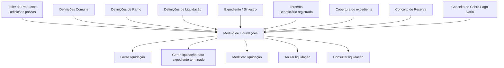
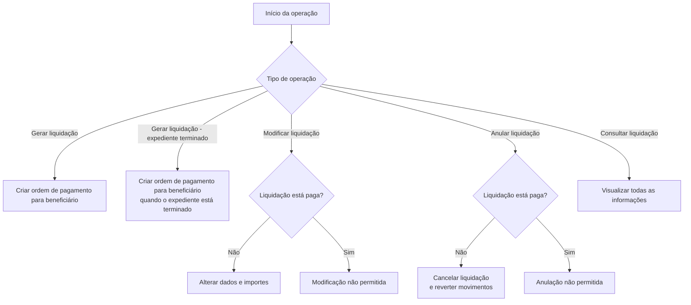

# Módulo de Liquidações de Sinistros — Documentação Funcional Reef

## 1. Metadados do Documento
- **Arquivo de Origem:** Não informado — conteúdo bruto extraído de documento Reef.
- **Tipo de Documento:** Manual funcional / documentação de módulo.
- **Domínio / Sistema:** Reef — módulo de Siniestros (Sinistros), Liquidações.
- **Público-Alvo:** Analistas funcionais, desenvolvedores, arquitetos, operação e áreas de negócio de sinistros.
- **Data/Versão Identificada:** Não identificada.
- **Status identificado no conteúdo:** Lifecycle: Approved Source.

---

## 2. Resumo Executivo & Contexto de Negócio

O módulo de Liquidações do sistema Reef suporta a ordenação de pagamentos e cobranças associados a pessoas físicas ou jurídicas que tenham participado de um expediente de sinistro. Cada ordem de pagamento ou cobrança é denominada **liquidação**. O módulo abrange beneficiários como fornecedores e prejudicados.

A liquidação de um expediente é detalhada por meio de conceitos econômicos denominados **conceitos de cobro y pago vario**. Esses conceitos permitem classificar o motivo econômico do pagamento ou cobrança, incluindo exemplos como mão de obra, indenização por novo valor, indenização por valor de reposição e despesas de peritos.

O comportamento do módulo é parametrizável. As validações e os comportamentos operacionais dependem de definições prévias, incluindo as definições do Taller de Productos. O módulo comporta criação, modificação, anulação e consulta de liquidações, com operações que podem ser executadas em linha ou de forma diferida.

Uma liquidação exige identificação do expediente, do beneficiário, da cobertura afetada, dos conceitos de reserva e de cobrança/pagamento, além de informações como moeda, previsão de pagamento e dados de fatura quando aplicável. O beneficiário precisa estar previamente registrado no sistema de Terceiros, com meios de contato e meios de recebimento ou pagamento.

---

## 3. Arquitetura, Componentes & Tecnologias Envolvidas

O conteúdo descreve uma arquitetura funcional organizada em níveis de definição e operações de liquidação:

- **Reef:** Sistema/documentação corporativa no qual o módulo está inserido.
- **Módulo de Siniestros:** Módulo de sinistros que contém o módulo de Liquidações.
- **Módulo de Liquidações:** Responsável por ordenar pagamentos e cobranças vinculados a expedientes.
- **Terceros:** Cadastro de beneficiários, contendo meios de contato e meios de cobrança/pagamento.
- **Taller de Productos:** Fonte de definições prévias que influencia o comportamento e as validações do módulo.
- **Expediente / Siniestro:** Registro de sinistro ao qual a liquidação é vinculada.
- **Cobertura:** Cobertura do expediente afetada pela liquidação.
- **Conceito de Reserva:** Classificação econômica vinculada a indenização, honorários ou despesas.
- **Conceito de Cobro Pago Vario:** Detalhamento econômico do pagamento ou da cobrança.
- **Definições Comuns, de Ramo e de Liquidação:** Níveis de parametrização utilizados para configurar o funcionamento das liquidações.



> **Nota de Análise:** O documento não detalha tecnologias de implementação, interfaces, métodos HTTP, contratos JSON, bancos de dados, filas, endpoints ou integrações técnicas entre sistemas.

---

## 4. Regras de Negócio, Especificações Funcionais & Processos

### 4.1 Finalidade da liquidação

A liquidação permite ordenar o pagamento ou a cobrança para pessoas físicas ou jurídicas que participaram de um expediente. Os destinatários podem incluir fornecedores e prejudicados.

Cada ordem de pagamento ou cobrança é denominada liquidação.

### 4.2 Conceitos de cobrança e pagamento

A liquidação de um expediente, seja cobrança ou pagamento a um beneficiário, é realizada por conceitos econômicos chamados conceitos de cobrança e pagamento variável.

Os conceitos de cobrança e pagamento variável detalham economicamente a liquidação. Os exemplos apresentados são:

- Mão de obra.
- Indenização por novo valor.
- Indenização por valor de reposição.
- Despesas de peritos.
- Outros conceitos não detalhados no documento.

### 4.3 Características funcionais

O módulo de Liquidações possui as seguintes características:

1. **Cobertura de funcionalidades de liquidação:** permite ordenar pagamento ou cobrança, modificar uma liquidação e anulá-la.
2. **Parametrização:** o comportamento e as validações dependem de definições prévias do Taller de Productos.
3. **Importes econômicos por cobertura:** cada liquidação contém importes econômicos armazenados no nível de cobertura.
4. **Detalhamento econômico:** o detalhe de pagamento ocorre por conceitos de cobrança e pagamento variável.
5. **Múltiplas moedas:** pagamentos podem ser realizados em moeda diferente da moeda da apólice ou da moeda do expediente.
6. **Registro obrigatório de beneficiário:** o beneficiário deve estar registrado no sistema de Terceiros.
7. **Múltiplas liquidações por expediente:** existe uma liquidação para cada beneficiário a pagar ou cobrar.

### 4.4 Elementos de uma liquidação

Uma liquidação é composta pelos seguintes elementos:

1. **Dados de identificação**
   - Identificação do sinistro ou expediente afetado.
   - Data estimada de pagamento.
   - Moeda de pagamento.
   - Dados da fatura, quando o pagamento for efetuado por fatura.
   - Outros dados de identificação não especificados.

2. **Beneficiário**
   - Pessoa física ou jurídica para quem será realizado pagamento ou cobrança.
   - Forma de pagamento ou cobrança, com exemplos de efetivo e transferência bancária.

3. **Atributos**
   - Informações adicionais da liquidação.
   - Elemento opcional.

4. **Cobertura**
   - Cobertura do expediente afetada pela liquidação.

5. **Conceito de reserva**
   - Detalha se o pagamento será realizado por indenização, honorários ou despesas.

6. **Conceito de cobrança e pagamento variável**
   - Detalha o pagamento.

### 4.5 Níveis de definição

As definições relacionadas a liquidações são organizadas nos níveis Comum, Ramo e Liquidação.

#### Nível Comum

O nível Comum contém definições não exclusivas do módulo de sinistros, mas necessárias para realizar a configuração das liquidações:

- Escritórios pagadores.
- Documentos de pagamento.
- Conceitos de cobrança e pagamento.
- Impostos.
- Numeração de ordens de pagamento.
- Controle técnico.

#### Nível Ramo

O nível Ramo contém definições que afetam todas as liquidações. O documento cita:

- Características gerais do módulo de sinistros.
- Causa de processo.

As características gerais podem determinar comportamentos do módulo de liquidações, como definir se as faturas de sinistros serão registradas.

A causa de processo permite categorizar o motivo pelo qual uma operação será realizada. Um exemplo informado é o motivo de anulação de uma liquidação.

#### Nível Liquidação

O nível Liquidação contém definições que afetam cada possível liquidação de um expediente:

- Atributo.
- Estrutura.
- Informação inicial.
- Validações de informação.
- Cobertura.
- Conceito de reserva.
- Conceito de cobrança e pagamento.
- Beneficiários de liquidação.
- Valor inicial.
- Valor máximo.
- Controle técnico.

### 4.6 Validações e restrições identificadas

- O beneficiário deve estar registrado no sistema de Terceiros antes da realização de uma liquidação.
- Uma liquidação pode ser modificada somente enquanto não estiver paga.
- Uma liquidação pode ser anulada somente enquanto não estiver paga.
- A anulação cancela a liquidação e reverte seus movimentos.
- As validações de informação core podem impor restrições conforme a parametrização.
- Exemplo de validação informado: se o documento for Real, o fornecedor da fatura não pode ser o tomador ou o segurado.
- O controle técnico pode definir condições para paralisar operações de liquidação ou exigir autorização.
- O valor máximo define o maior importe permitido para liquidar uma cobertura, conceito de reserva ou conceito de cobrança e pagamento variável.

### 4.7 Operações de liquidação



---

## 5. Tabelas de Parâmetros, Ambientes e Estruturas de Dados

### 5.1 Estrutura funcional da liquidação

| Item / Parâmetro | Descrição / Função | Tipo / Valores / Formato | Ambiente / Observações |
| :--- | :--- | :--- | :--- |
| Liquidação | Ordem de pagamento ou cobrança destinada a pessoa física ou jurídica vinculada ao expediente. | Ordem de pagamento ou cobrança. | Módulo de Liquidações. |
| Expediente / Siniestro | Sinistro ou expediente afetado pela liquidação. | Identificação obrigatória da liquidação. | Módulo de Siniestros. |
| Beneficiário | Pessoa física ou jurídica para quem será realizado pagamento ou cobrança. | Registro de Terceiros. | Deve estar previamente registrado. |
| Meios de contato | Dados de contato do beneficiário. | Não detalhado. | Mantidos no sistema de Terceiros. |
| Meios de cobrança/pagamento | Forma de receber ou pagar ao beneficiário. | Exemplos: efetivo; transferência bancária. | Mantidos no sistema de Terceiros. |
| Data estimada de pagamento | Data prevista para execução do pagamento. | Data. | Dado de identificação da liquidação. |
| Moeda de pagamento | Moeda utilizada no pagamento. | Pode ser diferente da moeda da apólice ou do expediente. | Suporta múltiplas moedas. |
| Dados da fatura | Dados associados a uma fatura, quando aplicável. | Não detalhado. | Aplicável quando o pagamento é realizado por fatura. |
| Atributos | Informação adicional da liquidação. | Opcional. | Pode incluir dados de finiquito. |
| Cobertura | Cobertura do expediente afetada pela liquidação. | Cobertura definida no produto. | Configurada por tipo de expediente e comportamento em liquidações. |
| Conceito de Reserva | Detalhamento econômico da natureza da reserva. | Exemplos: indenização, honorários, despesas. | Associado ao expediente e às liquidações. |
| Conceito de Cobro Pago Vario | Detalhamento econômico do pagamento ou cobrança. | Exemplos: mão de obra, indenizações, despesas de peritos. | Usado para detalhar o pagamento. |

### 5.2 Definições do nível Comum

| Item / Parâmetro | Descrição / Função | Tipo / Valores / Formato | Ambiente / Observações |
| :--- | :--- | :--- | :--- |
| Oficinas Pagadoras | Registro de escritórios que podem realizar pagamentos. | Registro de escritórios. | Nível Comum. |
| Documentos de Pago | Registro de documentos que podem ser pagos ou cobrados. | Exemplos: fatura; nota de crédito. | Nível Comum. |
| Conceptos Cobro y Pago | Define o detalhamento econômico das ordens de pagamento para discriminar a despesa. | Conceitos econômicos. | Nível Comum. |
| Impuesto | Define tipos de obrigações tributárias, características e formas de cálculo. | Configuração tributária. | Nível Comum. |
| Numeración Ordenes Pago | Define o conjunto de ordens de pagamento. | Numeração de ordens. | Nível Comum. |
| Control Técnico | Define erros e tipos de erros. | Configuração de controle. | Nível Comum. |

### 5.3 Definições do nível Ramo

| Item / Parâmetro | Descrição / Função | Tipo / Valores / Formato | Ambiente / Observações |
| :--- | :--- | :--- | :--- |
| Características Generales | Determina comportamentos do módulo de sinistros e de liquidações. | Configuração funcional. | Exemplo: definir se faturas de sinistros serão registradas. |
| Causa Proceso | Cataloga os motivos para execução de uma operação. | Motivo de operação. | Exemplo: motivo de anulação de liquidação. |

### 5.4 Definições do nível Liquidação

| Item / Parâmetro | Descrição / Função | Tipo / Valores / Formato | Ambiente / Observações |
| :--- | :--- | :--- | :--- |
| Atributo | Define informações adicionais da liquidação. | Dados adicionais. | Exemplo: dados de finiquito. |
| Estructura | Organiza informações adicionais compostas por atributos. | Atributos, obrigatoriedade e ordem de solicitação. | Nível Liquidação. |
| Información Inicial | Registra informações prévias de atributos de operações. | Valor inicial de atributo. | Exemplo: atribuir à moeda da fatura o valor inicial da moeda do país. |
| Validaciones Información | Define comportamentos e validações das informações core solicitadas nas operações. | Regras de validação. | Exemplo: documento Real impede fornecedor da fatura de ser tomador ou segurado. |
| Cobertura | Define quais coberturas de produto serão afetadas por tipos de expediente e o comportamento nas liquidações. | Configuração de cobertura. | Nível Liquidação. |
| Concepto Reserva | Determina o detalhamento econômico do expediente para liquidações. | Conceito econômico. | Nível Liquidação. |
| Concepto Cobro Pago | Determina o detalhamento econômico das liquidações. | Conceito econômico. | Nível Liquidação. |
| Beneficiarios Liquidación | Determina pessoas físicas e jurídicas às quais é possível pagar ou cobrar uma liquidação. | Perfis de beneficiários. | Nível Liquidação. |
| Valor Inicial | Define o importe de início para liquidar conceito de reserva e conceito de cobrança/pagamento variável. | Importe. | Nível Liquidação. |
| Valor Máximo | Define o importe máximo liquidável por cobertura, conceito de reserva e conceito de cobrança/pagamento variável. | Importe máximo. | Nível Liquidação. |
| Control Técnico | Define condições para paralisar operações ou obrigar autorização. | Condições e autorizações. | Nível Liquidação. |

### 5.5 Operações disponíveis

| Operação | Descrição / Função | Condições / Restrições | Modalidade |
| :--- | :--- | :--- | :--- |
| Gerar liquidação | Cria uma ordem de pagamento para um beneficiário. | Beneficiário deve estar registrado em Terceiros. | Em linha ou diferido. |
| Gerar liquidação — Expediente Terminado | Cria uma ordem de pagamento para um beneficiário quando o expediente está terminado. | Expediente terminado. | Em linha ou diferido. |
| Modificar liquidação | Altera informações e importes de uma liquidação. | Permitida somente se a liquidação não estiver paga. | Em linha ou diferido. |
| Anular liquidação | Cancela a liquidação e reverte seus movimentos. | Permitida somente se a liquidação não estiver paga. | Em linha ou diferido. |
| Consultar liquidação | Visualiza todas as informações da liquidação. | Não detalhado. | Em linha ou diferido. |

---

## 6. Bateria de Perguntas & Respostas para RAG (FAQ Sintético)

### P1: Qual é a finalidade do módulo de Liquidações do Reef?
**R:** O módulo de Liquidações permite ordenar pagamentos ou cobranças para pessoas físicas ou jurídicas que tenham participado de um expediente de sinistro, como fornecedores e prejudicados. Cada ordem de pagamento ou cobrança é denominada liquidação.

### P2: O que são os conceitos de cobro y pago vario em uma liquidação?
**R:** Os conceitos de cobro y pago vario são conceitos econômicos usados para detalhar o pagamento ou a cobrança de uma liquidação. O documento apresenta como exemplos mão de obra, indenização por novo valor, indenização por valor de reposição e despesas de peritos.

### P3: É possível realizar pagamento em moeda diferente da moeda da apólice?
**R:** Sim. O módulo permite que pagamentos sejam realizados em moedas diferentes da moeda da apólice ou da moeda do expediente.

### P4: Quais informações devem identificar uma liquidação?
**R:** A liquidação deve identificar o sinistro ou expediente afetado, a data estimada de pagamento, a moeda de pagamento e, quando o pagamento for realizado por fatura, os dados da fatura. O documento também indica a existência de outros dados de identificação não especificados.

### P5: O beneficiário precisa estar cadastrado antes de criar uma liquidação?
**R:** Sim. Para realizar uma liquidação, o beneficiário deve estar registrado no sistema de Terceiros, incluindo seus meios de contato e seus meios de cobrança ou pagamento.

### P6: Uma liquidação pode ser alterada depois de paga?
**R:** Não. A operação de modificação permite alterar dados e importes somente quando a liquidação ainda não tiver sido paga.

### P7: O que ocorre quando uma liquidação é anulada?
**R:** A anulação cancela a liquidação e reverte seus movimentos. A anulação somente pode ser realizada se a liquidação não estiver paga.

### P8: Quais são os níveis de definição utilizados para configurar liquidações?
**R:** O documento define três níveis: Comum, Ramo e Liquidação. O nível Comum contém configurações compartilhadas necessárias à operação; o nível Ramo contém definições que afetam todas as liquidações; e o nível Liquidação contém definições aplicáveis às possíveis liquidações de um expediente.

### P9: Qual validação é apresentada para documentos classificados como Real?
**R:** O documento apresenta como exemplo que, se o documento for Real, o fornecedor da fatura não pode ser o tomador nem o segurado.

### P10: O que configura o Valor Máximo em uma liquidação?
**R:** O Valor Máximo determina o importe máximo pelo qual pode ser liquidada uma cobertura, um conceito de reserva ou um conceito de cobrança e pagamento variável.

### P11: Qual é a finalidade do controle técnico no módulo de Liquidações?
**R:** O controle técnico define condições nas quais as operações de liquidação podem ser paralisadas ou obrigadas a passar por autorização. No nível Comum, o controle técnico também define erros e tipos de erros.

### P12: Quais operações estão disponíveis para liquidações de expediente?
**R:** As operações disponíveis são gerar liquidação, gerar liquidação para expediente terminado, modificar liquidação, anular liquidação e consultar liquidação. O documento informa que essas operações podem ser realizadas em linha ou de forma diferida.

---

## 7. Glossário de Termos, Siglas & Conceitos-Chave

- **Reef:** Sistema ou domínio documental mencionado como contexto do módulo de Liquidações.
- **Siniestro:** Sinistro; expediente relacionado a um evento de sinistro.
- **Expediente:** Registro de sinistro afetado por uma liquidação.
- **Liquidação:** Ordem de pagamento ou cobrança para um beneficiário.
- **Beneficiário:** Pessoa física ou jurídica para quem é realizado pagamento ou cobrança.
- **Terceros:** Sistema ou cadastro no qual os beneficiários precisam estar registrados.
- **Cobertura:** Cobertura do expediente afetada pela liquidação.
- **Conceito de Reserva:** Detalhamento econômico relacionado a indenização, honorários ou despesas.
- **Concepto de Cobro Pago Vario:** Conceito econômico que detalha pagamentos ou cobranças.
- **Taller de Productos:** Fonte de definições prévias que determina comportamentos e validações do módulo.
- **Oficinas Pagadoras:** Escritórios registrados que podem realizar pagamentos.
- **Documentos de Pago:** Documentos que podem ser pagos ou cobrados, como fatura e nota de crédito.
- **Causa Proceso:** Configuração que categoriza o motivo de uma operação.
- **Control Técnico:** Configuração de erros, condições de paralisação e exigência de autorização.
- **Finiquito:** Dado adicional de liquidação citado como exemplo de atributo.

---

## 8. Notas Críticas, Riscos & Limitações

- O documento informa que o comportamento e as validações do módulo dependem de definições prévias do Taller de Productos. Portanto, a operação efetiva de uma liquidação depende da parametrização existente.
- O beneficiário deve ser previamente registrado em Terceiros; ausência de cadastro pode impedir a realização de pagamentos ou cobranças.
- Modificação e anulação não são permitidas para liquidações pagas.
- O controle técnico pode interromper operações ou exigir autorização, mas o documento não especifica critérios, responsáveis, fluxos de aprovação ou mensagens de erro.
- O documento não detalha tecnologias, integrações, interfaces, APIs, campos completos de dados, persistência, perfis de acesso ou trilhas de auditoria.
- O documento não informa valores de configuração, fórmulas de cálculo tributário, limites monetários, códigos de moedas, estados de liquidação ou critérios completos para seleção de coberturas.
- **Nota de Análise:** O documento descreve operações em linha e diferidas, mas não detalha o mecanismo técnico de processamento diferido.

---

## 9. Conteúdo Bruto Estruturado (Referência Fiel)

```text
--- [PÁGINA 1 DE 4] ---

INTRODUCCIÓN - Módulo Liquidaciones
OBJETIVO
La finalidad de este módulo es poder ordenar el pago/cobro a personas físicas o jurídicas que hayan intervenido en el expediente, tanto
proveedores, como perjudicados. Cada una de esas órdenes son llamadas liquidaciones.
Concepto
Concepto de Cobro-Pago
Características
Elementos de una liquidación
Definiciones de una Liquidación
Operaciones de Liquidación
Conceptos
Conceptos de Cobro Pago Vario del módulo de Siniestros
La liquidación de un expediente (cobro o pago a un beneficiario), se realiza a través de unos conceptos económicos que se denominan
conceptos de cobro y pago vario. Estos conceptos posibilitan detallar el pago. Por ejemplo si se va a pagar a un taller:
Mano de Obra
Indemnización por el nuevo valor
Indemnización por el valor de reposición
Gastos peritos
Etc.
Características
Cubre todas las funcionalidades de las liquidaciones
Este módulo, contiene todas las funcionalidades necesarias para ordenar el pago o el cobro a una persona física o jurídica, modificarlo,
anularlo...
Parametrizable
Documentation / DOCUMENTACIÓN Reef
DOCUMENTACIÓN Reef
Mapfredocument
DOCUMENTACIÓN Reef
Owner
user:agonzalez_mapfre.com
Lifecycle
Approved Source
 /
VL
Buscar Inicio Soluciones Arquitecturas APIs Componentes Cloud Documentación Zeus Reef Ayuda
ES

--- [PÁGINA 2 DE 4] ---

El módulo es parametrizable y el comportamiento y las validaciones depende de las definiciones previas (Taller de Productos).
Importe económico
Cada liquidación contiene los importes económicos almacenados a nivel de cobertura. El detalle del pago se realiza a través de los
conceptos de cobro pago vario
Múltiples monedas
Los pagos pueden realizarse en monedas distintas a la de la póliza o a la de los expedientes
Registro de Beneficiario
Para realizar una liquidación el beneficiario tiene que estar registrado en el sistema (Terceros), con sus medios de contacto, sus medios
de cobro / pago, para poder realizar pagos y para poder contactar con ellos.
Una o varias liquidaciones por expediente
Existirán tantas liquidaciones como beneficiarios haya que pagar o cobrar.
Elementos de un Liquidación
Un liquidación está compuesta de varios elementos:
LIQUIDACIÓN
IDENTIFICACIÓN BENEFICIARIO ATRIBUTOS COBERTURA CONCEPTOS DE
RESERVA
CONCEPTO DE
COBRO PAGO
Datos Identificación
Se tiene que identificar:
Siniestro/expediente al que va afectar la liquidación
Fechas estimada de pago
Moneda de pago
Datos de la factura (si es que el pago se realiza por una factura)
Etc.
Beneficiario
Se debe identificar la persona (física o jurídica) a la cual se le va a pagar o cobrar.
El modo en el que se va a pagar o cobrar:
Efectivo
Transferencia Bancaria
Etc.
Atributos
Este elemento contiene información adicional de la liquidación, es opcional.
Cobertura
La cobertura del expediente a la que está afectando la liquidación.
Concepto de Reserva
Detalle de si se va a pagar por indemnización, honorarios o gastos.
Concepto de Cobro Pago Vario

--- [PÁGINA 3 DE 4] ---

Detalle del pago.
Definiciones Liquidación
Los elementos de definición atienden a distintos niveles:
NIVELES DE DEFINICIÓN
COMÚN RAMO LIQUIDACIÓN
COMÚN
En este nivel se encuentran definiciones que NO son exclusivas del módulo de siniestros, pero son
necesarias para poder realizar la definición. Entre otras definiciones se encuentra:
OFICINAS PAGADORAS
Registro de Oficinas que pueden realizar
pagos
DOCUMENTOS DE PAGO
Registro de Documentos que se pueden
pagar o cobrar. Factura, Nota de Crédito..
CONCEPTOS COBRO Y PAGO
Definición del desglose económico que
llevarán las órdenes de pago para detallar
el gasto
IMPUESTO
Definición de los tipos de obligaciones
tributarias que se deben tener en cuenta,
así como sus características y formas de
cálculo
NUMERACIÓN ORDENES PAGO
Definición del saco de órdenes de pago
CONTROL TÉCNICO
Definición de errores, tipos de Errores
RAMO
En este nivel se encuentran definiciones que afectarán a todos las liquidaciones. Entre otros se define:
[CARACTERÍSTICAS GENERALES]
Características Generales del módulo de
siniestros, determina comportamientos del
módulo liquidaciones por ejemplo si se va van
a registrar las facturas de siniestros...
CAUSA PROCESO
Permite catalogar los motivos por los que
se quiere realizar una operación. Ejemplo
Motivo para la Anulación de una
liquidación
LIQUIDACIÓN
Definiciones que afectan a cada uno de las posibles liquidaciones de un expediente
Ejemplo:

--- [PÁGINA 4 DE 4] ---

ATRIBUTO
Permite definir la información adicional de
la liquidación, como datos de finiquito
ESTRUCTURA
Información adicional de la liquidación
compuesta por atributos, obligatoriedad o
no de pedir información, orden en el que
se va a pedir
INFORMACIÓN INICIAL
Registrar información previa para los
atributos de las operaciones de
liquidaciones, para no tener que
introducirla posteriormente. Un ejemplo
sería dar a la moneda de la factura
inicialmente el valor de la moneda del país
VALIDACIONES INFORMACIÓN
Definir comportamientos y validaciones de
la información core que se piden en las
operaciones de liquidaciones. Ejemplo si
el documento es Real el Proveedor de la
factura no puede ser el tomador, o el
asegurado
COBERTURA
Definir de todas las coberturas definidas
en el producto, cual va a ser afectada por
cada uno de los tipos de expedientes y su
comportamiento en las liquidaciones
CONCEPTO RESERVA
Determinar el desglose económico del
expediente para las liquidaciones
CONCEPTO COBRO PAGO
Determina el desglose económico de las
liquidaciones
BENEFICIARIOS LIQUIDACIÓN
Determina las personas físicas y Jurídicas
a las que se les puede pagar o cobrar una
liquidación
VALOR INICIAL
Definición del importe con el que se va a
liquidar el concepto de reserva y el
concepto de cobro y pago vario
VALOR MÁXIMO
Determinar el importe Máximo por el que
se puede liquidar una cobertura concepto
de reserva, concepto de cobro y pago
vario
CONTROL TÉCNICO
Definir en qué condiciones se puede
paralizar las operaciones de liquidación u
obligación de ser autorizada
Operaciones Liquidaciones
LIQUIDACIÓN
Operaciones de liquidaciones de un expediente, se pueden realizar tanto en línea como diferido
GENERAR liquidación
Permite crear una orden de pago para un
beneficiario
GENERAR liquidación Expediente
Terminado
Permite crear una orden de pago para un
beneficiario,cuando el expediente está
terminado
MODIFICAR liquidación
Permite cambiar la información de una
liquidación, tanto datos, como importes
siempre que no esté pagada
ANULAR liquidación
Cancela una liquidación, revierte sus
movimientos siempre y cuando no esté
pagada
CONSULTAR liquidación
Visualiza toda la información de una
liquidación
```
