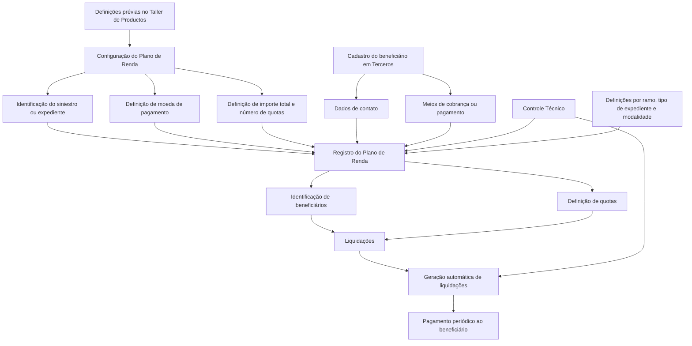
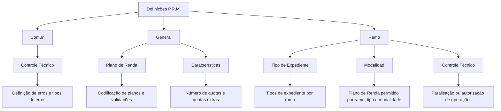

# Plano de Renda (P.R.M.) — Funcionalidades, Definições e Operações

## 1. Metadados do Documento
- **Arquivo de Origem:** Não identificado no conteúdo fornecido
- **Tipo de Documento:** Apresentação Executiva / Manual Funcional
- **Domínio / Sistema:** Reef — módulo Plano de Renda (P.R.M.)
- **Público-Alvo:** Negócio, analistas funcionais, desenvolvedores, arquitetos e operação
- **Data/Versão Identificada:** Não identificada

---

## 2. Resumo Executivo & Contexto de Negócio

O documento descreve o módulo **Plano de Renda**, identificado pelas siglas **P.R.M.** e **PRM**, no contexto da documentação Reef. A finalidade do módulo é atender à necessidade de pagar periodicamente um valor a uma pessoa segurada ou a um ou mais beneficiários, especialmente em situações relacionadas a invalidez permanente, invalidez temporária, acidente laboral ou outras coberturas contratadas.

O Plano de Renda automatiza a ordenação de pagamentos para pessoas físicas ou jurídicas. A operação depende da existência de definições prévias no **Taller de Productos**, indicando que o comportamento do módulo é parametrizável e condicionado à configuração de produtos e regras aplicáveis.

A estrutura funcional do Plano de Renda inclui a identificação do plano, o cadastro de beneficiários, a definição de quotas e a geração de liquidações. Para viabilizar pagamentos e contatos, os beneficiários precisam estar previamente registrados no sistema de **Terceros**, incluindo meios de contato e meios de recebimento/pagamento.

O documento estabelece que um plano pode possuir diferentes modalidades de quotas, incluindo quota inicial, quota periódica e quota extra. Também informa que podem existir tantas liquidações quanto beneficiários e quotas a pagar, e que as liquidações podem ser geradas automaticamente em periodicidades como mensal ou anual.

As definições do Plano de Renda estão distribuídas em três níveis: **Común**, **General** e **Ramo**. O módulo também oferece operações explícitas para criar, anular, terminar, terminar sem anular e consultar um Plano de Renda.

---

## 3. Arquitetura, Componentes & Tecnologias Envolvidas

### Componentes e conceitos identificados

| Componente / Conceito | Papel no Plano de Renda |
| :--- | :--- |
| Reef | Contexto de documentação no qual o módulo Plano de Renda é apresentado. |
| Plano de Renda | Módulo que permite ordenar pagamentos periódicos a segurados ou beneficiários. |
| P.R.M. / PRM | Sigla utilizada no documento para Plano de Renda. |
| Taller de Productos | Fonte de definições prévias que parametrizam o comportamento do módulo. |
| Terceros | Sistema no qual o beneficiário deve estar registrado com dados de contato e meios de cobrança/pagamento. |
| Expediente / Siniestro | Registro associado ao Plano de Renda e afetado por suas operações. |
| Beneficiário | Pessoa física ou jurídica que recebe pagamentos do Plano de Renda. |
| Quota | Valor a ser pago ao beneficiário até recuperação ou morte, conforme o contexto da cobertura. |
| Liquidação | Entidade gerada automaticamente para concretizar os pagamentos do Plano de Renda. |
| Controle Técnico | Conjunto de definições de erros, tipos de erros e condições para paralisar ou exigir autorização de operações. |
| Ramo | Nível de definição que aplica regras para tipos de expediente de um ramo. |
| Modalidad | Associação entre ramo, tipo de expediente, modalidade e o tipo de Plano de Renda permitido. |

### Fluxo funcional reconstruído



### Níveis de definição do P.R.M.



> **Nota de Análise:** O documento apresenta a arquitetura funcional e os elementos de configuração do Plano de Renda, mas não detalha tecnologias de implementação, interfaces, métodos HTTP, contratos JSON, bases de dados, URLs, servidores, portas ou integrações técnicas.

---

## 4. Regras de Negócio, Especificações Funcionais & Processos

### Finalidade do módulo

O módulo Plano de Renda cobre a necessidade de realizar pagamentos periódicos a uma pessoa segurada ou a um ou mais beneficiários, em cenários como invalidez permanente, invalidez temporária, acidente laboral ou outras coberturas contratadas.

O módulo contém as funcionalidades necessárias para ordenar automaticamente o pagamento a uma pessoa física ou jurídica quando existir uma cobertura de invalidez, acidente laboral ou situação equivalente descrita no produto contratado.

### Parametrização

O Plano de Renda é parametrizável. O comportamento do módulo depende de definições prévias realizadas no **Taller de Productos**.

As definições P.R.M. são organizadas nos níveis Común, General e Ramo:

1. **Común**
   - Abrange definições não exclusivas do módulo de siniestros.
   - Inclui definições necessárias para viabilizar a configuração.
   - Inclui Controle Técnico, definição de erros e tipos de erros.

2. **General**
   - Abrange definições aplicáveis a todos os possíveis expedientes que possuem Plano de Renda.
   - Inclui a codificação dos possíveis planos e suas validações.
   - Inclui características do plano, como número de quotas e existência de quotas extras.

3. **Ramo**
   - Abrange definições aplicáveis aos tipos de expediente de um ramo.
   - Define quais tipos de expediente por ramo podem trabalhar com Planos de Renda.
   - Permite associar, por ramo, tipo de expediente e modalidade, o tipo de Plano de Renda que pode ser associado.
   - Define condições em que as operações de Plano de Renda podem ser paralisadas ou exigem autorização.

### Identificação do Plano de Renda

Para identificar um Plano de Renda, o documento estabelece os seguintes elementos:

- Siniestro ou expediente afetado pelo Plano de Renda.
- Datas estimadas de pagamento.
- Moeda de pagamento.
- Importe total do Plano.
- Número de quotas.
- Outros dados não especificados no material.

### Beneficiários

O Plano de Renda deve identificar uma ou mais pessoas físicas e/ou jurídicas para as quais serão realizados os pagamentos.

Para realizar liquidações, o beneficiário deve estar cadastrado no sistema **Terceros** com:

- Meios de contato.
- Meios de cobrança ou pagamento.
- Dados necessários para realizar pagamentos.
- Dados necessários para contatar o beneficiário.

Os meios de pagamento apresentados incluem:

- Efectivo.
- Transferencia Bancaria.
- Outros meios não detalhados.

### Quotas

A quota é o valor que deve ser pago periodicamente à pessoa segurada ou aos seus beneficiários até:

- A recuperação, no caso de invalidez temporária.
- A morte.

O documento apresenta os seguintes tipos de quota:

1. **Quota inicial:** paga como a primeira quota do plano.
2. **Quota periódica (normal):** paga no período estabelecido.
3. **Quota extra:** paga adicionalmente às quotas periódicas, como em Natal ou férias.

### Liquidações

As liquidações são geradas automaticamente em periodicidades como:

- Mensalmente.
- Anualmente.
- Outras periodicidades indicadas pela expressão “etc.”, sem detalhamento adicional.

Existem tantas liquidações quanto beneficiários e quotas que precisam ser pagas.

### Operações P.R.M.

| Operação | Regra funcional descrita |
| :--- | :--- |
| Criar Plano de Renda | Permite registrar o Plano de Renda no expediente. |
| Anular Plano de Renda | Permite cancelar um Plano de Renda. |
| Terminar Plano de Renda | Permite finalizar o Plano de Renda quando não houver mais quotas. |
| Terminar Plano de Renda sem anular | Permite finalizar o Plano de Renda sem cancelá-lo. |
| Consultar Plano de Renda | Exibe toda a informação do P.R.M. |

---

## 5. Tabelas de Parâmetros, Ambientes e Estruturas de Dados

| Item / Parâmetro | Descrição / Função | Tipo / Valores / Formato | Ambiente / Observações |
| :--- | :--- | :--- | :--- |
| Siniestro / Expediente | Registro afetado pelo Plano de Renda. | Identificação de expediente. | Obrigatório para identificar o Plano de Renda, segundo o documento. |
| Datas estimadas de pagamento | Datas previstas para pagamento das quotas. | Datas. | O formato não é detalhado. |
| Moeda de pagamento | Define a moeda utilizada nos pagamentos. | Moeda. | Os pagamentos podem ser realizados em moedas diferentes da moeda da apólice ou dos expedientes. |
| Importe total do Plano | Valor total associado ao Plano de Renda. | Valor monetário. | Precisão, moeda de armazenamento e regras de cálculo não são detalhadas. |
| Número de quotas | Quantidade de pagamentos do Plano de Renda. | Número. | Configurável nas características do plano. |
| Beneficiário | Pessoa que recebe o pagamento. | Pessoa física e/ou jurídica. | Deve estar registrada em Terceros. |
| Meios de contato | Dados para contatar o beneficiário. | Não detalhado. | Mantidos no cadastro de Terceros. |
| Meios de cobrança / pagamento | Dados necessários para realizar o pagamento. | Efectivo, Transferencia Bancaria, etc. | Mantidos no cadastro de Terceros. |
| Quota inicial | Primeiro pagamento do plano. | Valor monetário. | Paga como a primeira quota do Plano de Renda. |
| Quota periódica | Pagamento regular realizado no período estabelecido. | Valor monetário. | Periodicidade não é limitada no documento. |
| Quota extra | Pagamento adicional às quotas periódicas. | Valor monetário. | Exemplos apresentados: Natal e férias. |
| Liquidação | Registro gerado para processar pagamento. | Uma ou mais liquidações. | Quantidade depende dos beneficiários e quotas a pagar. |
| Periodicidade de liquidação | Frequência de geração automática de liquidações. | Mensal, anual, etc. | O documento não apresenta uma lista exaustiva. |
| Codificação de planos | Identificação dos possíveis Planos de Renda. | Não detalhado. | Definida no nível General. |
| Validações do plano | Validações aplicáveis aos possíveis Planos de Renda. | Não detalhado. | Definidas no nível General. |
| Características do plano | Propriedades configuráveis do Plano de Renda. | Número de quotas, quotas extras, etc. | Definidas no nível General. |
| Tipo de expediente | Define quais expedientes por ramo podem usar Planos de Renda. | Tipo de expediente. | Definido no nível Ramo. |
| Modalidad | Associa ramo, tipo de expediente, modalidade e tipo de Plano de Renda. | Modalidade. | Definida no nível Ramo. |
| Controle Técnico — Común | Define erros e tipos de erros. | Definições de controle. | Não exclusivo do módulo de siniestros. |
| Controle Técnico — Ramo | Define condições de paralisação ou necessidade de autorização. | Condições de controle. | Aplicável às operações do Plano de Renda. |

> **Nota de Análise:** O documento não fornece URLs de ambientes, nomes de servidores, caminhos de logs, variáveis de configuração, contratos de dados, formatos de arquivo ou detalhes de persistência.

---

## 6. Bateria de Perguntas & Respostas para RAG (FAQ Sintético)

### P1: Qual é a finalidade do módulo Plano de Renda (P.R.M.)?
**R:** O módulo Plano de Renda atende à necessidade de pagar periodicamente um importe a uma pessoa segurada ou a um ou mais beneficiários. O contexto apresentado inclui situações de invalidez permanente, invalidez temporária, acidente laboral e outras coberturas contratadas.

### P2: Quem pode receber pagamentos de um Plano de Renda?
**R:** Os pagamentos podem ser destinados a pessoas físicas ou jurídicas. O documento também menciona pessoas seguradas e seus beneficiários como destinatários das quotas.

### P3: Quais dados precisam ser identificados para criar um Plano de Renda?
**R:** O Plano de Renda deve identificar o siniestro ou expediente afetado, as datas estimadas de pagamento, a moeda de pagamento, o importe total do plano, o número de quotas e outros dados não especificados no documento.

### P4: Onde o beneficiário deve estar registrado para que sejam realizadas as liquidações?
**R:** O beneficiário deve estar cadastrado no sistema Terceros, com meios de contato e meios de cobrança ou pagamento. Esses dados permitem realizar pagamentos e contatar o beneficiário.

### P5: Quais são os tipos de quota previstos para o Plano de Renda?
**R:** O documento prevê quota inicial, quota periódica normal e quota extra. A quota inicial é a primeira paga no plano; a quota periódica é paga no período estabelecido; e a quota extra é paga além das quotas periódicas, com exemplos como Natal e férias.

### P6: Quando o pagamento de quotas termina em um cenário de invalidez temporária?
**R:** Em caso de invalidez temporária, as quotas devem ser pagas até a recuperação da pessoa segurada ou do beneficiário, conforme a formulação apresentada no documento.

### P7: Quantas liquidações podem existir para um Plano de Renda?
**R:** Existem tantas liquidações quanto beneficiários e quotas precisem ser pagos. Portanto, a quantidade de liquidações depende da combinação entre beneficiários cadastrados e quotas definidas para o Plano de Renda.

### P8: Como são geradas as liquidações do Plano de Renda?
**R:** As liquidações são geradas automaticamente. O documento cita gerações mensais e anuais, além de indicar que podem existir outras periodicidades não detalhadas.

### P9: O Plano de Renda pode usar moeda diferente da moeda da apólice?
**R:** Sim. O documento informa que os pagamentos podem ser realizados em moedas diferentes da moeda da apólice ou da moeda dos expedientes.

### P10: Quais são os níveis de definição das regras P.R.M.?
**R:** As definições P.R.M. estão organizadas em três níveis: Común, General e Ramo. O nível Común inclui, entre outros elementos, definições de Controle Técnico; o nível General inclui planos, validações e características; e o nível Ramo inclui tipo de expediente, modalidade e Controle Técnico aplicável ao ramo.

### P11: O que é definido no nível General do P.R.M.?
**R:** O nível General contém definições aplicáveis a todos os possíveis expedientes que possuem Plano de Renda. Esse nível define a codificação dos possíveis planos e suas validações, além das características do Plano de Renda, como número de quotas e existência de quotas extras.

### P12: Qual é a função do nível Ramo nas definições do Plano de Renda?
**R:** O nível Ramo define quais tipos de expediente por ramo podem trabalhar com Planos de Renda. Também permite associar ramo, tipo de expediente e modalidade ao tipo de Plano de Renda que pode ser associado, além de definir condições de paralisação ou necessidade de autorização para operações.

### P13: Quais operações podem ser realizadas sobre um Plano de Renda?
**R:** As operações são criar, anular, terminar, terminar sem anular e consultar. Criar registra o plano no expediente; anular cancela o plano; terminar finaliza o plano quando não haverá mais quotas; terminar sem anular finaliza sem cancelamento; e consultar mostra toda a informação do P.R.M.

---

## 7. Glossário de Termos, Siglas & Conceitos-Chave

- **P.R.M. / PRM:** Sigla utilizada no documento para Plano de Renda.
- **Plano de Renda:** Módulo que ordena pagamentos periódicos a segurados ou beneficiários.
- **Quota:** Importe a ser pago ao beneficiário; pode ser inicial, periódica ou extra.
- **Quota inicial:** Primeira quota paga no Plano de Renda.
- **Quota periódica:** Quota normal paga no período estabelecido.
- **Quota extra:** Quota paga adicionalmente às quotas periódicas.
- **Liquidação:** Registro gerado automaticamente para suportar o pagamento de quotas.
- **Beneficiário:** Pessoa física ou jurídica que recebe pagamentos do Plano de Renda.
- **Terceros:** Sistema em que o beneficiário deve estar cadastrado com dados de contato e meios de cobrança/pagamento.
- **Siniestro:** Evento ou expediente ao qual o Plano de Renda afeta.
- **Expediente:** Registro de processo ou caso associado ao Plano de Renda.
- **Ramo:** Nível de definição que agrupa regras aplicáveis a tipos de expediente de um ramo.
- **Modalidad:** Elemento que permite associar ramo, tipo de expediente e modalidade a um tipo de Plano de Renda.
- **Control Técnico:** Definições de erros, tipos de erro e condições que podem paralisar operações ou exigir autorização.
- **Taller de Productos:** Origem das definições prévias que parametrizam o comportamento do módulo.
- **Reef:** Contexto de documentação no qual o módulo Plano de Renda é apresentado.

---

## 8. Notas Críticas, Riscos & Limitações

- O documento não identifica arquivo de origem, data, versão, autor técnico, responsáveis pelo módulo ou ciclo de vida detalhado.
- O documento não detalha tecnologias, linguagens de programação, APIs, endpoints, métodos HTTP, contratos JSON, bancos de dados, filas, servidores, ambientes, URLs, portas ou rotas de logs.
- A expressão “etc.” aparece em diversos pontos, incluindo dados de identificação, meios de pagamento e periodicidades de liquidação. Esses itens não devem ser interpretados como uma lista de capacidades confirmadas além das explicitamente apresentadas.
- O comportamento do módulo depende de definições prévias no Taller de Productos, mas o documento não descreve o processo de configuração, responsáveis, controles de acesso ou sequência de publicação dessas definições.
- O documento informa que o beneficiário deve existir em Terceros, mas não descreve validações cadastrais, sincronização de dados, tratamento de beneficiários inativos ou regras de duplicidade.
- Não são apresentadas regras de cálculo para importe total, distribuição de valores entre múltiplos beneficiários, arredondamento, impostos, reajustes, juros, retroativos ou tratamento de moedas.
- Não são detalhadas as condições exatas de término, anulação, autorização ou paralisação de operações; apenas é informado que essas condições podem ser definidas no Controle Técnico do nível Ramo.

---

## 9. Conteúdo Bruto Estruturado (Referência Fiel)

```text
--- [PÁGINA 1 DE 3] ---

INTRODUCCIÓN - Plan de Renta
OBJETIVO
La finalidad de este módulo es cubrir las necesidades de pagar un importe periódicamente a un asegurado o beneficiario/s, por una invalidez
permanente o temporal.
Concepto
Cuota
Características
Elementos del Plan de Renta
Definiciones P.R.M.
Operaciones P.R.M.
Conceptos
Cuota
Es el importe que hay que pagar al beneficiario hasta su recuperación o muerte.
Existen la posibilidad de tener diferentes cuotas:
- Cuota inicial - Se paga la primera del plan - Cuota periódica (normal)- Se paga en el periodo establecido
- Cuota extra - cuotas que se pagan además de las periódica, por ejemplo en navidad, en vacaciones....
Características
Cubre todas las funcionalidades del Plan de Renta
Este módulo, contiene todas las funcionalidades necesarias para ordenar el pago a una persona física o jurídica automáticamente,
cuando una persona tiene contratada una cobertura de invalidez, accidente laboral, etc.
Parametrizable
El módulo es parametrizable y el comportamiento del mismo depende de las definiciones previas (Taller de Productos)
Múltiples monedas
Los pagos pueden realizarse en monedas distintas a la de la póliza o a la de los expedientes
Documentation / DOCUMENTACIÓN Reef
DOCUMENTACIÓN Reef
Mapfredocument
DOCUMENTACIÓN Reef
Owner
user:agonzalez_mapfre.com
Lifecycle
Approved Source
 /
 VL
Buscar Inicio Soluciones Arquitecturas APIs Componentes Cloud Documentación Zeus Reef Ayuda
ES


--- [PÁGINA 2 DE 3] ---

Registro de Beneficiario
Para realizar las liquidaciones del Plan, el beneficiario tiene que estar ingresado en el sistema (Terceros), con sus medios de contacto,
sus medios de cobro / pago, para poder realizar pagos y para poder contactar con ellos.
Una o varias liquidaciones por Plan de Renta
Existirán tantas liquidaciones como beneficiarios y cuotas haya que pagar.
Elementos del Plan de Renta
El Plan de Renta está compuesto de varios elementos:
PRM
IDENTIFICACIÓN BENEFICIARIOS CUOTAS LIQUIDACIONES
Datos Identificación del Plan de Renta
Se tiene que identificar:
Siniestro/expediente al que va afectar el plan de Renta
Fechas estimada de pago
Moneda de pago
Importe Total del Plan
Número de cuotas
Etc.
Beneficiarios
Se debe identificar la/s persona/s (físicas y/o jurídicas) a la cual le vamos a pagar.
El modo en el que le vamos a pagar:
Efectivo
Transferencia Bancaria
Etc.
Cuotas
Es el importe que hay que pagar periódicamente a una asegurado o a sus beneficiarios hasta su recuperación (en caso de invalidez temporal)
o muerte.
Liquidación
Se generarán automáticamente cada mes, cada año, etc.
Definiciones P.R.M.
Los elementos de definición atienden a distintos niveles:
NIVELES DE DEFINICIÓN
COMÚN GENERAL RAMO
COMÚN


--- [PÁGINA 3 DE 3] ---

En este nivel se encuentran definiciones que NO son exclusivas del módulo de siniestros, pero son
necesarias para poder realizar la definición. Entre otras definiciones se encuentra:
CONTROL TÉCNICO
Definición de errores, tipos de Errores
GENERAL
En este nivel se encuentran definiciones que afectarán a todos los posibles expedientes que tienen un plan
de renta
PLAN DE RENTA
Definición de la codificación de los posibles planes y sus
validaciones
CARACTERÍSTICAS
Definición de las características del plan de renta, número de
cuotas, si tiene cuotas extras, etc
RAMO
En este nivel se encuentran definiciones que afectarán a todos los tipos de expediente de un ramo
TIPO DE EXPEDIENTE
Define que tipos de expediente por Ramo
van a poder trabajar con planes de Renta
MODALIDAD
Permite asociar por ramo, tipo de
expediente y modalidad que tipo de plan
de renta se puede asociar
CONTROL TÉCNICO
Definir en qué condiciones se puede
paralizar las operaciones de plan de renta
u obligación de ser autorizada
Operaciones P.R.M.
PLAN DE RENTA
Operaciones que se pueden realizar con un Plan de Renta
CREAR Plan Renta
Permite registrar el Plan de Renta al
expediente
ANULAR Plan Renta
Permite cancelar un Plan de Renta
TERMINAR Plan Renta
Permite finalizar el Plan de Renta cuando
este ya no va a tener más cuotas
TERMINAR Plan Renta sin anular
Permite finalizar el Plan de Renta sin
cancelarlo
CONSULTAR Plan Renta
Muestra toda la información del P.R.M
```
