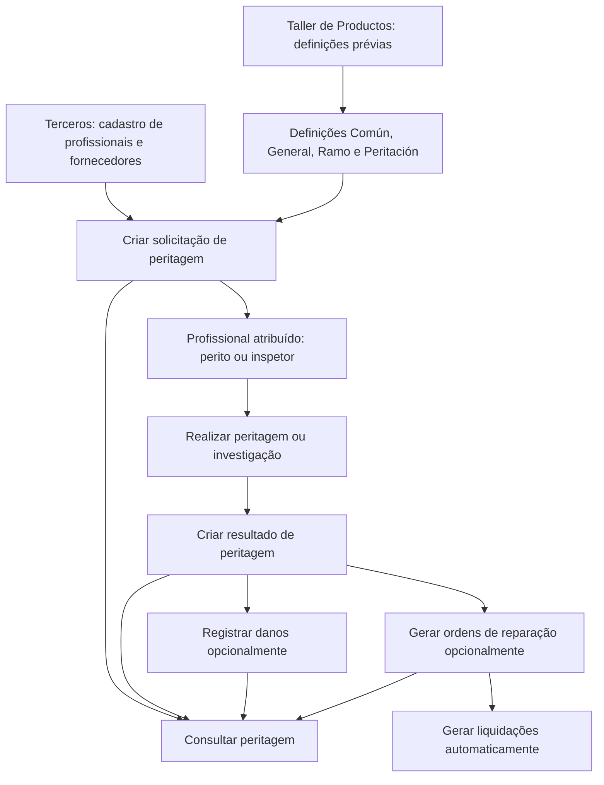

# Módulo de Peritaciones — Gestão de Solicitações, Resultados, Danos e Ordens de Reparação

## 1. Metadados do Documento
- **Arquivo de Origem:** Não identificado no conteúdo fornecido
- **Tipo de Documento:** Manual Funcional
- **Domínio / Sistema:** Reef / módulo de Siniestros / Peritaciones
- **Público-Alvo:** Não identificado explicitamente; conteúdo direcionado a usuários funcionais e equipes responsáveis por operações de peritagem
- **Data/Versão Identificada:** Não identificada

---

## 2. Resumo Executivo & Contexto de Negócio

O documento descreve o módulo de **Peritaciones**, responsável por registrar e acompanhar peritagens desde a solicitação ou atribuição a um profissional até sua finalização e o recebimento da fatura do fornecedor pela companhia. O fluxo abrange profissionais como peritos e inspetores, além de fornecedores envolvidos em reparações, como oficinas, fornecedores de peças e pedreiros.

Uma peritagem é estruturada por quatro elementos principais: **solicitação**, **resultado**, **danos** e **ordens de reparação**. A solicitação e o resultado compõem o núcleo do processo; danos e ordens de reparação são opcionais. Quando ordens de reparação são registradas, o documento informa que é possível gerar liquidações automaticamente.

O módulo é parametrizável: o comportamento da aplicação depende de definições prévias realizadas no **Taller de Productos**. As definições são organizadas pelos níveis **Común**, **General**, **Ramo** e **Peritación**, cobrindo cadastro de profissionais, centros de peritagem, causas de processo, locais de peritagem, honorários, atributos, validações e detalhamento de danos e reparações.

Para executar uma peritagem, profissionais e fornecedores devem estar previamente registrados no sistema **Terceros**, incluindo meios de contato e meios de cobrança/pagamento. Essa dependência permite tanto a comunicação operacional quanto a realização de pagamentos.

---

## 3. Arquitetura, Componentes & Tecnologias Envolvidas

### Componentes funcionais identificados

| Componente | Função documentada |
| :--- | :--- |
| Reef | Ambiente de documentação no qual o conteúdo é apresentado. |
| Módulo de Peritaciones | Gerencia o ciclo de vida de peritagens. |
| Módulo de Siniestros | Contexto funcional citado para definições não exclusivas e exclusivas de ramo. |
| Taller de Productos | Origem das definições prévias que determinam o comportamento parametrizável da aplicação. |
| Terceros | Sistema ou cadastro no qual profissionais e fornecedores devem estar registrados. |
| Solicitud de peritación | Registra o pedido para realização de uma peritagem ou investigação. |
| Resultado de la peritación | Registra o resultado produzido pelo profissional responsável. |
| Daños | Elemento opcional para detalhamento de danos, tipo de reparação, valor e horas. |
| Órdenes de reparación | Elemento opcional para geração de ordens associadas aos beneficiários surgidos na peritagem. |
| Liquidaciones | Podem ser geradas automaticamente quando ordens de reparação são registradas. |
| Perito | Profissional registrado para realização de peritagens. |
| Inspector | Profissional citado como possível responsável por peritagens. |
| Taller | Oficina registrada na companhia. |
| Centro de Peritación | Centro ao qual peritos podem ser associados. |

### Fluxo funcional reconstruído



### Nota de Análise

O documento não descreve arquitetura técnica de infraestrutura, APIs, protocolos, bancos de dados, URLs, microsserviços, métodos HTTP, contratos JSON, filas ou mecanismos de integração. A arquitetura apresentada é exclusivamente funcional e parametrizável.

---

## 4. Regras de Negócio, Especificações Funcionais & Processos

### 4.1 Escopo do módulo de Peritaciones

O módulo cobre as funcionalidades necessárias para conduzir uma peritagem desde o encargo ou solicitação a um profissional até a finalização, incluindo o envio da fatura por fornecedores à companhia.

O processo pode envolver:

- Peritos.
- Inspetores.
- Fornecedores de peças.
- Oficinas.
- Pedreiros.
- Outros profissionais ou fornecedores associados à peritagem.

### 4.2 Pré-requisito de cadastro de profissionais e fornecedores

Para realizar uma peritagem, o profissional ou fornecedor deve estar registrado no sistema **Terceros**.

O registro em **Terceros** deve incluir:

- Meios de contato.
- Meios de cobrança.
- Meios de pagamento.

O objetivo desses dados é permitir contato com os envolvidos e viabilizar pagamentos relacionados à peritagem.

### 4.3 Elementos de uma peritagem

#### Solicitação de peritagem

A solicitação deve coletar, no mínimo:

- Lugar de peritagem.
- Profissional atribuído, como perito ou inspetor.
- Data estimada da peritagem.
- Outros dados não detalhados no documento.

#### Resultado da peritagem

O resultado deve conter informações sobre a peritagem executada, incluindo:

- Data da peritagem.
- Indicação de perda total ou não.
- Indicação de anexação de fotos.
- Indicação de peritagem definitiva.
- Outros dados não detalhados no documento.

#### Danos

O elemento de danos é opcional. Quando utilizado, deve detalhar:

- Danos produzidos.
- Tipo de reparação.
- Valor.
- Número de horas necessárias para reparar.
- Outros dados não detalhados no documento.

#### Ordens de reparação

O elemento de ordens de reparação é opcional. Quando utilizado:

1. Devem ser geradas tantas ordens quanto beneficiários tenham surgido na peritagem.
2. O registro de ordens permite a geração automática de liquidações.
3. Para autos, os beneficiários ou intervenientes podem incluir oficina, fornecedor de peças e perito externo.
4. Para gerais, os beneficiários ou intervenientes podem incluir pedreiro e perito externo.

### 4.4 Níveis de definição

As definições da peritagem estão organizadas nos níveis:

1. **Común**
2. **General**
3. **Ramo**
4. **Peritación**

#### Nível Común

O nível **Común** reúne definições necessárias para a configuração de peritagens, mas que não são exclusivas do módulo de sinistros.

Inclui:

- Registro de todos os peritos da companhia.
- Registro de todas as oficinas da companhia.
- Registro dos diferentes centros de peritagem.
- Associação posterior de peritos aos centros de peritagem.

#### Nível General

O nível **General** contém definições que afetam todos os possíveis expedientes para os quais uma peritagem pode ser realizada.

Inclui:

- Causa de processo.
- Lugares de peritagem.
- Quadro de honorários.
- Resultado de visitas.
- Peritos por centro.

O resultado de uma visita pode desencadear ou não o resultado da peritagem. O documento apresenta como exemplo uma visita falha: nesse caso, o resultado da peritagem não é disparado e uma nova visita deve ser realizada.

#### Nível Ramo

O nível **Ramo** contém definições exclusivas do ramo configurado.

Inclui:

- Tipo de expediente.
- Causa de processo.
- Atividade peritar.
- Propriedade.

O tipo de expediente permite definir os tipos de dano para os quais uma peritagem pode ser realizada e se a peritagem é obrigatória ou não.

A causa de processo permite catalogar os motivos para realizar uma operação, como causa da peritagem, subscrição ou avaliação de danos para reparação.

A atividade peritar define quais atividades estão capacitadas para realizar peritagens, tais como peritos, inspetores e tramitadores.

A propriedade define a propriedade que será peritada por tipo de dano.

#### Nível Peritación

O nível **Peritación** afeta todas as peritagens.

Inclui:

- Atributo.
- Estrutura.
- Informação inicial.
- Validações de informação.
- Conceito de detalhe de peritagem.
- Partes.
- Sub-partes.
- Danos.
- Reparação.

A informação inicial permite registrar previamente dados para atributos das operações de peritagem, evitando preenchimento posterior. O documento apresenta como exemplo atribuir, por padrão, a atividade de realização da peritagem ao perito.

As validações de informação definem comportamentos e validações da informação core exigida nas operações de peritagem.

O conceito de detalhe de peritagem determina o conceito necessário para realizar uma ordem de reparação. Exemplos apresentados: reparação, chapa, pintura e mão de obra.

Partes e sub-partes representam a estrutura de uma propriedade. Para um veículo, exemplos de parte incluem a dianteira e a lateral direita; a parte dianteira pode ser subdividida em capô e para-choques.

### 4.5 Operações de peritagem

As operações de peritagem de um expediente podem ser realizadas **em linha** ou **em diferido**.

| Operação | Regra funcional |
| :--- | :--- |
| Criar solicitação de peritagem | Registra a solicitação para realização de uma peritagem ou investigação. |
| Modificar solicitação | Permite alterar informações da solicitação de peritagem. |
| Criar resultado | Gera os dados do resultado da peritagem realizada por um profissional. |
| Modificar resultado | Permite alterar as informações do resultado da peritagem. |
| Criar dano de peritagem | Permite registrar danos ocasionados em veículo, imóvel ou outra propriedade. |
| Modificar dano de peritagem | Permite modificar danos ocasionados em veículo, imóvel ou outra propriedade. |
| Criar ordem de reparação | Permite gerar uma ordem para pagamento de um profissional que tenha participado da peritagem. |
| Modificar ordem de reparação | Permite modificar dados e valores de uma ordem. |
| Anular ordem de reparação | Permite cancelar uma ordem de reparação. |
| Consultar peritagem | Exibe todas as informações de uma peritagem. |

---

## 5. Tabelas de Parâmetros, Ambientes e Estruturas de Dados

### 5.1 Dados mínimos de solicitação

| Item / Parâmetro | Descrição / Função | Tipo / Valores / Formato | Ambiente / Observações |
| :--- | :--- | :--- | :--- |
| Lugar de peritagem | Local no qual a peritagem será realizada. | Não detalhado | Dado mínimo da solicitação. |
| Profissional atribuído | Responsável pela peritagem. | Perito ou inspetor | Dado mínimo da solicitação. |
| Data estimada de peritagem | Data prevista para realização da peritagem. | Data | Dado mínimo da solicitação. |

### 5.2 Dados de resultado de peritagem

| Item / Parâmetro | Descrição / Função | Tipo / Valores / Formato | Ambiente / Observações |
| :--- | :--- | :--- | :--- |
| Data da peritagem | Registra quando a peritagem foi realizada. | Data | Parte do resultado. |
| Perda total | Indica se existe perda total. | Sim / Não, formato não detalhado | Parte do resultado. |
| Fotos anexadas | Indica se foram anexadas fotos. | Não detalhado | Parte do resultado. |
| Peritagem definitiva | Indica se a peritagem é definitiva. | Não detalhado | Parte do resultado. |

### 5.3 Dados de danos

| Item / Parâmetro | Descrição / Função | Tipo / Valores / Formato | Ambiente / Observações |
| :--- | :--- | :--- | :--- |
| Danos produzidos | Detalha os danos identificados. | Não detalhado | Elemento opcional. |
| Tipo de reparação | Descreve a reparação necessária. | Não detalhado | Elemento opcional. |
| Valor | Registra o importe associado ao dano ou reparação. | Não detalhado | Elemento opcional. |
| Número de horas | Registra o tempo necessário para reparar. | Número de horas | Elemento opcional. |

### 5.4 Definições por nível

| Nível | Definição | Descrição / Função | Observações |
| :--- | :--- | :--- | :--- |
| Común | Perito | Registra todos os peritos da companhia. | Não exclusiva do módulo de sinistros. |
| Común | Taller | Registra todas as oficinas da companhia. | Não exclusiva do módulo de sinistros. |
| Común | Centro de Peritación | Registra centros de peritagem para posterior associação de peritos. | Não exclusiva do módulo de sinistros. |
| General | Causa Proceso | Cataloga motivos pelos quais se deseja realizar uma peritagem. | Afeta todos os possíveis expedientes. |
| General | Lugares Peritación | Define os locais de trabalho onde peritos e inspetores podem realizar peritagens. | Exemplos: oficina, residência do segurado, empresa do segurado. |
| General | Cuadro Honorarios | Define honorários de peritos, inspetores externos e outros conforme locais de trabalho. | Afeta todos os possíveis expedientes. |
| General | Resultado Visitas | Define resultados de visitas que podem ou não disparar o resultado da peritagem. | Visita falha não dispara resultado. |
| General | Peritos por Centro | Associa peritos aos diferentes centros de peritagem. | Afeta todos os possíveis expedientes. |
| Ramo | Tipo Expediente | Define tipos de dano sujeitos a peritagem e se a peritagem é obrigatória. | Exclusiva do ramo definido. |
| Ramo | Causa Proceso | Cataloga motivos para realizar uma operação. | Exemplos: causa da peritagem, subscrição, avaliação de danos para reparação. |
| Ramo | Actividad Peritar | Define atividades capacitadas para realizar peritagens. | Exemplos: peritos, inspetores e tramitadores. |
| Ramo | Propiedad | Define a propriedade a peritar por tipo de dano. | Exclusiva do ramo definido. |
| Peritación | Atributo | Define informação adicional da peritagem. | Afeta todas as peritagens. |
| Peritación | Estructura | Define informação adicional da peritagem. | Afeta todas as peritagens. |
| Peritación | Información Inicial | Registra previamente informação para atributos das operações. | Evita inserção posterior. |
| Peritación | Validaciones Información | Define comportamentos e validações para informações core. | Aplica-se às operações de peritagem. |
| Peritación | Concepto Detalle Peritación | Determina conceitos de detalhe para criar ordem de reparação. | Exemplos: reparação, chapa, pintura e mão de obra. |
| Peritación | Partes | Define partes de uma propriedade. | Exemplo: dianteira ou lateral direita de veículo. |
| Peritación | Sub-partes | Define subdivisões das partes de uma propriedade. | Exemplos: capô e para-choques. |
| Peritación | Daños | Define danos por propriedade. | Afeta todas as peritagens. |
| Peritación | Reparación | Codifica possíveis reparações de uma propriedade. | Exemplos: substituir e reparar. |

### 5.5 Ambientes, rotas, logs e integrações

| Item / Parâmetro | Descrição / Função | Tipo / Valores / Formato | Ambiente / Observações |
| :--- | :--- | :--- | :--- |
| Ambientes | Não identificados. | Não aplicável | O documento não informa ambientes. |
| URLs | Não identificadas. | Não aplicável | O documento não informa URLs. |
| Rotas de log | Não identificadas. | Não aplicável | O documento não informa logs. |
| APIs ou contratos | Não identificados. | Não aplicável | O documento não detalha APIs, métodos HTTP ou contratos JSON. |

---

## 6. Bateria de Perguntas & Respostas para RAG (FAQ Sintético)

### P1: Qual é o objetivo do módulo de Peritaciones?
**R:** O módulo de Peritaciones permite registrar e acompanhar peritagens desde a solicitação ou atribuição a um profissional até a finalização da peritagem e o recebimento da fatura enviada pelos fornecedores à companhia.

### P2: Quais elementos compõem uma peritagem?
**R:** Uma peritagem é composta por solicitação, resultado, danos e ordens de reparação. Danos e ordens de reparação são elementos opcionais, enquanto solicitação e resultado formam o fluxo principal documentado.

### P3: Quais informações mínimas devem ser registradas na solicitação de peritagem?
**R:** A solicitação deve registrar, no mínimo, o lugar da peritagem, o profissional atribuído — como perito ou inspetor — e a data estimada para a realização da peritagem.

### P4: Quais informações podem constar no resultado de uma peritagem?
**R:** O resultado pode incluir a data da peritagem, a indicação de perda total, a informação sobre anexação de fotos e a indicação de que a peritagem é definitiva. O documento também menciona a existência de outros dados não especificados.

### P5: Quando o registro de danos deve ser utilizado?
**R:** O registro de danos é opcional. Quando utilizado, deve detalhar os danos produzidos, o tipo de reparação, o valor e o número de horas necessárias para realizar a reparação.

### P6: Como são geradas as ordens de reparação?
**R:** As ordens de reparação são opcionais e devem ser geradas em quantidade correspondente aos beneficiários surgidos na peritagem. Para autos, podem envolver oficina, fornecedor de peças ou perito externo; para gerais, podem envolver pedreiro ou perito externo.

### P7: O que acontece quando ordens de reparação são registradas?
**R:** Quando ordens de reparação são registradas, o documento informa que as liquidações podem ser geradas automaticamente.

### P8: Quais pré-requisitos existem para profissionais e fornecedores participarem de uma peritagem?
**R:** Profissionais e fornecedores devem estar registrados no sistema Terceros, com meios de contato e meios de cobrança ou pagamento. Esses dados permitem contatar os envolvidos e realizar pagamentos.

### P9: O que ocorre se uma visita de peritagem for falha?
**R:** Um resultado de visita falha não dispara o resultado da peritagem. Nesse cenário, uma nova visita deve ser realizada.

### P10: Onde é definida a obrigatoriedade de uma peritagem?
**R:** A obrigatoriedade é definida no nível Ramo, por meio da definição Tipo Expediente. Essa definição estabelece os tipos de dano que podem receber peritagem e informa se a peritagem é obrigatória ou não.

### P11: Quais operações podem ser realizadas em uma peritagem?
**R:** O módulo permite criar e modificar solicitações, criar e modificar resultados, criar e modificar danos, criar, modificar e anular ordens de reparação e consultar todas as informações de uma peritagem.

### P12: As operações de peritagem só podem ser realizadas em tempo real?
**R:** Não. O documento informa que as operações de peritagem de um expediente podem ser realizadas tanto em linha quanto em diferido.

---

## 7. Glossário de Termos, Siglas & Conceitos-Chave

- **Peritación / Peritagem:** Processo de avaliação ou investigação realizado por profissional responsável, desde a solicitação até o resultado e possíveis ordens de reparação.
- **Perito:** Profissional registrado pela companhia para realizar peritagens.
- **Inspector / Inspetor:** Profissional citado como possível responsável por realizar peritagens.
- **Taller:** Oficina registrada na companhia.
- **Centro de Peritación:** Centro de peritagem ao qual peritos podem ser associados.
- **Terceros:** Sistema ou cadastro em que profissionais e fornecedores devem estar registrados.
- **Siniestros:** Contexto funcional citado pelo documento; algumas definições não são exclusivas desse módulo.
- **Ramo:** Nível de definição exclusivo do ramo que está sendo configurado.
- **Expediente:** Registro ao qual operações de peritagem podem ser associadas.
- **Liquidaciones:** Liquidações que podem ser geradas automaticamente após o registro de ordens de reparação.
- **Cuadro Honorarios:** Definição de honorários para peritos, inspetores externos e outros profissionais conforme os locais de trabalho.
- **Resultado Visitas:** Definição dos resultados possíveis de visitas e de seu efeito sobre o disparo do resultado da peritagem.
- **Actividad Peritar:** Definição das atividades aptas a realizar peritagens.
- **Propiedad:** Propriedade que será peritada por tipo de dano.
- **Partes:** Componentes de uma propriedade, como partes de um veículo.
- **Sub-partes:** Subdivisões de partes de uma propriedade.
- **Taller de Productos:** Local citado como responsável por definições prévias que condicionam o comportamento parametrizável da aplicação.

---

## 8. Notas Críticas, Riscos & Limitações

- O comportamento do módulo depende de definições prévias realizadas no **Taller de Productos**. Definições incompletas ou incorretas podem afetar o funcionamento das operações de peritagem.
- A participação de profissionais e fornecedores depende de cadastro prévio em **Terceros**, incluindo dados de contato e de cobrança/pagamento.
- Uma visita com resultado falho não produz o resultado da peritagem e exige uma nova visita.
- A geração de ordens de reparação depende dos beneficiários surgidos na peritagem; o documento não detalha critérios para identificação desses beneficiários.
- O documento não especifica campos obrigatórios além dos dados mínimos da solicitação, nem formatos, regras de cálculo, valores permitidos ou mensagens de validação.
- O documento não apresenta detalhes de infraestrutura, ambientes, APIs, integrações técnicas, autenticação, logs, monitoramento, persistência ou contratos de dados.
- **Nota de Análise:** O documento lista operações de criação, alteração, anulação e consulta, mas não detalha permissões, perfis de acesso ou transições formais de estado.

---

## 9. Conteúdo Bruto Estruturado (Referência Fiel)

```text
--- [PÁGINA 1 DE 4] ---

INTRODUCCIÓN - Peritaciones
Objetivo
La nalidad de este módulo, es poder registrar todas las peritaciones, desde que se encargan a un profesional, hasta que se naliza y se
recibe el resultado.
Características
Elementos de una Peritación
Deniciones de Peritaciones
Operaciones Peritación
Características
Cubre todas las funcionalidades de las peritaciones
Contiene todas las funcionalidades necesarias de las peritaciones, desde el encargo o solicitud de las peritaciones a un profesional
(perito, inspector), hasta la nalización de la misma, con el envío de la factura por parte de los proveedores a la compañía.
Parametrizable
El módulo es parametrizable y el comportamiento de la aplicación depende de las deniciones previas (Taller de Productos).
Registro de Proveedor
Para realizar una peritación, el profesional (perito, inspector..) el proveedor (proveedor de piezas, taller,albañil..), etc tienen que estar
registrados en el sistema (Terceros), con sus medios de contacto, sus medios de cobro / pago, para poder realizar pagos y para poder
contactar con ellos.
Elementos de las Peritaciones
Las peritaciones están compuestas de varios elementos:
PERITACIONES
SOLICITUD RESULTADO DAÑOS ÓRDENES DE REPARACIÓN
Documentation / DOCUMENTACIÓN Reef
DOCUMENTACIÓN Reef
Mapfredocument
DOCUMENTACIÓN Reef
Owner
user:agonzalez_mapfre.com
Lifecycle
Approved Source
 / 
 VL
Buscar Inicio Soluciones Arquitecturas APIs Componentes Cloud Documentación Zeus Reef Ayuda
ES


--- [PÁGINA 2 DE 4] ---

Solicitud de la peritación
Se recogerán los datos mínimos de la peritación:
Lugar de peritación
Profesional asignado (perito, inspector)
Fecha estimada de peritación
Etc
Resultado de la peritación
Este elemento contendrá el resultado de la peritación:
Fecha de la peritación
Se indicará si es pérdida total o no
Si se adjunta fotos
Si es una peritación denitiva
Etc.
Daños
Este elemento es opcional. Si se utiliza, se detallará:
Daños producidos
Tipo de reparación
Importe
Número de horas que se tarda en reparar
Etc.
Órdenes de reparación
Este elemento de las peritaciones es opcional. Si se utiliza, se deberá generar tantas órdenes como beneciarios hayan surgido en la
peritación. Si se registran, se pueden generar las liquidaciones automáticamente.
Si es de autos: el taller, proveedor de repuestos, perito externo..
Si es de generales: el albañil, el perito externo...
Deniciones Peritación
Los elementos de denición atienden a distintos niveles:
NIVELES DE DEFINICIÓN
COMÚN GENERAL RAMO PERITACIÓN
COMÚN
En este nivel se encuentran deniciones que NO son exclusivas del módulo de siniestros, pero son
necesarias para poder realizar la denición de peritaciones. En otros se encuentran:
PERITO
Registrar todos los peritos de la compañía
TALLER
Registrar todos los talleres de la compañía
CENTRO DE PERITACIÓN
Registrar los diferentes Centros de
Peritación, para posteriormente asociar


--- [PÁGINA 3 DE 4] ---

peritos
GENERAL
En este Nivel se encuentran deniciones que afectarán a todos los posibles expedientes a los que se les
pueda realizar una peritación. Entre otros se dene:
CAUSA PROCESO
Permite catalogar los motivos por los que
se quiere realizar una peritación
LUGARES PERITACIÓN
Permite denir los lugares de trabajo de
los peritos, inspectores, es decir dónde va
a poder realizar las peritaciones. Por
ejemplo en un taller, en el hogar del
asegurado, en la empresa del asegurado,
etc
CUADRO HONORARIOS
Permite denir para peritos, inspectores
externos etc, diferentes honorarios según
los distintos lugares de trabajo de los
peritos
RESULTADO VISITAS
Permite denir diferentes resultados de
las visitas pudiendo desencadenar o no el
resultado de la peritación. Por ejemplo si
la visita es fallida no se disparará el
resultado de la peritación, ya que habrá
que volver a realizar la visita
PERITOS POR CENTRO
Permite asociar los peritos a los distintos
centros de periración
RAMO
Son exclusivas del ramo que se está deniendo
TIPO EXPEDIENTE
Permite denir los Tipos de Daño a los
que se les va a poder realizar una
peritación y si esta es obligatoria o no
CAUSA PROCESO
Permite catalogar los motivos por los que
se quiere realizar una operación. Ejemplo
causa de la peritación, para suscripción,
evaluación de daños para reparación
ACTIVIDAD PERITAR
Denir que actividad está capacitada para
realizar peritaciones, peritos, inspectores,
tramitadores..
PROPIEDAD
Denición de la propiedad que se va a
peritar por tipo de daño
PERITACIÓN
Afecta a todas las peritaciones
ATRIBUTO
Permite denir la información adicional de
la peritación
ESTRUCTURA
Información adicional de la peritación
INFORMACIÓN INICIAL
Registrar información previa para los
atributos de las operaciones de
peritaciones, para no tener que


--- [PÁGINA 4 DE 4] ---

introducirla posteriormente. Un ejemplo
sería dar a la actividad para realizar la
peritación por defecto perito
VALIDACIONES INFORMACIÓN
Denir comportamientos y validaciones de
la información core, que se pide en las
operaciones de peritación.
CONCEPTO DETALLE PERITACIÓN
Determina el concepto de detalle de la
peritación para realizar una orden de
reparación. Ejemplo Reparación, chapa,
pintura, mano de obra...
PARTES
Partes de una propiedad Si es un vehículo,
parte delantera, parte lateral derecha...
SUB-PARTES
División de las partes de una propiedad Si
es la parte delantera se puede sub-dividir
en capó, para-golpes... etc
DAÑOS
Denición de Daños por propiedad
REPARACIÓN
Codicación de las posibles reparaciones
de una propiedad, sustituir, reparar
Operaciones de Peritación
PERITACIONES
Operaciones de peritación de un expediente, se pueden realizar tanto en línea como diferido
CREAR solicitud peritación
En esta operación se registra la solicitud
para que se realice una peritación /
investigación
MODIFICAR solicitud
Permite cambiar información de la
solicitud de peritación
CREAR resultado
En esta operación se generan los datos
del resultado de la peritación realizada por
un profesional
MODIFICAR resultado
Permite cambiar la información del
resultado de la peritación
CREAR daño peritación
Permite registrar los daños ocasionados
del vehículo, del inmueble...
MODIFICAR daño peritación
Permite modicar los daños ocasionados
del vehículo, del inmueble...
CREAR orden reparación
Permite generar una orden para poder
pagar a un profesional que haya
intervenido en la peritación
MODIFICAR orden reparación
Permite modicar una orden tanto los
datos, como los importes de la misma
ANULAR orden reparación
Permite cancelar una orden de reparación
CONSULTAR peritación
Visualiza toda la información de una
peritación.
```
