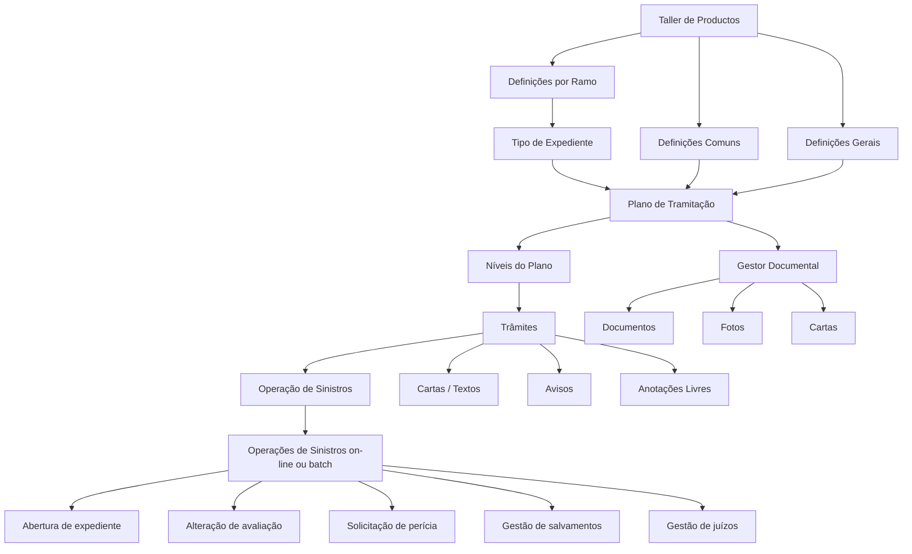
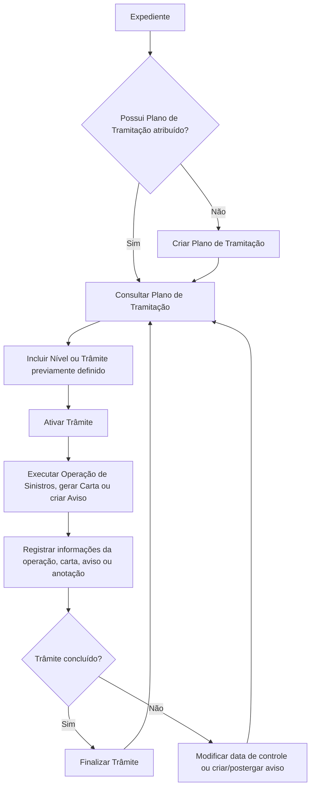

# Plano de Tramitação — Documentação Reef para Gestão de Expedientes de Sinistros

## 1. Metadados do Documento
- **Arquivo de Origem:** Não identificado no conteúdo extraído
- **Tipo de Documento:** Manual Operacional / Especificação Funcional
- **Domínio / Sistema:** Reef — módulo de Plano de Tramitação para sinistros e expedientes
- **Público-Alvo:** Tramitadores, analistas de sinistros, configuração de produtos, operação e equipes funcionais
- **Data/Versão Identificada:** Não identificada
- **Owner identificado:** `user:agonzalez_mapfre.com`
- **Lifecycle identificado:** `Approved`

---

## 2. Resumo Executivo & Contexto de Negócio

O documento descreve o **Plano de Tramitação** do sistema Reef como um mecanismo para orientar o tramitador, organizar o trabalho e especializar o tratamento de expedientes de acordo com a sua natureza. Entre os exemplos de natureza de expediente estão danos materiais, danos pessoais, recobros, morte, danos materiais de segurado e danos materiais de terceiro.

Um Plano de Tramitação é definido como o conjunto de **níveis** e **trâmites** necessários para tratar um expediente. Cada tipo de expediente pode possuir um plano específico. O objetivo é unificar a forma de trabalho e permitir que o processamento de um expediente siga etapas previamente configuradas.

O Plano de Tramitação centraliza ações operacionais relacionadas ao sinistro, incluindo abertura de expediente, alteração de avaliação, solicitação de perícia, gestão de salvamentos e gestão de processos judiciais. O módulo também permite gerar textos e comunicá-los por correio ordinário, e-mail ou SMS, além de acessar um gestor documental para consultar ou anexar documentos, fotos e cartas associados ao sinistro, expediente ou liquidação.

O comportamento do módulo é parametrizável e depende de definições prévias realizadas no **Taller de Productos**. As definições são organizadas nos níveis **Comum**, **Geral** e **Ramo**, abrangendo estruturas de informação, planos, níveis, trâmites, operações, avisos, cartas, papéis e associações entre planos e tipos de expediente.

O documento também descreve operações que podem ser executadas dentro de um Plano de Tramitação, tais como criar o plano, incluir ou ativar um trâmite, finalizar trâmites e avisos, criar anotações livres, postergar avisos, gerar cartas ou e-mails, modificar datas de controle e consultar o plano.

---

## 3. Arquitetura, Componentes & Tecnologias Envolvidas

O conteúdo descreve uma arquitetura funcional composta pelos seguintes elementos:

- **Reef:** Sistema ou contexto documental no qual o Plano de Tramitação é apresentado.
- **Plano de Tramitação:** Estrutura que organiza os níveis e trâmites necessários para processar um expediente.
- **Nível:** Agrupamento de trâmites da mesma natureza dentro de um processo.
- **Trâmite:** Cada passo necessário para realizar um processo.
- **Operação de Sinistros:** Operação chamada a partir de um trâmite, cujo registro inclui operação executada, usuário e informações gerais pertinentes.
- **Carta / Texto de comunicação:** Texto gerado que pode ser enviado por correio ordinário, e-mail, SMS ou outros canais citados.
- **Aviso:** Lembrete automático ou manual, com tipologia e estado.
- **Gestor documental:** Componente acessado pelo Plano de Tramitação para visualizar ou carregar documentação, fotos e cartas.
- **Taller de Productos:** Origem das definições prévias que parametrizam o comportamento do módulo.
- **Módulos de sinistros:** Módulos integrados ao Plano de Tramitação para executar operações on-line ou batch.
- **Ramo:** Nível de definição destinado a configurações do Plano de Tramitação por ramo.



### Fluxo funcional do Plano de Tramitação



> **Nota de Análise:** O documento informa que o Plano de Tramitação pode acionar operações de sinistros on-line ou batch, mas não detalha interfaces, métodos HTTP, contratos de integração, tecnologias de mensageria, bancos de dados, URLs, portas ou formatos de payload.

---

## 4. Regras de Negócio, Especificações Funcionais & Processos

### 4.1 Objetivo do Plano de Tramitação

O Plano de Tramitação deve:

1. Guiar o tramitador.
2. Organizar o trabalho.
3. Melhorar e especializar a tramitação dos expedientes conforme a natureza do caso.
4. Unificar a maneira de trabalhar.
5. Permitir realizar as gestões, operações e passos necessários para tramitar um expediente.
6. Associar um plano específico a cada tipo de expediente.
7. Permitir a execução de operações de sinistros on-line ou batch.
8. Emitir avisos judiciais e avisos referentes a prazos obrigatórios.
9. Gerar textos e enviá-los por correio ordinário, e-mail ou SMS.
10. Permitir acesso ao gestor documental.
11. Operar de forma parametrizável a partir de definições prévias.

### 4.2 Conceitos funcionais

#### Trâmite

Um trâmite é cada passo necessário para realizar um processo. O documento apresenta como exemplo o processo de perícia, que pode incluir:

1. Solicitação da perícia.
2. Comunicação com o perito.
3. Resultado da perícia.
4. Comunicação com o segurado.

#### Nível

Um nível é um agrupamento de trâmites de mesma natureza. O nível é um conjunto de passos que fazem parte de um mesmo processo.

Exemplos citados:

- **Nível de Perícia:** agrupa todos os trâmites necessários para realizar uma perícia do início ao fim.
- **Nível de Juízos:** agrupa todos os trâmites necessários para registrar e acompanhar um processo judicial.

#### Plano de Tramitação

O Plano de Tramitação é o conjunto de níveis e trâmites necessários para tratar um expediente. Cada tipo de expediente pode possuir um plano específico.

Exemplos de planos mencionados:

- Plano Danos Materiais Segurado.
- Plano Danos Materiais Terceiro.
- Plano Morte.

### 4.3 Estrutura operacional registrada no Plano de Tramitação

Cada elemento do Plano de Tramitação possui informações específicas.

#### Informações de nível

O elemento nível contém a informação do nível ao qual os trâmites pertencem.

#### Informações de trâmite

O elemento trâmite contém:

- Estado do trâmite.
- Data de início, caso o trâmite tenha sido iniciado.
- Data de fim, caso o trâmite tenha sido finalizado.

#### Informações da operação de sinistros

Cada vez que uma operação é chamada, a execução deve ficar registrada. O registro contém:

- Operação chamada.
- Usuário que executou a operação.
- Data de início e data de fim, que são iguais para a operação.
- Informações gerais da operação.

Exemplo informado para uma operação de liquidação:

- Número da liquidação.
- Beneficiário.
- Data estimada de pagamento.

#### Informações de cartas ou textos

O elemento de texto para comunicação contém uma ou mais cartas geradas. Uma carta é entendida como a geração de um texto que pode ser enviado por:

- Correio ordinário.
- E-mail.
- SMS.
- Outros meios representados por “etc.” no documento.

#### Informações de avisos

O elemento aviso contém avisos criados automaticamente ou manualmente, incluindo:

- Tipologia do aviso.
- Estado do aviso.

### 4.4 Regras de parametrização e definição

As definições do Plano de Tramitação são organizadas em três níveis: **Comum**, **Geral** e **Ramo**.

#### Definições Comuns

As definições comuns são anteriores ao Plano de Tramitação. Elas não são exclusivas de sinistros, porém são necessárias para realizar a definição do plano.

As definições comuns incluem:

- **Estrutura:** definição de um conjunto de atributos que forma uma estrutura de informação.
- **Agrupamento:** associação de estruturas ao agrupamento do Plano de Tramitação.
- **Notas:** definição de informações de notas para obter comunicados.

#### Definições Gerais

As definições gerais tratam da configuração geral do Plano de Tramitação.

As características gerais do módulo de sinistros determinam comportamentos do módulo de Plano de Tramitação, incluindo os exemplos:

- Trabalhar com papéis.
- Trabalhar com datas de controle.
- Utilizar o calendário laboral para cálculo de datas.

As definições gerais também incluem:

- Códigos de planos associados aos tipos de expediente.
- Definição de níveis.
- Definição de trâmites.
- Associação de trâmites sob níveis.
- Definição de níveis presentes em um plano.
- Definição completa de plano, níveis e passos.
- Definição de operações disponíveis em um trâmite.
- Definição de observações registradas no plano após a execução de uma operação.
- Definição de textos para destinatários.
- Tipificação de avisos.
- Definição de anotações livres.
- Definição de papéis para trabalho com planos.

#### Definições por Ramo

As definições por ramo incluem:

- Associação entre plano e tipo de expediente.
- Perguntas para confirmação de trâmites.
- Informações resumidas exibidas a cada tramitador.
- Restrições de consulta para tramitadores de um centro telefônico.

### 4.5 Regras de papéis e restrição de visualização

O documento estabelece que podem existir papéis que restringem a execução de níveis específicos do Plano de Tramitação.

Exemplos citados:

- Um papel pode executar somente o nível de perícias.
- Um papel pode executar somente o nível de juízos.

Também podem ser definidas restrições de consulta para determinar quais trâmites, níveis ou tipos de trâmites podem ser visualizados ou não por tramitadores de um centro telefônico.

### 4.6 Operações disponíveis no Plano de Tramitação

| Operação | Regra funcional descrita |
| :--- | :--- |
| Criar Plano de Tramitação | Permite atribuir um Plano de Tramitação a um expediente quando o expediente não possui um plano atribuído. |
| Incluir trâmite | Permite adicionar ao plano um trâmite previamente definido no plano. |
| Incluir nível | Permite adicionar ao plano um nível previamente definido no plano. |
| Ativar trâmite | Executa o trâmite. |
| Finalizar trâmite | Termina o trâmite. |
| Criar aviso de sinistro | Registra um lembrete no sinistro, visível nos planos de tramitação de todos os expedientes. |
| Criar aviso de expediente | Registra um lembrete no expediente. |
| Criar aviso de trâmite | Registra um lembrete no trâmite. |
| Criar anotação livre de sinistro | Permite inserir uma anotação no sinistro, visível em todos os expedientes do sinistro. |
| Criar anotação livre de expediente | Permite inserir uma anotação no expediente. |
| Criar anotação livre de trâmite | Permite inserir uma anotação no trâmite. |
| Finalizar aviso de sinistro | Permite terminar o lembrete para que ele não avise mais. |
| Finalizar aviso de expediente | Permite terminar o lembrete para que ele não avise mais. |
| Finalizar aviso de trâmite | Permite terminar o lembrete para que ele não avise mais. |
| Postergar aviso | Permite postergar a data do aviso do sinistro. |
| Postergar aviso de expediente | Permite postergar a data do aviso do expediente. |
| Postergar aviso de trâmite | Permite postergar a data do aviso do trâmite. |
| Criar carta / e-mail | Gera a carta ou o texto. |
| Modificar data de controle | Permite alterar a data de controle do trâmite. |
| Consultar Plano de Tramitação | Mostra todas as informações do Plano de Tramitação. |

---

## 5. Tabelas de Parâmetros, Ambientes e Estruturas de Dados

### 5.1 Elementos do Plano de Tramitação

| Item / Parâmetro | Descrição / Função | Tipo / Valores / Formato | Ambiente / Observações |
| :--- | :--- | :--- | :--- |
| Plano de Tramitação | Conjunto de níveis e trâmites necessários para tratar um expediente. | Plano associado a tipos de expediente. | Cada tipo de expediente pode ter plano específico. |
| Nível | Agrupamento de trâmites de mesma natureza. | Exemplo: Nível de Perícia; Nível de Juízos. | O nível contém informação sobre os trâmites pertencentes. |
| Trâmite | Passo necessário para realizar um processo. | Estado, data de início e data de fim. | Pode ser ativado e finalizado. |
| Operação de Sinistros | Operação chamada a partir de um trâmite. | Operação, usuário executor, data de início/fim e dados gerais. | A data de início e a data de fim são iguais. |
| Carta / Texto | Texto gerado para comunicação. | Correio ordinário, e-mail, SMS ou outros meios mencionados. | Pode haver uma ou mais cartas no elemento. |
| Aviso | Lembrete automático ou manual. | Tipologia e estado. | Pode ser criado, finalizado ou postergado. |
| Anotação livre | Registro textual associado ao sinistro, expediente ou trâmite. | Anotação sem formato especificado. | A anotação do sinistro é visível em todos os expedientes do sinistro. |
| Data de controle | Data de controle associada a um trâmite. | Data; formato não especificado. | Pode ser modificada. |
| Gestor documental | Acesso para visualizar ou carregar documentação. | Documentos, fotos e cartas. | Pode abranger sinistro, expediente e liquidação. |

### 5.2 Níveis de definição do Plano de Tramitação

| Nível de Definição | Item / Parâmetro | Descrição / Função | Tipo / Valores / Formato | Ambiente / Observações |
| :--- | :--- | :--- | :--- | :--- |
| Comum | Estrutura | Define um conjunto de atributos que forma uma estrutura de informação. | Conjunto de atributos. | Definição prévia ao Plano de Tramitação. |
| Comum | Agrupamento | Associa estruturas ao agrupamento do Plano de Tramitação. | Associação de estruturas. | Não exclusiva de sinistros. |
| Comum | Notas | Define informações de notas para obter comunicados. | Informação de notas. | Não exclusiva de sinistros. |
| Geral | Características Gerais | Determina comportamentos do módulo de sinistros e do Plano de Tramitação. | Papéis, datas de controle, calendário laboral. | O documento não informa todos os comportamentos possíveis. |
| Geral | Plano | Define códigos de planos associados a tipos de expediente. | Códigos de plano. | Associação posterior por tipo de expediente. |
| Geral | Nível | Define agrupamentos de trâmites. | Agrupamento de trâmites. | Exemplo: nível de perícia. |
| Geral | Trâmite | Define cada passo necessário para completar um processo. | Passo de processo. | Pode integrar um nível. |
| Geral | Trâmites de Nível | Associa trâmites de mesma natureza a um nível. | Associação trâmite–nível. | Exemplo: trâmites de perícia sob o nível de perícia. |
| Geral | Níveis do Plano | Define os níveis contidos em um plano. | Associação plano–nível. | Parte da composição do plano. |
| Geral | Plano Nível Trâmite | Define integralmente um Plano de Tramitação. | Plano, níveis e passos. | Inclui passos agrupados em níveis. |
| Geral | Estruturas de Trâmite | Define uma ou mais operações que podem ser realizadas em um trâmite. | Operações por trâmite. | Exemplo: solicitação de perícia em trâmite de solicitação de perícia. |
| Geral | Observação Estrutura | Define a observação registrada no plano após executar uma operação. | Observação da operação. | Exemplo: em liquidação, destinatário do pagamento e valor. |
| Geral | Cartas Trâmite | Define textos que podem ser enviados a diferentes destinatários. | Textos por destinatário. | Associados a trâmites. |
| Geral | Tipos de Avisos | Tipifica avisos que podem ser gerados. | Tipologia de aviso. | Avisos podem ser automáticos ou manuais. |
| Geral | Tipos de Anotações | Define anotações livres possíveis. | Tipos de anotação. | Sem formato adicional especificado. |
| Geral | Papéis do Plano | Define papéis para trabalhar com Planos de Tramitação. | Papéis de execução. | Pode restringir execução por nível. |
| Ramo | Plano Tipo de Expediente | Define qual plano tramita cada tipo de expediente ou tipo de dano. | Plano fixo ou plano determinado por diferentes causas. | Configuração por ramo. |
| Ramo | Confirmação do Tramitador | Define perguntas para confirmação de trâmites. | Perguntas de confirmação. | Exemplos: perda total, coberturas e situação de apólice. |
| Ramo | Resumo do Tramitador | Define informações do Plano de Tramitação que cada tramitador deve visualizar. | Casos pendentes e avisos pendentes, entre outros. | Pode ser segmentado por tipo de expediente. |
| Ramo | Restrição de Consulta | Define trâmites, níveis e tipos de trâmites que podem ou não ser vistos. | Regras de visibilidade. | Aplicável a tramitadores de um centro telefônico. |

### 5.3 Exemplos de planos, níveis e informações de operação

| Item / Parâmetro | Descrição / Função | Tipo / Valores / Formato | Ambiente / Observações |
| :--- | :--- | :--- | :--- |
| Plano Danos Materiais Segurado | Exemplo de Plano de Tramitação. | Plano por tipo ou natureza de expediente. | Citado como exemplo. |
| Plano Danos Materiais Terceiro | Exemplo de Plano de Tramitação. | Plano por tipo ou natureza de expediente. | Citado como exemplo. |
| Plano Morte | Exemplo de Plano de Tramitação. | Plano por tipo ou natureza de expediente. | Citado como exemplo. |
| Nível de Perícia | Agrupa trâmites necessários para perícia do início ao fim. | Nível. | Exemplo funcional. |
| Nível de Juízos | Agrupa trâmites necessários para registrar e acompanhar um juízo. | Nível. | Exemplo funcional. |
| Solicitação de perícia | Exemplo de trâmite em um processo de perícia. | Trâmite. | Pode executar solicitação de perícia. |
| Comunicação com o perito | Exemplo de trâmite no processo de perícia. | Trâmite. | Não há detalhamento do canal ou conteúdo. |
| Resultado da perícia | Exemplo de trâmite no processo de perícia. | Trâmite. | Não há detalhamento da estrutura do resultado. |
| Comunicação com o segurado | Exemplo de trâmite no processo de perícia. | Trâmite. | Pode envolver geração de textos, sem vínculo explícito no documento. |
| Liquidação | Exemplo de operação de sinistros. | Operação. | Exibe número da liquidação, beneficiário e data estimada de pagamento. |

### 5.4 Ambientes, URLs, servidores e logs

| Item / Parâmetro | Descrição / Função | Tipo / Valores / Formato | Ambiente / Observações |
| :--- | :--- | :--- | :--- |
| Ambientes | Não identificados no conteúdo extraído. | Não informado. | O documento não apresenta URLs, servidores, portas ou nomes de ambientes. |
| Rotas de logs | Não identificadas no conteúdo extraído. | Não informado. | O documento não detalha logging, observabilidade ou retenção de registros. |
| APIs | Não identificadas no conteúdo extraído. | Não informado. | O documento cita operações, mas não apresenta contratos técnicos ou endpoints. |

---

## 6. Bateria de Perguntas & Respostas para RAG (FAQ Sintético)

### P1: O que é o Plano de Tramitação no contexto do Reef?
**R:** O Plano de Tramitação é o conjunto de níveis e trâmites necessários para processar um expediente. O Plano de Tramitação orienta o tramitador, organiza o trabalho, especializa a tramitação conforme a natureza do expediente e busca unificar a forma de trabalho.

### P2: Qual é a diferença entre nível e trâmite?
**R:** Um trâmite é cada passo necessário para realizar um processo. Um nível é um agrupamento de trâmites da mesma natureza. Por exemplo, o Nível de Perícia pode agrupar os trâmites de solicitação da perícia, comunicação com o perito, resultado da perícia e comunicação com o segurado.

### P3: Um tipo de expediente pode possuir um Plano de Tramitação específico?
**R:** Sim. O documento determina que cada tipo de expediente pode possuir seu plano específico. Como exemplos, são citados Plano Danos Materiais Segurado, Plano Danos Materiais Terceiro e Plano Morte.

### P4: Quais operações de sinistros podem ser realizadas a partir do Plano de Tramitação?
**R:** O Plano de Tramitação pode realizar operações de sinistros on-line ou batch, incluindo abertura de novo expediente, alteração da avaliação do expediente, solicitação de perícias, gestão de salvamentos e gestão de juízos. O documento não detalha os contratos técnicos dessas operações.

### P5: Quais informações são registradas quando uma operação de sinistros é chamada?
**R:** Cada vez que uma operação é chamada, o Plano de Tramitação registra a operação chamada, o usuário que a executou, a data de início e a data de fim — que são iguais — e as informações gerais da operação. Para uma liquidação, o exemplo indicado inclui número da liquidação, beneficiário e data estimada de pagamento.

### P6: Como funcionam os avisos no Plano de Tramitação?
**R:** O Plano de Tramitação realiza avisos judiciais e avisos de prazos obrigatórios. Os avisos podem ser gerados automática ou manualmente e contêm tipologia e estado. Existem operações para criar, finalizar e postergar avisos de sinistro, expediente ou trâmite.

### P7: Qual é a diferença entre um aviso de sinistro, de expediente e de trâmite?
**R:** Um aviso de sinistro registra um lembrete no sinistro e é visível nos Planos de Tramitação de todos os expedientes daquele sinistro. Um aviso de expediente registra um lembrete no expediente. Um aviso de trâmite registra um lembrete associado ao trâmite.

### P8: O que pode ser feito com cartas e textos no Plano de Tramitação?
**R:** O Plano de Tramitação permite gerar textos, entendidos como cartas, e enviá-los por correio ordinário, e-mail, SMS ou outros meios mencionados no documento. A definição de Cartas Trâmite permite configurar textos que podem ser enviados a diferentes destinatários.

### P9: Como os papéis influenciam o uso do Plano de Tramitação?
**R:** Os papéis do plano definem os distintos papéis que podem trabalhar com Planos de Tramitação. O documento apresenta que determinados papéis podem executar somente o nível de perícias, enquanto outros podem executar somente o nível de juízos.

### P10: O que é configurado na definição Plano Tipo de Expediente?
**R:** A definição Plano Tipo de Expediente determina, para cada tipo de expediente ou tipo de dano, qual Plano de Tramitação será responsável por tratar o dano. O plano pode ser fixo ou determinado por diferentes causas.

### P11: Para que serve a definição Confirmação do Tramitador?
**R:** A definição Confirmação do Tramitador permite configurar perguntas para confirmar trâmites. Os exemplos fornecidos são confirmar uma perda total, confirmar coberturas e confirmar uma situação de apólice.

### P12: Como uma anotação livre de sinistro se diferencia de uma anotação de expediente ou trâmite?
**R:** A anotação livre de sinistro permite inserir uma anotação no sinistro e essa anotação é visível em todos os expedientes do sinistro. A anotação livre de expediente é inserida no expediente. A anotação livre de trâmite é inserida no trâmite.

---

## 7. Glossário de Termos, Siglas & Conceitos-Chave

- **Aviso:** Lembrete gerado automática ou manualmente, contendo tipologia e estado.
- **Carta:** Texto gerado para comunicação, que pode ser enviado por correio ordinário, e-mail, SMS ou outros meios mencionados.
- **Data de Controle:** Data associada ao trâmite que pode ser modificada.
- **Expediente:** Unidade tratada pelo Plano de Tramitação; pode estar associada a um tipo de dano e possuir um plano específico.
- **Gestor Documental:** Componente acessado para visualizar ou subir documentação, fotos e cartas relativas ao sinistro, expediente ou liquidação.
- **Liquidação:** Exemplo de operação cujas informações gerais exibidas incluem número de liquidação, beneficiário e data estimada de pagamento.
- **Nível:** Agrupamento de trâmites de mesma natureza dentro de um processo.
- **Plano de Tramitação:** Conjunto de níveis e trâmites necessários para tramitar um expediente.
- **Papel do Plano:** Papel definido para trabalhar com Planos de Tramitação, podendo limitar a execução de determinados níveis.
- **Ramo:** Nível de definição que contém configurações do Plano de Tramitação por ramo.
- **Reef:** Sistema ou contexto documental identificado como “DOCUMENTACIÓN Reef”.
- **Restrição de Consulta:** Definição que controla quais trâmites, níveis ou tipos de trâmite podem ser vistos por tramitadores de um centro telefônico.
- **Sinistro:** Entidade para a qual podem ser registradas operações, avisos e anotações; um sinistro pode possuir expedientes.
- **Taller de Productos:** Origem das definições prévias que determinam o comportamento parametrizável do Plano de Tramitação.
- **Tramitador:** Usuário responsável por executar ou acompanhar a tramitação de expedientes.
- **Trâmite:** Passo necessário para realizar um processo.

---

## 8. Notas Críticas, Riscos & Limitações

- O documento é predominantemente funcional e não especifica APIs, endpoints, métodos HTTP, autenticação, contratos JSON, esquemas de banco de dados, filas, eventos ou mecanismos de integração.
- Não foram identificados URLs, servidores, portas, nomes de ambientes, variáveis de configuração, rotas de logs, políticas de retenção ou indicadores de observabilidade.
- O comportamento do Plano de Tramitação depende de definições prévias realizadas no **Taller de Productos**. Portanto, a execução operacional depende da correta parametrização de estruturas, planos, níveis, trâmites, operações, avisos, cartas, papéis e associações por ramo.
- O documento indica que planos podem ser determinados por “diferentes causas”, mas não descreve quais causas existem, como são avaliadas ou qual regra resolve conflitos entre possíveis planos.
- O documento informa que há avisos de prazos obrigatórios e uso opcional de calendário laboral para cálculo de datas, mas não detalha regras de cálculo, feriados, fusos horários, escalonamento ou consequências do vencimento de prazo.
- O documento permite restringir a consulta de trâmites, níveis e tipos de trâmite para tramitadores de centro telefônico, porém não especifica o modelo de autorização, os critérios de associação de usuários a papéis ou a auditoria de permissões.
- **Nota de Análise:** O texto extraído contém caracteres corrompidos em termos como “definición”, “finalizado”, “específico” e “tipificar”. A estrutura funcional foi preservada sem inferir conteúdo além do texto fornecido.

---

## 9. Conteúdo Bruto Estruturado (Referência Fiel)

```text
--- [PÁGINA 1 DE 6] ---

INTRODUCCIÓN - Plan de Tramitación
Objetivo
Guiar al tramitador, organizar el trabajo, mejorar y especializar la tramitación de los expedientes según su naturaleza (daños materiales,
daños personales, recobros…..), unicar la manera de trabajar.
Conceptos
Trámite
Nivel
Plan
Características
Elementos del Plan de Tramitación
Deniciones Plan de Tramitación
Operaciones Plan de Tramitación
Conceptos
Trámite
Cada Paso que se requiere para realizar un proceso.
Por ejemplo en el proceso de Peritación se podrían tener los siguientes trámites o pasos: - Solicitud de la Peritación - Comunicación con el
perito - Resultado de la Peritación - Comunicación con el Asegurado
Nivel
Agrupación de trámites de la misma naturaleza. Conjunto de pasos que se agrupan y forman parte de un mismo proceso. Por ejemplo:
Nivel de Peritación
Agrupará todos los trámites necesarios para realizar una peritación de inicio a n.
Nivel de Juicios
Agrupará todos los trámites necesarios para registrar y llevar el seguimiento de un juicio.
Etc.
Plan de Tramitación
Documentation / DOCUMENTACIÓN Reef
DOCUMENTACIÓN Reef
Mapfredocument
DOCUMENTACIÓN Reef
Owner
user:agonzalez_mapfre.com
Lifecycle
Approved Source
 / 
 VL
Buscar Inicio Soluciones Arquitecturas APIs Componentes Cloud Documentación Zeus Reef Ayuda
ES

--- [PÁGINA 2 DE 6] ---

Es la herramienta para Guiar al tramitador, organizar el trabajo, mejorar y especializar la tramitación de los expedientes según su naturaleza
(daños materiales, daños personales, recobros…..), unicar la manera de trabajar.
El plan de tramitación, es el conjunto de niveles y trámites necesarios para tramitar un expediente.
Cada Tipo de Expediente podrá tener su plan especíco.
Por ejemplo:
Plan Daños Materiales Asegurado
Plan Daños Materiales Contrario
Plan Muerte
Etc.
Características
Permite realizar todas las gestiones necesarias de un Expediente
Desde el plan se puede realizar todas las operaciones, pasos, gestiones, necesarias para tramitar un expediente.
Conexión con los módulos
Desde el plan de tramitación se puede realizar cualquier operación de siniestros on-line o batch:
Apertura de un nuevo expediente
Cambiar valoración del expediente
Encargar Peritaciones
Gestionar Salvamentos
Gestionar Juicios
Etc.
Aviso de plazos formales
El plan de tramitación realizará avisos:
Avisos judiciales
Avisos de plazos obligatorios
Etc.
Generación de textos y su envío
Posibilidad de generar textos, su posterior envío vía email, sms, correo ordinario...
Acceso al gestor documental
Acceso al gestor documental para visualizar o subir documentación, fotos, cartas... del siniestro, del expediente de la liquidación... etc.
Parametrizable
El módulo es parametrizable y el comportamiento del plan depende de las deniciones previas (Taller de Productos).
Elementos del Plan de Tramitación
Los planes están compuestos de varios elementos:

--- [PÁGINA 3 DE 6] ---

PLAN TRAMITACIÓN
NIVEL 1
TRÁMITE 1.1
OPERACIÓN
CARTA
AVISO
TRAMITE 1.2
CARTA
AVISO
NIVEL 2 TRÁMITE 2 OPERACIÓN
Nivel
En este elemento tendremos la información del nivel al que pertenecen los trámites
Trámite
En este elemento tendremos la información del trámite:
Estado del trámite
Fecha de inicio (si se ha iniciado el trámite)
Fecha n (si se ha nalizado el trámite)
Operación de Siniestros
Este elemento contendrá la operación a la que se ha llamado. Cada vez que se llame a una operación quedará registrado.
Operación a la que se ha llamado
Usuario que lo ha ejecutado
Fecha inicio y n será la misma
La información general de esa operación por ejemplo:
Si la operación es una liquidación, se visualizará el número de liquidación, el beneciario y fecha estimada de pago.
Texto para comunicarse (carta)
Este elemento contendrá carta o cartas que se han generado, entendiendo como carta, la generación de un texto que puede enviarse por
correo ordinario, email, sms, etc.
Aviso
Este elemento contendrá los avisos generados automática o manualmente, su tipología, su estado, etc.
Deniciones Plan de Tramitación
Los elementos de denición atienden a distintos niveles:

--- [PÁGINA 4 DE 6] ---

NIVELES DE DEFINICIÓN
COMÚN GENERAL RAMO
COMÚN
Son deniciones Previas al Plan de tramitación. En este nivel se encuentran deniciones que NO son
exclusivas de siniestros, pero son necesarias para poder realizar la denición. Entre otras deniciones se
encuentra:
ESTRUCTURA
Denición de un conjunto de atributos que
forman una estructura de información.
AGRUPACIÓN
Asociación de Estructuras a la agrupación
del plan de tramitación
NOTAS
Denición de información de notas para
obtener comunicados
GENERAL
Deniciones Generales del Plan de Tramitación
CARACTERÍSTICAS GENERALES
Características Generales del módulo de
siniestros, determina comportamientos
del módulo de plan de tramitación por
ejemplo si se va a trabajar con roles, si se
va a trabajar con fechas de control, si se
va a utilizar el calendario laboral para el
cálculo de fechas...
PLAN
Denición de códigos que planes que
serán asociados a los tipos de
expedientes
NIVEL
Agrupación de Trámites
TRÁMITE
Denición de cada paso que hay que
realizar para completar un proceso
TRAMITES NIVEL
Asociación de trámites de la misma
naturaleza bajo un nivel, por ejemplo Nivel
de peritación aglutinará todos los trámites
de peritaciones
NIVELES PLAN
Denición de los distintos niveles que va a
contener un plan
PLAN NIVEL TRÁMITE
Denición completa de un plan de
tramitación, todos los diferentes pasos
que se pueden realizar para tramitar el
expediente agrupados en niveles.
ESTRUCTURAS TRÁMITE
Denición de la o las operaciones que
puede realizarse en un trámite. Ejemplo el
tramite de solicitud de peritación ejecutará
la solicitud de peritación
OBSERVACIÓN ESTRUCTURA
Denición de la observación que se
grabará en el plan cada vez que se ejecute
una operación. Ejemplo si se ejecuta una
liquidación a quien se paga, el importe, etc
CARTAS TRÁMITE
Denición de Textos que se pueden enviar
a distintos destinatarios
TIPOS AVISOS
Tipicar los distintos avisos que se
pueden generar
TIPOS ANOTACIONES
Denir las distintas anotaciones libres que
se pueden realizar
ROLES PLAN

--- [PÁGINA 5 DE 6] ---

Denir los distintos roles para poder
trabajar con los planes de tramitación.
Puede haber roles que sólo puedan
ejecutar el nivel de peritaciones, o roles
que sólo puedan ejecutar el nivel de
juicios etc
RAMO
Deniciones por RAMO del Plan de Tramitación
PLAN TIPO EXPEDIENTE
Denir para cada tipo de expediente, tipo
de daños qué plan se va a encargar de
tramitar ese daño. Puede ser un plan jo o
que se determine por diferentes causas
CONFIRMACIÓN TRAMITADOR
Denición de preguntas para conrmación
de trámites. Ejemplo conrmar una
pérdida total, conrmar unas coberturas,
una situación de póliza, etc
RESUMEN TRAMITADOR
Denición de la información del plan de
tramitación que queremos que vea cada
tramitador, por ejemplo número de casos
pendientes por tipo de expediente, número
de avisos pendientes, etc
RESTRICCIÓN CONSULTA
Denición de trámites, niveles, tipos de
trámites que que pueden ver y no pueden
ver los tramitadores de un centro
telefónico
Operaciones Plan de Tramitación
PLAN TRAMITACION
Operaciones que se pueden realizar dentro del Plan de tramitación de un expediente
CREAR plan tramitación
Permite asignar el plan de tramitación a
un expediente, si este no tuviera uno
asignado
INCLUIR trámite
Permite añadir un trámite al Plan,
previamente denido en el plan
INCLUIR nivel
Permite añadir un nivel al Plan,
previamente denido en el plan
ACTIVAR trámite
Ejecutar el trámite
FINALIZAR trámite
Terminar el trámite
CREAR aviso siniestro
Registrar un recordatorio al siniestro,
visible en los planes de tramitación de
todos los expedientes
CREAR aviso expediente
Registra un recordatorio al expediente
CREAR aviso trámite
Registra un recordatorio al trámite
CREAR anotación libre siniestro
Permite ingresar una anotación en el
siniestro visible en todos los expedientes
del siniestro
CREAR anotación libre expediente
 CREAR anotación libre trámite
 FINALIZAR aviso siniestro

--- [PÁGINA 6 DE 6] ---

Permite ingresar una anotación en el
expediente
Permite ingresar una anotación en el
trámite
Permite terminar el recordatorio para que
no avise más
FINALIZAR aviso expediente
Permite terminar el recordatorio para que
no avise más
FINALIZAR aviso trámite
Permite terminar el recordatorio para que
no avise más
RETRASAR aviso
Permite post-poner la fecha de aviso del
siniestro
RETRASAR aviso expediente
Permite post-poner la fecha de aviso del
expediente
RETRASAR aviso trámite
Permite post-poner la fecha de aviso del
trámite
CREAR carta, email
Genera la carta o texto
MODIFICAR fecha control
Permite cambiar la fecha de control del
trámite
CONSULTAR plan tramitación
Muestra toda la información del Plan de
tramitación
Checking links...
```
